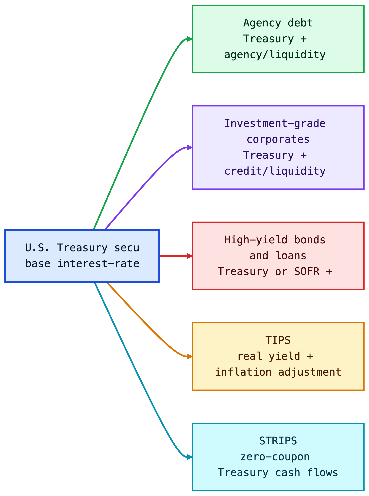
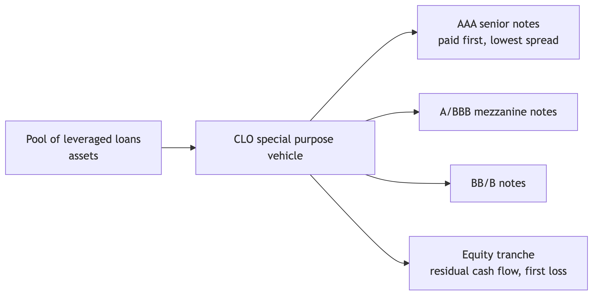
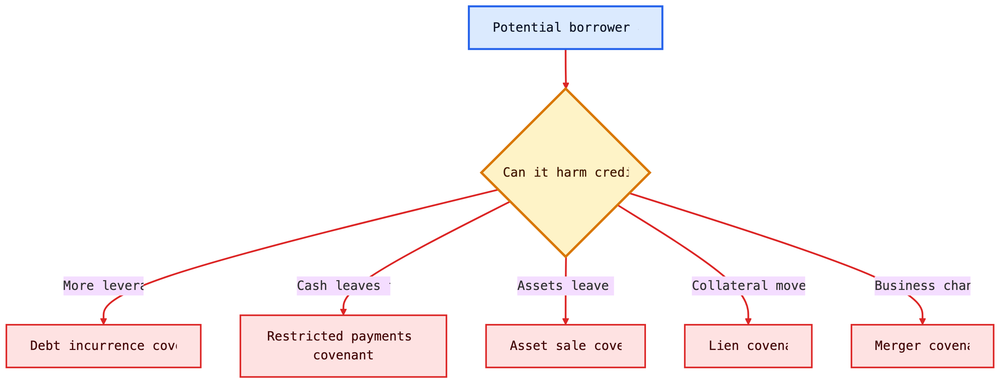
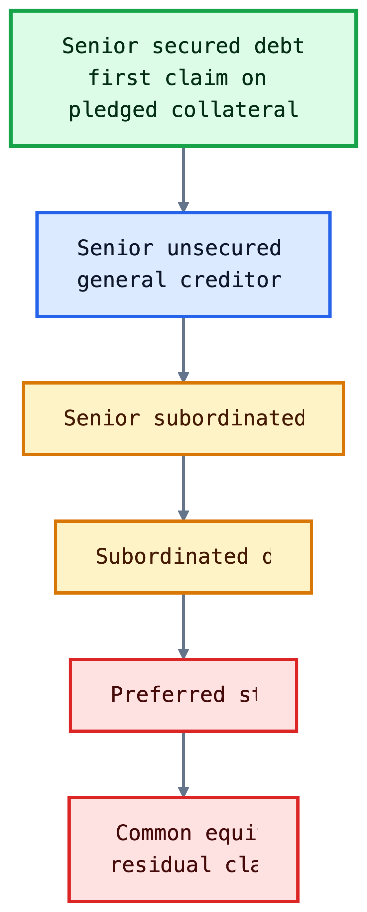
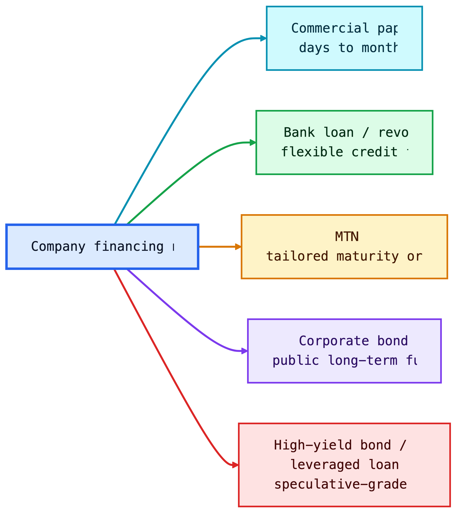
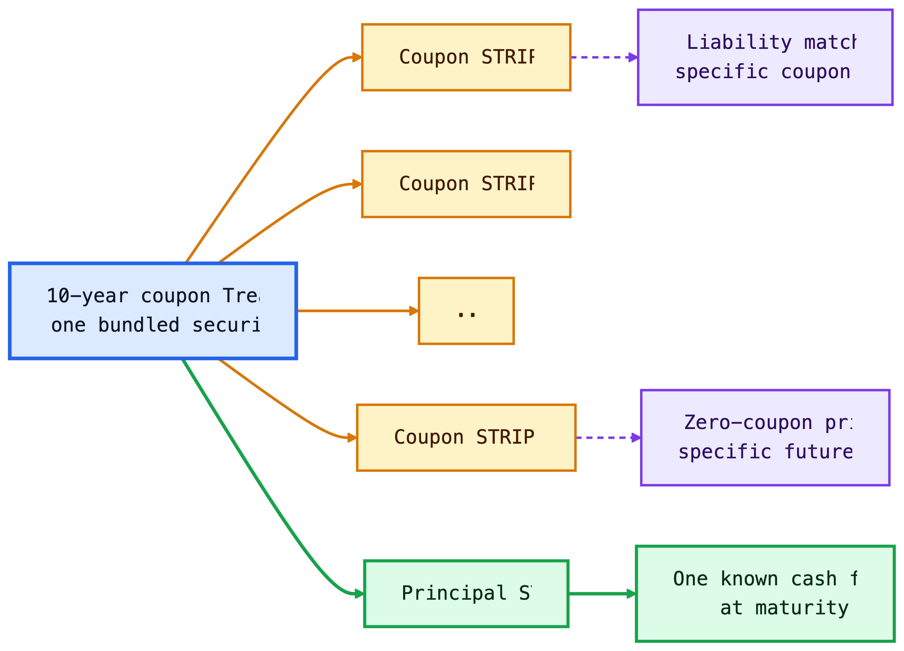
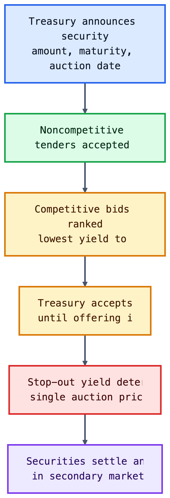
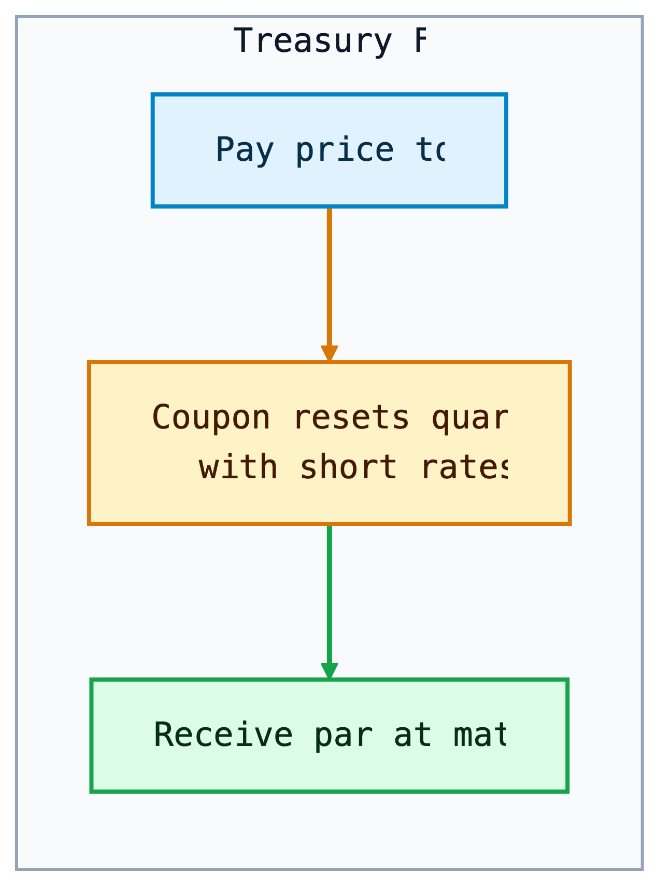
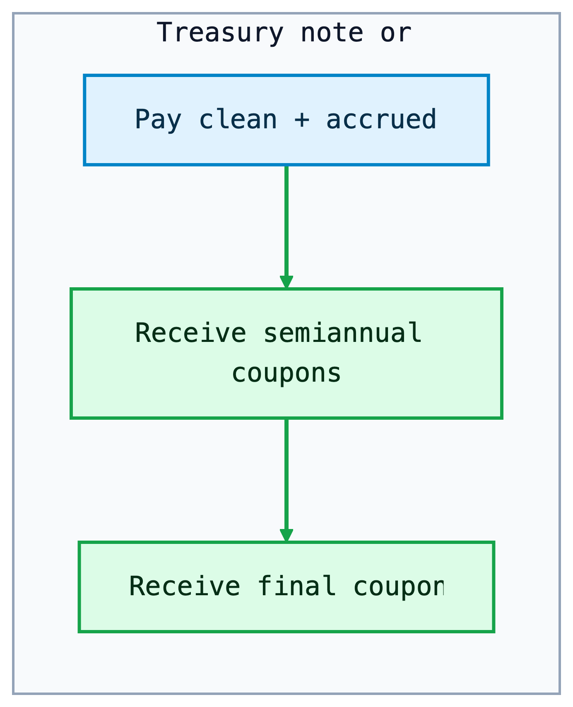
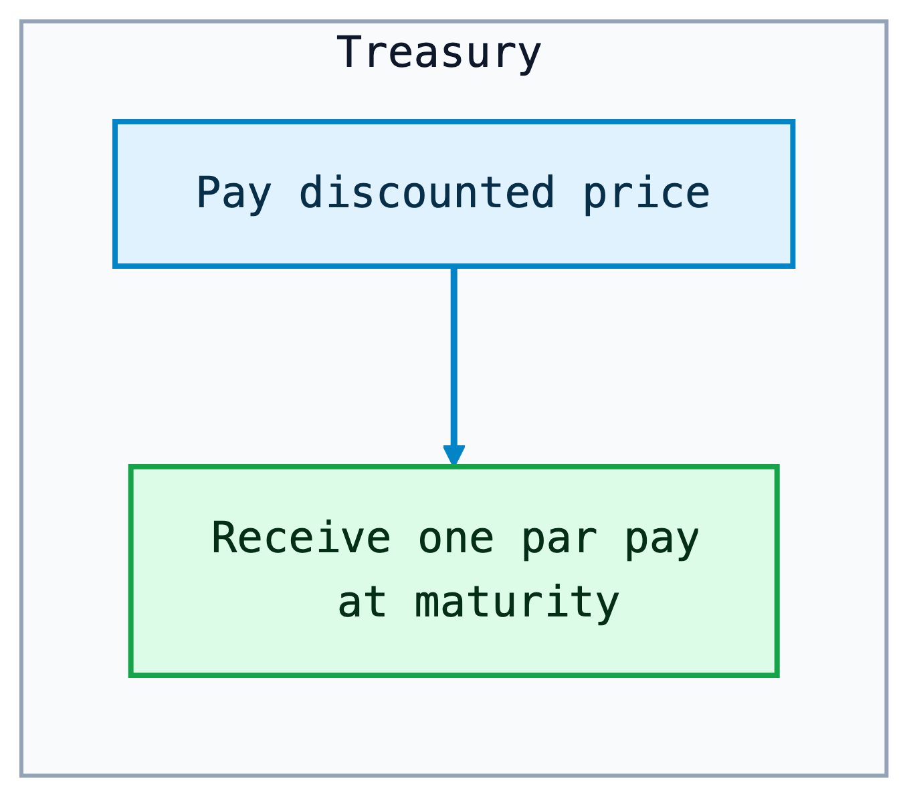

```{python}
#| echo: false
#| message: false
#| warning: false

%matplotlib inline

import io
import urllib.request

import matplotlib.pyplot as plt
import numpy as np
import pandas as pd

plt.rcParams["figure.figsize"] = (7.5, 4.2)
plt.rcParams["axes.grid"] = True
plt.rcParams["grid.alpha"] = 0.25
plt.rcParams["axes.spines.top"] = False
plt.rcParams["axes.spines.right"] = False
```

## Learning Objectives {.unnumbered}

At the end of this lecture you should be able to:

- Explain why U.S. Treasury securities serve as benchmark rates for the broader fixed-income market.
- Distinguish Treasury bills, notes, bonds, FRNs, TIPS, and STRIPS by cash-flow structure, maturity, quoting convention, and risk exposure.
- Compute Treasury bill prices, bank discount yields, bond-equivalent yields, Treasury coupon-security quote conversions, and accrued interest.
- Explain Treasury auction mechanics, including noncompetitive bids, competitive bids, reopenings, stop-out yield, prorated allocations, and single-price awards.
- Interpret on-the-run and off-the-run Treasuries, when-issued trading, and how Treasury securities support benchmark curve construction.
- Interpret TIPS principal adjustments, real yields, breakeven inflation, and the implied real-yield gap between nominal yields and inflation compensation.
- Explain how STRIPS are created, taxed, reconstituted, and used for zero-coupon valuation, liability matching, and no-arbitrage intuition.
- Compare major federal agency and GSE issuers by market role, risk-transfer mechanism, investor considerations, liquidity, and government-support risk.
- Explain corporate debt seniority, secured versus unsecured claims, bankruptcy priority, Chapter 7, Chapter 11, debtor-in-possession financing, and the absolute priority rule.
- Interpret corporate credit ratings, investment-grade versus high-yield classifications, original-issue high-yield bonds, fallen angels, and downgrade risk.
- Explain how calls, make-whole calls, sinking funds, covenants, deferred-coupon structures, PIK bonds, and reset features affect issuer flexibility and investor protection.
- Compare corporate bonds, MTNs, structured notes, commercial paper, revolving credit facilities, term loans, leveraged loans, and CLOs.
- Evaluate default risk, recovery risk, downgrade risk, and credit spread risk using expected-loss intuition and spread-duration approximations.
- Read market charts for Treasury yields, breakeven inflation, default frequency, recovery rates, and corporate option-adjusted spreads.

---

# Treasury Securities

The U.S. Treasury market is the reference point for dollar fixed income. In Lecture 1, we introduced Treasuries as one of the main sectors of the bond market. In Lecture 2, we priced bonds by discounting cash flows. In Lecture 3, we measured how prices respond when yields move. In Lecture 4, we used Treasury rates as the base curve for spreads, spot rates, and forward rates. This lecture connects those ideas to the securities that actually trade.

Treasury securities are issued by the U.S. Department of the Treasury and are backed by the full faith and credit of the U.S. government. Investors usually treat them as free of default risk in nominal dollars. They are not free of all risk: Treasury investors still face interest-rate risk, reinvestment risk, inflation risk, liquidity differences across issues, and tax considerations.

The central intuition is:

> Treasuries define the price of time in U.S. dollars. Agency and corporate securities are usually priced as Treasury cash flows plus additional compensation for credit, liquidity, optionality, and structure.

This benchmark role exists for practical reasons, not just theoretical ones. The Treasury issues across the maturity spectrum, the securities are standardized, the secondary market is deep, and the cash flows are simple enough to serve as discounting inputs. A corporate bond analyst does not usually ask, "What is the bond worth in isolation?" The practical question is, "What yield spread over the matched Treasury compensates for the extra risks?"


::: {.callout-note title="Market Snapshot: Why Treasuries Matter"}
FRED reported the 10-year Treasury constant maturity yield at **4.46% on June 2, 2026** and the 10-year breakeven inflation rate at **2.38% on June 3, 2026**. On June 2, 2026, broad U.S. corporate option-adjusted spreads were about **0.74%**, while high-yield spreads were about **2.71%**. Nominal Treasury rates set the base rate, TIPS help reveal inflation compensation, and corporate spreads price credit risk.
:::

{fig-align="center"}

## Types of Treasury Securities

The Treasury issues marketable and nonmarketable securities. This lecture focuses on marketable securities: instruments that investors can buy and sell in the secondary market.

Marketable Treasury securities can be grouped into:

- **Fixed-principal securities:** bills, notes, bonds, and floating-rate notes.
- **Inflation-protected securities:** TIPS, whose principal is adjusted for CPI inflation.

This classification is based on cash-flow design. A bill is one future payment. A coupon note is many future payments. A TIPS is a coupon bond whose principal changes with inflation. A STRIP is one separated cash flow from a larger Treasury security.

The reason the Treasury issues multiple security types is that the government has multiple financing needs and investors have multiple risk preferences. Bills help the Treasury manage short-term cash balances. Notes and bonds lock in longer-term funding. FRNs appeal to investors who want Treasury credit quality with less duration risk. TIPS help the Treasury reach investors who care about real purchasing power. STRIPS exist because some investors want one certain future cash flow rather than a package of coupon payments.

```{python}
#| echo: false
#| message: false
#| warning: false

security_map = pd.DataFrame(
    {
        "Security": ["Bill", "Note", "Bond", "FRN", "TIPS", "STRIP"],
        "Dominant exposure": [
            "Short rate / cash yield",
            "Nominal duration",
            "Long nominal duration",
            "Short-rate reset",
            "Real rate + inflation",
            "Pure zero-coupon duration",
        ],
        "Why it exists": [
            "Low-cost short-term funding",
            "Benchmark funding across the curve",
            "Long-term funding and duration supply",
            "Low duration exposure",
            "Inflation-linked financing",
            "Exact future cash-flow matching",
        ],
    }
)
security_map
```

### Fixed-Principal Treasury Securities

Fixed-principal Treasury securities promise repayment of a fixed nominal principal amount. They differ mainly by maturity and coupon structure.

| Security | Original maturity | Coupon? | Main use |
|---|---:|---|---|
| Treasury bills | 1 year or less | No coupon; sold at discount | Cash management, money-market investment |
| Treasury notes | More than 1 year through 10 years | Semiannual fixed coupons; FRNs pay quarterly floating coupons | Benchmark rates, duration exposure |
| Treasury bonds | More than 10 years | Semiannual fixed coupons | Long-duration investing and liability matching |

Treasury bills are zero-coupon instruments: the investor pays less than par and receives par at maturity. Notes and bonds are coupon securities: the investor receives periodic interest plus par at maturity. Treasury floating-rate notes (FRNs) have coupons that reset based on a Treasury bill reference rate plus a spread determined at auction.

Treasuries are noncallable. This matters because the price-yield relationship from Lectures 2 and 3 applies cleanly: the promised nominal cash flows do not change when rates fall. A callable corporate bond behaves differently because the issuer can redeem it when refinancing becomes attractive.

The maturity labels also tell you which risk dominates. Bills have little duration risk but high reinvestment risk because the investor must reinvest soon. Long bonds have large duration risk because most present value comes from distant cash flows. FRNs shift risk away from price sensitivity and toward coupon uncertainty: the coupon resets, so the price usually stays closer to par, but future income is not locked in.

::: {.callout-tip title="Intuition"}
A Treasury bill is mostly a promise about **one future dollar**. A Treasury note or bond is a package of many future dollars. That is why a bill quote is naturally about the discount from par, while a coupon Treasury quote is naturally about the price of a stream of cash flows.
:::

<div style="display: flex; flex-direction: row; gap: 2rem; justify-content: space-around; align-items: flex-start; flex-wrap: wrap;">
<div style="flex: 1; min-width: 270px;">

{fig-align="center"}

</div>
<div style="flex: 1; min-width: 270px;">

{fig-align="center"}

</div>
<div style="flex: 1; min-width: 270px;">

{fig-align="center"}

</div>
</div>

::: {.callout-note title="Worked Example: Pricing a Treasury Bill"}
A 13-week Treasury bill with face value \$10,000 is quoted at a discount yield of 4.75%. The price is calculated using:

$$
P=F \left(1 - \frac{r_d \times t}{360}\right),
$$

where $F$ is face value, $r_d$ is the discount yield, and $t$ is days to maturity. With $t=91$:

$$
P = 10{,}000 \left(1 - \frac{0.0475 \times 91}{360}\right) \approx 9{,}879.93.
$$

The investor pays about \$9,879.93 and receives \$10,000 at maturity. The dollar discount is \$120.07.
:::

### Treasury Inflation-Protected Securities (TIPS)

TIPS are Treasury securities whose principal is adjusted with inflation. The coupon rate is fixed, but the dollar coupon changes because it is paid on the inflation-adjusted principal. The inflation index is the non-seasonally adjusted CPI-U, applied with a lag.

TIPS separate two ideas that are mixed together in nominal Treasuries:

- the **real yield**, or compensation for postponing consumption after inflation;
- the **inflation adjustment**, which protects principal and coupons from realized CPI inflation.

At maturity, the investor receives the greater of the inflation-adjusted principal or the original principal. This floor protects the investor against cumulative deflation over the life of the bond, although TIPS prices before maturity can still fall if real yields rise.

The reason TIPS exist is risk sharing. Nominal Treasuries put inflation risk on investors: the government repays fixed dollars, and the investor bears the risk those dollars buy less. TIPS shift realized CPI inflation risk back to the government. In exchange, investors accept a real yield that is usually lower than the nominal Treasury yield.

The difference between a nominal Treasury yield and a TIPS real yield of the same maturity is often called the **breakeven inflation rate**:

$$
\text{Breakeven inflation} \approx y_{\text{nominal Treasury}} - y_{\text{TIPS real}}.
$$

If actual inflation over the holding period is higher than the breakeven rate, TIPS tend to outperform a comparable nominal Treasury. If actual inflation is lower, nominal Treasuries tend to outperform.

Breakeven inflation is not a pure inflation forecast. It also includes liquidity differences, inflation-risk premiums, taxes, and temporary supply-demand effects. The practical interpretation is: "What average inflation rate would make the nominal Treasury and the TIPS roughly competitive before these frictions?"

::: {.callout-note title="Worked Example: TIPS Principal Adjustment"}
Consider a \$1,000 TIPS with a 3% annual coupon. Over the first six months, the CPI index increases by 1%. The adjusted principal after six months is:

$$
1{,}000 \times (1 + 0.01) = 1{,}010.
$$

The semiannual coupon payment is:

$$
\text{Coupon} = \frac{0.03}{2} \times 1{,}010 = 15.15.
$$

If inflation cumulatively rises 3% by maturity, the principal will be \$1,030. If cumulative inflation is negative, the investor receives at least the original \$1,000 principal at maturity.
:::

::: {.callout-note title="History Box: Why TIPS Became Important"}
The United States introduced TIPS in 1997. Their importance rose after investors experienced periods when inflation uncertainty became central to portfolio construction, including the 2008 crisis period and the 2021-2022 inflation surge. TIPS are useful because they provide a traded market measure of real yields and inflation compensation.
:::

::: {.callout-tip title="Investor Decision Rule"}
If you care about the number of dollars you receive, nominal Treasuries are simpler. If you care about purchasing power, TIPS are the closer match. The tradeoff is that TIPS protect realized CPI inflation but still expose the investor to real-yield changes before maturity.
:::

```{python}
#| label: fig-fred-rates
#| fig-cap: "Real market data: 10-year nominal Treasury yield and 10-year breakeven inflation rate. Data source: FRED, Federal Reserve Bank of St. Louis."
#| echo: false
#| message: false
#| warning: false

def load_fred_series(series_ids, start="2018-01-01"):
    ids = ",".join(series_ids)
    url = f"https://fred.stlouisfed.org/graph/fredgraph.csv?id={ids}"
    try:
        with urllib.request.urlopen(url, timeout=8) as response:
            raw = response.read()
        data = pd.read_csv(io.BytesIO(raw), parse_dates=["observation_date"])
        data = data.rename(columns={"observation_date": "date"}).set_index("date")
        data = data.replace(".", np.nan).apply(pd.to_numeric, errors="coerce")
        return data.loc[start:].dropna(how="all")
    except Exception:
        fallback_values = {
            "DGS10": [2.74, 2.85, 3.06, 2.69, 2.41, 2.01, 1.68, 1.92, 1.31, 0.66, 0.68, 0.93, 1.74, 1.45, 1.52, 1.52, 2.32, 2.98, 3.83, 3.88, 3.48, 3.81, 4.59, 3.88, 4.20, 4.36, 3.81, 4.57, 4.21, 4.36, 4.46, 4.46, 4.46, 4.46],
            "T10YIE": [2.10, 2.12, 2.13, 1.88, 1.87, 1.70, 1.54, 1.78, 1.05, 1.26, 1.64, 1.99, 2.36, 2.32, 2.37, 2.56, 2.84, 2.34, 2.23, 2.30, 2.25, 2.24, 2.36, 2.20, 2.32, 2.27, 2.21, 2.31, 2.35, 2.39, 2.38, 2.38, 2.38, 2.38],
        }
        idx = pd.date_range("2018-03-31", periods=len(fallback_values["DGS10"]), freq="QE")
        return pd.DataFrame(fallback_values, index=idx)

rates = load_fred_series(["DGS10", "T10YIE"])
ax = rates[["DGS10", "T10YIE"]].plot(linewidth=2)
ax.set_title("Nominal Treasury Yield vs. Breakeven Inflation")
ax.set_ylabel("Percent")
ax.set_xlabel("")
ax.legend(["10-year Treasury yield", "10-year breakeven inflation"], loc="best")
plt.tight_layout()
plt.show()
```

::: {.callout-tip title="Chart Explanation"}
The chart compares the 10-year nominal Treasury yield with the 10-year breakeven inflation rate. Their difference is approximately the 10-year TIPS real yield:

$$
y_{\text{real}} \approx y_{\text{nominal}} - \text{breakeven inflation}.
$$

When the nominal Treasury yield is above breakeven inflation, the implied real yield is positive: investors are being paid inflation compensation plus an additional real return. When breakeven inflation is above the nominal yield, the implied real yield is negative: inflation compensation is larger than the nominal yield. A crossing point means the implied real yield is near zero. In that case, the market is pricing the 10-year nominal Treasury yield as roughly equal to expected inflation compensation, before liquidity premiums, inflation-risk premiums, taxes, and other frictions.
:::

## The Treasury Auction Process

Treasury securities are sold in the primary market through sealed-bid auctions. Each auction is announced several days in advance by the Treasury Department. The announcement states the offering amount, security type, term, auction date, and key auction rules. Treasury auctions are open to all entities.

Treasury regularly issues new securities, but it also sells additional amounts of already outstanding securities. This is called a **reopening**. Reopenings increase the size of an existing issue rather than creating a new CUSIP, and the Treasury has a regular reopening schedule for 5-year and 10-year issues.

Two types of bids can be submitted:

- **Noncompetitive bids.** The bidder specifies only the quantity and agrees to accept the auction-determined yield. A noncompetitive bid cannot exceed \$5 million.
- **Competitive bids.** The bidder specifies both the quantity and the yield at which they are willing to buy the security.

Auction awards are determined in stages. First, total noncompetitive tenders and nonpublic purchases, such as Federal Reserve purchases, are deducted from the total offering amount. The remaining amount is allocated to competitive bidders. Competitive bids are ranked from lowest yield to highest yield, which is equivalent to ranking from highest price to lowest price. The Treasury accepts bids from the lowest yield upward until the competitive allocation is filled.

The highest accepted yield is the **stop-out yield**, also called the **high yield**. Competitive bids above the stop-out yield receive no allocation. Bids exactly at the stop-out yield may receive only a proportional allocation if there is not enough remaining supply to fill them completely.

U.S. Treasury auctions are **single-price auctions**. All successful bidders receive the same yield: the stop-out yield. For notes and bonds, the Treasury also sets the coupon rate after the auction. The coupon is chosen in increments of 1/8 of 1% so that the price is as close as possible to par without being above par at the awarded yield.

Within about an hour after the 1:00 p.m. auction deadline, Treasury announces the results. These include the stop-out yield, associated price, percentage awarded at the stop-out yield, amount of noncompetitive tenders, median-yield bid, bid-to-cover ratio, and, for notes and bonds, the coupon rate.

{fig-align="center"}

::: {.callout-note title="Auction Example: Finding the Stop-Out Yield"}
**Setup**

- Treasury offering amount: \$20 billion
- Noncompetitive tenders: \$4 billion
- Amount left for competitive bids: \$16 billion

**Competitive bid stack**

| Bidder | Bid yield | Amount bid | Cumulative accepted amount | Result |
|---|---:|---:|---:|---|
| A | 4.20% | \$5 billion | \$5 billion | Filled |
| B | 4.23% | \$6 billion | \$11 billion | Filled |
| C | 4.25% | \$7 billion | \$16 billion target reached | Partially filled |
| D | 4.28% | \$4 billion | Above target | Not filled |
| E | 4.30% | \$3 billion | Above target | Not filled |

**Conclusion**

- The **stop-out yield** is 4.25%, the highest accepted yield.
- Bids below 4.25% are filled.
- Bids above 4.25% receive no allocation.
- Bidder C is prorated because only \$5 billion remains for a \$7 billion bid.
- In a single-price auction, all successful bidders receive the yield of 4.25%.
:::

::: {.callout-note title="Auction Example"}
**Setup**

- Amount remaining at the stop-out yield: \$1 billion
- Total bids submitted at the stop-out yield: \$2 billion
- Allocation rate at the stop-out yield: 50%

**Result**

| Bidder's tender at stop-out yield | Awarded amount |
|---:|---:|
| \$5 million | \$2.5 million |
| \$20 million | \$10 million |
| \$100 million | \$50 million |

All bids below the stop-out yield are filled. Bids above the stop-out yield receive no allocation. Bids exactly at the stop-out yield are prorated because demand at that yield exceeds the remaining supply.
:::

::: {.callout-tip title="Why Single-Price Auctions Matter"}
In a single-price Treasury auction, every successful bidder receives the same yield: the stop-out yield. A bidder who submitted a lower accepted yield does not get penalized with that lower yield. This format encourages stronger participation because bidders can reveal demand without worrying that an aggressive bid will lock them into a worse yield than other successful bidders.
:::

## Secondary Market

After issuance, Treasuries trade in a large over-the-counter secondary market. Dealers quote bid and ask prices, investors trade through brokers and electronic platforms, and the most recently issued securities become the most visible benchmarks.

Important terms:

- **On-the-run issue:** the most recently issued Treasury at a benchmark maturity. It is usually the most liquid and often trades at a slightly lower yield.
- **Off-the-run issue:** an older Treasury with a similar remaining maturity. It may trade cheaper because it is less liquid or less financeable in repo.
- **When-issued market:** trading in a Treasury security after the auction is announced but before the security is issued.

This section connects directly to Lecture 4. Benchmark Treasury yields are not abstract numbers; they come from actively traded securities. Those securities anchor the base curve used to price agency debt, corporate bonds, swaps, mortgages, and structured products.

Secondary-market trading is also where liquidity premia become visible. Two Treasuries can have nearly identical cash-flow timing but different yields because one is easier to finance, hedge, or sell quickly. That is why fixed-income desks distinguish "rate risk" from "liquidity and specialness" even inside the Treasury market.

::: {.callout-note title="Example: On-the-Run Liquidity Premium"}
Suppose the current 10-year on-the-run note yields 4.45%, while an older off-the-run note with nearly the same duration yields 4.50%. The 5 basis point difference is not mainly credit risk. It reflects liquidity, benchmark demand, repo financing value, and relative scarcity.
:::

### Price Quotes for Treasury Bills

Treasury bills are quoted using the **bank discount yield**:

$$
r_d = \frac{F-P}{F} \times \frac{360}{t}.
$$

Solving for price:

$$
P = F\left(1-r_d\frac{t}{360}\right).
$$

This convention is useful for money-market quoting, but it understates the investor's economic return relative to a yield based on the amount invested. Investors often compute the **bond-equivalent yield (BEY)**:

$$
\text{BEY} = \frac{F-P}{P} \times \frac{365}{t}.
$$

::: {.callout-note title="Worked Example: Discount Yield vs. BEY"}
Assume a 100-day T-bill has face value \$100,000 and price \$99,100.

The bank discount yield is:

$$
r_d = \frac{100{,}000-99{,}100}{100{,}000}\times\frac{360}{100}
= 3.24\%.
$$

The bond-equivalent yield is:

$$
\text{BEY} = \frac{900}{99{,}100}\times\frac{365}{100}
= 3.32\%.
$$

The BEY is higher because it divides by the actual investment, not face value, and uses a 365-day year.
:::

The reason this convention survives is market history and operational convenience. Money-market traders compare short discount instruments quickly, and the bank discount yield made arithmetic simple. For valuation, however, the economic yield should be based on dollars invested and the investor's actual holding period.

### Quotes on Treasury Coupon Securities

Treasury coupon securities are quoted differently from Treasury bills. Bills are quoted on a discount-yield basis, while Treasury notes and bonds are quoted on a **price basis** in points. One point equals 1% of par, or \$1 per \$100 of par value.

The points are split into **32nds**. A quote of `96-14` means 96 and 14/32:

$$
96 + \frac{14}{32} = 96.4375.
$$

The price is quoted per \$100 of par value. For \$1,000 of par value, a quote of `96-14` implies:

$$
0.964375 \times 1{,}000 = 964.375.
$$

The 32nds can be split into smaller increments:

- A `+` means one-half of a 32nd, or 1/64.
- A trailing digit means eighths of a 32nd, or 256ths.

For example, `96-14+` means:

$$
96 + \frac{14}{32} + \frac{1}{64} = 96.453125.
$$

A quote of `96-142` means:

$$
96 + \frac{14}{32} + \frac{2}{256} = 96.4453125.
$$

Yield to maturity is usually reported alongside the price. In when-issued trading, notes and bonds are quoted in yield terms because the coupon rate is not set until after the auction.

::: {.callout-note title="Example: Treasury Quote Conversion"}
**Quotes in 32nds**

| Quote | Calculation | Price per 100 par |
|---|---:|---:|
| `91-19` | 91 + 19/32 | 91.59375 |
| `107-22` | 107 + 22/32 | 107.68750 |
| `109-06` | 109 + 6/32 | 109.18750 |

**Quotes with smaller increments**

| Quote | Calculation | Price per 100 par |
|---|---:|---:|
| `91-19+` | 91 + 19/32 + 1/64 | 91.609375 |
| `107-222` | 107 + 22/32 + 2/256 | 107.6953125 |
| `109-066` | 109 + 6/32 + 6/256 | 109.2109375 |
:::

When an investor buys a Treasury coupon security between coupon dates, the buyer compensates the seller for coupon interest earned since the previous coupon date. This payment is called **accrued interest**.

For a semiannual coupon Treasury, accrued interest is:

$$
\text{AI} =
\frac{\text{Annual dollar coupon}}{2}
\times
\frac{\text{Days in accrued interest period}}{\text{Days in coupon period}}.
$$

Three inputs are needed:

- the number of days in the accrued interest period,
- the number of days in the coupon period,
- the dollar amount of the coupon payment.

Treasury coupon securities use the **actual/actual day count convention**. The accrued interest period includes the previous coupon date and excludes the settlement date. For Treasury securities, settlement is normally the next business day after the trade date.

Coupon securities are settled at the **dirty price**:

$$
\text{Dirty price} = \text{Clean price} + \text{Accrued interest}.
$$

::: {.callout-note title="Example: Accrued Interest with Actual/Actual"}
**Setup**

- Previous coupon date: May 15
- Settlement date: September 10
- Next coupon date: November 15
- Annual coupon per \$100 par: \$8
- Semiannual coupon: \$4

**Day count**

| Period | Days counted |
|---|---:|
| May 15 to May 31 | 17 |
| June | 30 |
| July | 31 |
| August | 31 |
| September 1 to September 10 | 9 |
| **Accrued interest period** | **118** |
| **Full coupon period: May 15 to November 15** | **184** |

**Accrued interest**

$$
\text{AI} = 4 \times \frac{118}{184} = 2.5652.
$$

The buyer pays \$2.5652 of accrued interest per \$100 of par value, in addition to the quoted clean price.
:::

Clean-price quoting keeps market price movements easier to interpret. If bonds were quoted dirty, the quoted price would mechanically rise as accrued interest builds and then drop on the coupon date. Separating clean price from accrued interest lets traders see the price change caused by yield movements rather than the coupon calendar.

# Stripped Treasury Securities

**Separate Trading of Registered Interest and Principal Securities (STRIPS)** are created when the coupon and principal payments of an eligible Treasury security are separated into individual zero-coupon securities. A 10-year note with 20 remaining semiannual coupons can be transformed into 21 separate securities: 20 coupon STRIPS and one principal STRIP.

STRIPS are not new borrowing by the Treasury. They are created and reassembled in the commercial book-entry system by financial institutions, brokers, and dealers. Their economic role is important because they provide direct market prices for specific future Treasury cash flows.

STRIPS connect directly to Lecture 4. A STRIP is essentially an observable zero-coupon Treasury price:

$$
P_{\text{STRIP}} = \frac{F}{(1+z_T)^T}.
$$

If a 10-year STRIP paying \$100 trades at \$62:

$$
z_{10} = \left(\frac{100}{62}\right)^{1/10}-1 \approx 4.90\%.
$$

The economic reason for stripping is matching. A coupon Treasury delivers cash repeatedly; a STRIP delivers cash once. If an insurer knows it must pay a claim reserve in exactly 12 years, a 12-year principal STRIP is cleaner than buying a coupon bond and reinvesting intermediate coupons. STRIPS also make duration exposure more concentrated because no cash comes back before maturity.

{fig-align="center"}

## Tax Treatment

STRIPS produce no cash coupon before maturity, but taxable investors generally must report imputed interest each year. This is often called **phantom income**: taxable income is recognized before cash is received.

That tax treatment makes STRIPS more natural for tax-deferred accounts, pension funds, insurance companies, or investors with specific long-dated liability needs. A pension plan, for example, may buy STRIPS because it wants a known cash amount on a known future date.

The tax rule matters because it changes the investor base. A taxable household that buys a long STRIP in a regular brokerage account may owe annual tax without receiving annual cash. A pension fund or retirement account can often tolerate this better because the account's tax treatment already differs from a taxable account.

## Reconstituting a Bond

Reconstitution is the reverse of stripping. If a dealer owns all remaining coupon and principal STRIPS from the same original Treasury, the pieces can be recombined into the original coupon security.

This creates an arbitrage force:

- If the coupon Treasury is cheap relative to its pieces, dealers can buy the bond, strip it, and sell the pieces.
- If the pieces are cheap relative to the coupon Treasury, dealers can buy the STRIPS, reconstitute the bond, and sell the bond.

This arbitrage helps keep the STRIPS curve and coupon Treasury curve aligned, though liquidity, taxes, and financing costs prevent perfect equality.

The broader lesson is no-arbitrage pricing. If two portfolios deliver the same Treasury cash flows on the same dates, their prices should be close. When they are not, dealers have an incentive to transform one form into the other until the pricing gap is reduced.

# Federal Agency Securities

Federal agency securities are issued by federally related institutions and government-sponsored enterprises (GSEs). They are not identical to Treasuries. Some have explicit government backing; many GSE obligations have historically been viewed as having strong support but not the same full faith and credit guarantee as Treasuries.

Agency debt usually trades at a positive spread over Treasuries because investors require compensation for less liquidity, agency or GSE credit structure, optionality, and sector-specific uncertainty.

In Lecture 4 language:

$$
\text{Agency yield} = \text{Treasury yield} + \text{agency spread}.
$$

The reason these institutions exist is policy specialization. Instead of having Treasury directly fund every mortgage, agricultural loan, member-bank advance, or power project, Congress created specialized entities that can fund targeted sectors in capital markets. The tradeoff is that investors must distinguish explicit federal obligations from GSE obligations that may have strong policy support but are not identical to Treasury debt.

::: {.callout-tip title="Agency Debt Intuition"}
Agency spreads are usually small when investors believe liquidity is strong and government support is credible. They widen when investors question either the issuer's sector exposure or the exact form of government support.
:::

## Fannie Mae and Freddie Mac

Fannie Mae and Freddie Mac are GSEs central to the U.S. residential mortgage market. They buy mortgages, guarantee mortgage-backed securities, and issue agency debt. Their debt programs have historically included benchmark notes, discount notes, callable notes, structured notes, and global debt.

The key historical event is the 2008 conservatorship. During the housing and credit crisis, the Federal Housing Finance Agency placed Fannie Mae and Freddie Mac into conservatorship, and the U.S. Treasury entered support agreements to stabilize their obligations.

Their business model explains the policy importance. The agencies support mortgage liquidity by buying mortgages, guaranteeing mortgage-backed securities, and funding retained portfolios. If investors suddenly refused to buy their debt or MBS, mortgage credit could become more expensive or less available across the economy.

::: {.callout-note title="History Box: 2008 and Implicit Support"}
Before 2008, many investors treated Fannie Mae and Freddie Mac debt as if the government would support it in a crisis, even though the guarantee was not the same as a Treasury guarantee. The conservatorship showed why this belief mattered: the government chose support because failure would have damaged the mortgage market and global fixed-income portfolios.
:::

## Federal Farm Credit Bank System

The Federal Farm Credit Bank System supports lending to farmers, ranchers, and agricultural businesses. It funds itself through consolidated obligations, discount notes, designated bonds, and structured notes.

The economic logic is sectoral credit support. Agriculture can be capital-intensive, seasonal, and exposed to commodity-price and weather risk. Farm Credit institutions help channel funds to that sector through a GSE structure.

From an investor's perspective, Farm Credit debt is a way to buy high-quality agency exposure that is tied to a different policy mission than housing. The risk question is not only "Will the borrower pay?" but also "How liquid is this issuer's debt compared with larger benchmark agency programs?"

## Federal Agricultural Mortgage Corporation

Farmer Mac supports a secondary market for agricultural real estate and rural utility loans. It can issue discount notes and medium-term notes, and it can guarantee agricultural mortgage-backed securities.

Farmer Mac is smaller and less liquid than the largest housing GSEs. Its debt therefore illustrates a general fixed-income principle: similar government-related status does not imply identical liquidity or spread.

Farmer Mac exists because agricultural real estate and rural utility loans are not as standardized as conforming residential mortgages. A secondary-market guarantor can make those loans easier to fund by turning idiosyncratic rural credit into securities with more standardized terms.

## Federal Home Loan Bank System

The Federal Home Loan Bank System provides advances to member banks and other eligible financial institutions. The system funds itself with consolidated obligations, including short-term discount notes and longer-term bonds.

FHLB debt is widely viewed as very high quality. During periods of banking stress, FHLB advances can become especially important because member institutions use them as a source of collateralized liquidity.

This is why FHLB debt connects to bank liquidity risk. A member institution can pledge eligible collateral and receive an advance, reducing the need to sell assets quickly. Investors in FHLB debt therefore care about the joint-and-several structure of consolidated obligations, collateral practices, and the fact that FHLB obligations are not the same legal obligation as Treasury debt.

## Tennessee Valley Authority

The Tennessee Valley Authority (TVA) is a corporate agency of the U.S. government created in 1933. It operates a large public power system and issues debt to fund its power program. TVA obligations are not Treasury securities, but they have historically carried high credit quality because of TVA's federal status and operating role.

TVA bonds also show that federal-related debt can finance real assets, not just financial intermediation. The underlying business is power generation and infrastructure.

TVA debt is useful pedagogically because the source of repayment is tied to an operating public-power enterprise. That makes it different from housing GSEs and FHLBs, where the balance sheet is more directly connected to financial intermediation.

---

```{python}
#| echo: false
#| message: false
#| warning: false

agency_data = {
    "Issuer": ["Fannie Mae", "Freddie Mac", "Farm Credit", "Farmer Mac", "FHLB", "TVA"],
    "What it does in the market": [
        "Buys conforming mortgages and guarantees mortgage-backed securities.",
        "Buys conforming mortgages and guarantees mortgage-backed securities.",
        "Funds lenders that serve farmers, ranchers, and rural businesses.",
        "Creates secondary-market funding for agricultural real estate and rural utility loans.",
        "Provides collateralized advances to member banks, credit unions, and insurers.",
        "Issues debt to finance a public power system and regional infrastructure.",
    ],
    "How risk is transferred to the market": [
        "Mortgage credit and prepayment exposure are packaged into agency MBS; agency debt funds retained mortgage activity.",
        "Mortgage credit and prepayment exposure are packaged into agency MBS; agency debt funds retained mortgage activity.",
        "Agricultural loan exposure is funded through systemwide consolidated obligations sold to investors.",
        "Agricultural mortgage and rural utility exposure is standardized through guarantees and notes.",
        "Member-institution liquidity needs are funded by issuing consolidated obligations backed by the FHLB system.",
        "Power-project and operating cash-flow risk is financed through TVA bonds and notes.",
    ],
    "Main investor considerations": [
        "Government support, conservatorship policy, mortgage-market stress, prepayment risk in MBS, and agency spread liquidity.",
        "Government support, conservatorship policy, mortgage-market stress, prepayment risk in MBS, and agency spread liquidity.",
        "Agricultural sector concentration, systemwide support structure, liquidity, and spread over Treasuries.",
        "Smaller issuer scale, agricultural credit exposure, guarantee performance, liquidity, and spread compensation.",
        "Joint-and-several obligation structure, collateral quality, banking-system stress, liquidity, and non-Treasury status.",
        "Federal status, power demand, rate-setting ability, capital spending needs, project economics, and liquidity.",
    ],
}

pd.DataFrame(agency_data)
```

# Corporate Debt Instruments

Corporations issue debt to finance operations, acquisitions, capital expenditures, share repurchases, and refinancing. Corporate debt is not one market. It ranges from short-term commercial paper issued by high-quality firms to speculative high-yield bonds and leveraged loans.

The central pricing idea is the one introduced in Lecture 4:

$$
\text{Corporate required yield}
= \text{base rate} + \text{credit spread}.
$$

But the spread is not just default probability. It also reflects expected recovery, liquidity, covenants, seniority, optionality, taxes, investor demand, and market risk appetite.

Corporate debt exists because it is often cheaper and less dilutive than equity. For investors, it creates a contractual claim with priority over equity but limited upside. This asymmetry explains why bondholders care less about maximum growth and more about downside protection, asset coverage, and restrictions on risk-shifting.

{fig-align="center"}

## Seniority of Debt in a Corporation's Capital Structure

Seniority determines who gets paid first if the issuer cannot meet its obligations. A simplified capital structure is:

{fig-align="center"}

Senior secured debt is backed by collateral. Senior unsecured debt has no specific collateral but has a general claim on the issuer's assets after secured claims. Subordinated debt ranks below senior debt. Equity is last.

Seniority affects expected loss:

$$
\text{Expected loss} = \text{Probability of default} \times (1-\text{Recovery rate}).
$$

The reason priority is written into contracts is to control incentives before distress. Senior lenders are willing to lend at lower spreads when they know junior capital absorbs losses first. Junior investors demand higher returns because their claims are more exposed to enterprise-value declines.

::: {.callout-tip title="Intuition"}
Default is not a yes-or-no loss. Credit investors care about **how often** default occurs and **how much** is recovered after default. Seniority mainly affects recovery.
:::

::: {.callout-note title="Example: Same Default Probability, Different Loss"}
Two bonds issued by the same firm may have the same probability of default but different expected losses. If a senior secured loan is expected to recover 65% and a subordinated bond is expected to recover 25%, a 6% default probability implies expected losses of 2.1% and 4.5%, respectively.
:::

## Bankruptcy and Creditor Rights

U.S. bankruptcy law provides a process for either liquidation or reorganization.

Chapter 7 liquidation means the firm's assets are sold and proceeds are distributed according to priority. Chapter 11 reorganization allows the firm to keep operating while negotiating a plan with creditors. In Chapter 11, the firm may become a debtor in possession and may receive new financing that ranks ahead of existing debt.

The **absolute priority rule** says senior creditors should be paid in full before junior creditors receive value. In practice, Chapter 11 outcomes are negotiated. Junior creditors or equity holders may receive some value if doing so helps reach agreement, reduces litigation, or preserves the going-concern value of the business.

Bankruptcy rules exist because individual creditor enforcement can destroy value. Without a court-supervised process, each creditor has an incentive to rush for collateral, sue, or force liquidation. Chapter 11 tries to preserve going-concern value when the business is worth more alive than dead.

::: {.callout-note title="Example: Why Reorganization Can Beat Liquidation"}
Suppose a retailer has \$900 million of debt and assets that would sell for only \$500 million in liquidation. If the stores continue operating, the reorganized business may be worth \$750 million. Creditors may prefer Chapter 11 because the going-concern value is higher than the fire-sale value.
:::

Debtor-in-possession financing is allowed because distressed firms often need cash to keep operating during the case. The controversial feature is priority: new lenders may receive a senior claim because otherwise they would not provide money to a borrower already in bankruptcy.

## Corporate Debt Ratings

Credit ratings summarize rating agencies' opinions about credit risk. Ratings are not guarantees, and they often adjust more slowly than market spreads, but they remain important because many investment mandates and regulations reference them.

The boundary between BBB/Baa and BB/Ba is crucial. Bonds rated BBB- or Baa3 and above are **investment grade**. Bonds below that boundary are **noninvestment grade**, **speculative grade**, or **high yield**.

Downgrades through this boundary can matter disproportionately because some investors are forced to sell "fallen angels" when they lose investment-grade status.

Ratings exist partly to reduce information and monitoring costs. A small investor or regulated institution may not have the resources to perform full credit analysis on every issuer. Ratings provide a common language, but they should be treated as a starting point rather than a substitute for spread analysis and covenant review.

### The Three Major NRSROs

> NRSROs are nationally recognized statistical rating organizations. 
The three major global rating agencies are Moody's, S&P Global Ratings, and Fitch.

| Credit quality | Moody's | S&P / Fitch | Common label |
|---|---|---|---|
| Highest quality | Aaa | AAA | Prime |
| Very high quality | Aa | AA | High grade |
| Upper-medium quality | A | A | Investment grade |
| Medium quality | Baa | BBB | Lowest investment grade |
| Speculative | Ba | BB | High yield |
| Highly speculative | B | B | High yield |
| Substantial risk | Caa/Ca/C | CCC/CC/C | Distressed or near default |
| Default | D | D | Default |

Rating agencies also place issuers on watch for possible upgrades or downgrades. Markets often react before the rating change because spreads update continuously.

The rating scale is ordinal, not a precise probability table. AAA is better than AA, and AA is better than A, but the market still prices each issuer separately. A BBB utility, a BBB cyclical manufacturer, and a BBB bank can trade at different spreads because their business risk, leverage, liquidity, and recovery prospects differ.

## Corporate Bonds

Corporate bonds are debt securities issued by corporations. They may be fixed-rate, floating-rate, secured, unsecured, callable, noncallable, senior, subordinated, public, private, investment grade, or high yield.

Corporate bonds are usually less standardized and less liquid than Treasuries. Two bonds from the same issuer can have different spreads because they have different maturities, coupons, covenants, call protection, collateral, and index eligibility.

Issuers choose public bonds when they want broad investor access and long-term capital. Investors accept lower control rights than banks usually receive because public bonds are tradable and standardized enough to fit portfolios and indices. This is the core tradeoff: public bond financing is scalable, but creditor control is weaker than in a private loan.

### Provisions for Paying Off Bonds Prior to Maturity

Some corporate bond issues allow or require debt to be retired before stated maturity. These provisions change both the cash-flow timing and the investor's risk.

The main early-redemption provisions are:

- traditional calls and refunding provisions;
- make-whole calls;
- sinking funds.

> These provisions connect to Lecture 1's embedded-option discussion and Lecture 3's duration and convexity discussion. If the issuer controls redemption, the investor is exposed to reinvestment risk.

Early-redemption terms exist because the issuer and investor value flexibility differently. Issuers want the ability to refinance, deleverage, sell assets, or simplify the capital structure. Investors want predictable cash flows. The call price, call protection period, and make-whole formula are the negotiated price of that flexibility.

#### Traditional Call and Refunding Provisions

A traditional call provision gives the issuer the right to redeem the bond before maturity, usually after a period of call protection. Issuers like calls because they can refinance if rates or spreads fall. Investors dislike calls because upside is capped and reinvestment risk rises.

Refunding means replacing old bonds with a new bond issue. A bond may be callable but nonrefundable for a period, meaning the issuer can call the bond for some reasons but cannot use lower-cost debt issuance to fund the call.

The reason issuers pay for callability is the same reason homeowners value mortgage refinancing: if rates or credit spreads fall, old debt becomes expensive relative to new debt. Investors therefore demand extra yield or a call premium for giving the issuer that option.

::: {.callout-tip title="Connection to Lecture 3"}
An option-free Treasury has positive convexity. A callable corporate bond can have reduced or even negative effective convexity near the call price because price appreciation is capped when rates fall.
:::

#### Make-Whole Call Provisions

A make-whole call requires the issuer to pay the present value of remaining promised payments discounted at a Treasury rate plus a specified spread. This is more investor-friendly than a traditional par call because the call price adjusts to compensate investors for the value of the remaining cash flows.

The intuition is simple: a make-whole call is designed to "make the investor whole" for the lost future coupon stream.

Make-whole calls are common in investment-grade corporate bonds because they give issuers corporate-finance flexibility without creating the same reinvestment-risk problem as a par call. The issuer can clean up debt after a merger or asset sale, but calling the bond when rates fall is expensive because the call price rises with the present value of the remaining payments.

::: {.callout-note title="Worked Example: Make-Whole Logic"}
Suppose a bond has \$105 of remaining promised value on a present-value basis when discounted at the Treasury rate plus the make-whole spread. A traditional par call at \$100 would transfer about \$5 of value from bondholders to the issuer. A make-whole call instead requires a price near \$105, so the call is mainly used for balance-sheet flexibility rather than cheap refinancing.
:::

#### Sinking Fund Provision

A sinking fund requires the issuer to retire part of the debt over time. This reduces the amount outstanding and can reduce credit risk, but it may force investors to reinvest principal earlier than expected.

Sinking funds can be especially important when a borrower has large debt outstanding and investors want evidence that leverage will decline over time.

The reason investors like sinking funds is path control. A single bullet maturity can create refinancing risk if all principal comes due at once. A sinking fund reduces the amount outstanding gradually, but it also creates uncertainty about which holders will have bonds retired and when.

### Covenants

Covenants are contractual restrictions in the bond indenture or loan agreement. They protect creditors by limiting actions that could transfer value away from lenders.

Common affirmative covenants require the issuer to:

- make timely interest and principal payments;
- maintain insurance;
- provide financial statements;
- comply with laws.

Common negative covenants restrict the issuer from:

- taking on too much additional debt;
- paying excessive dividends or repurchasing stock;
- selling important assets;
- pledging collateral to new creditors;
- merging without protecting bondholders.

Covenants are especially important in high-yield bonds and leveraged loans because small changes in creditor protections can materially affect recovery value.

The reason covenants exist is agency conflict. After debt is issued, shareholders and managers may prefer actions that increase equity upside while increasing creditor downside: more debt, dividends, asset sales, risky acquisitions, or collateral pledges to new lenders. Covenants limit those transfers of value.

{fig-align="center"}

### Special Structures for High-Yield Corporate Bonds

High-yield bonds are rated below BBB/Baa. They can enter the high-yield market in two ways:

- **Original-issue high-yield bonds:** rated below investment grade when issued.
- **Fallen angels:** originally investment grade, then downgraded because of weaker credit quality, higher leverage, an LBO, or a recapitalization.

Early high-yield bonds were mostly fixed-coupon term bonds. Modern high-yield deals, especially those used for LBOs and recapitalizations, often include structures that reduce the issuer's near-term cash burden.

Common deferred-coupon structures are:

- **Deferred-interest bonds:** sold at a deep discount and pay no cash interest for an initial period, often three to seven years.
- **Step-up bonds:** pay a low coupon at first, then step up to a higher coupon later.
- **Payment-in-kind (PIK) bonds:** allow the issuer to pay interest with additional bonds instead of cash for a specified period.

Another structure is the **extendable reset bond**. Its coupon is reset so the bond should trade near a target price, usually par. Unlike a floating-rate bond, the reset reflects market conditions at the reset date, including both the current rate level and the credit spread investors require.

::: {.callout-tip title="Investor Intuition"}
Deferred coupons and PIK features help the issuer conserve cash, but they shift more risk to investors. They delay cash interest rather than eliminate the obligation, so leverage can rise if the firm does not improve.
:::

### Accrued Interest

Corporate bonds, like Treasury coupon securities, are usually quoted clean and settled dirty:

$$
\text{Dirty price} = \text{Clean price} + \text{Accrued interest}.
$$

::: {.callout-note title="Worked Example: Corporate Bond Settlement"}
A corporate bond has a 6% annual coupon, semiannual payments, and \$100,000 par value. Each coupon is \$3,000. If the buyer settles 80 days into a 180-day coupon period:

$$
\text{Accrued Interest}=\frac{80}{180}\times 3{,}000=1{,}333.33.
$$

If the clean price is 102.25, the clean dollar price is \$102,250 and the dirty price is \$103,583.33.
:::

Corporate accrued interest is usually calculated with day-count conventions specified in the bond documents. The practical reason to check the convention is that two bonds with similar coupons can have slightly different settlement cash flows if the accrual basis differs.

### Secondary Market for Corporate Bonds

Corporate bond trading is mostly over the counter. Liquidity is usually strongest for large, recently issued, investment-grade bonds and weakest for small, older, distressed, or complex bonds.

This is different from exchange-traded equities. A company may have one common stock but dozens of bonds with different coupons, maturities, covenants, and seniority. Fragmentation makes corporate bond liquidity thinner than Treasury liquidity.

This fragmentation explains why transaction-cost analysis is central in corporate credit. A spread that looks attractive on a screen may not be achievable for a large order. Investors therefore care about issue size, dealer inventories, index eligibility, TRACE trade prints, and whether the bond is a current benchmark issue for that borrower.

### Private-Placement Market for Corporate Bonds

Private placements are debt securities sold to a limited group of institutional investors rather than through a public SEC-registered offering. They often have stronger covenants and less secondary-market liquidity. Investors demand compensation for that illiquidity, but they may also value customized terms and direct borrower relationships.

Private placements are common among insurance companies because insurers often hold debt to maturity and can analyze bespoke creditor protections.

The reason borrowers use private placements is customization. A firm that does not need a large public benchmark bond may prefer negotiating directly with a small set of institutions. The reason investors accept lower liquidity is that they may receive stronger covenants, better information rights, amortization terms, or a spread premium.

## Medium-Term Notes (MTNs)

Medium-term notes are issued under a shelf-registration program that allows a firm to issue debt repeatedly without launching a full public bond deal each time. Despite the name, MTNs can have maturities from less than one year to several decades.

MTNs are flexible. Issuers can tailor maturity, currency, fixed or floating coupon, embedded options, principal repayment, and index-linked payoff.

The issuer benefits from timing and customization. The investor benefits from getting a security closer to the desired maturity, currency, or payoff profile.

MTN programs exist because funding needs arrive continuously, not only during large public bond windows. A company can maintain documentation and issue smaller amounts when investor demand appears. This is useful for asset-liability matching: an investor may want a 9-year note or a floating-rate payoff even if the issuer's benchmark bonds are 5-year and 10-year fixed-rate issues.

### Structured Notes

Structured notes combine a debt instrument with derivative exposure. Examples include notes linked to equity indexes, commodity prices, interest-rate formulas, or foreign exchange rates.

The investor should separate the note into:

- a bond component, which returns principal subject to issuer credit risk;
- a derivative component, which creates the customized payoff.

Structured notes can be useful, but they can be difficult to value. Investors must understand the embedded derivative, issuer credit risk, liquidity, fees, and secondary-market pricing.

The reason structured notes are issued is payoff customization. One investor may want principal protection plus equity-index upside; another may want a coupon that rises if rates stay in a range. The issuer or dealer can manufacture that exposure by combining a debt obligation with options. The danger is that the package can hide fees and make the economic exposure harder to compare with buying the bond and derivative separately.

::: {.callout-note title="Example: Decomposing a Structured Note"}
A five-year note that promises principal repayment plus 70% of S&P 500 upside can be viewed as a zero-coupon bond issued by the bank plus a call option on the index. The investor has both market exposure and bank credit exposure.
:::

## Commercial Paper

Commercial paper is short-term unsecured corporate borrowing, usually with maturity less than 270 days. It is used to finance working capital, receivables, inventory, and short-term funding needs.

Like T-bills, commercial paper is often issued at a discount:

$$
P = F\left(1-r_d\frac{t}{360}\right).
$$

Commercial paper depends heavily on credit quality and market confidence. A high-quality issuer can roll over maturing paper at low cost. A weaker issuer may suddenly lose market access and need a backup bank credit line.

The reason commercial paper has a 270-day convention is regulatory: in the U.S., issuers can often avoid full SEC registration for short-term notes that meet the relevant exemption conditions. Economically, the market is designed for working-capital funding, not permanent capital.

::: {.callout-note title="History Box: Commercial Paper in 2008"}
During the 2008 financial crisis, the commercial paper market came under severe stress after investors became unwilling to roll short-term funding. This was dangerous because many firms used commercial paper for routine liquidity. The episode showed that short maturity does not eliminate risk; it can create rollover risk.
:::

::: {.callout-note title="Worked Example: Commercial Paper Price"}
A firm issues \$5,000,000 face value of 60-day commercial paper at a discount yield of 5.40%.

$$
P = 5{,}000{,}000\left(1-0.0540\frac{60}{360}\right)
= 4{,}955{,}000.
$$

The firm receives \$4,955,000 today and repays \$5,000,000 in 60 days. The \$45,000 difference is the interest cost.
:::

::: {.callout-tip title="Why Backup Lines Matter"}
Commercial paper creates rollover risk because the borrower depends on issuing new paper to repay maturing paper. A committed bank credit line reassures investors that the issuer has another source of liquidity if the CP market closes.
:::

### Directly Placed versus Dealer-Placed Paper

**Direct paper** is sold by the issuer directly to investors. It is common among large finance companies that borrow frequently and can justify maintaining their own distribution capability.

**Dealer-placed paper** is sold through dealers, usually banks or securities firms, on a best-efforts basis. Dealer placement is useful for issuers that do not have their own distribution network.

Direct placement lowers distribution cost for frequent, highly rated issuers with a stable investor base. Dealer placement broadens access because dealers maintain investor relationships and can help find buyers when issuance needs are less predictable.

### Tier-1 and Tier-2 Paper

Commercial paper investors pay close attention to short-term credit ratings. Money market funds face restrictions on the credit quality of eligible paper.

Tier-1 paper is the highest-quality eligible commercial paper. Tier-2 paper is still eligible but lower quality. A move from Tier 1 to Tier 2 can materially reduce investor demand and increase rollover risk.

This tier distinction matters because money-market investors are constrained by rules and risk limits. A downgrade can therefore change not only the price of funding but also the quantity of funding available.

## Bank Loans

Bank loans are private debt contracts between a borrower and one or more lenders. They are governed by a **credit agreement**, not a public bond indenture. For corporate borrowers, bank loans are important because they can provide committed funding, negotiated covenants, and direct lender monitoring.

Bank loans are useful for borrowers because they can be more flexible than public bonds. A company can use them for working capital, acquisitions, refinancing, leveraged buyouts, or backup liquidity. They are useful for lenders and investors because many loans are senior secured and floating-rate, so they often have lower interest-rate duration and higher expected recovery than unsecured high-yield bonds.

The main risks are still credit risk, collateral risk, liquidity risk, covenant weakness, and refinancing risk. A floating coupon reduces rate duration; it does not eliminate default risk.

### Main Types of Bank Loans

| Type | What it is | What it is good for | Main investor issue |
|---|---|---|---|
| Revolving credit facility | A committed line of credit the borrower can draw and repay | Backup liquidity and working capital | Borrower liquidity and covenant compliance |
| Term loan | A funded loan with scheduled maturity | Acquisition financing, refinancing, and capital structure funding | Credit quality, collateral, amortization, and repayment capacity |
| Leveraged loan | A loan to a below-investment-grade or highly levered borrower | Financing LBOs, recapitalizations, and speculative-grade companies | Default risk, covenant protection, collateral value, and refinancing risk |
| Syndicated loan | A loan shared by a group of lenders, usually arranged by a lead bank | Large borrowings that are too big for one lender | Agent-bank process, transferability, and lender rights |
| Loan participation | Exposure purchased through another lender rather than direct lender status | Indirect access to loan exposure | Counterparty risk to the selling lender |
| Loan assignment | Loan ownership transferred so the buyer becomes lender of record | Cleaner secondary-market transfer of lender rights | Documentation, settlement time, and borrower/agent consent |

### High-Yield Bonds versus Leveraged Loans

High-yield bonds and leveraged loans are alternative funding sources for speculative-grade companies.

| Feature | High-yield bond | Leveraged loan |
|---|---|---|
| Coupon | Usually fixed | Usually floating |
| Seniority | Often unsecured or subordinated | Usually senior secured |
| Interest-rate duration | Higher | Lower because coupons reset |
| Covenants | Often incurrence-based | Historically maintenance-based, though covenant-lite loans are common |
| Call protection | Often noncallable for several years | Often callable/prepayable with limited protection |
| Recovery in default | Often lower | Often higher due to senior secured claim |

The key tradeoff is simple: high-yield bonds usually give investors fixed coupons and more call protection; leveraged loans usually give investors seniority and floating-rate income.

The issuer's choice depends on the rate environment, desired flexibility, and investor demand. For investors, the choice is a tradeoff between rate exposure, recovery expectation, liquidity, and covenant protection.

### Collateralized Loan Obligations (CLOs)

CLOs are structured finance vehicles backed by pools of leveraged loans. They turn one pool of loans into multiple securities with different priority, ratings, and risk.

{fig-align="center"}

Senior CLO tranches are paid first and can receive investment-grade ratings even though the underlying loans are below investment grade. Equity receives the residual cash flow but absorbs first losses. CLOs exist because different investors want different versions of the same loan-pool exposure: senior rated floating-rate debt, mezzanine credit risk, or levered equity-like exposure.

::: {.callout-note title="CLO Waterfall Intuition"}
The waterfall determines payment priority. Senior notes are paid before mezzanine notes. Equity gets what remains after expenses and debt-tranche payments, but it is also the first to absorb losses.
:::

# Default Risk for Corporate Debt Instruments

Credit risk has three connected dimensions:

- **Default risk:** the issuer fails to make promised payments.
- **Downgrade risk:** rating agencies lower the issuer or issue rating.
- **Credit spread risk:** the market demands more compensation for the same credit exposure.

These risks interact. A spread can widen before a downgrade. A downgrade can force selling and widen spreads further. A default crystallizes loss, but the eventual loss depends on recovery.

This is why credit analysis is not just "Will the firm default?" A complete view asks four questions: how likely is default, when could it happen, what would be recovered, and how much spread volatility can the investor tolerate before default occurs?

## Default Rates

Default rate measures the frequency of default. It can be measured annually, cumulatively over several years, or by rating category.

Investment-grade bonds usually have low default rates. High-yield bonds have higher default rates, which is why investors demand higher spreads. The spread is not pure profit; part of it compensates for expected credit losses.

Default rates are cyclical. They rise when profits fall, refinancing markets close, and highly leveraged firms cannot roll over maturities. They fall when growth is strong, liquidity is abundant, and refinancing is easy. For this reason, a high-yield spread that looks generous in a boom may not be generous if the economy is moving toward recession.

::: {.callout-note title="Example: Cumulative Default Intuition"}
If a rating category has a 2% annual default rate, the five-year cumulative default probability is not exactly 10%, but 10% is a useful first approximation for intuition. The more precise independent-year approximation is:

$$
1-(1-0.02)^5 = 9.6\%.
$$

Credit analysts then adjust this simple calculation because defaults are not independent across time; they cluster in weak economic periods.
:::

## Recovery Rates

Recovery rate measures how much value creditors receive after default. Expected credit loss combines default probability and recovery:

$$
\text{Default loss rate} =
\text{Default rate}\times(1-\text{Recovery rate}).
$$

Example: if the annual default rate is 4% and the recovery rate is 40%, the expected annual default loss is:

$$
0.04\times(1-0.40)=0.024=2.4\%.
$$

The credit spread must compensate investors not only for expected loss, but also for uncertainty, liquidity risk, downgrade risk, and the fact that defaults tend to cluster in bad economic states.

Recovery depends on collateral, seniority, enterprise value, industry asset specificity, and the legal process. A secured loan backed by receivables and inventory may recover more than an unsecured bond issued by an asset-light business, even if both borrowers have the same rating before default.

```{python}
#| echo: false
#| message: false
#| warning: false

years = np.arange(1, 11)
default_rate_ig = np.array([0.1, 0.2, 0.4, 0.7, 1.0, 1.4, 1.8, 2.2, 2.6, 3.0])
default_rate_hy = np.array([2.0, 4.5, 7.0, 9.5, 12.0, 14.0, 16.0, 18.0, 20.0, 22.0])
recovery_labels = ["Senior secured", "Senior unsecured", "Subordinated"]
recovery_rates = np.array([65, 40, 25])
recovery_colors = ["#2ca02c", "#ff7f0e", "#d62728"]

fig, (ax_default, ax_recovery) = plt.subplots(
    1,
    2,
    figsize=(10, 4.2),
    gridspec_kw={"width_ratios": [1.35, 1]},
)

ax_default.plot(
    years,
    default_rate_ig,
    marker="o",
    linewidth=2.2,
    label="Investment grade",
)
ax_default.plot(
    years,
    default_rate_hy,
    marker="o",
    linewidth=2.2,
    label="High yield",
)
ax_default.set_title("Default frequency")
ax_default.set_xlabel("Years")
ax_default.set_ylabel("Cumulative default rate (%)")
ax_default.set_xlim(1, 10)
ax_default.set_ylim(0, 25)
ax_default.legend(loc="upper left", frameon=False)

bars = ax_recovery.bar(
    recovery_labels,
    recovery_rates,
    color=recovery_colors,
    alpha=0.85,
)
ax_recovery.set_title("Recovery after default")
ax_recovery.set_ylabel("Illustrative recovery rate (%)")
ax_recovery.set_ylim(0, 100)
ax_recovery.tick_params(axis="x", rotation=25)

for bar, value in zip(bars, recovery_rates):
    ax_recovery.text(
        bar.get_x() + bar.get_width() / 2,
        value + 2,
        f"{value:.0f}%",
        ha="center",
        va="bottom",
        fontsize=9,
    )

fig.suptitle("Default Probability and Recovery Rate Are Separate Credit-Risk Inputs")
plt.tight_layout()
plt.show()
```

## Corporate Downgrade Risk

Downgrade risk is the risk that a rating agency lowers the issuer or issue rating. A downgrade can reduce price even if the issuer does not default because investors demand a higher spread for weaker credit quality.

Downgrades matter most when they trigger constraints:

- investment-grade portfolios may be forced to sell fallen angels;
- money-market funds face strict limits on commercial-paper credit quality;
- collateral agreements may require more margin after a downgrade;

::: {.callout-note title="Example: Price Impact of Spread Widening"}
Suppose a BBB corporate bond has spread duration of 6. If its spread widens by 80 basis points after a downgrade, the approximate price change from spread widening alone is:

$$
\Delta P/P \approx -6 \times 0.0080 = -4.8\%.
$$

This uses the spread-duration logic from Lecture 3 and the spread decomposition from Lecture 4.
:::

Downgrade risk is also a liquidity risk. If many investors are benchmarked to investment-grade indices, a fallen angel can face forced selling at the same time that natural high-yield buyers are still evaluating the credit. The temporary imbalance can move prices more than the rating change alone would suggest.

## Corporate Credit Spread Risk

Credit spread risk is the risk that the market spread over Treasuries widens. It can occur because of issuer-specific news, sector stress, recession risk, market liquidity, or broad risk aversion.

The spread is a price of bearing risky cash flows:

$$
\text{Corporate spread}
\approx
\text{expected default loss}
+ \text{credit risk premium}
+ \text{liquidity premium}
+ \text{tax/technical/option effects}.
$$

Spreads are cyclical. They usually narrow when growth is strong, default expectations are low, and investors want risk. They widen when recession risk rises, liquidity falls, or investors demand safety.

For a portfolio manager, spread risk is measured separately from Treasury-rate risk because the two can move in opposite directions. In a flight to quality, Treasury yields may fall while corporate spreads widen. A corporate bond can therefore lose value from wider spreads even if the Treasury component of the discount rate declines.

```{python}
#| label: fig-fred-spreads
#| fig-cap: "Real market data: U.S. corporate and high-yield option-adjusted spreads. Data source: FRED, Federal Reserve Bank of St. Louis; ICE BofA indices."
#| echo: false
#| message: false
#| warning: false

spreads = load_fred_series(["BAMLC0A0CM", "BAMLH0A0HYM2"], start="2018-01-01")
if not {"BAMLC0A0CM", "BAMLH0A0HYM2"}.issubset(spreads.columns):
    spreads = pd.DataFrame()

if spreads.empty or spreads[["BAMLC0A0CM", "BAMLH0A0HYM2"]].dropna().empty:
    fallback_spreads = {
        "BAMLC0A0CM": [1.00, 1.10, 1.30, 1.50, 1.20, 1.15, 1.05, 1.00, 3.73, 1.60, 1.25, 1.05, 0.90, 0.86, 0.84, 0.92, 1.25, 1.55, 1.60, 1.45, 1.25, 1.10, 1.05, 0.95, 0.92, 0.88, 0.86, 0.82, 0.80, 0.76, 0.74, 0.74, 0.74, 0.74],
        "BAMLH0A0HYM2": [3.45, 3.65, 3.90, 5.30, 4.10, 4.25, 4.00, 3.60, 10.87, 6.40, 5.20, 4.20, 3.20, 3.05, 3.15, 3.40, 4.20, 5.90, 5.20, 4.80, 4.25, 4.05, 3.95, 3.50, 3.35, 3.15, 3.10, 3.00, 2.90, 2.80, 2.71, 2.71, 2.71, 2.71],
    }
    idx = pd.date_range("2018-03-31", periods=len(fallback_spreads["BAMLC0A0CM"]), freq="QE")
    spreads = pd.DataFrame(fallback_spreads, index=idx)

ax = spreads[["BAMLC0A0CM", "BAMLH0A0HYM2"]].plot(linewidth=2)
ax.set_title("Corporate Spread Risk: Investment Grade vs. High Yield")
ax.set_ylabel("Option-adjusted spread (%)")
ax.set_xlabel("")
ax.legend(["Broad U.S. corporates", "U.S. high yield"], loc="best")
plt.tight_layout()
plt.show()
```

::: {.callout-note title="Reading the Chart"}
High-yield spreads are always above broad corporate spreads because high-yield bonds have higher default probability and lower average recovery. Spread spikes are the teaching moments: spread risk can dominate Treasury-rate risk during credit stress.
:::

::: {.callout-note title="Example: Separating Rate and Spread Effects"}
Suppose a corporate bond has Treasury duration of 7 and spread duration of 6. If Treasury yields fall by 40 basis points but the bond's credit spread widens by 90 basis points, the approximate price effect is:

$$
\Delta P/P \approx -7(-0.0040)-6(0.0090)=2.8\%-5.4\%=-2.6\%.
$$

The bond loses value even though Treasury rates fell because spread widening dominates.
:::

---

# Key Points {.unnumbered}

- Treasuries are the base interest-rate market for U.S. dollar fixed income. Other debt instruments are usually priced as Treasury rates plus compensation for credit, liquidity, optionality, taxes, and structure.
- Treasury bills are discount instruments; Treasury notes and bonds are coupon instruments. Bills are quoted on a bank discount basis, while coupon Treasuries are quoted as clean prices in points, 32nds, and smaller increments.
- TIPS protect against realized CPI inflation by adjusting principal. Breakeven inflation compares nominal Treasury yields with TIPS real yields; the gap between nominal yield and breakeven inflation is approximately the real yield.
- STRIPS convert coupon and principal payments into separate zero-coupon securities. They are useful for spot-rate intuition, liability matching, and understanding no-arbitrage relationships across Treasury cash flows.
- Treasury auctions use competitive and noncompetitive bids. The stop-out yield is the highest accepted yield; in a single-price auction, all successful bidders receive that yield, while bidders at the stop-out yield may be prorated.
- On-the-run Treasuries are typically the most liquid benchmark issues; off-the-run Treasuries may trade at different yields because liquidity and financing value differ.
- Agency and GSE securities are not the same as Treasuries. They transfer housing, agricultural, bank-liquidity, or infrastructure-related risk to capital markets and trade at spreads because of liquidity, structure, and government-support uncertainty.
- Corporate debt value depends on promised cash flows, Treasury benchmark rates, credit spreads, seniority, covenants, optionality, and expected recovery in default.
- Senior secured creditors usually have stronger recovery prospects than unsecured or subordinated creditors, but legal priority does not eliminate credit losses.
- Investment-grade and high-yield ratings shape investor demand, index eligibility, borrowing costs, and forced-selling risk after downgrades. Fallen angels are bonds downgraded from investment grade to high yield.
- High-yield structures such as deferred-interest bonds, step-up bonds, PIK bonds, and extendable reset bonds reduce issuer cash pressure but shift more risk to investors.
- Commercial paper is short-term and unsecured, so rollover risk is central even though maturity is short.
- Bank loans are private credit agreements used for liquidity, acquisitions, refinancing, and leveraged transactions. Revolvers, term loans, syndicated loans, participations, assignments, and leveraged loans differ in lender rights and risk transfer.
- Leveraged loans are usually senior secured and floating-rate; high-yield bonds are usually fixed-rate and often lower in the capital structure.
- CLOs redistribute leveraged-loan risk across tranches. Senior tranches receive priority; equity absorbs first losses and receives residual cash flow.
- Default probability and recovery rate are separate credit-risk inputs. Credit spreads compensate for expected default loss, uncertainty, liquidity risk, downgrade risk, and market risk appetite. Spread widening can create large price losses even without actual default.

---

# Suggested Readings

Fabozzi – *Bond Markets, Analysis, and Strategies*:  
**Chapter 6: Treasury and Federal Agency Securities**  
**Chapter 7: Corporate Debt Instruments**  
