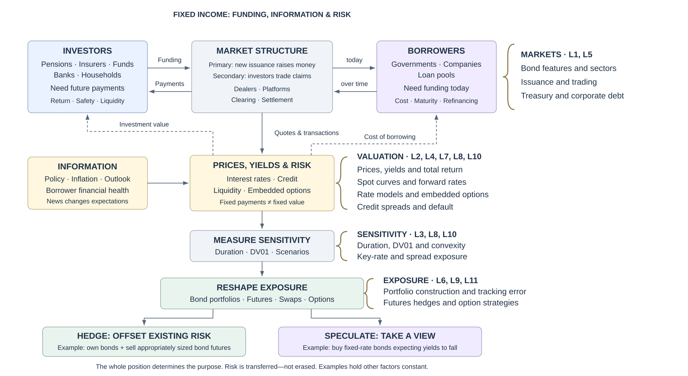
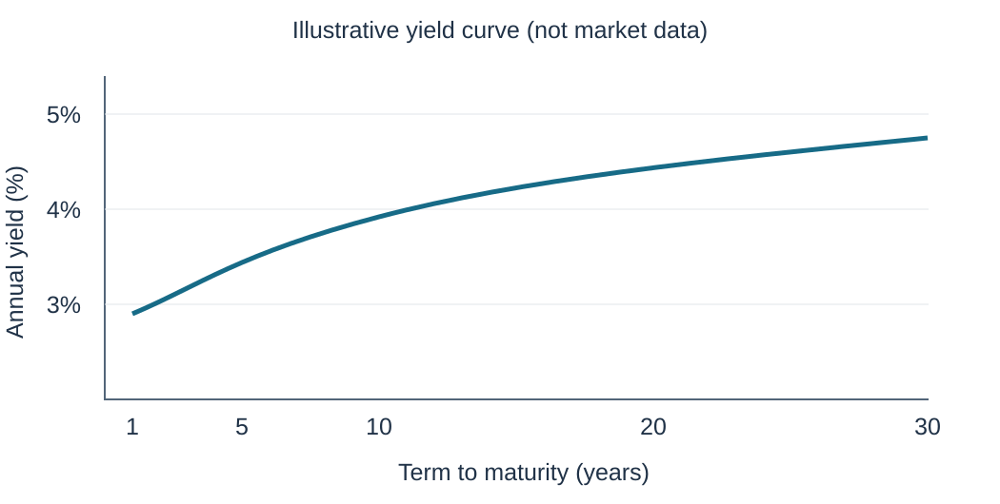
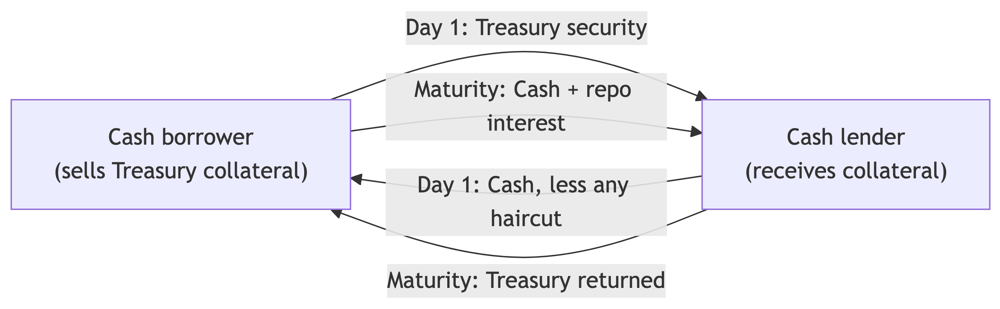
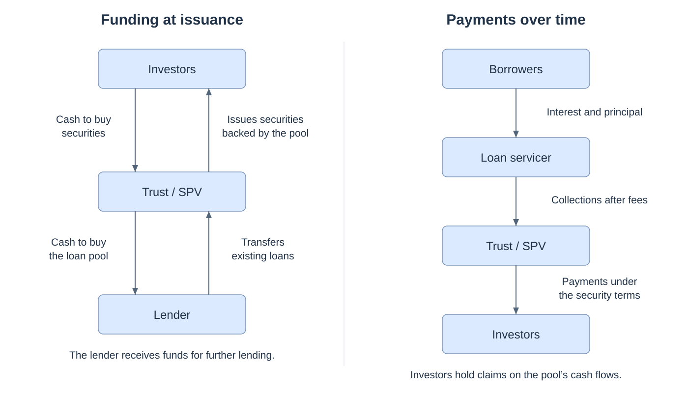

## The course in a nutshell {.market-roadmap}

{fig-alt="Course roadmap: market participants, valuation, sensitivity and constructing or reshaping exposure. Dotted lines connect each block to the course topics in the right-hand column." width="1480" height="775"}

::: {.notes}
Borrowers need funding today; investors need future payments. Explain the primary and secondary markets, follow information into prices, then discuss measuring and constructing exposure. Braces preview later course topics. Colors distinguish boxes without grouping their functions.
:::

## What is a bond?

A **bond** is a debt contract: the issuer borrows today and promises future payments.

- **Issuer:** the borrower responsible for the contractual payments.
- **Investor:** the holder of the claim on those payments.
- **Cash flows:** typically coupon payments plus repayment of principal.

Default and embedded options can change the payments actually received.

## Principal and coupon payments

- **Principal (face or par value):** the amount the issuer must repay.
- **Coupon rate:** annual interest stated as a percentage of principal.
- **Coupon payment:** the amount of interest paid on each payment date.

For a \$1,000 bond with a 5% annual coupon rate:

$$
\text{Annual coupon}=0.05\times \$1{,}000=\$50
$$

With two equal payments per year, each semiannual coupon is **\$25**.

## Term to maturity

**Term to maturity** is the time remaining until the final contractual repayment.

- **Short-term bonds:** approximately 1–5 years.
- **Intermediate-term bonds:** approximately 5–12 years.
- **Long-term bonds:** more than 12 years.

More distant payments generally make a conventional bond’s price more sensitive to yield changes, other factors equal.

## The yield curve {.yield-curve}

The **yield curve** relates yields to maturities for a comparable set of securities at a given date.

{fig-alt="Illustrative yield curve with large markers at 1, 5, 10, 20 and 30 years. Hypothetical annual yields are 3.0, 3.6, 4.1, 4.5 and 4.7 percent." height="490" fig-align="center"}

Curves can slope upward, slope downward, or be relatively flat. Lecture 4 distinguishes par, spot and forward rates.

## Principal and coupon types

- **Fixed-rate bond:** the coupon rate remains unchanged.
- **Zero-coupon bond:** no periodic coupons, with the return arising from the purchase price relative to the maturity payment.
- **Floating-rate bond:** the coupon resets using a reference rate plus a contractual margin.
- **Inverse floater:** the coupon moves opposite to its reference rate.

Principal may return entirely at maturity or gradually through amortization.

## Floating-rate bonds and reference rates

$$
\text{Coupon rate}=\text{reference rate}+\text{quoted margin}
$$

Illustration: a contractual SOFR-based rate of 3.75% plus 150 basis points gives a **5.25% annualized coupon rate**.

::: {.callout-note title="U.S. and Canadian benchmarks"}
**SOFR:** Secured Overnight Financing Rate, based on overnight borrowing secured by U.S. Treasury securities.

**CORRA:** Canadian Overnight Repo Rate Average, based on overnight repo transactions collateralized by Government of Canada securities.
:::

The contract specifies averaging or compounding, reset timing and day-count conventions.

## The repo market

{fig-alt="Repo transaction: cash and securities exchange initially and reverse at repurchase." height="430"}

- A **repo** is economically a secured loan: sell securities for cash and agree to repurchase them later.
- The repurchase-price difference determines the financing cost.
- The cash lender views the transaction as a **reverse repo**.

## Inverse floaters: two channels of rate exposure

$$
\text{Coupon rate}_t=a-b r_t,\qquad b>0
$$

When the reference rate and market discount rates rise together:

- **Cash-flow effect:** the coupon falls.
- **Discounting effect:** higher discount rates reduce present value.

Falling rates can work in the opposite direction. “Two channels” does **not** mean exactly twice the price sensitivity.

**Example:** with a coupon of $10\%-2r_t$, a rise in $r_t$ from 3% to 4% has two effects when market discount rates also rise:

1. The coupon falls from **4% to 2%**, reducing future interest payments.
2. Higher discount rates reduce the present value of those payments further.

## Deferred-coupon structures

- **Deferred-interest bonds:** postpone interest payments initially, then begin regular payments according to the contract.
- **Step-up bonds:** increase the coupon rate on a specified schedule.
- **Payment-in-kind (PIK) bonds:** pay interest by adding debt rather than distributing cash.

These structures reduce near-term cash demands on the issuer. Investors must assess the resulting repayment burden and credit exposure.

## Inflation-linked bonds

- **TIPS:** U.S. Treasury Inflation-Protected Securities adjust principal with U.S. CPI.
- **Linkers:** the general name for inflation-linked bonds. Canadian Real Return Bonds link payments to Canadian CPI.
- A fixed coupon rate applied to adjusted principal changes the coupon amount as the price index changes.

TIPS repay at least original principal at maturity. Their market prices can still fall when real yields rise.

## Amortization and weighted average life

An **amortizing bond** returns principal gradually. A **bullet bond** returns principal at maturity.

| Year | Principal repaid | Remaining principal |
|---:|---:|---:|
| 1 | \$200 | \$800 |
| 2 | \$200 | \$600 |
| 3 | \$200 | \$400 |
| 4 | \$200 | \$200 |
| 5 | \$200 | \$0 |

Interest is separate from these equal principal repayments.

$$
\text{WAL}=\frac{\sum_t P_t t}{\text{total principal}}
=\frac{200(1+2+3+4+5)}{1{,}000}=3\text{ years}
$$

Final maturity is five years, but the average principal dollar returns after three.

## Embedded options

- **Call option:** the issuer can redeem early under specified terms, often to refinance.
- **Put option:** the investor can require early repayment on specified dates and terms.
- **Conversion option:** the investor can exchange the bond for shares.
- **Currency-choice option:** the contract gives a specified party a choice of payment currency.

A **convertible** exchanges into the issuer’s shares. An **exchangeable** exchanges into another company’s shares.

The party controlling an option can change the other party’s cash flows or exposure.

## Financial innovation and securitization

**Securitization** creates tradable claims backed by a pool of loans or other receivables.

- A lender originates loans and transfers a pool to a trust or special-purpose vehicle (SPV).
- The trust issues securities to investors and uses the proceeds to buy the pool.
- A servicer collects borrower payments for distribution under the security terms.

The lender can free up funding, while investors obtain access to loan cash flows without originating each loan.

## Securitization: funding and payments {.securitization-diagram}

{fig-alt="Two side-by-side diagrams: funding at issuance and borrower payments distributed over time." height="690"}

The new securities are claims on existing cash flows. Pooling and structuring redistribute risk.

## Six sectors of the U.S. bond market

- **U.S. Treasury:** federal government bills, notes and bonds that provide benchmark rates.
- **Agency:** debt of federally related institutions and government-sponsored enterprises, with credit support varying by issuer.
- **Municipal:** state and local government debt supported by taxes or specified project revenues.
- **Corporate:** debt issued by businesses, with differing credit quality and contractual protections.
- **Asset-backed securities (ABS):** claims backed by pools of nonmortgage loans or receivables.
- **Mortgage:** residential and commercial mortgage debt, including agency and non-agency mortgage-backed securities.

## Bond risks: rates, cash flows and purchasing power

- **Interest-rate risk:** changes in market yields change the bond’s price.
- **Reinvestment risk:** coupons or returned principal may earn a lower rate when reinvested.
- **Call risk:** early redemption can limit price appreciation and return money when reinvestment rates are low.
- **Inflation risk:** rising prices erode the purchasing power of nominal payments.
- **Exchange-rate risk:** currency movements change the value of foreign-currency payments in the investor’s home currency.

## Bond risks: credit, trading and complexity

- **Credit risk:** the borrower may fail to deliver the promised payments.
  - **Default risk:** missed interest or principal.
  - **Credit spread risk:** a widening required spread lowers price.
  - **Downgrade risk:** a lower credit rating can reduce value.
- **Counterparty risk:** the other party to a transaction may fail to perform.
- **Liquidity risk:** selling promptly may require a price concession.
- **Volatility risk:** changes in expected rate volatility alter embedded-option values.

## Secondary market for bonds

- Investors trade **existing securities**, allowing them to adjust portfolios before maturity.
- Secondary transactions generally provide no new funding to the original issuer.
- Trading supports **liquidity and price discovery**, but activity varies across issues and sectors.

Treasuries generally trade more actively than many individual municipal or corporate issues.

```{=html}
<style>
.reveal .market-roadmap h2 { font-size: 1.15em; margin-bottom: .15em; }
.reveal .market-roadmap p { margin: 0; }
.reveal .market-roadmap img { width: 100%; height: auto; max-height: 790px; object-fit: contain; margin: 0; }
.reveal .securitization-diagram img { max-height: 650px; width: auto; margin: 0; }
.reveal .yield-curve p:has(img), .reveal .securitization-diagram p:has(img) { text-align: center; }
.reveal .yield-curve img, .reveal .securitization-diagram img { display: block; margin-left: auto; margin-right: auto; }
</style>
```
