## Two credit questions: price changes and payment failures

<h3>Spread exposure</h3>
How much does price change when the market demands different credit compensation? A bond can lose value without defaulting.

<h3>Default exposure</h3>
How likely is default, what will recovery be, and how do defaults cluster across a portfolio?

$$
y_{corp}\approx y_{Treasury}+s
$$

## Corporate bond risk has several sources

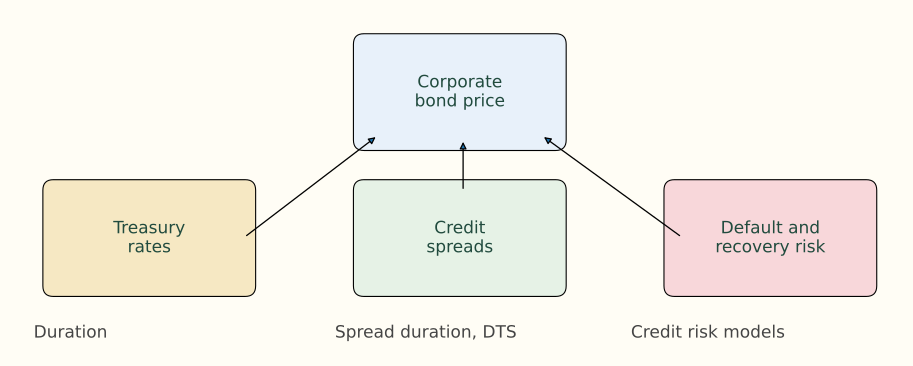{.figure}

## Absolute and relative spread changes answer different questions

$$
s_i=y_i-y_{Treasury}
$$

<h3>Absolute shock</h3>
Δs: how many basis points does the spread move?

<h3>Relative shock</h3>
Δs / s: how large is the move compared with the starting spread?

Existing-deck check: 100 → 150 bp is +50 bp and +50%.

## Example 1 — the same 25 bp move has different meaning

| Bond | Starting spread | Absolute widening | Relative widening |
|---|---:|---:|---:|
| A | 50 bp | 25 bp | 25 / 50 = 50% |
| B | 500 bp | 25 bp | 25 / 500 = 5% |

A’s required credit compensation increases by half. B’s proportional shock is much smaller.

## Compare absolute and proportional shocks visually

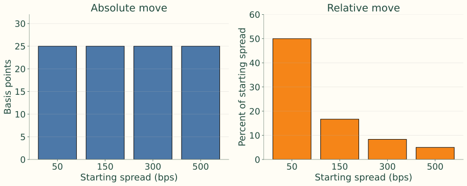{.figure}

The notes’ empirical motivation: wider-spread bonds tend to experience larger basis-point moves, supporting proportional spread-risk measures.

## Spread duration holds Treasury rates constant

$$
D_{spread}=\frac{P_- - P_+}{2P_0\Delta s}
$$

$$
\frac{\Delta P_{spread}}P\approx-D_{spread}\Delta s
$$

P₋ and P₊ are prices after equal spread decreases and increases. Use decimal Δs; a 100 bp widening produces approximately −Dspread percent.

## Connect spread duration to bond valuation

$$
P=\sum_t\frac{CF_t}{(1+r_t+s)^t}
$$

$$
D_s=-\frac1P\frac{\partial P}{\partial s}
$$

A wider spread raises discount rates and lowers present value. Match the shock to the spread convention used in valuation.

## Example 2 — convert a spread shock into a price change

$$
\Delta s=40\text{ bp}=0.0040
$$

$$
\Delta P/P\approx-6.5(0.0040)=-2.6\%
$$

$$
\Delta P\approx-98(0.026)=-2.548
$$

Starting price 98 becomes approximately **95.45**. This is a local approximation with benchmark rates held fixed.

## Retained spread-duration dollar example

Spread duration 4.5; widening 35 bp; market value $4 million.

$$
\Delta P/P\approx-4.5(0.0035)=-1.575\%
$$

$$
\Delta P\approx-0.01575(4{,}000{,}000)=-\$63{,}000
$$

## DTS combines spread level and sensitivity

$$
DTS=D_{spread}\times s
$$

$$
4(0.0090)=0.036=3.6\%
$$

A spread duration of 4 with a 90 bp spread gives DTS of 3.6% when spreads are in decimals.

## Derive the proportional-shock interpretation

$$
\frac{\Delta P_{spread}}P\approx-D_{spread}\Delta s
$$

$$
\frac{\Delta P_{spread}}P\approx-(D_{spread}s)\frac{\Delta s}{s}
$$

$$
\frac{\Delta P_{spread}}P\approx-DTS\frac{\Delta s}{s}
$$

## Spread duration and DTS use different common shocks

<h3>Spread duration</h3>
Give every bond the same basis-point spread move.

<h3>DTS</h3>
Give every bond the same percentage change in its starting spread.

The proportional view helps distinguish tight-spread bonds from distressed or high-yield bonds.

## Example 3 — shorter duration can still mean more spread risk

| Bond | Spread duration | Spread | DTS |
|---|---:|---:|---:|
| A | 7.0 | 100 bp = .0100 | .0700 |
| B | 3.5 | 400 bp = .0400 | .1400 |

$$
\Delta s/s=20\%=0.20
$$

## Apply the same relative widening to both bonds

$$
\Delta P_A/P_A\approx-0.0700(0.20)=-1.40\%
$$

$$
\Delta P_B/P_B\approx-0.1400(0.20)=-2.80\%
$$

A widens by 20 bp; B widens by 80 bp. B’s shorter spread duration is outweighed by its larger spread level.

## Keep DTS quote units explicit

Retained examples from the existing deck:

| Spread duration | Spread | DTS in bp units | DTS in decimals |
|---:|---:|---:|---:|
| 4.5 | 180 bp | 810 | .081 |
| 5.0 | 60 bp | 300 | .030 |
| 5.0 | 300 bp | 1,500 | .150 |

Divide bp-unit DTS by 10,000 before multiplying by a relative spread shock.

## Example 4 — locate portfolio spread risk

$$
\text{DTS contribution}_i=w_iD_{spread,i}s_i
$$

| Sector | Weight | Spread duration | Spread | DTS | Contribution to DTS |
|---|---:|---:|---:|---:|---:|
| A-rated industrials | 50% | 6.0 | 1.20% | 7.20% | 3.60% |
| BBB financials | 30% | 5.0 | 2.00% | 10.00% | 3.00% |
| High yield | 20% | 3.0 | 5.00% | 15.00% | 3.00% |

Portfolio DTS = 3.60% + 3.00% + 3.00% = **9.60%**.

## Market weights can hide credit-risk concentration

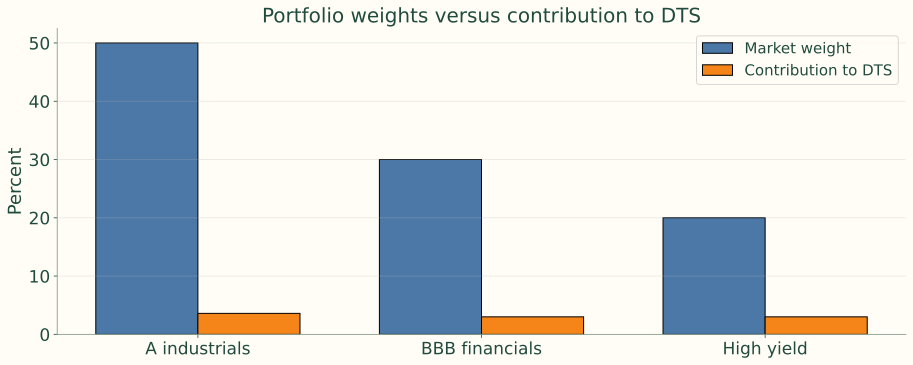{.figure}

The 20% high-yield allocation contributes as much DTS as the 30% BBB allocation. Both chart series are in percentage points, but measure different objects.

## Corporate bonds combine rates, spreads and equity-like risk

<h3>Higher quality</h3>
Promised payments are more likely; Treasury-rate moves often dominate day-to-day price changes.

<h3>Lower quality</h3>
Default, recovery, refinancing and business outlook become more important; returns can behave more like equity.

## A promised-cash-flow duration can overstate Treasury exposure

If credit spreads tighten when Treasury yields rise, the spread gain offsets some rate loss. Default/recovery expectations can also dominate the price.

$$
5\times0.25=1.25
$$

The notes’ rule of thumb reduces a high-yield duration of 5 by 75%. A historical empirical estimate is more explicit, but remains sample dependent.

## Analytical versus empirical duration

<h3>Analytical</h3>
Compute sensitivity from promised cash flows, price, yield and maturity.

<h3>Empirical</h3>
Estimate actual bond-price behavior against Treasury yield changes.

$$
\frac{\Delta P_t}{P_t}=\alpha-D_{emp}\Delta y_t+\epsilon_t
$$

## The regression can be much flatter for high yield

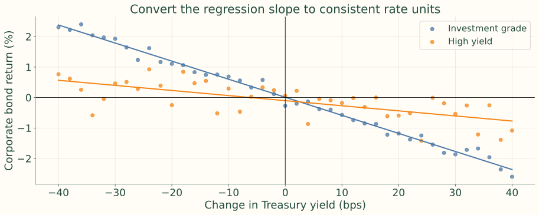{.figure}

Illustrative seeded data, not an empirical market sample. With returns in percent and Treasury changes in bp, Demp = −100 × plotted slope.

## Start the theoretical comparison with two risk factors

$$
\frac{\Delta P}{P}\approx-D\Delta y-Ds\frac{\Delta s}{s}
$$

<h3>Treasury term</h3>
−D Δy: higher risk-free yields lower price.

<h3>Credit term</h3>
−DTS × (Δs / s): spread widening lowers price.

This simple derivation uses the same D for rate and spread sensitivity.

## Divide by the Treasury yield change

$$
\frac1P\frac{\Delta P}{\Delta y}\approx-D-Ds\frac{\Delta s/s}{\Delta y}
$$

$$
\frac1P\frac{\Delta P}{\Delta y}\approx-D\left[1+s\frac{\Delta s/s}{\Delta y}\right]
$$

The spread response per unit Treasury move is estimated statistically, rather than assumed to be known for every observation.

## Estimate the spread response with a regression slope

$$
\beta=\frac{\operatorname{cov}(\Delta y,\Delta s/s)}{\operatorname{var}(\Delta y)}
$$

$$
\operatorname{cov}(\Delta y,\Delta s/s)=\rho_{y,s}\sigma_y\sigma_s
$$

$$
\beta=\frac{\rho_{y,s}\sigma_y\sigma_s}{\sigma_y^2}=\rho_{y,s}\frac{\sigma_s}{\sigma_y}
$$

## The bracket becomes the duration adjustment

$$
D_{emp}\approx D\left[1+s\rho_{y,s}\frac{\sigma_s}{\sigma_y}\right]
$$

σs is volatility of **relative spread changes**; σy is volatility of Treasury yield changes. Use consistent horizons and decimal rate units.

<h3>Negative correlation</h3>
Spread tightening offsets Treasury-rate losses; multiplier below 1.

<h3>Positive correlation</h3>
Spread and Treasury losses reinforce each other; multiplier above 1.

## Example 5 — calculate the multiplier

D = 6; s = .0300; ρ = −.50; σs = .0200; σy = .0020.

$$
\sigma_s/\sigma_y=0.0200/0.0020=10
$$

$$
M=1+(0.0300)(-0.50)(10)=0.8500
$$

$$
D_{emp}=6(0.85)=5.10
$$

## Example 5 — interpret a 50 bp Treasury rise

$$
\Delta P/P\approx-5.10(0.0050)=-2.55\%
$$

<h3>Analytical estimate</h3>
−6 × .005 = −3.00%.

<h3>Empirical adjustment</h3>
Predicted loss is 2.55%, allowing for the historical spread response.

## Example 6 — see the offset directly

$$
\text{Treasury effect}=-6(0.0050)=-3.0\%
$$

$$
\text{Spread effect}=-6(-0.0030)=+1.8\%
$$

$$
\text{Combined}=-3.0\%+1.8\%=-1.2\%
$$

Analytical duration 6; starting spread 3%; Treasury yield rises 50 bp while spread tightens 30 bp.

## A flatter observed response does not mean shorter maturity

$$
D_{observed}=\frac{1.2\%}{0.50\%}=2.4
$$

The cash-flow maturity did not change. The offsetting spread movement changed the observed Treasury-rate response.

## Duration multipliers summarize the empirical adjustment

$$
D_{emp}\approx MD_{analytical},\qquad M=a+bs
$$

Rating and spread help explain multipliers. Wider-spread and lower-rated bonds often have smaller M; strong offsets can produce zero or negative empirical sensitivity.

Existing-deck check: M = .65 and D = 6 imply Demp = 3.9.

## Estimate multipliers in three stages

<b>Time series</b>Estimate Demp for each bond<i>→</i><b>Bond ratio</b>Compute Mᵢ = Demp,ᵢ / Danalytical,ᵢ<i>→</i><b>Cross section</b>Regress Mᵢ on spread within rating groups

$$
M_i=a+bs_i+u_i
$$

## Stage 1 — estimate each bond’s Treasury sensitivity

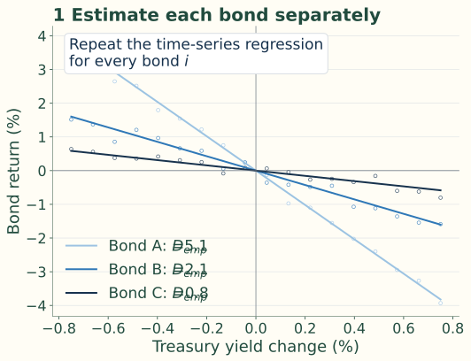{.figure}

Source illustrative data: repeat the return/yield regression separately for each bond.

## Stage 2 — form one duration ratio per bond

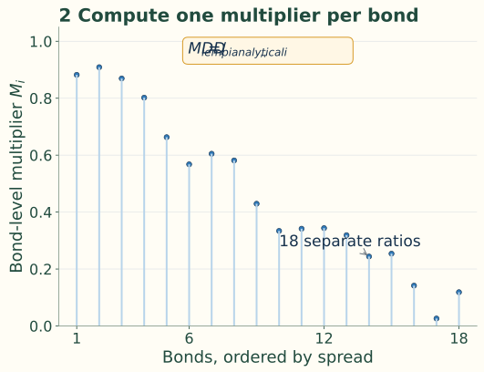{.figure}

Eighteen separate bond-level ratios, ordered by spread.

## Stage 3 — relate those ratios to spread

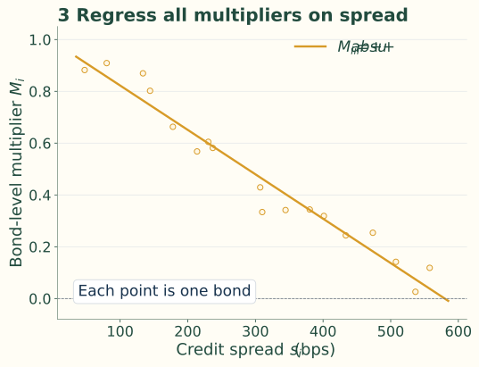{.figure}

The intercept is the rating-group baseline; the slope describes how the multiplier changes with spread. The source expects b < 0 in the usual pattern.

## Example 7 — size adjusted Treasury exposure

Hold $10 million of a B-rated bond, analytical duration 5, multiplier .25; Treasury shock +75 bp.

$$
D_{adjusted}=0.25(5)=1.25
$$

| Method | Return estimate | Dollar loss |
|---|---:|---:|
| Analytical | −5(.0075) = −3.75% | $375,000 |
| Adjusted | −1.25(.0075) = −.9375% | $93,750 |

## Use the adjusted exposure when sizing a Treasury hedge

The change from $375,000 to $93,750 reflects the estimated Treasury–spread offset, before additional issuer-specific credit movement.

An unadjusted analytical-duration hedge can unintentionally add a rate bet.

## Example 8 — the apparent portfolio position can reverse

Target duration 5.5. Hold 85% at duration 5.8 and 15% high yield at analytical duration 5.0.

$$
D_{analytical,p}=0.85(5.8)+0.15(5.0)=5.68
$$

$$
D_{adjusted,p}=0.85(5.8)+0.15(1.25)=5.1175\approx5.12
$$

With a .25 high-yield multiplier, the adjusted portfolio is below target rather than above it. The source’s “true” duration is an estimate, not an immutable property.

## The rating pattern is illustrative, not universal

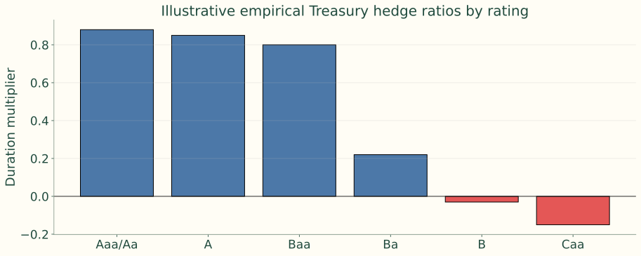{.figure}

These source multipliers are separate illustrative assumptions, not the .25 B-rated input used in Examples 7–8. Estimates depend on rating, sector, maturity and market regime.

## Why credit risk is harder to model

<h3>Sparse observations</h3>
Defaults are rare, particularly in investment grade; there is less event data than daily rate data.

<h3>Heterogeneous issuers</h3>
Industry, leverage, scale, assets, management, accounting, jurisdiction and funding structures differ.

## Default causes and recovery vary across cycles

<h3>Many routes to default</h3>
Poor management, leverage, fraud, commodities, litigation, recession, rates or a liquidity shock.

<h3>Uncertain recovery</h3>
Law, collateral, seniority, restructuring negotiations and market conditions determine loss.

A model that works in one credit cycle may fail in another.

## Credit models serve three connected tasks

<b>Default probabilities</b>One-year, five-year or full term structure<i>→</i><b>Pricing</b>Recovery, risk-free curve and risk compensation<i>→</i><b>Portfolio risk</b>Dependence and clustered defaults

A portfolio of 100 bonds is not merely 100 independent default probabilities.

## Example 9 — expected loss is only a starting point

$$
EL=PD\times LGD=2\%\times60\%=1.2\%
$$

With a 4% risk-free yield, a naive expected-loss spread is 120 bp. That does not establish the fair market spread.

$$
\text{Spread}\approx\text{default compensation}+\text{risk/liquidity premiums}+\text{other effects}
$$

## Ratings and models provide different information

| Feature | Credit ratings | Credit risk models |
|---|---|---|
| Scale | Discrete grades | Continuous probabilities |
| Update frequency | Infrequent | Can update daily or intraday |
| Horizon | Often broad short-term or long-term view | Can produce maturity-specific default probabilities |
| Inputs | Fundamental review and agency judgment | Market data, accounting data, macro variables, model assumptions |
| Strength | Stable, widely understood benchmark | Timely, granular, useful for pricing and risk |
| Weakness | Slow-moving and coarse | Model risk and calibration risk |

## Combine ratings with model evidence

Ratings matter for mandates, indexes, regulations and communication. Models can react more quickly and produce maturity-specific probabilities.

Ratings are stable labels; models are explicit measurement systems with calibration and specification risk.

## Structural default starts with the firm’s balance sheet

<b>Firm assets</b>Market value and volatility<i>→</i><b>Debt obligations</b>Amount and maturity<i>→</i><b>Default threshold</b>Assets insufficient to meet the obligation

Default is endogenous: it arises from the modeled capital structure.

## The basic BSM setup has one debt maturity

Assets A(t); one zero-coupon debt issue with face K due at T. Equity holders repay or default at maturity.

$$
\text{Default at }T\quad\Longleftrightarrow\quad A(T)<K
$$

$$
PD=\Pr[A(T)<K]
$$

A lognormal asset process places some probability mass below the debt threshold.

## Asset paths show why the terminal threshold matters

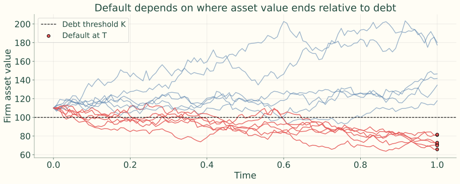{.figure}

Seeded source simulation: A₀ = 110, K = 100, μ = 4%, σ = 28%, T = 1. Basic BSM allows default only at maturity.

## Equity is a call option on firm assets

$$
E(T)=\max[A(T)-K,0]
$$

$$
B(T)=A(T)-\max[A(T)-K,0]
$$

Shareholders keep residual value when assets exceed debt; limited liability permits them to walk away below the threshold.

## Risky debt is a risk-free claim minus a default put

$$
B(T)=K-\max[K-A(T),0]=\min[A(T),K]
$$

The default put removes value from the promised debt payoff in low-asset-value states.

## Example 10 — allocate the terminal firm value

| Asset value at maturity | Equity payoff | Debt payoff |
|---:|---:|---:|
| 140 | 40 | 100 |
| 100 | 0 | 100 |
| 70 | 0 | 70 |

K = 100. At A(T) = 70, shareholders receive zero and bondholders recover 70 of the promised 100.

## The payoff diagram unifies debt and equity

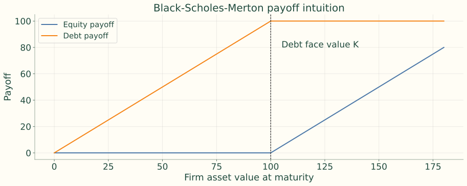{.figure}

## Leverage and volatility connect to credit spreads

<h3>More leverage</h3>
Higher K relative to A₀ moves the firm closer to the default threshold.

<h3>More asset uncertainty</h3>
Wider asset-value outcomes can increase downside risk and the default put’s value.

For the solvent-firm setting emphasized in the notes, higher asset volatility generally raises default risk; the probability relationship is not universal across all leverage/drift settings.

## Maturity and equity-market signals also matter

<h3>Time to maturity</h3>
More time changes both equity and debt option values; PD and spread effects depend on leverage, growth, volatility and recovery.

<h3>Equity information</h3>
Falling equity value and rising equity volatility often signal lower asset value or greater asset risk, widening credit spreads.

## Structural models explain incentives but need difficult inputs

<h3>Economic strengths</h3>
Connect credit to leverage, assets and volatility; analyze borrowing, equity issuance and risk shifting.

<h3>Practical weaknesses</h3>
Assets and volatility are inferred; complex debt, uncertain barriers and unstable calibration complicate implementation.

Maturity-only default can understate short-horizon risk. The objective mentions structural extensions; the notes develop the basic BSM case and later introduce an uncertain first-passage barrier.

## Reduced-form models specify default arrival directly

<b>Default time</b>An intensity or hazard process<i>→</i><b>Recovery</b>A recovery amount and timing rule<i>→</i><b>Discounting</b>A risk-free rate process

Default is exogenous to a detailed asset/debt model. Market-price calibration makes this framework useful for trading and pricing.

## Poisson arrival logic over a very short interval

$$
\Pr(N_{t+dt}-N_t=1)=\lambda dt+o(dt)
$$

$$
\Pr(N_{t+dt}-N_t=0)=1-\lambda dt+o(dt)
$$

λ is conditional default intensity given survival. The notes’ λdt expressions are first-order small-interval approximations. τ denotes the first default time.

## Intensity determines survival and cumulative default

$$
\Pr(\tau>T)=e^{-\lambda T}
$$

$$
\Pr(\tau\le T)=1-e^{-\lambda T}
$$

With constant λ, the first Poisson arrival is default. A generic event-count process can have many arrivals; a single issuer defaults at the first one.

## Poisson event counts change shape with intensity

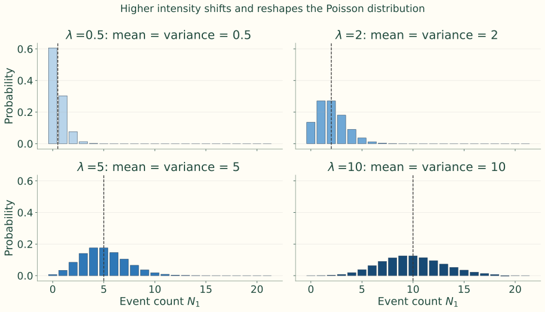{.figure}

Over one time unit, N₁ ∼ Poisson(λ): mean = variance = λ. Larger intensity shifts mass right and makes the distribution less skewed.

## Higher intensity means faster average count growth

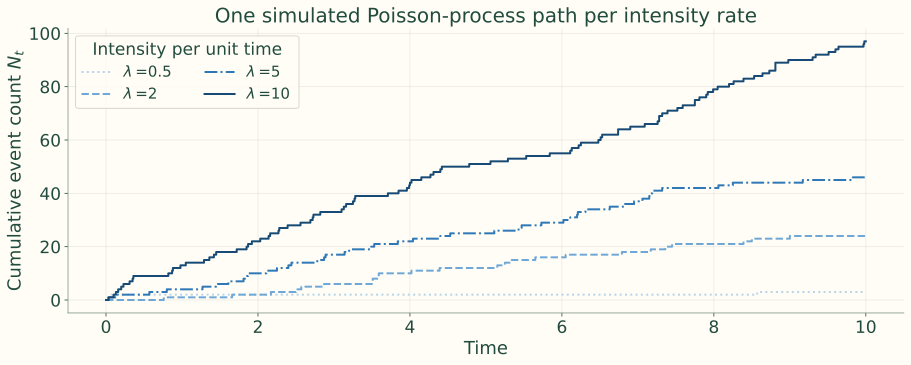{.figure}

Paths are random and need not be ordered at every instant. These are event counts, not repeated defaults of one issuer.

## Example 11 — five-year survival with a 2% intensity

$$
S(5)=e^{-0.02(5)}=e^{-0.10}=90.48\%
$$

$$
PD(5)=1-90.48\%=9.52\%
$$

This is not exactly 2% × 5 = 10%. Retained one-year check: survival e⁻⁰·⁰² = 98.02%; intensity is not exactly one-year PD.

## Compare survival curves across hazard rates

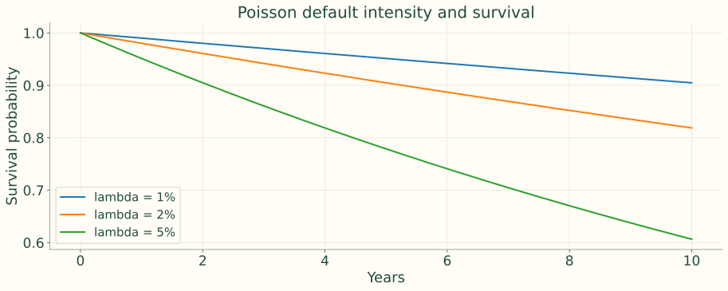{.figure}

## Jarrow–Turnbull: default, recovery and migration

The notes’ simple version pays recovery at maturity, simplifying recovery-timing dependence. Extensions allow migration among rating states such as A, BBB, BB and default.

Transition matrices add credit-migration risk; recovery at maturity is unrealistic for many actual defaults.

## Duffie–Singleton: fractional recovery of market value

<b>Before default</b>The risky bond has market value Vτ₋<i>→</i><b>At default</b>Recover a fraction of that value<i>→</i><b>Pricing</b>Combine intensity, recovery and rates

Recovery occurs at default time and is tied to pre-default market value, rather than being allowed to exceed that value through an unrelated fixed amount.

## Compare the model families

| Issue | Structural models | Reduced-form models |
|---|---|---|
| Default driver | Firm value relative to debt | Exogenous default intensity |
| Main strength | Economic explanation | Market calibration and pricing |
| Main weakness | Hard inputs and calibration | Less economic explanation |
| Common use | Credit analysis, capital structure insight | Trading, pricing, credit derivatives |

Reduced-form calibration can infer credit/default curves from risky zeros, bonds and credit derivatives, but explains less about the economic cause of default.

## Recovery conventions change valuation

Retained existing-deck comparison: recovery may be specified as a fraction of face value, pre-default market value, or a default-free equivalent claim.

Seniority, collateral, industry and the cycle affect realized recovery. A default probability alone does not determine price.

## Portfolio credit risk requires a dependence model

Common macro, industry, funding and liquidity shocks make defaults cluster. A linear correlation coefficient may not describe asymmetric tail outcomes.

The notes’ supplier–automaker example illustrates asymmetric economic exposure; correlation itself is symmetric and does not establish causal direction.

## Copulas join marginal distributions into joint behavior

<b>Marginals</b>Each issuer’s default distribution<i>→</i><b>Dependence</b>Specify how defaults occur together<i>→</i><b>Portfolio losses</b>Evaluate joint and tail outcomes

A copula separates individual risk from dependence assumptions. Tail dependence is difficult to estimate and can be understated.

## Example 12 — expected loss stays the same

100 equal-sized bonds; each has one-year PD 2%; LGD 60%.

$$
E[\text{defaults}]=100(0.02)=2
$$

$$
EL=2(0.60)(0.01)=1.2\%
$$

Ten defaults are unlikely under independence but can become plausible under a shared recession factor.

## The same marginal PD can conceal very different tails

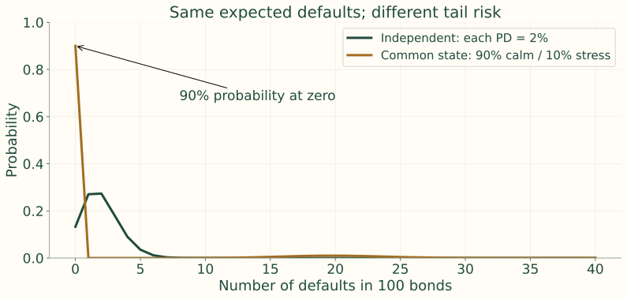{.figure}

Clarifying illustration: 90% calm state with PD 0%; 10% stress state with conditional PD 20%. Unconditional PD remains 2%; expected defaults remain 2.

## Read empirical model comparisons with care

<h3>Ratings and structural models</h3>
Ratings contain information but are coarse. Structural leverage, value and volatility help explain distress.

<h3>Reduced-form models</h3>
Timely market/accounting inputs can improve prediction and pricing, conditional on specification, calibration and data.

The notes summarize general evidence without naming studies. No model family is always best; combine complementary signals.

## Relative value asks what spread compensates for

$$
\text{Spread-to-PD ratio}=\frac{\text{credit spread}}{\text{maturity-matched default probability}}
$$

Higher values mean more spread per unit of modeled default probability, all else equal. This is a comparison screen, not a complete pricing model.

## Example 13 — the wider spread is not automatically better

| Bond | Credit spread | Five-year default probability | Spread / default probability |
|---|---:|---:|---:|
| Bond A | 120 bps | 2.0% | 60 |
| Bond B | 180 bps | 6.0% | 30 |

The source quotes **bp of spread per percentage point of PD**: 120 / 2 = 60 and 180 / 6 = 30. With both inputs in decimals, the ratios are .60 and .30; rankings are unchanged.

## Compare compensation consistently across bonds

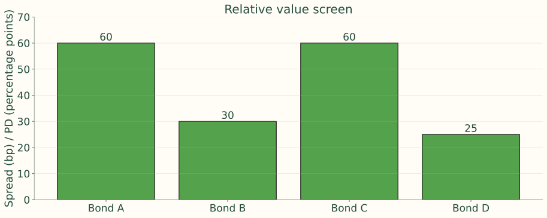{.figure}

Source chart adds C: 90 bp / 1.5% and D: 250 bp / 10%. Liquidity, recovery, covenants, seniority, tax treatment and model error still matter.

## Incomplete information can hide proximity to default

<h3>Hidden obligations</h3>
Off-balance-sheet items, derivatives, pensions and leases.

<h3>Hidden condition</h3>
Asset-quality problems, fraud, aggressive accounting and the true default barrier.

Investors observe noisy signals rather than the firm’s complete economic condition.

## Bridge structural intuition and surprise default

<b>Economic structure</b>Assets approach a default barrier<i>→</i><b>Incomplete information</b>Investors do not know the exact barrier<i>→</i><b>Observed default</b>Failure can arrive as a surprise

A first-passage model with an uncertain barrier combines structural intuition with reduced-form features.

## In practice, calibrate a hazard curve to prices

<b>Observe</b>Bond or CDS prices/spreads<i>→</i><b>Assume</b>Recovery amount and process<i>→</i><b>Calibrate</b>Term structure λ(t)<i>→</i><b>Value</b>Less-liquid bonds, loans or derivatives

## A zero-recovery risky discount factor

$$
P_{risky}(0,T)\approx\exp\left[-\int_0^T(r(t)+\lambda(t))dt\right]
$$

In the simple deterministic-rate/intensity setting, hazard acts as an additional discount rate. Stochastic models require the corresponding risk-neutral expectation. Recovery changes the valuation equation.

## A spread–hazard shortcut needs assumptions

$$
s\approx\lambda\times LGD
$$

$$
0.02(1-0.40)=0.012=120\text{ bp}
$$

Retained existing-deck approximation. Pricing intensities are calibrated risk-neutral quantities; raw market spreads can also contain liquidity and other effects.

## Factor-driven hazard rates use issuer and macro information

$$
\lambda(t\mid X_t)=g(\beta_0+\beta^\top X_t)
$$

X can contain leverage, equity volatility, spreads, rating, unemployment and sector conditions. The link function g must produce a nonnegative intensity.

## A positive link prevents impossible intensities

$$
\lambda=\beta_0+\beta^\top X_t\quad\text{can be negative}
$$

$$
\lambda=\exp(\beta_0+\beta^\top X_t)>0
$$

Softplus is another positive link. A convenient statistical formula alone does not guarantee consistent asset prices.

## Arbitrage-free pricing requires a consistent framework

<b>Measure</b>Specify risk-neutral dynamics<i>→</i><b>Intensity</b>Keep λ(t) nonnegative<i>→</i><b>Cash flows</b>Treat default and recovery consistently<i>→</i><b>Calibration</b>Fit traded prices

A naive linear hazard model can violate these requirements.

## Physical and risk-neutral probabilities serve different uses

<h3>Physical PD</h3>
Real-world default forecasting, expected loss, limits, underwriting, stress tests and capital planning.

<h3>Risk-neutral PD</h3>
Market-consistent valuation of bonds and credit derivatives.

Market pricing includes systematic credit risk, liquidity and recovery uncertainty, especially losses in adverse states.

## Physical PD estimation uses several kinds of evidence

| Information | Examples |
|---|---|
| Default history | Defaults and rating transitions |
| Balance sheet | Leverage, profitability, liquidity, coverage |
| Market | Equity returns/volatility, bond and CDS spreads |
| Macro and sector | Growth, unemployment, rates, inflation, commodities, refinancing |

Common tools: logistic regression, survival models, transition matrices and panel models.

## Example 14 — distinguish expected loss from market spread

$$
PD_{physical}=1\%,\qquad R=40\%
$$

$$
EL=1\%(1-40\%)=0.60\%=60\text{ bp}
$$

The observed spread may be 150 bp. Risk premiums, liquidity, recovery uncertainty, taxes and supply/demand can account for the gap; a price-calibrated model may imply a higher risk-neutral PD.

## Turn measurements into a credit decision

<b>Position</b>Instrument, seniority and spread measure<i>→</i><b>Exposure</b>Spread duration, DTS and rate scenarios<i>→</i><b>Credit</b>PD, recovery and dependence<i>→</i><b>Decision</b>Limit, hedge or relative value

Model outputs organize judgment. Check liquidity, optionality, covenants, technical pressure and model risk before treating a wide spread as attractive.

## Readings and source resources

Fabozzi, *Bond Markets: Analysis and Strategies*, Chapters 21 and 23.

- [FRED, ICE BofA U.S. Corporate Option-Adjusted Spread](https://fred.stlouisfed.org/series/BAMLC0A0CM): Track the broad investment-grade corporate OAS through expansions and periods of market stress.
- [FRED, ICE BofA U.S. High Yield Option-Adjusted Spread](https://fred.stlouisfed.org/series/BAMLH0A0HYM2): Compare speculative-grade spread levels and volatility with investment-grade credit conditions.
- [FINRA, Fixed Income Data](https://www.finra.org/finra-data/fixed-income): Use TRACE-based transaction information to examine actual corporate-bond prices, yields, and trading activity.
- [SEC, EDGAR Company Filings](https://www.sec.gov/search-filings): Retrieve issuer financial statements and debt disclosures used to assess leverage, coverage, structural credit risk, and recovery prospects.
- [Federal Reserve, Senior Loan Officer Opinion Survey](https://www.federalreserve.gov/data/sloos.htm): Relate bank lending standards and loan demand to the credit cycle and changes in default risk.
