## Learning objectives

<b>Contracts</b>Rights, obligations, exercise, assignment and margin<i>→</i><b>Payoffs</b>Intrinsic/time value, profit, break-even and parity<i>→</i><b>Valuation</b>Inputs, Black–Scholes, trees, implied volatility and Black<i>→</i><b>Hedging</b>Protective puts and covered calls sized with DV01 and delta

## The big picture: buy a choice

<b>Interest-rate exposure</b>Bond, yield or futures-price risk<i>→</i><b>Option contract</b>Pay premium; choose whether to exercise<i>→</i><b>Desired payoff</b>Protection, upside or premium income

The buyer has a right without an obligation. The seller receives premium and accepts the corresponding obligation. A futures contract locks in an outcome; an option buys a choice.

## Translate the yield view before choosing the option

<b>Yield move</b>Yields rise<i>→</i><b>Price move</b>Ordinary fixed-rate bond and Treasury futures prices fall<i>→</i><b>Option payoff</b>A put benefits

| Market view or risk | Expected price move | Option position that benefits |
|---|---|---|
| Yields will fall | Bond/futures price rises | Long call |
| Yields will rise | Bond/futures price falls | Long put |
| Protect against rising yields | Insure against a price decline | Buy put |
| Protect against falling yields | Insure against a price increase | Buy call |

## Quantify the exposure that needs protection

$$
\Delta P\approx-PD_{\mathrm{mod}}\Delta y
$$

A $10 million portfolio has modified duration 8. For a +25 bp yield shock:

$$
\Delta P\approx-\$10{,}000{,}000(8)(0.0025)=-\$200{,}000
$$

A put supplies the desired payoff shape. Risk sensitivity still determines the contract count.

## Follow the shock through the hedge

<b>Yield shock</b>Rates rise 25 bp<i>→</i><b>Price response</b>Bond and Treasury futures prices fall<i>→</i><b>Option response</b>Put moves toward or further into the money<i>→</i><b>Portfolio result</b>Put payoff offsets part of the bond loss

Identify the quoted underlying: cash bond, futures price or rate.

## Calls and puts allocate rights and obligations

| Position | Right or obligation | Market view | Maximum loss at expiration |
|---|---|---|---|
| Long call | Right to buy | Underlying price will rise | Premium paid |
| Short call | Obligation to sell if assigned | Underlying will not rise much | Potentially very large |
| Long put | Right to sell | Underlying price will fall | Premium paid |
| Short put | Obligation to buy if assigned | Underlying will not fall much | Large if underlying collapses |

Strike **K** is the exercise price. Expiration is the final date the right exists. The buyer is long and pays premium; the writer is short and receives it.

## A futures option delivers a futures position

<h3>Exercise a call</h3>
Holder becomes long the specified futures at K.

<h3>Exercise a put</h3>
Holder becomes short the specified futures at K.

The underlying is the futures contract, not the cash Treasury security.

## Exercise style determines when the choice exists

<h3>American</h3>
Exercise on any eligible trading day through expiration.

<h3>European</h3>
Exercise only at expiration.

The names describe rules, not geography. The notes identify Treasury and SOFR options as American-style families; exact contract specifications govern. American flexibility cannot reduce value, but early exercise is not always optimal.

## Options versus futures: commitment and cash

| Feature | Futures contract | Option contract |
|---|---|---|
| Economic commitment | Both sides are obligated | Buyer has a right; writer has an obligation |
| Upfront price | Normally no purchase price; margin is posted | Buyer pays premium under traditional premium style |
| Payoff | Symmetric | Asymmetric |
| Long's downside | Falls one-for-one with futures price | Long option loss is limited to premium |
| Time value | No option time value | Premium normally includes time value |
| Main use | Lock in or linearly change exposure | Protect, retain upside, or sell contingent exposure |

## Symmetric futures exposure versus a call payoff

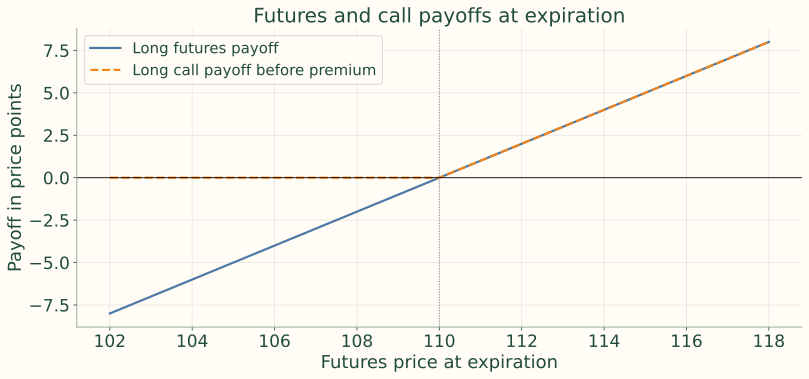{.figure}

At 110, a long futures position gains one point at 111 and loses one at 109. A 110 call can expire unexercised below 110. The plotted call payoff excludes premium.

## Example 1 — lock or insure a long portfolio

<h3>Sell futures</h3>
A price decline creates gains; a price rise creates losses. Linear hedging gives up both sides of the mapped exposure.

<h3>Buy puts</h3>
Pay premium for protection below the strike. If prices rise, let puts expire and retain portfolio gains less premium.

Both respond to fear of falling Treasury prices over the next three months; they serve different payoff objectives.

## Options on cash bonds

<b>Underlying</b>A specific bond<i>→</i><b>Value drivers</b>Coupon, maturity, yield, duration and price volatility<i>→</i><b>OTC terms</b>Customization, counterparty, liquidity and documentation

Retained connection: embedded calls and puts in bonds allocate similar rights within the bond contract.

## Options on interest rates

<h3>Cap and floor</h3>
A cap protects a borrower from rates above a strike. A floor protects an investor from rates below a strike.

<h3>Swaption</h3>
An option to enter an interest-rate swap.

These OTC instruments are often quoted using implied volatility, not just dollar premium.

## Exchange-traded futures option families

Treasury families include 2Y, 3Y, 5Y, 10Y, Ultra 10Y, bond and Ultra bond futures options. SOFR options include standard, weekly and mid-curve expirations; other listed short-rate options may also be available.

Standardization, transparent prices, central clearing and offsetting trades support exchange trading.

## Read the complete trade instruction

<b>Buy one</b>Long option; pay premium<i>→</i><b>September 10-year Treasury futures</b>Identify the exact underlying contract<i>→</i><b>110 call</b>Right to become long futures at strike 110

Also identify option expiration, exercise style, contract unit, quotation, premium and margin convention. The option date need not be inferred from the futures month.

## Exercise and assignment are paired

| Option exercised | Holder receives | Assigned writer receives |
|---|---|---|
| Call | Long futures at K | Short futures at K |
| Put | Short futures at K | Long futures at K |

New futures positions are marked to market. Clearing handles assignment. Traders often close an option with an offsetting trade instead of exercising early.

## Follow one trade — buy the December 110 put

Premium quote **0-40** means 40/64 of one price point for this example.

$$
\frac{40}{64}\times\$1{,}000=\$625
$$

Strike 110 is an index price equal to 110% of the $100,000 face unit; it is not $110. One point is $1,000; one 1/64 is $15.625.

## Follow one trade — expiration outcomes

| Futures price | Status | Payoff | Profit after $625 |
|---:|---|---:|---:|
| 114 | Out of money | $0 | −$625 |
| 110 | At money | $0 | −$625 |
| 109.375 | In money by 0.625 | $625 | $0 |
| 107 | In money by 3 points | $3,000 | $2,375 |

At 107, exercise creates a short futures at 110, worth three points. Selling the valuable option or exercising and offsetting gives intrinsic value at expiration, apart from fees and execution.
Instructor review: The notes write 109-24 = 109.375. In 32nds futures notation, 109.375 = 109-12; 109-24 = 109.75. Decimal prices above remove the ambiguity.

## Keep three units separate

<h3>Option premium fractions</h3>
1-16 = 1 + 16/64 = 1.25 points = $1,250 in the example convention.

<h3>Futures-price fractions</h3>
109.375 = 109 + 12/32 = 109-12 in 32nds notation.

Price points, dollars and yield basis points are different quantities. A quote convention must be specified before converting.

## Example 2 — exercise the 110 call at 112

<b>Exercise</b>Long futures at 110<i>→</i><b>Immediate value</b>(112 − 110) × $1,000 = $2,000<i>→</i><b>Premium</b>0-48 = 48/64 × $1,000 = $750<i>→</i><b>Net profit</b>$2,000 − $750 = $1,250

The example ignores fees and cash-flow timing.

## Margin conventions change the cash-flow mechanics

<h3>Premium paid upfront</h3>
Buyer pays premium and normally does not post the same performance margin as an uncovered writer. Writer posts margin for contingent obligations.

<h3>Futures-style margining</h3>
Premium is not fully exchanged initially. Changes generate settlement variation; premium settles at close, exercise or expiry.

Portfolio offsets affect clearing margin. Exercise creates futures positions with their own margin requirements.

## Why futures options are popular

<b>Trading</b>Liquidity and transparent prices<i>→</i><b>Risk</b>Asymmetric protection and flexible payoff design<i>→</i><b>Infrastructure</b>Standardized terms, central clearing and offsetting trades<i>→</i><b>Capital</b>Capital efficiency with margin obligations

Quarterly, serial, weekly and mid-curve listings target horizons and events. Product codes, strike intervals, hours and expiration rules vary; the notes’ specification table is a teaching summary.

## Contract specifications: the source teaching summary

| Option family | Underlying futures | Typical underlying unit | Quotation intuition | Exercise |
|---|---|---:|---|---|
| Treasury note options | 2Y, 3Y, 5Y, 10Y, Ultra 10Y | $100,000 face | Points and fractions of a point | American style |
| Treasury bond options | T-Bond and Ultra T-Bond | $100,000 face | Points and fractions of a point | American style |
| Three-Month SOFR options | One specified SR3 futures contract | $1,000,000 reference notional | Index points; 1 bp in futures is $25 | American style |

Instructor review: The source groups all Treasury note units as $100,000. Unit sizes differ by tenor; treat this as a teaching summary, not a contract specification. The worked 10-year examples use $100,000.

## Decompose the option premium

$$
\text{Premium}=\text{intrinsic value}+\text{time value}
$$

<h3>Intrinsic value</h3>
What exercise would be worth if the option expired now; never negative.

<h3>Time value</h3>
Premium above intrinsic value; value from favorable movement before expiry.

## Call and put moneyness

$$
\text{Call intrinsic}=\max(S-K,0),\qquad\text{Put intrinsic}=\max(K-S,0)
$$

| Price relative to strike | Call | Put |
|---|---|---|
| S > K | In the money | Out of the money |
| S = K | At the money | At the money |
| S < K | Out of the money | In the money |

## Time value sits above intrinsic value

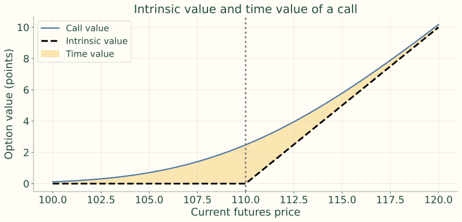{.figure}

Time value is usually greatest near the strike and tends to zero at expiry. This source illustration sets r = 0 so European value and immediate-exercise intrinsic share the same value basis.

## Example 3 — decompose a 2.75-point premium

Call strike 110; current futures 112; premium 2.75 points.

$$
\text{Intrinsic}=\max(112-110,0)=2.00
$$

$$
\text{Time value}=2.75-2.00=0.75
$$

<b>Total premium</b>$2,750<i>→</i><b>Intrinsic portion</b>$2,000<i>→</i><b>Time-value portion</b>$750

All dollar amounts use $1,000 per price point.

## Payoff and profit answer different questions

<h3>Payoff</h3>
Exercise value at expiration, before the initial premium.

<h3>Profit</h3>
Payoff less premium for a buyer; premium less payoff for a writer.

Let c and p be call and put premiums and Sₜ the expiration price. The following profit diagrams use K = 110, c = 3.00 and p = 2.50, ignoring financing and fees.

## Long call — formula and exposure

$$
\Pi=\max(S_T-K,0)-c
$$

Maximum loss c; break-even K + c = 113. Benefits from higher prices, usually falling yields. Potential upside is large; the ordinary-asset model has no upper bound.

## Long call — expiration profit

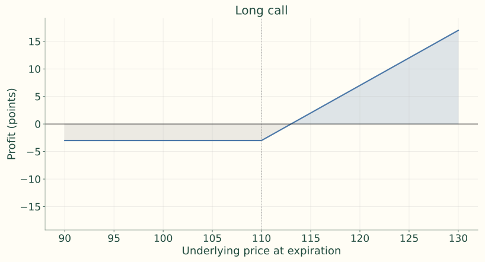{.figure}

## Short call — formula and exposure

$$
\Pi=c-\max(S_T-K,0)
$$

Maximum gain c; break-even K + c = 113. A naked writer accepts potentially very large losses if prices rise.

## Short call — expiration profit

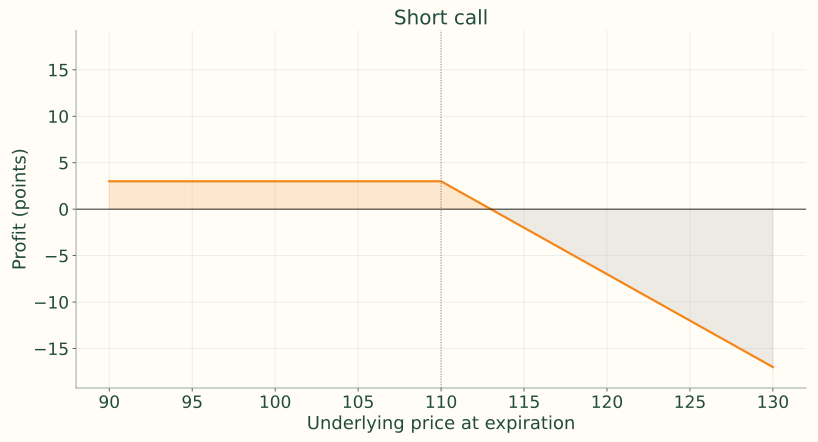{.figure}

## Long put — formula and exposure

$$
\Pi=\max(K-S_T,0)-p
$$

Maximum loss p; break-even K − p = 107.5. Maximum gain K − p if price can fall to zero. Usually benefits from rising yields.

## Long put — expiration profit

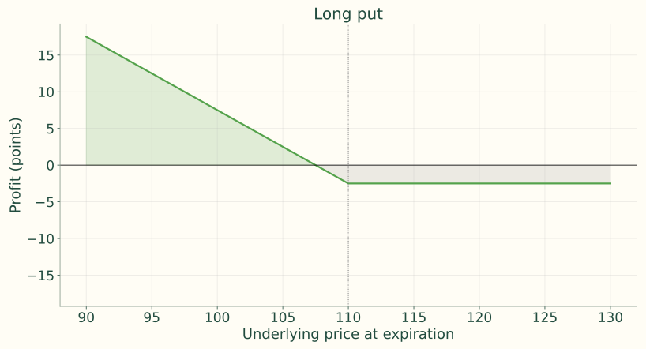{.figure}

## Short put — formula and exposure

$$
\Pi=p-\max(K-S_T,0)
$$

Maximum gain p; break-even K − p = 107.5. Loss can be large if the underlying falls sharply.

## Short put — expiration profit

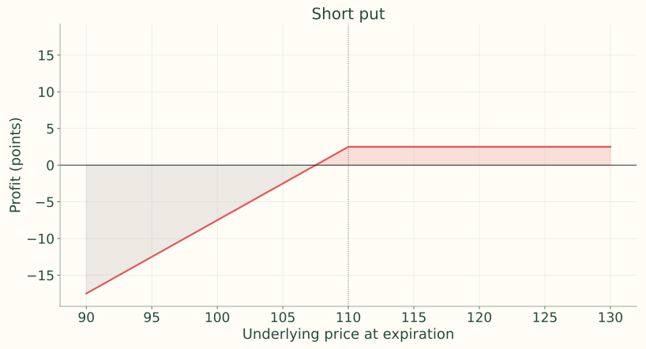{.figure}

## Naked writing exchanges tail risk for premium

Receiving a premium is not a safe return. The maximum gain is known and small relative to possible losses. Margin protects the clearing system; it does not remove the writer’s market risk.

## Example 4 — a 110 put costing 1.50

| Futures price at expiration | Put payoff | Profit after premium |
|---:|---:|---:|
| 114 | 0.00 | -1.50 |
| 110 | 0.00 | -1.50 |
| 108.5 | 1.50 | 0.00 |
| 105 | 5.00 | 3.50 |

$$
\text{Break-even}=110-1.50=108.50
$$

At 105, payoff is 5.00 points and profit is 3.50 points. Above 110, the loss is the 1.50-point premium.

## Put-call parity equates two expiration packages

$$
C-P=S_0-Ke^{-rT}
$$

$$
C+Ke^{-rT}=P+S_0
$$

<h3>Fiduciary call</h3>
Call + risk-free investment paying K at expiry.

<h3>Protective put</h3>
Underlying + put.

European options on a non-coupon-paying asset. Both packages end at max(Sₜ, K), so no arbitrage requires the same price today.

## The two packages trace the same payoff

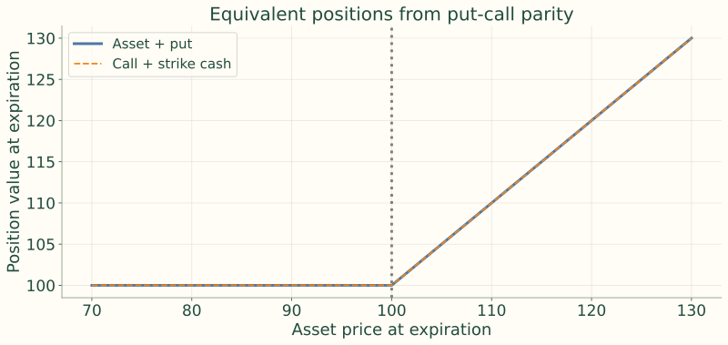{.figure}

## Adjust parity for coupons or futures

<h3>Coupon bond</h3>
Subtract I, the present value of coupons paid before option expiry.

<h3>Futures option</h3>
With European exercise and premium paid upfront, discount the futures–strike difference.

$$
C-P=(B_0-I)-Ke^{-rT}
$$

$$
c-p=e^{-rT}(F_0-K)
$$

## Parity creates synthetic positions

| Desired position | Equivalent position |
|---|---|
| Long call | Long put + long underlying - risk-free bond paying $K$ |
| Long put | Long call - long underlying + risk-free bond paying $K$ |
| Long underlying | Long call - long put + risk-free bond paying $K$ |
| Protective put | Fiduciary call |

These equivalents use the same European maturity and strike and the non-coupon asset setup; adapt the income term when coupons intervene.

## Example 5 — calculate the parity-consistent put

S₀ = 98, K = 100, T = 0.5, r = 4%, C = 3.80.

$$
P=C-S_0+Ke^{-rT}=3.80-98+100e^{-0.04(0.5)}\approx3.82
$$

If the identical put trades at 4.50, asset + put is expensive relative to call + strike cash.

## Example 5 — trade the price gap

<b>Sell expensive</b>Short asset and put: receive 98 + 4.50 = 102.50<i>→</i><b>Buy cheap</b>Buy call and strike cash: pay 3.80 + 98.0199 = 101.8199<i>→</i><b>Initial difference</b>Receive about 0.6801; expiration packages offset

The arbitrage comparison assumes matching contracts, borrowing/shorting access and negligible transaction costs.

## Six inputs shape option value

| Input rises | Ordinary cash-asset call | Ordinary cash-asset put |
|---|---|---|
| Underlying price | Rises | Falls |
| Strike | Falls | Rises |
| Time | Usually rises | Usually rises |
| Risk-free rate | Usually rises | Usually falls |
| Interim coupon PV | Falls | Rises |
| Price volatility | Rises | Rises |

Hold other inputs fixed. American time flexibility helps; European discounting and coupon timing can complicate the time effect. Futures-model rate effects differ.

## Underlying price and strike work in opposite directions

<h3>Current price rises</h3>
Buying at fixed K is more attractive; selling at fixed K is less attractive.

<h3>Strike rises</h3>
Buying at higher K is less attractive; selling at higher K is more attractive.

## More time gives more opportunities — with qualifications

American calls and puts gain exercise opportunities with more time. European options can behave differently because discounting and coupon timing matter. A deep in-the-money call behaves more like the underlying; a deep out-of-the-money call has little exercise probability.

## Separate the rate input from the bond-price response

<h3>Ordinary call pricing input</h3>
Higher r reduces the present value of paying K, tending to raise a cash-asset call and lower a put.

<h3>Bond-market movement</h3>
A rate rise can also lower the underlying bond price. That simultaneous effect must be included in an actual rate scenario.

## Interim coupons leave before the option is exercised

<b>Current bond price</b>Includes the value of interim coupons<i>→</i><b>Subtract coupon PV</b>Adjusted underlying = S₀ − I<i>→</i><b>Option value</b>Larger I tends to reduce the call and increase the put

The option holder does not receive coupons paid before exercise.

## Volatility makes the choice more valuable

The buyer keeps favorable outcomes and declines unfavorable exercise. More dispersion can increase call and put values even if the expected underlying price is unchanged; the writer demands compensation.

$$
\frac{\Delta P}{P}\approx-D_{\mathrm{mod}}\Delta y
$$

Distinguish percentage price volatility, yield volatility in bp, and normal versus lognormal quote conventions. Longer duration maps a given yield shock into greater price movement.

## Current futures price — isolate one pricing input

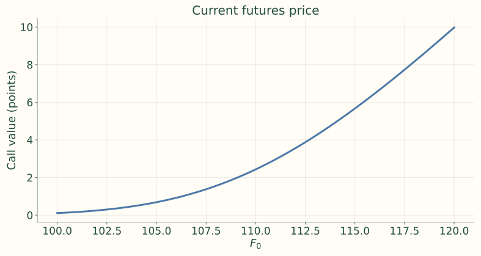{.figure}

Source benchmark: F₀ = K = 110, T = 0.5, r = 4%, σ = 8%; change only the plotted input.

## Strike — isolate one pricing input

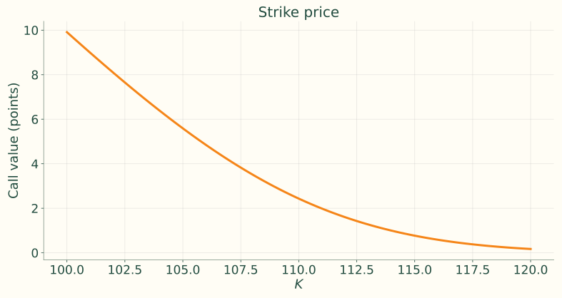{.figure}

Source benchmark: F₀ = K = 110, T = 0.5, r = 4%, σ = 8%; change only the plotted input.

## Time to expiration — isolate one pricing input

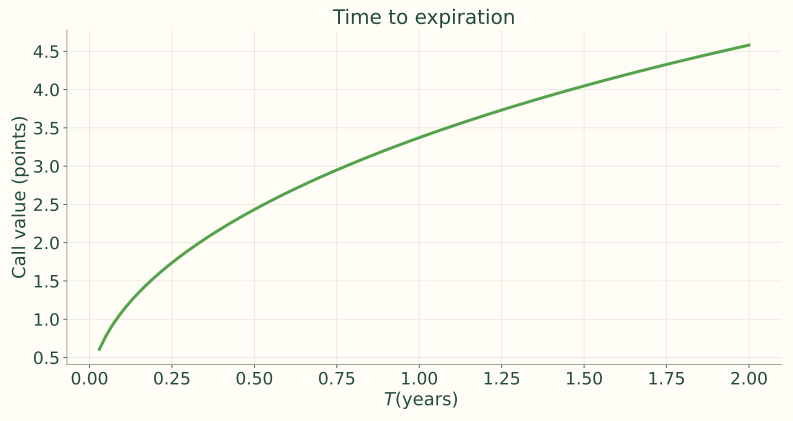{.figure}

Source benchmark: F₀ = K = 110, T = 0.5, r = 4%, σ = 8%; change only the plotted input.

## Price volatility — isolate one pricing input

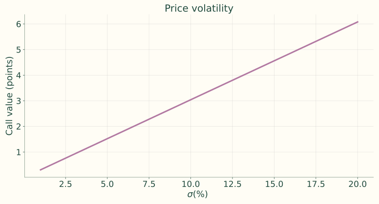{.figure}

Source benchmark: F₀ = K = 110, T = 0.5, r = 4%, σ = 8%; change only the plotted input.

## Moneyness, time and volatility interact

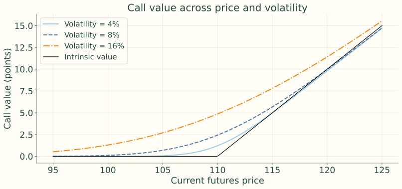{.figure}

Near the strike, uncertainty most visibly changes exercise prospects. With positive discounting, a European futures option can lie below immediate-exercise intrinsic far in the money; the right cannot be exercised early.

## Every model applies the same valuation logic

<b>States</b>Describe future underlying prices<i>→</i><b>Payoffs</b>Apply the exercise rule in each state<i>→</i><b>No arbitrage</b>Replicate or use pricing probabilities<i>→</i><b>Value today</b>Discount at the appropriate risk-free rate

## Black–Scholes for a non-coupon-paying asset

$$
C=S_0N(d_1)-Ke^{-rT}N(d_2)
$$

$$
d_1=\frac{\ln(S_0/K)+(r+\sigma^2/2)T}{\sigma\sqrt T},\qquad d_2=d_1-\sigma\sqrt T
$$

$$
P=Ke^{-rT}N(-d_2)-S_0N(-d_1)
$$

N(·) is the standard normal CDF. For a coupon bond, the simple adjustment replaces S₀ with S₀ − I.

## Interpret the formula and its assumptions

<b>Underlying component</b>S₀N(d₁)<i>→</i><b>Strike component</b>Discount K, then weight by N(d₂)<i>→</i><b>Call value</b>Underlying component − strike component

Assumptions: lognormal price, constant volatility and risk-free rate, frictionless trading and continuous hedging. For bonds these are approximations; term-structure models can better represent joint rate and bond dynamics.

## Example 6 — zero-coupon bond call setup

| Input | Value |
|---|---:|
| Current bond price S₀ | 92 |
| Strike K | 90 |
| Option maturity T | 0.5 years |
| Continuously compounded r | 4% |
| Annualized bond-price σ | 10% |

No interim coupon. Calculate call and put, then check parity.

## Example 6 — standardize the exercise threshold

$$
d_1=\frac{\ln(92/90)+[0.04+(0.10)^2/2](0.5)}{0.10\sqrt{0.5}}=0.6290
$$

$$
d_2=0.6290-0.10\sqrt{0.5}=0.5583
$$

$$
N(d_1)=0.7353,\qquad N(d_2)=0.7117
$$

Keep full precision internally; displayed probabilities are rounded.

## Example 6 — calculate the call

$$
\begin{aligned}C&=92N(d_1)-90e^{-0.04(0.5)}N(d_2)\\&\approx92(0.7353)-90e^{-0.02}(0.7117)\\&=4.8673\quad\text{using unrounded CDF values.}\end{aligned}
$$

$$
\text{Intrinsic}=\max(92-90,0)=2;\qquad\text{time value}=2.8673
$$

The strike payment is discounted; the current underlying price is not.

## Example 6 — calculate the put

$$
N(-d_1)=0.2647,\qquad N(-d_2)=0.2883
$$

$$
\begin{aligned}P&=90e^{-0.04(0.5)}N(-d_2)-92N(-d_1)\\&\approx90e^{-0.02}(0.2883)-92(0.2647)\\&=1.0852\quad\text{using unrounded CDF values.}\end{aligned}
$$

## Example 6 — verify parity

$$
C-P=4.8673-1.0852=3.7821
$$

$$
S_0-Ke^{-rT}=92-90e^{-0.04(0.5)}=3.7821
$$

The two sides agree: call and put values are internally consistent.

## Retained worked example — a second zero-coupon call

Existing-deck example: S₀ = 95, K = 94, T = 0.75, r = 3%, σ = 12%.

$$
d_1=0.3703,\quad d_2=0.2664,\quad N(d_1)=0.6444,\quad N(d_2)=0.6050
$$

$$
C=95N(d_1)-94e^{-0.03(0.75)}N(d_2)=5.6129\approx5.61
$$

Same pricing logic with a different set of inputs.

## Example 6 extension — remove the interim coupon

Coupon of 2.00 is paid before option expiry; its PV is 1.96.

$$
S_0-I=92.00-1.96=90.04
$$

$$
d_1=\frac{\ln(90.04/90)+[0.04+(0.10)^2/2](0.5)}{0.10\sqrt{0.5}}=0.3245
$$

$$
d_2=0.2538;\qquad N(d_1)=0.6272,\quad N(d_2)=0.6002
$$

## Example 6 extension — value and interpretation

$$
C_{\mathrm{coupon}}=90.04N(d_1)-90e^{-0.02}N(d_2)=3.5291
$$

$$
4.8673-3.5291=1.3382
$$

Full-precision probabilities produce these values. The call-value reduction is smaller than the coupon PV of 1.96 because call delta is below one: reducing the adjusted bond price does not reduce the call one-for-one.

## A binomial tree matches volatility through its branches

$$
\Delta t=T/N,\qquad u=e^{\sigma\sqrt{\Delta t}},\qquad d=e^{-\sigma\sqrt{\Delta t}}=1/u
$$

One-step log returns are ±σ√Δt. Higher volatility and longer steps widen the branches. A finer CRR tree converges toward the corresponding lognormal distribution; expected growth is not inserted into u and d.

## No arbitrage determines the pricing probability

$$
q=\frac{e^{r\Delta t}-d}{u-d},\qquad 1-q=\text{down probability}
$$

$$
d<e^{r\Delta t}<u\quad\Longrightarrow\quad0<q<1
$$

For continuous income yield y, use r − y in the probability’s carry term. The volatility-based u and d remain unchanged. q is a pricing weight, not a forecast frequency.

## CRR parameters — 100 steps for Example 6

$$
\Delta t=0.5/100=0.005
$$

$$
u=e^{0.10\sqrt{0.005}}=1.007096,\qquad d=e^{-0.10\sqrt{0.005}}=0.992954
$$

$$
S_u=92u=92.6528,\qquad S_d=92d=91.3518
$$

One step raises price about 0.7096% or lowers it about 0.7046%.

## CRR parameters — probabilities and backward induction

$$
q=\frac{e^{0.04(0.005)}-0.992954}{1.007096-0.992954}\approx0.512376,\quad1-q=0.487624
$$

$$
V_t=e^{-r\Delta t}\left[qV^u_{t+\Delta t}+(1-q)V^d_{t+\Delta t}\right]
$$

Calculate terminal call/put payoffs first, then repeat this recursion to time zero. For American exercise, take the larger of continuation and immediate exercise at every node.

## One-period tree — start with the terminal states

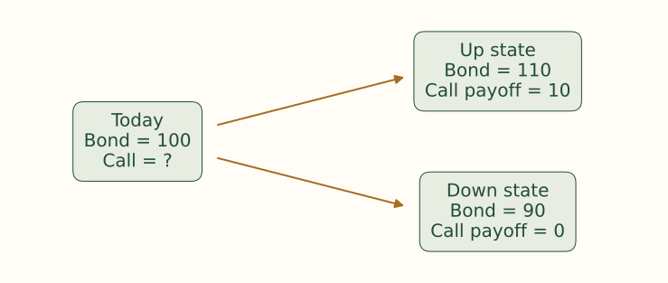{.figure}

One-year call: strike 100; risk-free gross return 1.05. Build a portfolio of Δ bonds and B dollars in the risk-free asset that matches both terminal call payoffs.

## One-period tree — solve the replicating portfolio

$$
110\Delta+1.05B=10,\qquad90\Delta+1.05B=0
$$

$$
\Delta=\frac{10-0}{110-90}=0.5,\qquad B=-\frac{90(0.5)}{1.05}=-42.857
$$

$$
C_0=0.5(100)-42.857=7.143
$$

Buy half a bond and borrow 42.857. Replication determines the call’s value without guessing real-world probabilities.

## One-period tree — the same price from risk-neutral weights

$$
q=\frac{1.05-0.90}{1.10-0.90}=0.75
$$

$$
C_0=\frac{0.75(10)+0.25(0)}{1.05}=7.143
$$

The 75% makes the underlying earn the risk-free return inside the pricing calculation. A many-period tree repeats this same logic at every node.

## A finer tree approaches the closed-form price

$$
C_{100\mathrm{-step}}=4.8723,\qquad C_{\mathrm{BS}}=4.8673
$$

$$
\text{Difference}=4.8723-4.8673=0.0050
$$

The economics is unchanged. Each step discounts a risk-neutral expectation over Δt = 0.005 years.

## Inspect convergence rather than expecting a straight line

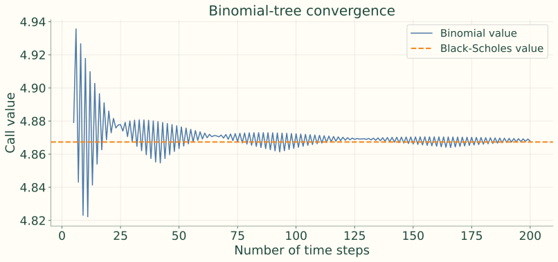{.figure}

The saw-tooth pattern reflects whether the strike falls near an up or down node. The oscillation narrows as the tree becomes finer.

## Implied volatility reverses the pricing question

<b>Observe</b>Market option price<i>→</i><b>Hold fixed</b>Other model inputs<i>→</i><b>Solve</b>Volatility that reproduces the price

$$
\text{Market price}=\text{Model price}(\sigma_{\mathrm{implied}})
$$

It is not necessarily a realized-volatility forecast; risk premiums, supply/demand, liquidity and model assumptions also affect it.

## Recover implied volatility — set up the root search

The Example 6 call trades at 4.25, below its 4.8673 value at 10% volatility.

$$
4.25=92N(d_1)-90e^{-0.04(0.5)}N(d_2)
$$

Both d₁ and d₂ depend on unknown σ. It cannot be isolated algebraically. If model price is too low, raise σ; if too high, lower σ.

## Recover implied volatility — converge on the quote

| Trial volatility | Black-Scholes call value | Direction for next trial |
|---:|---:|---|
| 5.000% | 3.9655 | Price too low; raise $\sigma$ |
| 6.500% | 4.1878 | Price too low; raise $\sigma$ |
| 7.000% | 4.2741 | Price too high; lower $\sigma$ |
| 6.800% | 4.2390 | Price too low; raise $\sigma$ |
| 6.863% | 4.2500 | Matches the market price |

$$
\sigma_{\mathrm{implied}}\approx6.863\%
$$

Continue trial values or a numerical root search until the pricing error is sufficiently small.

## A smile shows why one volatility is not enough

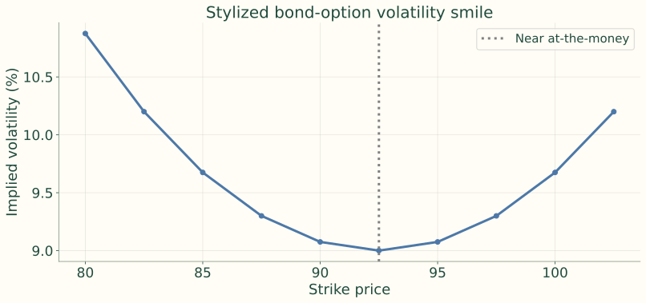{.figure}

Stylized source curve, not observed market data. A smile or skew means a single constant lognormal volatility does not fully describe prices across strikes.

## Black’s model values European futures options

$$
c=e^{-rT}[F_0N(d_1)-KN(d_2)]
$$

$$
p=e^{-rT}[KN(-d_2)-F_0N(-d_1)]
$$

$$
d_1=\frac{\ln(F_0/K)+\tfrac12\sigma^2T}{\sigma\sqrt T},\qquad d_2=d_1-\sigma\sqrt T
$$

Both terms are inside the discount factor. No separate carry term enters d₁: F₀ already reflects carry under the model.

## Example 7 — Treasury futures option inputs

| Input | Value |
|---|---:|
| Futures F₀ | 111 |
| Strike K | 110 |
| Time T | 0.25 years |
| Rate r | 4.5% |
| Futures-price σ | 8% |
| Contract point value | $1,000 |

Calculate call and put in points, convert to dollars, then check parity.

## Example 7 — calculate d₁, d₂ and discounting

$$
d_1=\frac{\ln(111/110)+\tfrac12(0.08)^2(0.25)}{0.08\sqrt{0.25}}=0.2462
$$

$$
d_2=0.2462-0.04=0.2062
$$

$$
N(d_1)=0.5973,\quad N(d_2)=0.5817,\quad e^{-0.045(0.25)}=0.9888
$$

Displayed probabilities and discount factor are rounded; use full precision for final premiums.

## Example 7 — price the call

$$
\begin{aligned}c&=e^{-rT}[111N(d_1)-110N(d_2)]\\&\approx0.9888[111(0.5973)-110(0.5817)]\\&=2.2823\ \text{points}\quad\text{(full precision)}\end{aligned}
$$

$$
\text{Dollar premium}=c\times\$1{,}000=\$2{,}282.32
$$

## Example 7 — price the put and check parity

$$
\begin{aligned}p&=e^{-rT}[110N(-d_2)-111N(-d_1)]\\&\approx0.9888[110(0.4183)-111(0.4027)]\\&=1.2935\ \text{points}=\$1{,}293.50\end{aligned}
$$

$$
c-p=2.2823-1.2935=0.9888=e^{-rT}(111-110)
$$

Full-precision inputs produce the reported values. The equality checks consistency.

## Choose a model that matches the problem

| Model | Useful for | Limitation to remember |
|---|---|---|
| Black / Black–Scholes | Benchmark prices and implied-volatility quotes | Lognormal constant-volatility approximation |
| Binomial tree | Early exercise and discrete choices | Grid and underlying dynamics matter |
| Short-rate / term-structure model | Future curves, path dependence, many cash-flow dates | Calibration and model risk |

Black does not explain how all maturities move together. Models such as Hull–White can generate internally consistent future curves.

## Hedge a long bond portfolio with futures puts

<b>Long bonds</b>Lose value when yields rise<i>→</i><b>Treasury futures</b>Price usually falls with bonds<i>→</i><b>Long puts</b>Gain as futures prices fall

$$
N_{\mathrm{fut\text{-}eq}}\approx\frac{\text{Portfolio DV01}}{\text{Futures DV01 per contract}}
$$

First map exposure into futures-equivalent contracts. A put then supplies only a fraction of a contract’s sensitivity before expiration.

## Option delta changes the initial hedge count

$$
\Delta=\frac{\partial V}{\partial F},\qquad N_{\mathrm{puts}}\approx\frac{\text{Portfolio DV01}}{|\Delta_{\mathrm{put}}|\times\text{Futures DV01}}
$$

A put has negative delta. At −0.40, each put supplies 0.40 short futures equivalents; 100 / 0.40 = 250 puts hedge 100 equivalents locally. Rebalance as delta changes. Add yield-beta or key-rate adjustments if responses differ.

## Example 8 — define the protective-put position

| Input | Value |
|---|---:|
| Bond portfolio / modified duration | $10 million / 8.0 |
| Current futures F₀ / put strike K | 110 / 110 |
| Futures DV01 | $80 per contract |
| Put premium / current delta | 1.25 points / −0.40 |
| Dollar value of one price point | $1,000 |

## Example 8 — measure the rate exposure

$$
\mathrm{DV01}_P=10{,}000{,}000(8.0)(0.0001)=\$8{,}000
$$

$$
N_{\mathrm{fut\text{-}eq}}=8{,}000/80=100
$$

A 1 bp yield rise costs approximately $8,000. Under the simplified mapping, a one-point futures decline costs 100 × $1,000 = $100,000.

## Example 8 — 250 puts hedge a small move today

$$
N_{\mathrm{delta\ hedge}}=100/0.40=250\ \text{puts}
$$

<b>Mapped bond loss</b>One-point decline: −$100,000<i>→</i><b>Gain per put</b>Approximately 0.40 × $1,000 = $400<i>→</i><b>250 puts</b>250 × $400 = $100,000

$$
\text{Premium}=250(1.25)(\$1{,}000)=\$312{,}500
$$

This is an initial local hedge. Large moves, time and volatility alter delta; the fixed count will cease to offset exactly.

## Example 8 — 100 puts target a static expiration floor

<h3>250-put delta hedge</h3>
Initial option exposure −100 futures equivalents. Targets zero local net sensitivity and needs rebalancing.

<h3>100-put static overlay</h3>
Initial option exposure −40 equivalents; retains +60 net. Below K at expiration, put payoff slope becomes −1.

$$
\text{Static premium}=100(1.25)(\$1{,}000)=\$125{,}000
$$

The remaining scenario analysis uses the 100-put static design.

## Example 8 — map the bond change to futures

$$
\Delta V_{\mathrm{bond,mapped}}=100(\$1{,}000)(F_T-110)
$$

$$
F_T=107\quad\Longrightarrow\quad\Delta V_{\mathrm{bond,mapped}}=-\$300{,}000
$$

Assume the DV01 match remains valid and ignore basis and convexity effects. This mapping is an illustrative exposure, not an exact cash-bond payoff.

## Example 8 — build the protected payoff

$$
\text{Put payoff}=100(\$1{,}000)\max(110-F_T,0)
$$

$$
\Delta V_{\mathrm{protected}}=\Delta V_{\mathrm{bond,mapped}}+\text{Put payoff}-\$125{,}000
$$

Measure the change relative to the initial bond-portfolio value, including the option premium.

## Example 8 — expiration scenarios

| $F_T$ | Mapped bond change | Put payoff | Net change after premium |
|---:|---:|---:|---:|
| 104 | -$600,000 | $600,000 | -$125,000 |
| 107 | -$300,000 | $300,000 | -$125,000 |
| 110 | $0 | $0 | -$125,000 |
| 113 | $300,000 | $0 | $175,000 |
| 116 | $600,000 | $0 | $475,000 |

Below K, additional mapped losses are offset one-for-one by put payoff. Above K, the mapped bond gains are retained less premium.

## Example 8 — work the 107 scenario

$$
\begin{aligned}\Delta V&=100(\$1{,}000)(107-110)\\&\quad+100(\$1{,}000)(110-107)-\$125{,}000\\&=-\$125{,}000\end{aligned}
$$

The $300,000 mapped bond loss and $300,000 put payoff cancel. The remaining loss is the insurance premium.

## Visualize the static protective floor

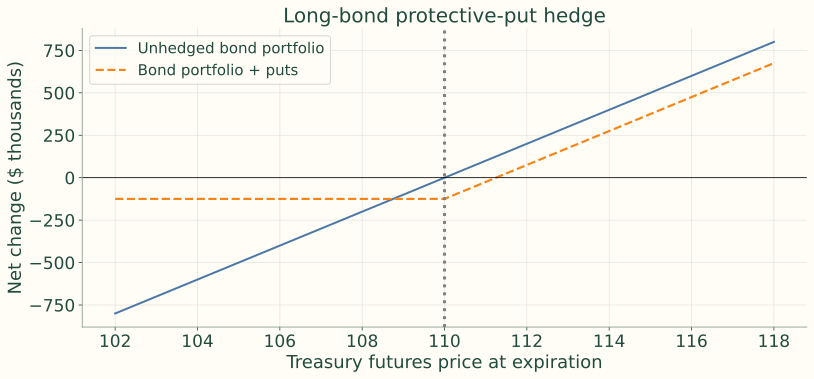{.figure}

A floor for the mapped exposure at expiration, subject in practice to basis, curve and convexity differences. It is distinct from the 250-put initial delta hedge.

## Retained hedge-sizing example — delta matters

Portfolio DV01 = $9,000; put delta = −0.45; futures DV01 = $75.

$$
N_p=\frac{9{,}000}{0.45(75)}=266.67\approx267\ \text{puts}
$$

This existing-deck example is also a local initial hedge. Monitor changing delta, DV01 and the portfolio–futures relationship.

## Practical hedge risks remain after sizing

| Risk | What can change |
|---|---|
| Basis and CTD | Portfolio and delivery-linked futures respond differently |
| Curve | One future cannot cover every maturity point |
| Delta drift | Price, time and volatility change option sensitivity |
| Volatility | Put value changes without a rate move |
| Expiration | Hedge ends before exposure ends |
| Liquidity and costs | Rolling and rebalancing are costly |

## Covered calls exchange favorable outcomes for premium

<b>Long bond exposure</b>Map into futures equivalents with DV01<i>→</i><b>Short calls</b>Receive premium; owe payoff above K<i>→</i><b>Combined result</b>Limited downside cushion and capped upside

Useful for a range-bound view; it is not downside insurance. Choose between matching current delta and overwriting one-for-one at expiration.

## Covered-call expiration economics

$$
\Pi_{\mathrm{covered\ call}}=(F_T-F_0)+c-\max(F_T-K,0)
$$

<h3>Below the strike</h3>
Call expires worthless. Premium cushions losses by only a fixed amount.

<h3>Above the strike</h3>
Short-call losses offset additional underlying gains.

Formula is per futures-equivalent unit and one written call; actual cash bonds introduce basis risk.

## Example 9 — same portfolio, different payoff objective

| Input | Value |
|---|---:|
| Portfolio DV01 / futures DV01 | $8,000 / $80 |
| Long futures-equivalent exposure | 100 contracts |
| Current futures F₀ / call strike K | 110 / 113 |
| Call premium / delta | 1.00 point / +0.40 |
| Point value | $1,000 |

## Example 9 — compare overwrite counts

<h3>250 short calls</h3>
100 / 0.40 = 250; initial net delta = 100 − 250(0.40) = 0. As call delta approaches one, the position can become overhedged.

<h3>100 short calls</h3>
Initial net delta = 100 − 100(0.40) = +60. Above K at expiration, short-call slope −1 offsets the mapped long exposure.

The following scenarios use the standard one-for-one static overlay of 100 short calls. A 250-call local hedge requires rebalancing and is not fully covered one-for-one.

## Example 9 — premium and component payoffs

$$
\text{Premium income}=100(1.00)(\$1{,}000)=\$100{,}000
$$

$$
\Delta V_{\mathrm{bond,mapped}}=100(\$1{,}000)(F_T-110)
$$

$$
\Pi_{\mathrm{short\ calls}}=100(\$1{,}000)[1-\max(F_T-113,0)]
$$

Covered-call net change = mapped bond change + short-call profit.

## Example 9 — expiration scenarios

| $F_T$ | Mapped bond change | Short-call profit | Covered-call net change |
|---:|---:|---:|---:|
| 104 | -$600,000 | $100,000 | -$500,000 |
| 107 | -$300,000 | $100,000 | -$200,000 |
| 110 | $0 | $100,000 | $100,000 |
| 113 | $300,000 | $100,000 | $400,000 |
| 116 | $600,000 | -$200,000 | $400,000 |
| 119 | $900,000 | -$500,000 | $400,000 |

## Example 9 — down-market cushion at 107

<b>Mapped bond</b>100 × $1,000 × (107 − 110) = −$300,000<i>→</i><b>Short calls</b>Expire worthless; retain $100,000<i>→</i><b>Combined</b>−$300,000 + $100,000 = −$200,000

The premium reduces the loss, but does not create a floor.

## Example 9 — up-market cap at 119

$$
\Pi_{\mathrm{short\ calls}}=100(\$1{,}000)[1-(119-113)]=-\$500{,}000
$$

$$
\Delta V_{\mathrm{combined}}=\$900{,}000-\$500{,}000=\$400{,}000
$$

$$
\text{Maximum net gain}=100(\$1{,}000)[(113-110)+1]=\$400{,}000
$$

Above 113, each additional mapped gain is offset by a written-call loss. The manager keeps only the strike gain plus premium.

## Visualize the covered-call cap

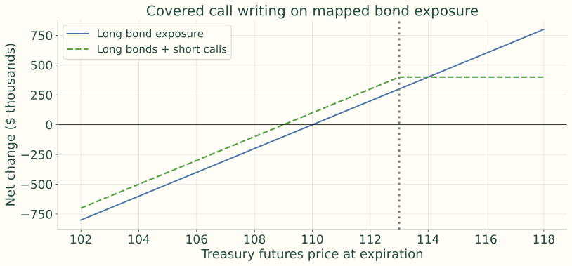{.figure}

The downside cushion is fixed at $100,000. Actual results can differ because cash bonds are not futures and the DV01 mapping can change.

## Protective puts and covered calls serve different objectives

| Strategy | Premium cash flow | Downside | Upside | Typical objective |
|---|---:|---|---|---|
| Long bond + long put | Pay premium | Floored below strike, subject to basis risk | Retained | Insurance |
| Long bond + short call | Receive premium | Only slightly cushioned | Capped above strike | Income enhancement |

Protective puts buy convexity; covered calls sell it. Choose using objectives, constraints, valuation and tail-risk tolerance, not premium alone.

## A complete option decision starts with the risk

<b>Risk</b>Parallel move, curve point, volatility or event date<i>→</i><b>Payoff shape</b>Lock, floor, cap or premium income<i>→</i><b>Contract</b>Cash-bond option, futures option, cap, floor or swaption

Then size with DV01, key-rate duration, beta and option delta. Stress basis, volatility, time decay, exercise, liquidity, margin and model risk. Compare with no hedge and a futures hedge.

## Choose the instrument from the desired payoff

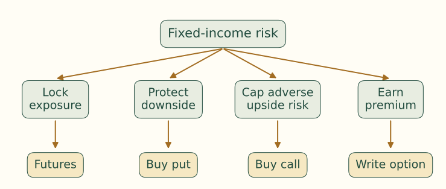{.figure}

Identify the underlying price and existing position before translating a rate view into an instrument.

## Check understanding — direction and quote units

1. A manager expects the 10-year yield to rise sharply. Call or put on Treasury futures? Explain both links.
2. A 110 put costs 0-32. What is its dollar premium and expiration break-even, ignoring fees?

## Check understanding — pricing, sizing and volatility

3. Why is a binomial risk-neutral probability not necessarily a forecast?
4. Why does a −0.25-delta put require more contracts than portfolio DV01 / futures DV01 alone suggests?
5. Does implied volatility prove traders expect exactly that realized volatility?

## Answers — trace the chain and convert the quote

1. Buy a put: rising yields usually lower Treasury futures prices; the put benefits from falling prices.
2. Premium = 32/64 = 0.5 point = $500. Break-even = 110 − 0.5 = 109.5.
Instructor review: The notes’ answer quotes 109.5 as 109-32. In 32nds futures notation, it is 109-16. The 0-32 premium here is in 64ths.

## Answers — distinguish pricing weights from forecasts

3. q enforces no-arbitrage pricing and risk-free expected growth; it is not estimated from real-world frequencies.
4. Each put supplies 0.25 futures-equivalent sensitivity, so roughly four puts are needed per equivalent unit initially.
5. No: implied volatility is model-consistent with price and reflects risk premiums, supply/demand, liquidity and model limitations.

## Key points — contracts and valuation

<b>Rights</b>Buyer chooses; writer performs if assigned<i>→</i><b>Asymmetry</b>Calls benefit from higher prices; puts from lower prices<i>→</i><b>Premium</b>Intrinsic + time value; writing retains tail risk<i>→</i><b>Pricing</b>Parity, model inputs, Black–Scholes, trees and Black

Exercise a futures call into long futures and a put into short futures. Implied volatility reconciles model and market price; it is not a promise about realized volatility.

## Key points — match the hedge to its objective

<h3>Protective put</h3>
Pay for an expiration floor and retain upside under the mapping.

<h3>Covered call</h3>
Receive premium, cap gains and accept most downside.

Use DV01, delta, curve exposure and basis relationships rather than notional alone. Separate local delta hedges from static expiration overlays; stress assumptions and implementation.

## Suggested readings

- Fabozzi, *Bond Markets, Analysis, and Strategies*, **Chapter 30: Interest-Rate Options**.
- [CME Group, Fundamentals of Options on Futures](https://www.cmegroup.com/education/whitepapers/fundamentals-of-options-on-futures).
- [CME Group, Trading SOFR Options](https://www.cmegroup.com/education/articles-and-reports/trading-sofr-options).
- [CME Group, Primer on Margining Styles for Options](https://www.cmegroup.com/education/articles-and-reports/a-primer-on-margining-styles-for-options).

## Source data and resources

- [OCC, Quarterly Report on Bank Trading and Derivatives Activities](https://www.occ.treas.gov/topics/supervision-and-examination/capital-markets/financial-markets/derivatives/derivatives-quarterly-report.html): See how interest-rate derivatives exposures are distributed across U.S. commercial banks.
- [Federal Reserve, Selected Interest Rates (H.15)](https://www.federalreserve.gov/releases/h15/): Obtain the official underlying rate and Treasury-yield history needed to compare option-implied and subsequently realized rate movements.

These links are retained from the notes; no live market data or contract specifications were refreshed for this deck.
