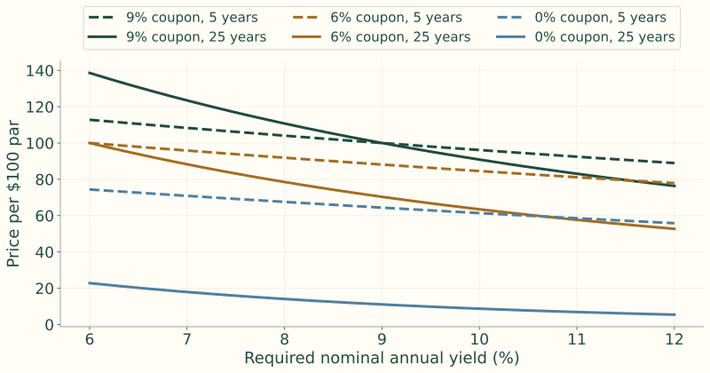
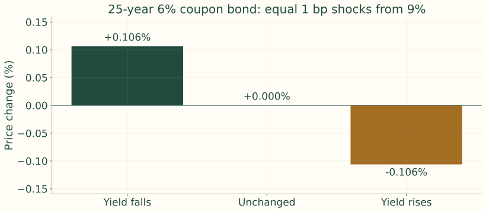
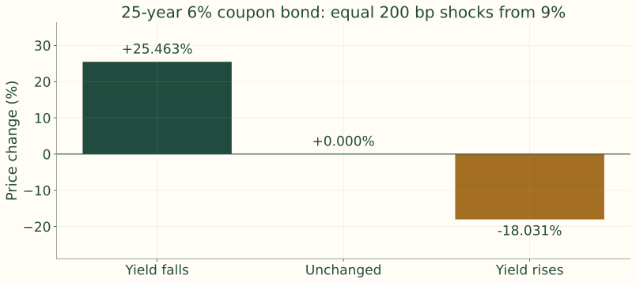
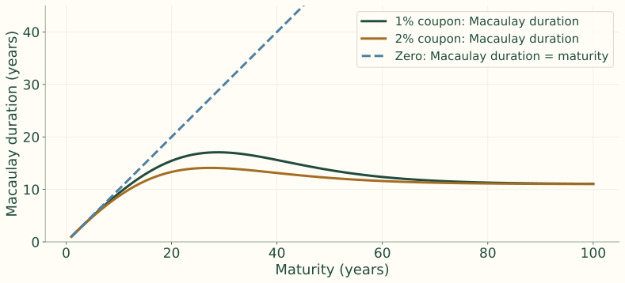
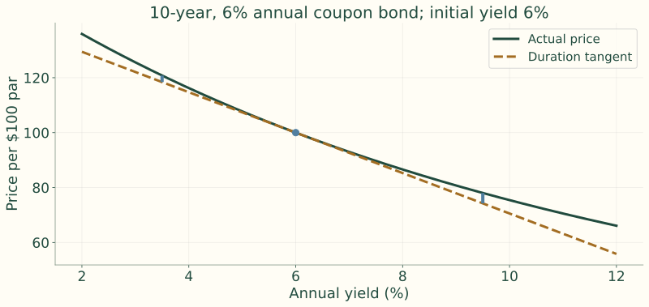
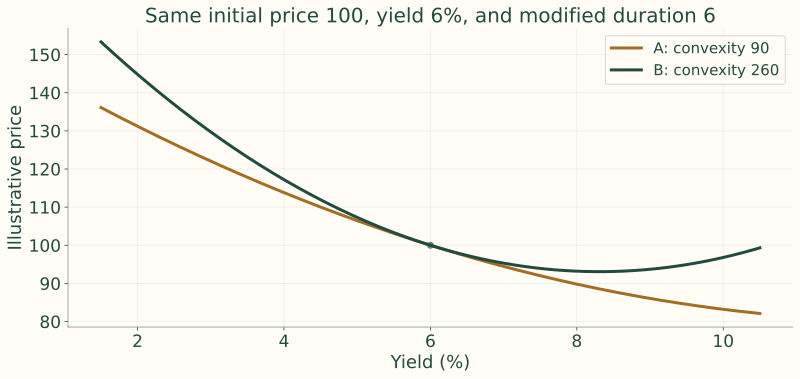
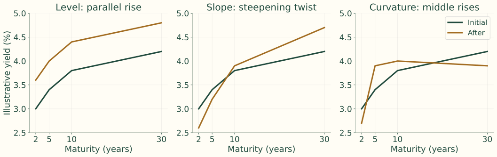
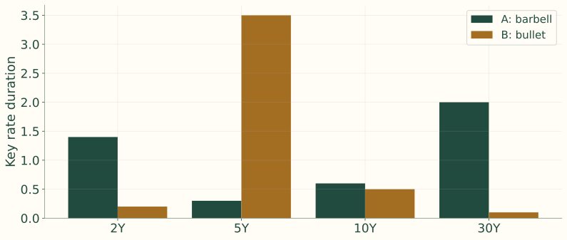
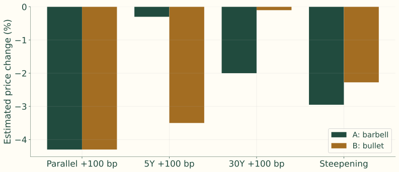

## Fixed cash flows isolate the effect of yield

<b>Promised cash flows</b>Coupons and principal stay fixed<i>→</i><b>Required yield</b>The discount rate changes<i>→</i><b>Present value</b>Higher yield lowers today’s price

$$
P(y)=\sum_{t=1}^{n}\frac{C}{(1+y)^t}+\frac{F}{(1+y)^n}
$$
An option-free bond has no embedded call, put, or prepayment option that changes these promised cash flows.

## What can change a bond’s price?

<b>Market yield</b>Instantaneous discount-rate change<i>→</i><b>Credit and curve</b>Issuer risk and curve shape<i>→</i><b>Time</b>Premium or discount pulls toward par
For now, isolate a change in required yield with fixed cash flows.

## Three-year bond: the cash flows

Face value: **\$1,000** · Annual coupon: **\$60** · Maturity: **3 years**

The same payments are discounted at 5% and then at 7%.

## Pricing the same payments at 5% and 7%

$$
P(5\%)=\frac{60}{1.05}+\frac{60}{1.05^2}+\frac{1060}{1.05^3}
$$

$$
=57.14+54.42+915.91=1027.47
$$

$$
P(7\%)=\frac{60}{1.07}+\frac{60}{1.07^2}+\frac{1060}{1.07^3}
$$

$$
=56.07+52.40+865.38=973.85
$$
Higher discount rates reduce the value of the package of future dollars.

Instructor review: the stated totals are retained from the notes. Direct evaluation gives 1,027.23 at 5% and 973.76 at 7%.

## Six hypothetical bonds: yields from 6% to 9%

| Required Yield (%) | 9% / 5 years | 9% / 25 years | 6% / 5 years | 6% / 25 years | 0% / 5 years | 0% / 25 years |
|---:|---:|---:|---:|---:|---:|---:|
| 6.00 | 112.7953 | 138.5946 | 100.0000 | 100.0000 | 74.4094 | 22.8107 |
| 7.00 | 108.3166 | 123.4556 | 95.8417 | 88.2722 | 70.8919 | 17.9053 |
| 8.00 | 104.0554 | 110.7410 | 91.8891 | 78.5178 | 67.5564 | 14.0713 |
| 8.50 | 102.0027 | 105.1482 | 89.9864 | 74.2587 | 65.9537 | 12.4795 |
| 8.90 | 100.3966 | 100.9961 | 88.4983 | 71.1105 | 64.7017 | 11.3391 |
| 8.99 | 100.0395 | 100.0988 | 88.1676 | 70.4318 | 64.4236 | 11.0975 |
| 9.00 | 100.0000 | 100.0000 | 88.1309 | 70.3570 | 64.3928 | 11.0710 |

Prices per \$100 par. The tabulated bonds use semiannual coupon and yield conventions.

## Six hypothetical bonds: yields from 9% to 12%

| Required Yield (%) | 9% / 5 years | 9% / 25 years | 6% / 5 years | 6% / 25 years | 0% / 5 years | 0% / 25 years |
|---:|---:|---:|---:|---:|---:|---:|
| 9.00 | 100.0000 | 100.0000 | 88.1309 | 70.3570 | 64.3928 | 11.0710 |
| 9.01 | 99.9604 | 99.9013 | 88.0943 | 70.2824 | 64.3620 | 11.0445 |
| 9.10 | 99.6053 | 99.0199 | 87.7654 | 69.6164 | 64.0855 | 10.8093 |
| 9.50 | 98.0459 | 95.2539 | 86.3214 | 66.7773 | 62.8723 | 9.8242 |
| 10.00 | 96.1391 | 90.8720 | 84.5565 | 63.4881 | 61.3913 | 8.7204 |
| 11.00 | 92.4624 | 83.0685 | 81.1559 | 57.6712 | 58.5431 | 6.8767 |
| 12.00 | 88.9599 | 76.3572 | 77.9197 | 52.7144 | 55.8395 | 5.4288 |

Compare maturities at a fixed coupon, then coupons at a fixed maturity.

## The six price–yield curves

{.figure}

Longer maturities and lower coupons concentrate value in distant cash flows.

## Property 1: sensitivity differs across bonds

<b>5-year, 9% coupon</b>More value arrives early<i>→</i><b>25-year, 9% coupon</b>More exposure to distant dollars<i>→</i><b>25-year, zero coupon</b>All cash arrives at maturity
All prices fall when yields rise, but their **percentage changes differ**.

## Property 2: tiny yield moves are nearly symmetric

{.figure}

Over a very small interval, the curve looks nearly straight. This is the local approximation behind duration.

## Properties 3 and 4: large moves reveal convexity

{.figure}

Equal large yield moves create unequal price changes. The gain when yields fall exceeds the loss when yields rise. This benefits a long position and works against a short position.

## Maturity, coupon, and starting yield

| Comparison | Greater percentage sensitivity | Why |
|---|---|---|
| Same coupon and yield | Longer maturity | Later cash flows |
| Same maturity and yield | Lower coupon | Less cash returned early |
| Same cash flows | Lower starting yield | Distant cash flows retain more PV weight |

The same 100-basis-point move can matter more from 4% than from 10%.

## PVBP measures a one-basis-point price move

$$
1\text{ bp}=0.01\%=0.0001
$$

$$
PVBP\approx P(y)-P(y+0.0001)
$$
PVBP, also called DV01, is normally reported as a positive dollar amount.

$$
0.04\times\frac{\$10{,}000{,}000}{\$100}=\$4{,}000
$$
A 1 bp yield increase produces approximately a \$4,000 loss on this position.

## PVBP across the six bonds

| Measure | 5-year 9% coupon | 25-year 9% coupon | 5-year 6% coupon | 25-year 6% coupon | 5-year zero-coupon | 25-year zero-coupon |
|---|---:|---:|---:|---:|---:|---:|
| Initial Price (9% yield) | 100.0000 | 100.0000 | 88.1309 | 70.3570 | 64.3928 | 11.0710 |
| Price at 9.01% | 99.9604 | 99.9013 | 88.0945 | 70.2824 | 64.3620 | 11.0445 |
| DV01 | 0.0396 | 0.0987 | 0.0364 | 0.0746 | 0.0308 | 0.0265 |

Source discrepancy: the 5-year 6% bond is 88.0945 here but 88.0943 in the earlier price table. Values are retained as printed.

## Yield value of a price change

<b>Price question</b>What yield move takes price from 100 to 99?<i>→</i><b>Sensitive bond</b>A small yield increase produces the loss<i>→</i><b>Less sensitive bond</b>A larger yield increase is required
YVPC reverses the PVBP question. It is useful when a manager starts with a price-loss threshold.

## Duration is local percentage price sensitivity

$$
\frac{\Delta P}{P}\approx-D^*\Delta y
$$
A modified duration of **6** implies roughly a **6% loss** for a **100 bp rise** in yield, or a **6% gain** for a **100 bp fall**, before convexity.

The yield change is in decimal units; duration itself is normally positive.

## Macaulay duration weights time by present value

$$
D_M=\sum_{t=1}^{n}t\underbrace{\left(\frac{CF_t/(1+y)^t}{P}\right)}_{\text{PV weight}}
$$
Weights use discounted cash flows, not raw cash flows. For semiannual coupons, calculate in periods and divide by two to obtain years.

A zero-coupon bond has all its PV weight at maturity, so $D_M$ equals maturity.

## Modified duration converts timing into sensitivity

$$
D^*=\frac{D_M}{1+y}\quad\text{(annual coupons)}
$$

$$
D^*=\frac{D_M}{1+y/m}\quad\text{(}m\text{ payments per year)}
$$
In the second formula, $D_M$ is in years and $y$ is the annual nominal yield.

**Example:** $D^*=4.5$, $\Delta y=25$ bp $=0.0025$.
$$
\frac{\Delta P}{P}\approx-4.5(0.0025)=-1.125\%
$$

## The derivative reveals duration’s meaning

$$
P(y)=\sum_{t=1}^{n}\frac{CF_t}{(1+y)^t}
$$

$$
\frac{dP}{dy}=\sum_{t=1}^{n}-t\frac{CF_t}{(1+y)^{t+1}}
$$
The first derivative is the slope of the price–yield curve at the current yield.

## Scaling the slope by price

$$
\frac{1}{P}\frac{dP}{dy}=-\frac{1}{1+y}\frac{\sum_{t=1}^{n}t\,CF_t/(1+y)^t}{P}=-D^*
$$

$$
\frac{\Delta P}{P}\approx-D^*\Delta y
$$
This is a **local** approximation. A slope at one point cannot describe the entire curved relationship.

## Duration example: an 8% three-year bond

Face value \$1,000; annual coupon \$80; annual yield 6%.

$$
P=\frac{80}{1.06}+\frac{80}{1.06^2}+\frac{1080}{1.06^3}=1053.4602
$$

## Each payment contributes to duration

| Year | Cash Flow | Present Value at 6% | PV Weight | Contribution to Duration |
|---:|---:|---:|---:|---:|
| 1 | 80 | 75.4717 | 0.0716 | 0.0716 |
| 2 | 80 | 71.1997 | 0.0676 | 0.1352 |
| 3 | 1,080 | 906.7888 | 0.8608 | 2.5823 |
| **Total** |  | **1,053.4602** | **1.0000** | **2.7891** |

The final payment accounts for 86.08% of price and 2.5823 years of weighted time.

## The weighted times give Macaulay duration

$$
D_M=0.0716+0.1352+2.5823=2.7891\text{ years}
$$

$$
D^*=\frac{2.7891}{1.06}=2.6313
$$
A 100 bp increase in yield produces a first-order estimated loss of 2.6313%.

## Alternative formula: annuity plus face value

$$
P=C\frac{1-(1+y)^{-n}}{y}+\frac{F}{(1+y)^n}
$$
$C$: coupon per period; $F$: face value; $y$: yield per period; $n$: number of periods.

Differentiate the coupon annuity and principal separately.
$$
\frac{dP}{dy}=C\left[\frac{ny(1+y)^{-n-1}-[1-(1+y)^{-n}]}{y^2}\right]-nF(1+y)^{-n-1}
$$

## Alternative formula: the same duration directly

$$
D^*=\frac{\frac{C}{y^2}[1-(1+y)^{-n}]+n(F-C/y)(1+y)^{-n-1}}{P}
$$

$$
D^*=\frac{\frac{80}{0.06^2}[1-1.06^{-3}]+3(1000-80/0.06)1.06^{-4}}{1053.4602}=2.6313
$$

$$
D_M=2.6313(1.06)=2.7891\text{ years}
$$
Both methods price and weight the same cash flows.

## Duration properties reflect cash-flow timing

| Change | Typical effect on duration |
|---|---|
| Longer maturity | Increases, at a decreasing rate |
| Higher coupon | Decreases: more value arrives early |
| Higher yield | Decreases: distant PV weights shrink |
| Coupon bond versus maturity | Macaulay duration is below maturity |
| Zero-coupon bond | Macaulay duration equals maturity |

Very long, deep-discount bonds require direct calculation; the maturity rule is not universal.

## Very long maturity: the notes’ counterexample

At a **10% yield**, the notes compare **1% coupon bonds**:

| Bond | Maturity | Approximate duration stated in notes |
|---|---:|---:|
| A | 30 years | 20–22 |
| B | 100 years | 35–40 |

Instructor review: these duration ranges do not reconcile with the stated coupon and yield. They are retained here as source claims, not validated calculations.

Intermediate coupons and heavy discounting pull PV-weighted time far inward.

## Maturity alone can mislead

{.figure}

The notes also compare a 30-year zero with a 100-year 2% coupon bond: the longer coupon bond can have lower duration.

Curve calculated from annual cash flows at 10%; it illustrates why the preceding numerical ranges need review.

## Duration estimate versus actual repricing

| Yield shock | New yield | New price | Duration estimate | Actual change | Difference |
|:--:|--:|--:|--:|--:|--:|
| +100 bp | 10.00% | 63.488 | $-10.62\%$ | $-9.76\%$ | 0.86 pp |
| +200 bp | 11.00% | 57.671 | $-21.24\%$ | $-18.03\%$ | 3.21 pp |
$$
\Delta P/P\approx-10.62\Delta y
$$
25-year, 6% coupon bond at 9% yield; $P_0=70.357$. Duration overstates losses as the shock grows because it replaces a curve with a line.

## Dollar duration connects duration to PVBP

$$
\Delta P\approx-D^*P\Delta y
$$

$$
\Delta P\approx-10.62(70.357)(0.0001)=-0.0747
$$
For this bond, a 1 bp increase costs about 0.0747 per \$100 par.

The notes use **signed dollar duration** $-D^*P$; an unsigned exposure report may instead quote $D^*P$.

## Spread duration separates benchmark and spread risk

$$
y_{\text{bond}}=y_{\text{Treasury}}+s
$$

<b>Treasury duration</b>Move benchmark rates, hold spread fixed<i>→</i><b>Spread duration</b>Move spread, hold benchmark rates fixed

$$
\Delta P/P\approx-D_{\text{spread}}\Delta s
$$
Spread duration 5 implies about a 5% loss for a 100 bp widening, with Treasury rates unchanged.

## Spread risk remains when coupons reset

A Treasury has no credit spread relative to itself.

For a corporate, high-yield, or structured security, the spread can compensate for credit, liquidity, and sector risk.

<b>Floater coupon</b>Resets with short-term rates<i>→</i><b>Quoted margin</b>Remains fixed<i>→</i><b>Required margin rises</b>Price falls

## Portfolio duration is market-value weighted

$$
w_i=\frac{MV_i}{\sum_j MV_j},\qquad D_P=\sum_iw_iD_i
$$
Contribution to portfolio duration is $w_iD_i$. Position size matters as much as an issue’s duration.

| Bond | Market Value | Weight in Portfolio | Duration | Contribution to Portfolio Duration |
|---|---:|---:|---:|---:|
| A | \$10,000,000 | 0.10 | 4 | 0.40 |
| B | \$40,000,000 | 0.40 | 7 | 2.80 |
| C | \$30,000,000 | 0.30 | 6 | 1.80 |
| D | \$20,000,000 | 0.20 | 2 | 0.40 |
| **Total** | **\$100,000,000** | **1.00** |  | **5.40** |

## Sector contributions: the portfolio

| Sector | Portfolio Sector Weight | Sector Duration | Contribution to Portfolio Duration |
|---|---:|---:|---:|
| Treasury | 0.295 | 7.25 | 2.14 |
| Government Related | 0.036 | 1.94 | 0.07 |
| Agency MBS | 0.290 | 5.17 | 1.50 |
| Corporates | 0.379 | 4.85 | 1.84 |
| **Total** | **1.000** |  | **5.55** |

Portfolio duration is 5.55. Similar total durations can conceal different sector exposures.

## Sector contributions: the benchmark

| Sector | Benchmark Weight | Benchmark Sector Duration | Contribution to Benchmark Duration |
|---|---:|---:|---:|
| Treasury | 0.333 | 5.32 | 1.77 |
| Government Related | 0.068 | 5.88 | 0.40 |
| Agency MBS | 0.333 | 4.53 | 1.51 |
| Corporates | 0.266 | 6.50 | 1.73 |
| **Total** | **1.000** |  | **5.41** |

Benchmark duration is 5.41. These are the illustrative benchmark values in the notes.

## Near-neutral total duration can hide active bets

| Sector | Portfolio Contribution | Benchmark Contribution | Difference |
|---|---:|---:|---:|
| Treasury | 2.14 | 1.77 | 0.37 |
| Government Related | 0.07 | 0.40 | -0.33 |
| Agency MBS | 1.50 | 1.51 | -0.01 |
| Corporates | 1.84 | 1.73 | 0.11 |
| **Total** | **5.55** | **5.41** | **0.14** |

Sector yields and spreads need not move together. The location of duration matters even when the total is close to the benchmark.

## Analytical and empirical duration

<h3>Analytical</h3>
Differentiate a valuation formula. Fixed cash flows make the relationship explicit.

<h3>Empirical</h3>
Use observed or simulated price responses. Reprice under shocks or estimate a historical regression.

Distressed bonds may respond more to equity-like credit risk than to Treasury rates. Model-based risk estimates depend on the quality of the pricing model.

## Convexity adds curvature to the tangent

{.figure}

As yields rise, duration falls and the tangent becomes flatter. As yields fall, duration rises and the tangent becomes steeper.

## The volatility measures fit together

| Measure | Formula or role |
|---|---|
| Macaulay duration | PV-weighted time |
| Modified duration | $D^*=D_M/(1+y/m)$ |
| Price–yield slope | $dP/dy=-D^*P$ |
| PVBP | $D^*P/10{,}000$ |
| Convexity | Curvature that improves large-shock estimates |

Near par, with price per \$100, $PVBP\approx D^*/100$.

## Why the tangent understates ending price

<h3>Yields fall</h3>
Duration underestimates the price gain.

<h3>Yields rise</h3>
Duration overestimates the price loss.

The actual option-free bond price lies above its tangent. The error grows farther from the initial yield.

## Taylor expansion: slope plus curvature

$$
\Delta P\approx\frac{dP}{dy}\Delta y+\frac12\frac{d^2P}{dy^2}(\Delta y)^2
$$

$$
\frac{\Delta P}{P}\approx\underbrace{-D^*\Delta y}_{\text{duration effect}}+\underbrace{\frac12 C(\Delta y)^2}_{\text{convexity effect}}
$$
Here $C$ denotes the convexity measure, not the coupon payment.

## Measuring convexity

$$
\text{Dollar convexity}=\frac{d^2P}{dy^2}=\sum_{t=1}^{n}\frac{t(t+1)CF_t}{(1+y)^{t+2}}
$$

$$
C=\frac1P\frac{d^2P}{dy^2}
$$
When the derivative is calculated in coupon periods, divide by $m^2$ to annualize. With semiannual coupons, divide by $2^2=4$.

## Convexity of the six hypothetical bonds

| Bond | Second Derivative | Annualized Convexity Measure | Annualized Dollar Convexity Measure |
|---|---:|---:|---:|
| 9% / 5-year | 7,781.02 | 19.45 | \$1,945.26 |
| 9% / 25-year | 64,288.42 | 160.72 | \$16,072.00 |
| 6% / 5-year | 7,349.45 | 20.85 | \$1,837.36 |
| 6% / 25-year | 51,476.26 | 182.92 | \$12,869.70 |
| 0% / 5-year | 6,486.30 | 25.18 | \$1,621.42 |
| 0% / 25-year | 25,851.93 | 583.78 | \$6,463.02 |

At the same yield and maturity, a lower coupon gives higher convexity. Longer maturities usually give higher convexity.

## A 200 bp increase: duration plus convexity

25-year, 6% coupon bond at 9% yield. $P_0=70.357$, $D^*=10.62$, $C=182.92$.
$$
\text{Duration effect}=-10.62(0.02)=-21.24\%
$$

$$
\text{Convexity effect}=\tfrac12(182.92)(0.02)^2=3.66\%
$$

$$
\text{Estimated change}=-21.24\%+3.66\%=-17.58\%
$$
Actual repricing: **−18.03%**. Curvature materially improves the estimate.

## A 200 bp decrease: convexity still helps

$$
\text{Duration effect}=-10.62(-0.02)=21.24\%
$$

$$
\text{Convexity effect}=\tfrac12(182.92)(-0.02)^2=3.66\%
$$

$$
\text{Estimated change}=21.24\%+3.66\%=24.90\%
$$
Actual repricing: **25.46%**. Squaring the yield change makes the convexity contribution positive in either direction.

## Convexity conventions must match the formula

Convexity can describe the **shape** or a **numerical measure**. The numerical value has meaning through its price effect.

| Convention | Convexity contribution |
|---|---|
| $C=P^{-1}d^2P/dy^2$ | $\tfrac12C(\Delta y)^2$ |
| $\widetilde C=(2P)^{-1}d^2P/dy^2$ | $\widetilde C(\Delta y)^2$ |

The estimated effect is identical if the convention is used consistently.

## More convexity improves both sides of a large move

{.figure}

These illustrative second-order curves have the same starting price, yield, and duration. Bond B has greater convexity.

## Convexity has a price

<h3>Expect volatile rates</h3>
Greater convexity offers more benefit from large moves. An investor may accept a lower yield to own it.

<h3>Expect stable rates</h3>
The local slope matters most. An investor may prefer less convexity and the higher yield offered in exchange.

The decision depends on expected volatility relative to the market price of convexity.

## Convexity properties: yield and coupon

| Comparison | Convexity effect | Intuition |
|---|---|---|
| Yield rises | Convexity falls | Distant payments receive less weight |
| Yield falls | Convexity rises | Curve becomes more responsive |
| Same yield and maturity: coupon falls | Convexity rises | Value shifts toward maturity |

All option-free bonds have positive convexity.

## Changing coupon at the same maturity

Change yield, maturity, and coupon to inspect the same cash-flow calculation used in the notes.

## Holding duration fixed changes the comparison

At a given yield and modified duration, the lower-coupon bond can have **less** convexity.

<b>Lower coupon</b>Later PV weights at a given maturity<i>→</i><b>Match duration</b>Use a shorter maturity<i>→</i><b>Result</b>Less dispersion in cash-flow timing
A zero has the lowest convexity for a given modified duration. Its **Macaulay** duration equals maturity; its modified duration is maturity divided by $1+y$.

## Changing coupon near the same target duration

As in the notes, maturity is selected from whole years 1–80. The displayed achieved duration may differ from the target.

## Duration needs a matching risk scenario

| Limitation | Consequence |
|---|---|
| Local slope | Large moves need convexity or full repricing |
| Parallel shift assumption | Curve twists need maturity-specific risk |
| Embedded options | Cash flows and duration can change sharply |
| Model dependence | Incorrect pricing produces incorrect sensitivities |

Callable bonds require effective measures when exercise behavior changes.

## Duration is a sensitivity, not a legal life

$$
\text{Duration}\approx\text{percentage sensitivity to a 100 bp yield change}
$$
A security can have duration greater than legal maturity, or even negative duration.

An inverse floater with duration 40 and 30-year collateral does not have a 40-year life. It has roughly 40% first-order sensitivity to a 100 bp move.

## Three prices provide numerical risk measures

<b>Yield falls</b>Price $P_-$<i>→</i><b>Current yield</b>Price $P_0$<i>→</i><b>Yield rises</b>Price $P_+$

$$
D^*\approx\frac{P_--P_+}{2P_0\Delta y},\qquad C\approx\frac{P_-+P_+-2P_0}{P_0(\Delta y)^2}
$$
Use the same positive shock magnitude $\Delta y$ on each side. A model for changing cash flows can extend this procedure to complex securities.

## Numerical duration and convexity: substitution

$P_0=70.3570$, $P_-=71.1105$, $P_+=69.6164$, $\Delta y=0.001$.
$$
D^*\approx\frac{71.1105-69.6164}{2(70.3570)(0.001)}=10.62
$$

$$
C\approx\frac{71.1105+69.6164-2(70.3570)}{70.3570(0.001)^2}=183.3
$$
The shock-and-reprice estimates are close to the analytical values.

## Inverse floaters concentrate collateral exposure

<b>Collateral</b>\$100m, duration 8<i>→</i><b>Floater</b>\$80m, duration near zero<i>→</i><b>Inverse floater</b>\$20m, residual rate exposure

$$
L=80/20=4,\qquad D_I\approx(1+L)D_C\frac{P_C}{P_I}
$$

$$
D_I\approx(1+4)(8)=40\quad\text{at prices near par}
$$
Prices in the ratio use a consistent per-par convention. Falling rates help both discounting and the inverse coupon.

## Nonparallel shifts change where risk appears

{.figure}

Level, slope, and curvature describe distinct moves. A single duration assumes all relevant yields move together.

## Steepening and flattening

| Movement | Bear case: rates rise | Bull case: rates fall |
|---|---|---|
| Steepening: $y_{10}-y_2$ increases | Long rates rise more | Short rates fall more |
| Flattening: $y_{10}-y_2$ decreases | Short rates rise more | Long rates fall more |

A **twist** can raise one end and lower the other: $y(T)\mapsto y(T)+a+bT$, where $a$ shifts level and $b$ changes slope.

## Butterfly moves change the middle of the curve

$$
\text{Curvature measure}=2y(5y)-y(2y)-y(10y)
$$

<b>Short end</b>Rates fall<i>→</i><b>Middle</b>Rates rise<i>→</i><b>Long end</b>Rates fall
This is the example in the notes. A barbell and a bullet can have the same total duration and react differently.

## Yield curve reshaping duration

Short-end slope: $y_{10}-y_2$. Long-end slope: $y_{30}-y_{10}$.
$$
SEDUR=\frac{V_{SE,S}-V_{SE,F}}{2V_0\Delta y}
$$

$$
LEDUR=\frac{V_{LE,F}-V_{LE,S}}{2V_0\Delta y}
$$
$S$ and $F$ denote steepening and flattening scenarios. The notes use opposite numerator conventions for the two segments. Specify the exact curve shocks before interpreting the signs.

## Key rate duration reveals an exposure vector

Hold other curve points fixed and shock one selected maturity. Common key rates are 3 months, 1, 2, 5, 10, and 30 years.

A 30-year key rate duration of **0.675** implies about a **0.675% loss** if only that rate rises 100 bp.

$$
\frac{\Delta V}{V}\approx-\sum_k KRD_k\Delta y_k
$$

## Same total duration, different key rates

| Key rate | Portfolio A: Barbell | Portfolio B: Bullet |
|---|---:|---:|
| 2-year | 1.40 | 0.20 |
| 5-year | 0.30 | 3.50 |
| 10-year | 0.60 | 0.50 |
| 30-year | 2.00 | 0.10 |
| **Total duration** | **4.30** | **4.30** |

A is a barbell. B is a bullet. Both have total duration 4.30.

## The exposure map explains different outcomes

{.figure}

Equal total duration constrains the sum, not the maturity distribution.

## The same portfolios under different shocks

| Yield curve shock | Portfolio A estimated price change | Portfolio B estimated price change |
|---|---:|---:|
| Parallel +100 bp | -4.30% | -4.30% |
| 5-year rate +100 bp only | -0.30% | -3.50% |
| 30-year rate +100 bp only | -2.00% | -0.10% |

$$
\Delta V/V\approx-\sum_kKRD_k\Delta y_k
$$
Only a parallel shock makes the equal total durations imply the same first-order loss.

## Steepening extends the scenario comparison

{.figure}

The notes’ additional steepening scenario raises 2Y, 5Y, 10Y, and 30Y yields by 25, 50, 75, and 100 bp respectively.

## Portfolio mandates define the relevant risk

| Framework | Primary objective |
|---|---|
| Benchmark based | Outperform an index within active-risk limits |
| Absolute return | Deliver positive or target return across environments |
| Liability driven | Fund dated obligations with controlled surplus risk |

Market-cap-weighted bond indexes can overweight the largest debt issuers and may be costly to replicate.

::: {.notes}
These topics are named in the lecture-note objectives and retained from the existing slide deck. The notes contain no corresponding developed section.
:::

## Portfolio construction connects factors and securities

| Approach | Starting point |
|---|---|
| Top down | Duration, curve, sector, and quality exposures |
| Bottom up | Issuer and security relative-value analysis |
| Smart beta | Systematic rules beyond market-value weighting |
| Leverage | Magnifies returns and unintended risks |

A complete process reconciles security choices with portfolio exposures.

## Risk measurement follows the instrument

<b>Fixed cash flows</b>Duration, PVBP, convexity<i>→</i><b>Credit and portfolios</b>Spread and weighted contributions<i>→</i><b>Curve and options</b>Key rates and effective measures
Longer maturity, lower coupons, and lower yields usually raise sensitivity. Duration gives local slope; convexity adds curvature; exposure location matters.

## Readings and market resources

Fabozzi, *Bond Markets, Analysis, and Strategies*, **Chapter 4: Bond Price Volatility**.

- [U.S. Treasury interest-rate statistics](https://home.treasury.gov/resource-center/data-chart-center/interest-rates): observable curve shocks.
- [Federal Reserve H.15](https://www.federalreserve.gov/releases/h15/): rates across maturities.
- [CME U.S. Treasury futures](https://www.cmegroup.com/markets/interest-rates/us-treasury.html): duration hedging instruments.
