## Required yield has two building blocks

$$
\text{Required yield}=\text{base interest rate}+\text{benchmark spread}
$$

<b>Base rate</b>Minimal-default-risk return at the relevant horizon<i>→</i><b>Benchmark spread</b>Issuer and security-specific risks and features

Common bases: Treasuries, Treasury spots, swaps, and OIS for collateralized derivatives.

## A spread is a yield difference

$$
5.05\%-3.80\%=1.25\%=125\text{ bp}
$$

$$
6.20\%-4.70\%=1.50\%=150\text{ bp}
$$

Spreads change with credit conditions, liquidity, risk appetite, and the bond’s features. Match the benchmark to the cash-flow exposure.

## Base rate plus benchmark spread

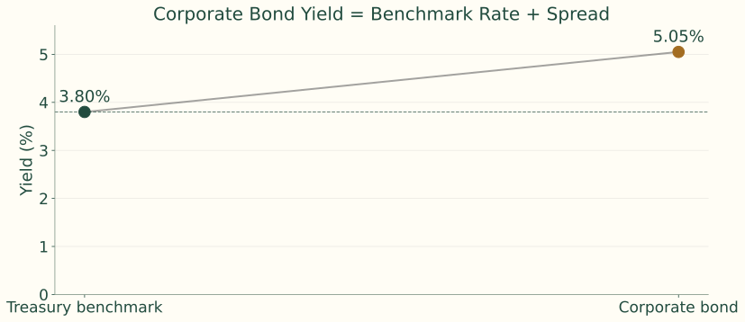{.figure}

## Issuer type shapes the spread

Sovereigns, agencies, supranationals, municipalities, financials, industrials, utilities, structured finance, and MBS issuers have different risks and protections.

| Issuer type | Yield | Spread over Treasury |
|---|---:|---:|
| Federal agency | 4.35% | 35 bps |
| Utility company | 4.95% | 95 bps |
| High-yield industrial company | 7.25% | 325 bps |

Illustration: 10-year Treasury yield 4.00%. Sovereign backing and liquidity support the Treasury benchmark.

## Creditworthiness is forward looking

| Credit driver | Comparison in the notes |
|---|---|
| Leverage and coverage | High debt/EBITDA versus low; weak versus strong coverage |
| Earnings and business risk | Cyclical commodity earnings versus stable utilities |
| Assets and recovery | Liquid collateral versus specialized assets |
| Diversification and industry | One product versus many; staples versus autos/airlines |
| Legal protection | Secured versus subordinated debt |

A-rated 7-year bond: **85 bp**; similar BBB bond: **145 bp**. The **60 bp** gap reflects weaker credit. Spreads can react before ratings.

## Embedded options shift value

<h3>Issuer call</h3>
Limits investor upside when rates fall and creates reinvestment risk. Usually increases required spread.

<h3>Investor put or conversion</h3>
Adds investor value. Can reduce required spread, sometimes below a comparable benchmark yield.

An AAA callable can trade wider than an AA putable or convertible if option value outweighs the credit difference.

## Raw spread mixes option and non-option effects

$$
\text{Benchmark spread}=\text{OAS}+\text{embedded-option effects}
$$

This is a conceptual decomposition, with option effects expressed in spread terms.

OAS requires a valuation model to remove the estimated effect of embedded options. Comparing raw yields alone can mis-rank bonds with different options.

## Tax treatment changes the comparison

$$
y_{\text{after tax}}=y_{\text{taxable}}(1-t)
$$

$$
y_{\text{taxable equivalent}}=\frac{y_{\text{tax exempt}}}{1-t}
$$

$$
\frac{3.00\%}{1-0.35}=4.62\%
$$

For an investor taxed at 35%, a 3% tax-exempt municipal yield is equivalent to a 4.62% taxable yield.

## Liquidity has a spread cost

Issue size, dealer inventory, trading frequency, price transparency, index eligibility, seasoning, and investor concentration affect saleability.

| Comparable BBB issue | Trading | Spread |
|---|---|---:|
| A: \$2 billion | Daily benchmark trading | 140 bp |
| B: \$150 million | Rarely trades | 175 bp |

The **35 bp** difference may largely reflect liquidity. Liquidity premiums can grow sharply in stressed markets.

## Financeability connects the bond and repo markets

<b>Manager owns bond</b>Pledges the security as collateral<i>→</i><b>Dealer lends cash</b>Repo rate is the financing cost<i>→</i><b>Leverage</b>Borrowing supports a larger position

Repo terms depend on tenor, collateral quality and liquidity, haircut, dealer demand, and scarcity of the specific issue.

## Special collateral can justify a lower cash yield

<b>Dealer needs a scarce bond</b>Often to cover a short position<i>→</i><b>Holder gets a lower repo rate</b>A financing advantage<i>→</i><b>Investors bid up its price</b>The bond’s cash yield falls

On-the-run Treasury richness can reflect both liquidity and special financing value.

## Financeability example: compare the whole position

| Issue | Cash yield | Repo rate | Financing status |
|---|---:|---:|---|
| On-the-run 5-year Treasury | 4.18% | 3.70% | Special collateral |
| Off-the-run 5-year Treasury | 4.28% | 4.10% | General collateral |

$$
4.28\%-4.18\%=10\text{ bp lower cash yield on the on-the-run issue}
$$

A leveraged investor also pays a financing rate. The larger cash yield alone does not identify the better carry.

## Financing carry reverses the ranking

$$
\text{Financing carry}=\text{bond yield}-\text{repo rate}
$$

$$
\text{On-the-run}:4.18\%-3.70\%=0.48\%
$$

$$
\text{Off-the-run}:4.28\%-4.10\%=0.18\%
$$

$$
0.48\%-0.18\%=30\text{ bp carry advantage}
$$

This simplified comparison isolates financing economics; actual leveraged returns also depend on price changes and position terms.

## Maturity creates a term structure

| Maturity sector | Term to maturity |
|---|---:|
| Short term | 1 to 5 years |
| Intermediate term | 5 to 12 years |
| Long term | More than 12 years |

$$
\text{Maturity spread}=y_{\text{long}}-y_{\text{short}}
$$

Longer cash-flow horizons generally increase price volatility. Comparable securities across maturities define the term structure.

## Maturity spreads across sectors

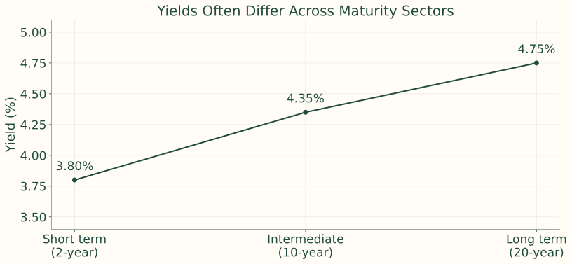{.figure}

Maturity spread: $4.75\%-3.80\%=0.95\%$.

## One term structure can generate several curves

| Curve | What it reports |
|---|---|
| Par | Coupon that prices a new bond at par |
| Spot | Discount rate for a single payment date |
| Forward | Implied rate between future dates |
| Swap | Par fixed swap rate across maturities |
| Credit spread | Extra yield across risky maturities |

## YTM compresses a package into one rate

$$
P=\sum_{t=1}^{n}\frac{CF_t}{(1+y)^t}
$$

YTM is the internal rate of return for promised cash flows and is usually solved numerically.

Realizing the quoted compounded return requires holding to maturity, receiving all payments on time, and reinvesting coupons at YTM. A coupon-bond YTM summarizes many payment dates.

## Common yield-curve shapes

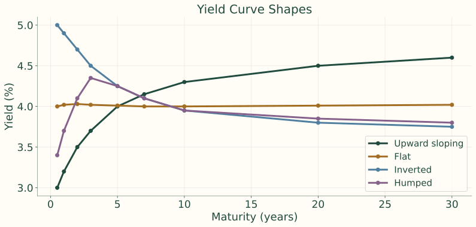{.figure}

## Curve shapes provide clues, not mechanical rules

| Shape | Typical economy | Signal |
|---|---|---|
| Upward sloping | Expansion or recovery | Growth and inflation expectations are rising. |
| Flat | Transition period | The outlook is uncertain. |
| Inverted | Late cycle or recession risk | Policy is tight and rate cuts may be expected. |
| Humped | Uneven outlook | Near-term pressure is high, but longer-term expectations are lower. |

Central-bank purchases, liquidity, Treasury supply, and maturity-specific demand can also change the curve.

## Individual cash flows require individual spot rates

$$
P=\sum_{t=1}^{n}\frac{CF_t}{(1+z_t)^t}
$$

A spot rate is the annualized yield for one payment at one maturity. A 5-year semiannual coupon bond needs ten date-specific discount rates.

## Why one discount rate can misprice the package

Two-year annual bond: \$50 coupon, \$1,000 principal; $z_1=3\%$, $z_2=5\%$.

$$
P_{\text{spot}}=\frac{50}{1.03}+\frac{1050}{1.05^2}=1000.65
$$

$$
P_{\text{one rate}}=\frac{50}{1.05}+\frac{1050}{1.05^2}=999.72
$$

Instructor review: The displayed totals are retained from the notes. Direct evaluation gives 1000.92 and 1000.00 respectively. The date-specific discounting principle is unchanged.

## Observed YTMs are heterogeneous

Two 10-year Treasuries with 1.50% and 4.50% coupons can have different YTMs despite similar underlying discount rates.

<b>Observed prices and YTMs</b>Coupon, maturity, liquidity, tax, financing effects<i>→</i><b>Smoothed par curve</b>Standardized hypothetical par bonds<i>→</i><b>Spot curve</b>One discount rate per payment date

## Smoothing and interpolation precede bootstrapping

| Benchmark maturity | Observed YTM | Smoothed par coupon rate |
|---:|---:|---:|
| 0.5 year | 3.58% | 3.60% |
| 1 year | 3.82% | 3.80% |
| 2 years | 4.08% | 4.10% |
| 3 years | 4.38% | 4.35% |
| 5 years | 4.57% | 4.60% |
| 7 years | 4.78% | 4.75% |
| 10 years | 4.88% | 4.90% |

The smoothed par coupons in this example are supplied inputs, not obtained merely by relabeling observed YTMs.

## Interpolation fills missing payment dates

$$
c_{1.5}=c_1+\frac{1.5-1}{2-1}(c_2-c_1)
$$

$$
=3.80\%+0.5(4.10\%-3.80\%)=3.95\%
$$

$$
c_{4.0}=4.35\%+\frac{4-3}{5-3}(4.60\%-4.35\%)=4.475\%
$$

A rate is needed at every half-year payment date, not only the observed benchmark maturities.

## Bootstrapping solves one new rate at a time

$$
100=\sum_{j=1}^{m-1}\frac{c_m/2}{(1+z_j/2)^j}+\frac{100+c_m/2}{(1+z_m/2)^m}
$$

Here $m$ counts half-year periods, $z_j$ is an annualized decimal spot rate, and $c_m$ is the annual coupon in dollars per \$100 par (3.80 for a 3.80% coupon).

$$
z_m=2\left[\left(\frac{100+c_m/2}{100-\sum_{j=1}^{m-1}(c_m/2)/(1+z_j/2)^j}\right)^{1/m}-1\right]
$$

## First bootstrap step: six months

$$
100=\frac{100+3.60/2}{1+z_{0.5}/2}
$$

$$
z_{0.5}=3.600\%
$$

One cash flow means par yield and spot yield coincide at the first maturity.

## Second step: one year

$$
100=\frac{1.90}{1+0.0360/2}+\frac{101.90}{(1+z_{1.0}/2)^2}
$$

$$
z_{1.0}=3.802\%
$$

The first coupon uses the already known six-month spot. Only the final spot rate is unknown.

## Third step: eighteen months

$$
100=\frac{1.975}{1+0.0360/2}+\frac{1.975}{(1+0.03802/2)^2}+\frac{101.975}{(1+z_{1.5}/2)^3}
$$

$$
z_{1.5}=3.954\%
$$

The interpolated par coupon is 3.95%, so each half-year payment is 1.975.

## The bootstrapped curve: periods 1–7

| Period | Maturity | Par coupon rate | Bootstrapped spot rate |
|---:|---:|---:|---:|
| 1 | 0.5 year | 3.600% | 3.600% |
| 2 | 1.0 year | 3.800% | 3.802% |
| 3 | 1.5 years | 3.950% | 3.954% |
| 4 | 2.0 years | 4.100% | 4.108% |
| 5 | 2.5 years | 4.225% | 4.237% |
| 6 | 3.0 years | 4.350% | 4.367% |
| 7 | 3.5 years | 4.412% | 4.432% |

Annualized rates with semiannual compounding; source table retained.

## The bootstrapped curve: periods 8–14

| Period | Maturity | Par coupon rate | Bootstrapped spot rate |
|---:|---:|---:|---:|
| 8 | 4.0 years | 4.475% | 4.497% |
| 9 | 4.5 years | 4.537% | 4.564% |
| 10 | 5.0 years | 4.600% | 4.631% |
| 11 | 5.5 years | 4.637% | 4.671% |
| 12 | 6.0 years | 4.675% | 4.711% |
| 13 | 6.5 years | 4.713% | 4.752% |
| 14 | 7.0 years | 4.750% | 4.793% |

Annualized rates with semiannual compounding; source table retained.

## The bootstrapped curve: periods 15–20

| Period | Maturity | Par coupon rate | Bootstrapped spot rate |
|---:|---:|---:|---:|
| 15 | 7.5 years | 4.775% | 4.820% |
| 16 | 8.0 years | 4.800% | 4.848% |
| 17 | 8.5 years | 4.825% | 4.876% |
| 18 | 9.0 years | 4.850% | 4.904% |
| 19 | 9.5 years | 4.875% | 4.933% |
| 20 | 10.0 years | 4.900% | 4.963% |

Annualized rates with semiannual compounding; source table retained.

## The ten-year step uses nineteen known rates

$$
100=\sum_{j=1}^{19}\frac{2.45}{(1+z_j/2)^j}+\frac{102.45}{(1+z_{10}/2)^{20}}
$$

$$
z_{10}=4.963\%
$$

In this final expression, $z_{10}$ means the **10-year** spot; earlier $z_j$ indexes half-year periods. The notes mix these indexing conventions.

## Observed, par, and spot curves

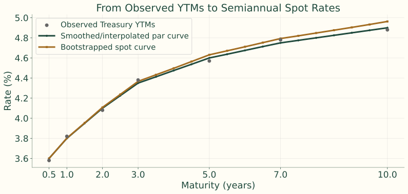{.figure}

## On-the-run Treasuries: clear prices, sparse maturities

<h3>Advantages</h3>
Recent issues are liquid, actively quoted, and useful for trader communication.

<h3>Limitations</h3>
Few maturities; liquidity and special financing can make issues rich.

A 10-year on-the-run yield of 4.20% versus 4.25% on an older 9.8-year note may reflect a 5 bp liquidity difference rather than the pure discount curve.

## Treasury auction pattern in the notes

| Security | Maturities | Typical auction frequency |
|---|---|---|
| Bills | 4-, 6-, 8-, 13-, 17-, and 26-week | Weekly |
| Bills | 52-week | Every 4 weeks |
| Notes | 2-, 3-, 5-, and 7-year | Monthly |
| Notes | 10-year | Quarterly original issue, with reopenings in other months |
| Bonds | 20- and 30-year | Quarterly original issue, with reopenings in other months |
| TIPS | 5-, 10-, and 30-year | Less frequent; varies by maturity |
| FRNs | 2-year | Quarterly original issue, with reopenings in other months |

Typical pattern as stated in the lecture notes; actual auction schedules can change.

## Adding selected off-the-run issues

<h3>More observations</h3>
Better coverage between benchmark maturities and less reliance on a few rich issues.

<h3>Selection risk</h3>
Stale quotes, lower liquidity, special financing, coupon and tax effects can distort the fit.

## Using all Treasury bills and coupon securities

<h3>Broad coverage</h3>
Many observations support a smooth curve and reduce dependence on benchmark issues.

<h3>Cleaning the inputs</h3>
Liquidity, supply and demand, taxes, financing, and coupon effects still matter.

Statistical fitting controls issue-specific noise and outliers.

## A coupon bond is a package of zeros

| Date | Coupon payment | Principal payment | Total cash flow | Equivalent zero-coupon bond |
|---:|---:|---:|---:|---|
| Year 1 | \$5 | \$0 | \$5 | 1-year zero paying \$5 |
| Year 2 | \$5 | \$0 | \$5 | 2-year zero paying \$5 |
| Year 3 | \$5 | \$100 | \$105 | 3-year zero paying \$105 |

$$
P=\frac5{1+z_1}+\frac5{(1+z_2)^2}+\frac{105}{(1+z_3)^3}
$$

The 3-year, 5% Treasury’s payments can be separated into individual dated claims.

## STRIPS reveal one-date discount rates

<h3>Advantages</h3>
Single-payment yields directly reveal spot rates, remove coupon effects, and support long-maturity estimates.

<h3>Limitations</h3>
Lower liquidity, pension demand, and incomplete maturity coverage can affect prices.

$$
z_{10}=\left(\frac{100}{62}\right)^{1/10}-1=4.91\%
$$

A \$100 payment in ten years trades for \$62.

Instructor review: the source reports 4.91%; the displayed annual-compounding formula gives 4.8965%, rounding to 4.90%.

## Spot valuation: a three-year Treasury

| Maturity | Spot rate |
|---:|---:|
| 1 year | 3.50% |
| 2 years | 4.00% |
| 3 years | 4.40% |

$$
P=\frac4{1.035}+\frac4{1.04^2}+\frac{104}{1.044^3}=98.54
$$

Instructor review: The source total 98.54 does not reconcile; direct evaluation is approximately 98.96. Rates and printed total are retained for review.

## A constant spread applies to each spot rate

$$
P=\sum_{t=1}^{n}\frac{CF_t}{(1+z_t+s)^t}
$$

$z_t$ is the Treasury spot for payment date $t$; $s$ is a constant spread over that curve.

This respects cash-flow timing more closely than subtracting one Treasury YTM from the bond’s YTM.

## Spot rates as base rates: Treasury value

Corporate promised payments: \$5 in year 1 and \$105 in year 2. Treasury spots: 3.00% and 3.50%.

$$
P_{\text{base}}=\frac5{1.03}+\frac{105}{1.035^2}=102.91
$$

This is the value of those payments discounted at Treasury base rates.

## Adding 120 bp to the same payment dates

$$
3.00\%+1.20\%=4.20\%,\qquad3.50\%+1.20\%=4.70\%
$$

$$
P_{\text{risky}}=\frac5{1.042}+\frac{105}{1.047^2}=100.63
$$

Instructor review: The notes’ base and risky totals are retained. Direct calculation gives about 102.87 and 100.58; verify before teaching the numerical totals.

## Forward rates connect two investment routes

<b>Two-year route</b>Invest now at the two-year spot<i>→</i><b>Rollover route</b>Invest one year, then lock the forward<i>→</i><b>No arbitrage</b>Both routes end with the same value

$$
(1+z_2)^2=(1+z_1)(1+f_{1,2})
$$

## Deriving a one-year forward rate

$$
f_{1,2}=\frac{(1+z_2)^2}{1+z_1}-1
$$

$$
z_1=4.00\%,\quad z_2=4.80\%
$$

$$
f_{1,2}=\frac{1.048^2}{1.04}-1=5.61\%
$$

The rate covers year 1 to year 2. It is implied today, not a new observed future spot rate.

## An overpriced forward creates an arbitrage

Now use $z_1=4\%$ and $z_2=5\%$. The fair forward is 6.01%. Suppose the market forward is **7%**.

<b>Borrow two years</b>At 5%<i>→</i><b>Invest one year</b>At 4%<i>→</i><b>Lock year-two reinvestment</b>At 7%

$$
\text{Owed}=100(1.05)^2=110.25
$$

## Arbitrage cash flows at the common end date

$$
\text{Investment}=100(1.04)(1.07)=111.28
$$

$$
\text{Profit}=111.28-110.25=1.03
$$

If the forward is too low, reverse the trade: invest two years and finance with one-year borrowing plus locked forward borrowing.

The example assumes the same frictionless borrowing and lending rates.

## Six-month spots are geometric averages

$$
(1+z_t)^t=(1+z_1)(1+f_1)\cdots(1+f_{t-1})
$$

$$
z_t=\left[(1+z_1)\prod_{i=1}^{t-1}(1+f_i)\right]^{1/t}-1
$$

In this section, $t$ counts half-year periods and both $z_t$ and $f_i$ are **six-month periodic rates**. They are not the annualized spot quotes used in the bootstrap.

## Adjacent spots imply six-month forwards

$$
f_i=\frac{(1+z_{i+1})^{i+1}}{(1+z_i)^i}-1
$$

Compare investing directly for $i+1$ periods with investing for $i$ periods and reinvesting for one more period. The forward rate makes the ending values equal.

## Spot-to-forward example: periods 1–5

| Period | Maturity | Spot rate per six months | Bond-equivalent spot rate |
|---:|---:|---:|---:|
| 1 | 0.5 year | 2.625% | 5.250% |
| 2 | 1.0 year | 2.750% | 5.500% |
| 3 | 1.5 years | 2.880% | 5.760% |
| 4 | 2.0 years | 3.077% | 6.154% |
| 5 | 2.5 years | 3.250% | 6.500% |

Bond-equivalent annual rate is twice the periodic rate; the source table contains rounding differences.

## Spot-to-forward example: periods 6–10

| Period | Maturity | Spot rate per six months | Bond-equivalent spot rate |
|---:|---:|---:|---:|
| 6 | 3.0 years | 3.427% | 6.855% |
| 7 | 3.5 years | 3.453% | 6.906% |
| 8 | 4.0 years | 3.578% | 7.155% |
| 9 | 4.5 years | 3.635% | 7.271% |
| 10 | 5.0 years | 3.660% | 7.321% |

Bond-equivalent annual rate is twice the periodic rate; the source table contains rounding differences.

## The first two implied forward rates

$$
f_1=\frac{1.02750^2}{1.02625}-1=2.875\%
$$

$$
f_2=\frac{1.02880^3}{1.02750^2}-1=3.140\%
$$

$f_1$ covers 0.5–1.0 year. $f_2$ covers 1.0–1.5 years. These are six-month rates.

## The full six-month forward curve

| Forward rate | Period covered | Six-month rate |
|---|---|---:|
| $f_1$ | 0.5 to 1.0 year | 2.875% |
| $f_2$ | 1.0 to 1.5 years | 3.140% |
| $f_3$ | 1.5 to 2.0 years | 3.670% |
| $f_4$ | 2.0 to 2.5 years | 3.945% |
| $f_5$ | 2.5 to 3.0 years | 4.320% |
| $f_6$ | 3.0 to 3.5 years | 3.605% |
| $f_7$ | 3.5 to 4.0 years | 4.455% |
| $f_8$ | 4.0 to 4.5 years | 4.100% |
| $f_9$ | 4.5 to 5.0 years | 3.885% |

These are the implied break-even reinvestment rates stated in the notes.

## Reconstructing the five-year spot

Ten half-year growth factors consist of today’s six-month spot and nine forwards.

$$
G=(1.02625)(1.02875)(1.03140)(1.03670)(1.03945)
$$

$$
\phantom{G={}}\times(1.04320)(1.03605)(1.04455)(1.04100)(1.03885)
$$

$$
G=1.43261,\qquad z_{10}=G^{1/10}-1=3.660\%
$$

Bond-equivalent quote: $2(3.660\%)=7.320\%$.

The printed inputs are rounded. Recalculating forwards from the displayed spots can produce small rounding differences.

## The forward curve reveals the reinvestment path

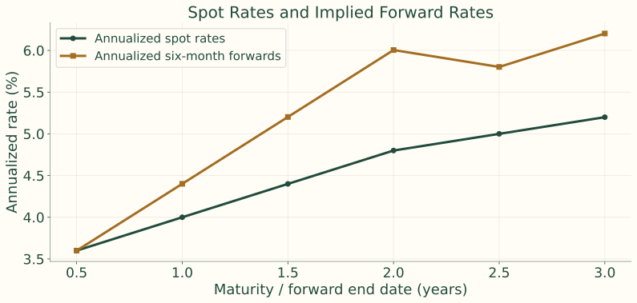{.figure}

Separate illustration from the notes: annualized spots and annualized six-month forwards. An upward spot curve can imply higher forwards.

## Forwards can cover any future interval

$$
1+f_{a,b}=\left[\frac{(1+z_b)^b}{(1+z_a)^a}\right]^{1/(b-a)}
$$

Annual compounding, with maturities in years. For $z_3=4.00\%$ and $z_5=4.60\%$:

$$
f_{3,5}=\left(\frac{1.046^5}{1.040^3}\right)^{1/2}-1=5.51\%
$$

This locks a two-year rate beginning three years from now.

## A forward rate is a hedgeable break-even rate

Forward rates can differ from realized future rates because of risk premiums, liquidity, and changing economic conditions.

<h3>Lock the longer rate</h3>
Hedges reinvestment uncertainty today.

<h3>Roll the shorter investment</h3>
Leaves the future reinvestment rate uncertain.

Compare your rate expectation with the forward break-even, not just with today’s short rate.

## One-year horizon: lock or roll?

Six-month spot: 5.00% bond-equivalent, or 2.50% periodic.

One-year spot: 5.37% bond-equivalent, or 2.685% periodic.

$$
f_1=\frac{1.02685^2}{1.0250}-1\approx2.875\%
$$

The notes quote **5.75% bond-equivalent** as the forward break-even.

Below that expected future rate: prefer the locked one-year investment. Above it: rolling six months is expected to earn more.

## Term-structure shape reflects several forces

<b>Expectations</b>Policy, inflation, growth<i>→</i><b>Risk compensation</b>Duration and liquidity premiums<i>→</i><b>Supply and demand</b>Maturity preferences, safe havens, balance-sheet constraints

No single theory explains the curve at every date.

## Pure expectations and liquidity theory

<h3>Pure expectations</h3>
Risk-neutral investors require no maturity premium. Upward slopes imply expected rate increases; inversions imply expected cuts.

<h3>Liquidity theory</h3>
Investors prefer short maturities. A positive long-maturity premium can produce an upward curve even with unchanged expected short rates.

$$
y_{\text{long}}=\text{expected average short rates}+\text{liquidity premium}
$$

## Preferred habitat and market segmentation

<h3>Preferred habitat</h3>
Money funds prefer short maturities; banks may prefer intermediate; insurers and pensions prefer long. Compensation can induce them to move.

<h3>Market segmentation</h3>
Supply and demand largely determine yields within separate maturity sectors. Arbitrage and relative-value trading limit this separation.

## Expectations can reshape the curve

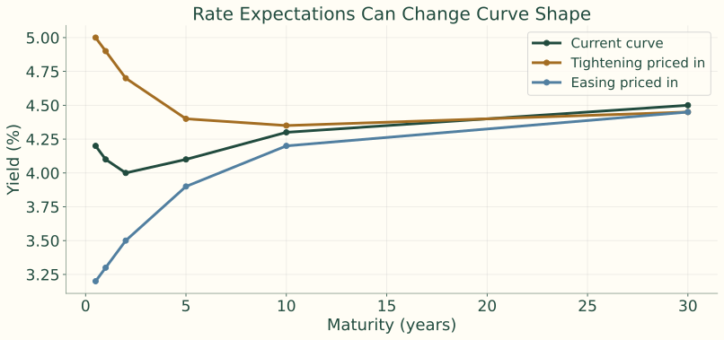{.figure}

Expected tightening can raise 1–5Y yields and flatten or invert the curve. Expected easing can lower intermediate yields; recession expectations can pull longer yields down.

## Bond risk premiums move independently of expectations

| Force | Possible curve effect |
|---|---|
| Inflation uncertainty | Higher long-term premium; steepening |
| Heavy long-term issuance | Long maturities cheapen; yields rise |
| Pension and insurer demand | Lower long-end premium; flattening |
| Safe-haven buying | Lower Treasury yields at liquid benchmarks |

Expected short rates can be unchanged while risk premiums move.

## Convexity also has value in the curve

<h3>Positive convexity</h3>
Investors may accept lower yields for favorable price asymmetry, especially when rates are volatile.

<h3>Negative convexity</h3>
Callables and MBS sacrifice upside when rates fall and require compensation for exercise or prepayment risk.

The observed curve combines expectations, risk premiums, and convexity effects.

## A swap exchanges interest payments

<b>Party A</b>Pays fixed 4.50%<i>→</i><b>\$100m notional</b>Principal is not exchanged<i>→</i><b>Party B</b>Pays floating six-month SOFR

$$
\text{Semiannual fixed payment}=\$100m\times4.50\%/2=\$2.25m
$$

Five-year fixed-for-floating swap. A receives floating; B receives fixed.

## Swap payments depend on the floating reset

| Scenario for 6-month SOFR | Floating payment | Net cash flow |
|---|---:|---|
| SOFR = 3.50% | \$1,750,000 | Party A pays Party B \$500,000 |
| SOFR = 4.50% | \$2,250,000 | No net payment |
| SOFR = 5.50% | \$2,750,000 | Party B pays Party A \$500,000 |

A benefits from higher floating rates; B benefits from lower floating rates. These simplified six-month payments use an annual rate divided by two.

## Swap rates form a benchmark curve

The par swap rate makes the initial swap value approximately zero. Active trading across maturities makes the curve useful for corporate and structured-product valuation and hedging.

$$
\text{Swap spread}=\text{swap rate}-\text{Treasury yield}
$$

$$
4.65\%-4.25\%=0.40\%=40\text{ bp}
$$

Swap spreads reflect collateralized derivatives, bank balance sheets, reference rates, and relative market conditions.

## Treasury and swap curves

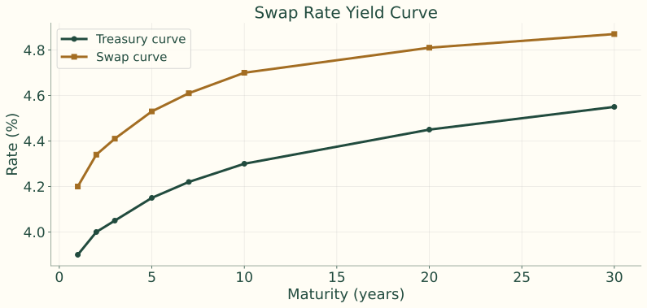{.figure}

The swap curve is not identical to the Treasury curve. Many users hedge with swaps, making swap rates a useful benchmark for their cash flows.

## Curve trades isolate the intended exposure

<b>Level</b>Broad rate move<i>→</i><b>Slope</b>Short versus long rates<i>→</i><b>Curvature</b>Belly versus wings

Use bonds, futures, or swaps. Duration-adjusted positions aim to reduce unintended parallel-shift exposure.

## Bull steepener: short rates fall more

Long 2-year notes and short 10-year notes in duration-adjusted amounts.

| | 2Y | 10Y | 2s10s slope |
|---|---:|---:|---:|
| Initial | 4.80% | 4.20% | −60 bp |
| After | 4.10% | 3.95% | −15 bp |
| Move | −70 bp | −25 bp | +45 bp |

The long short-end position gains more than the long-end short loses.

## Bull steepener: the curve move

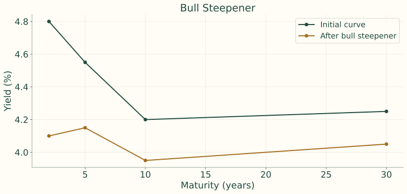{.figure}

## Bear steepener: long rates rise more

Short 30-year bonds and long 5-year notes in duration-adjusted amounts.

| | 5Y | 30Y | 5s30s slope |
|---|---:|---:|---:|
| Initial | 4.00% | 4.40% | 40 bp |
| After | 4.10% | 4.80% | 70 bp |
| Move | +10 bp | +40 bp | +30 bp |

The long-end short gains more than the 5-year long loses.

## Bear steepener: the curve move

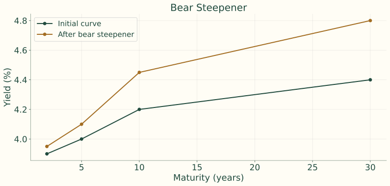{.figure}

## Bull flattener: long rates fall more

Long 10-year notes; short 2-year notes in duration-adjusted amounts.

The 10-year yield falls **50 bp** and the 2-year yield falls **15 bp**. The long-end gain exceeds the short-end loss.

Declining inflation expectations or demand for duration can motivate this view.

## Bull flattener: the curve move

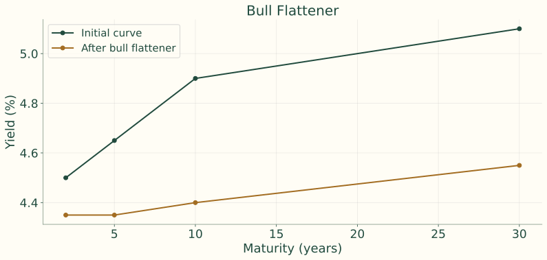{.figure}

## Bear flattener: short rates rise more

Short 2-year notes; long 10-year notes in duration-adjusted amounts.

The 2-year yield rises **75 bp** and the 10-year yield rises **25 bp**. The short-end gain exceeds the long-end loss.

Expected monetary tightening can motivate this view.

## Bear flattener: the curve move

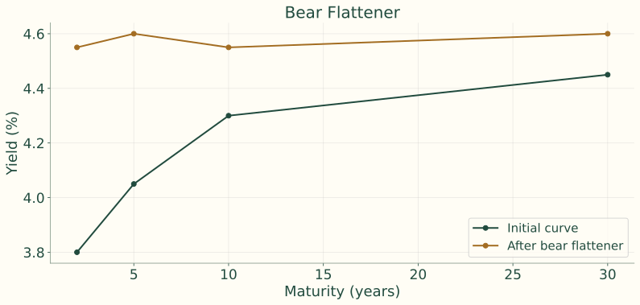{.figure}

## Butterfly: the belly versus the wings

$$
\text{Butterfly}=2y_5-y_2-y_{10}
$$

$$
2(4.50\%)-4.00\%-4.30\%=0.70\%
$$

The 5-year point is high relative to the 2-year and 10-year wings. A trader expecting it to richen buys 5Y and shorts the wings in duration-adjusted amounts.

## Butterfly: relative richening of the belly

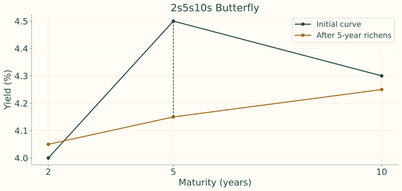{.figure}

## Carry and roll-down are separate return sources

<h3>Carry</h3>
Coupon income less financing cost from holding the position.

<h3>Roll-down</h3>
Price effect as the bond ages to a shorter maturity on an unchanged curve.

The 30 bp roll-down can add a price gain. An adverse curve move can overwhelm both carry and roll-down.

## Curve risk controls extend beyond total duration

| Exposure or cost | Control |
|---|---|
| Level and maturity location | Duration and key rate duration |
| Large moves | Convexity and scenario repricing |
| Holding the position | Financing cost and liquidity |
| Adverse outcomes | Stop-loss levels and stress scenarios |

Duration neutrality applies only locally to parallel shifts. Volatility, financing changes, unexpected curve moves, and hedge basis risk can still create losses.

## Broad picture: constructing the pricing curve

<b>Observe</b>Treasury prices and YTMs<i>→</i><b>Standardize</b>Smooth par coupons and interpolate<i>→</i><b>Bootstrap</b>Solve dated spot rates

Raw YTMs mix coupon, maturity, cash-flow timing, liquidity, tax, and financing effects. The par curve standardizes the cash-flow package.

## Broad picture: using the pricing curve

<b>Spot curve</b>One rate per payment date<i>→</i><b>Valuation</b>Discount each cash flow<i>→</i><b>Forward curve</b>Infer future-start break-even rates<i>→</i><b>Hedge or trade</b>Express views or lock future rate exposure

Spreads add issuer and security features. Curve trades target level, slope, curvature, carry, and roll-down.

## Readings and market resources

Fabozzi, **Chapter 5: Factors Affecting Bond Yields and the Term Structure of Interest Rates**.

- [U.S. Treasury interest-rate statistics](https://home.treasury.gov/resource-center/data-chart-center/interest-rates): observable Treasury curves.
- [New York Fed term-premium estimates](https://www.newyorkfed.org/research/data_indicators/term-premia-tabs): expectations and premiums.
- [New York Fed reference rates](https://www.newyorkfed.org/markets/reference-rates): overnight reference-rate publications.
