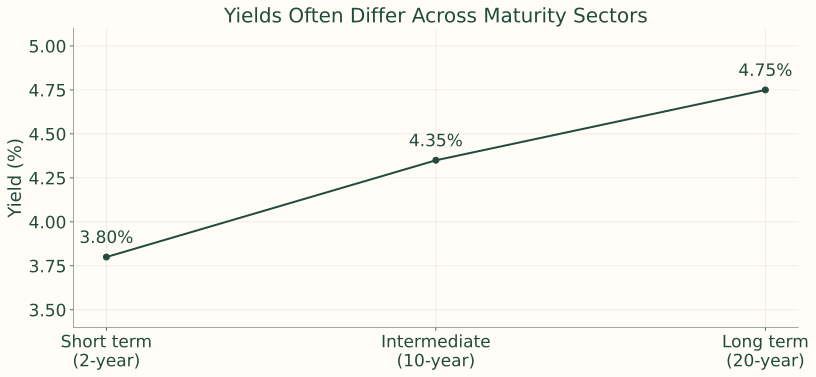
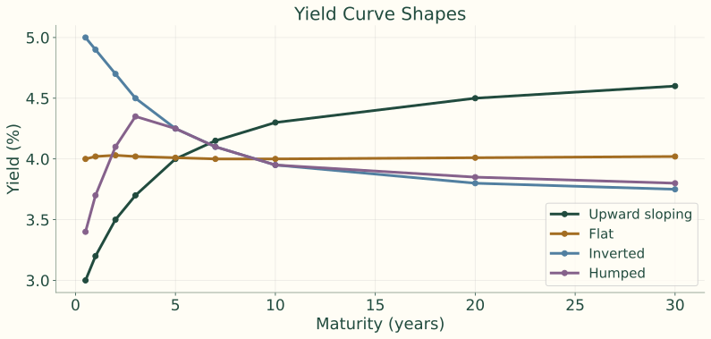
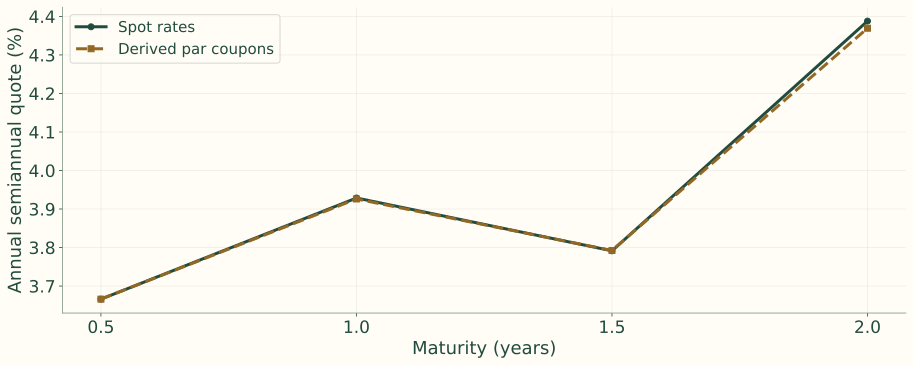
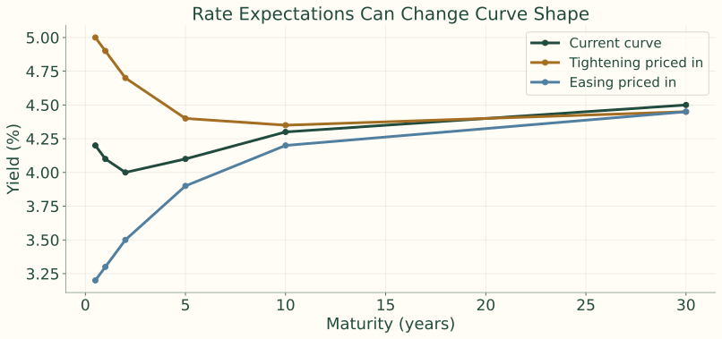
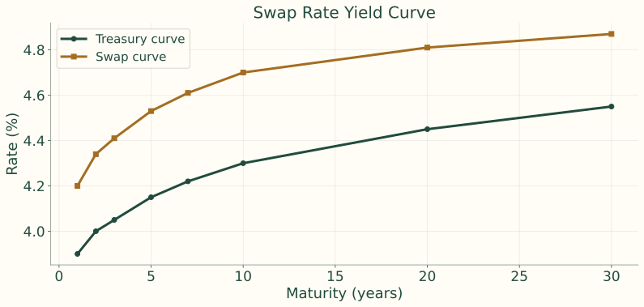
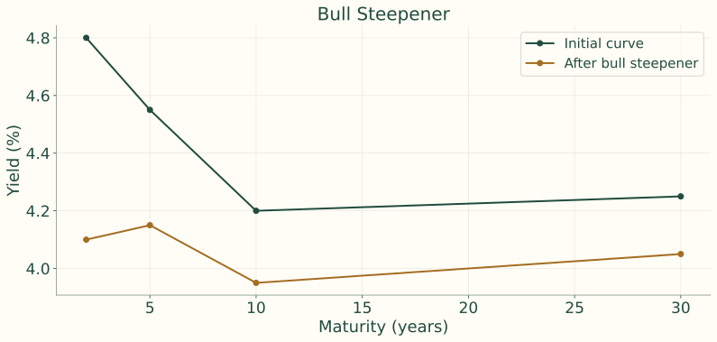
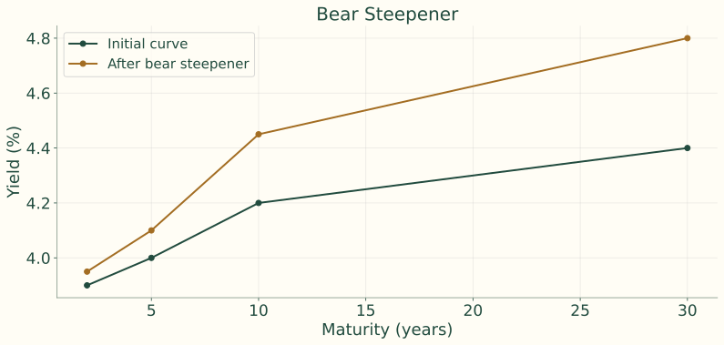
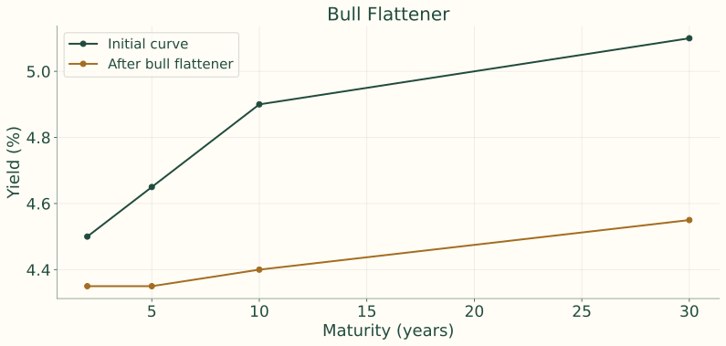
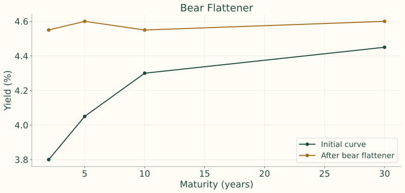
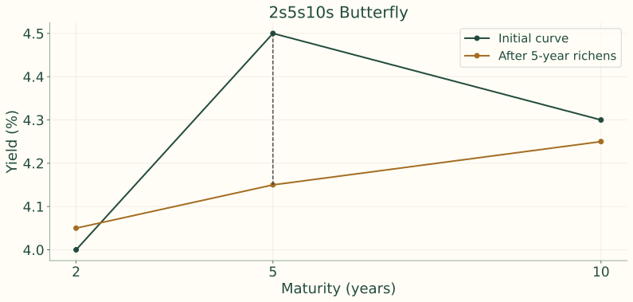

## Base interest rate

$$
\text{Required yield}=\text{base interest rate}+\text{benchmark spread}
$$

<div class="flow"><span><b>Base rate</b>Minimal-default-risk return at the relevant horizon</span><i>→</i><span><b>Benchmark spread</b>Issuer and security-specific risks and features</span></div>

Common bases: Treasuries, Treasury spots, swaps, and OIS for collateralized derivatives.

## Benchmark spread

The benchmark spread is the bond yield minus the yield of the benchmark security or curve.

**Five-year example:** corporate yield 5.05%, Treasury yield 3.80%.

$$
5.05\%-3.80\%=1.25\%=125\text{ bp}
$$

A second bond yields 6.20% against a 4.70% Treasury benchmark:

$$
6.20\%-4.70\%=1.50\%=150\text{ bp}
$$

Spreads change with credit conditions, liquidity, risk appetite, and the bond’s features. Match the benchmark to the cash-flow exposure.

## Issuer type shapes the spread

Sovereigns, agencies, supranationals, municipalities, financials, industrials, utilities, structured finance, and MBS issuers have different risks and protections.

| Issuer type | Yield | Spread over Treasury |
|---|---:|---:|
| Federal agency | 4.35% | 35 bps |
| Utility company | 4.95% | 95 bps |
| High-yield industrial company | 7.25% | 325 bps |

Illustration: 10-year Treasury yield 4.00%.

## Creditworthiness

| Credit driver | Examples |
|---|---|
| Leverage and coverage | High debt/EBITDA versus low; weak versus strong coverage |
| Earnings and business risk | Cyclical commodity earnings versus stable utilities |
| Assets and recovery | Liquid collateral versus specialized assets |
| Diversification and industry | One product versus many; staples versus autos/airlines |
| Legal protection | Secured versus subordinated debt |

A-rated 7-year bond: **85 bp**; similar BBB bond: **145 bp**. The **60 bp** gap reflects weaker credit. Spreads can react before ratings.

## Embedded options shift value

<div class="comparison"><div><h3>Issuer call</h3><p>Limits investor upside when rates fall and creates reinvestment risk. Usually increases required spread.</p></div><div><h3>Investor put or conversion</h3><p>Adds investor value. Can reduce required spread, sometimes below a comparable benchmark yield.</p></div></div>

An AAA callable can trade wider than an AA putable or convertible if option value outweighs the credit difference.

## Raw spread mixes option and non-option effects

$$
\text{Benchmark spread}=\text{OAS}+\text{embedded-option effects}
$$

This is a conceptual decomposition, with option effects expressed in spread terms.

OAS requires a valuation model to remove the estimated effect of embedded options. Comparing raw yields alone can mis-rank bonds with different options.

## Tax treatment changes the comparison

$$
y_{\text{after tax}}=y_{\text{taxable}}(1-t)
$$

$$
y_{\text{taxable equivalent}}=\frac{y_{\text{tax exempt}}}{1-t}
$$

$$
\frac{3.00\%}{1-0.35}=4.62\%
$$

For an investor taxed at 35%, a 3% tax-exempt municipal yield is equivalent to a 4.62% taxable yield.

## Liquidity has a spread cost

Issue size, dealer inventory, trading frequency, price transparency, index eligibility, seasoning, and investor concentration affect saleability.

| Comparable BBB issue | Trading | Spread |
|---|---|---:|
| A: \$2 billion | Daily benchmark trading | 140 bp |
| B: \$150 million | Rarely trades | 175 bp |

The **35 bp** difference may largely reflect liquidity. Liquidity premiums can grow sharply in stressed markets.

## Financeability connects the bond and repo markets

<div class="flow"><span><b>Manager owns bond</b>Pledges the security as collateral</span><i>→</i><span><b>Dealer lends cash</b>Repo rate is the financing cost</span><i>→</i><span><b>Leverage</b>Borrowing supports a larger position</span></div>

Repo terms depend on tenor, collateral quality and liquidity, haircut, dealer demand, and scarcity of the specific issue.

## Special collateral can justify a lower cash yield

<div class="flow"><span><b>Dealer needs a scarce bond</b>Often to cover a short position</span><i>→</i><span><b>Holder gets a lower repo rate</b>A financing advantage</span><i>→</i><span><b>Investors bid up its price</b>The bond’s cash yield falls</span></div>

On-the-run Treasury richness can reflect both liquidity and special financing value.

## Financeability example: compare the whole position

| Issue | Cash yield | Repo rate | Financing status |
|---|---:|---:|---|
| On-the-run 5-year Treasury | 4.18% | 3.70% | Special collateral |
| Off-the-run 5-year Treasury | 4.28% | 4.10% | General collateral |

$$
4.28\%-4.18\%=10\text{ bp lower cash yield on the on-the-run issue}
$$

A leveraged investor also pays a financing rate. The larger cash yield alone does not identify the better carry.

## Financing carry reverses the ranking

$$
\text{Financing carry}=\text{bond yield}-\text{repo rate}
$$

$$
\text{On-the-run}:4.18\%-3.70\%=0.48\%
$$

$$
\text{Off-the-run}:4.28\%-4.10\%=0.18\%
$$

$$
0.48\%-0.18\%=30\text{ bp carry advantage}
$$


## Maturity creates a term structure

| Maturity sector | Term to maturity |
|---|---:|
| Short term | 1 to 5 years |
| Intermediate term | 5 to 12 years |
| Long term | More than 12 years |

$$
\text{Maturity spread}=y_{\text{long}}-y_{\text{short}}
$$

Longer cash-flow horizons generally increase price volatility. Comparable securities across maturities define the term structure.

## Maturity spreads across sectors

{.figure}

Maturity spread: $4.75\%-3.80\%=0.95\%$.

## Term structure of interest rates

The term structure describes how rates vary with maturity. Each curve answers a different question.

| Curve | What it reports |
|---|---|
| Par | Coupon that prices a new bond at par |
| Spot | Discount rate for a single payment date |
| Forward | Implied rate between future dates |
| Swap | Par fixed swap rates under the relevant projection and discount curves |
| Credit spread | Additional compensation across risky maturities |

## YTM compresses a package into one rate

$$
P=\sum_{t=1}^{n}\frac{CF_t}{(1+y)^t}
$$

- YTM is the internal rate of return for promised cash flows, usually solved numerically.
- A coupon-bond YTM summarizes many payment dates in one rate.
- Realizing that compounded return requires holding to maturity, receiving all payments on time, and reinvesting coupons at YTM.

## Common yield-curve shapes

{.figure}

## Curve shapes provide clues, not mechanical rules

| Shape | Typical economy | Signal |
|---|---|---|
| Upward sloping | Expansion or recovery | Growth and inflation expectations are rising. |
| Flat | Transition period | The outlook is uncertain. |
| Inverted | Late cycle or recession risk | Policy is tight and rate cuts may be expected. |
| Humped | Uneven outlook | Near-term pressure is high, but longer-term expectations are lower. |

Central-bank purchases, liquidity, Treasury supply, and maturity-specific demand can also change the curve.

## Individual cash flows require individual discount factors

<div class="cash-timeline" data-times='["Today", "6 months", "1 year", "\u2026", "5 years"]' data-flows='["Price", "Coupon", "Coupon", "Coupons", "Coupon + face"]'></div>

$$
P=\sum_{j=1}^{n}CF_jD(t_j)
$$

- A spot rate prices one payment at one maturity.
- A five-year semiannual coupon bond has ten payment dates.
- Its own YTM reproduces its own price, but cannot supply a discount curve for other payment packages.

## Why one discount rate can misprice the package

Two-year annual bond: \$50 coupon, \$1,000 principal; $z_1=3\%$, $z_2=5\%$.

$$
P_{\text{spot}}=\frac{50}{1.03}+\frac{1050}{1.05^2}=1000.92
$$

$$
P_{\text{one rate}}=\frac{50}{1.05}+\frac{1050}{1.05^2}=1000.00
$$


## Constructing the theoretical Treasury spot curve

- **Goal:** find the value today of $1 paid at each selected future payment date, then express those discount factors as spot rates.
- **Securities:** use Treasury bills for the short end and Treasury coupon securities across the maturities we want to cover.
- **Inputs:** use full prices (clean prices plus accrued interest), coupon amounts, principal, and exact payment dates.
- **Consistency:** use a common observation and settlement date, with consistent day-count and compounding conventions.
- **Check:** the curve should reproduce the input securities' full prices. Missing payment dates require interpolation or additional securities.

## Discount factors and spot rates

$D(t)$ is today's value of \$1 paid at maturity $t$, measured in years.

$$
D(t)=(1+z(t)/2)^{-2t}
$$

$$
z(t)=2\left[D(t)^{-1/(2t)}-1\right]
$$

The two curves contain the same information. Here $z(t)$ is a decimal annual rate with semiannual compounding.

## Bootstrapping from full prices

For the bond maturing at $t_n=n/2$, $C_n$ is its coupon in dollars per half year.

$$
P_n=C_n\sum_{j=1}^{n-1}D(t_j)+(100+C_n)D(t_n)
$$

$$
D(t_n)=\frac{P_n-C_n\sum_{j=1}^{n-1}D(t_j)}{100+C_n}
$$

Subtract the earlier coupons' present value. The remaining price belongs to the final payment.

## Worked example: four prices, four discount factors

Illustrative Treasury-like securities, \$100 face value, coupon-date settlement.

| Maturity | Annual coupon | Full price | Semiannual coupon |
|---:|---:|---:|---:|
| 0.5 year | 0% | 98.20 | 0.00 |
| 1.0 year | 3% | 99.10 | 1.50 |
| 1.5 years | 4% | 100.30 | 2.00 |
| 2.0 years | 5% | 101.20 | 2.50 |

The six-month instrument pays \$100 once. All other payments fall on the same half-year grid.

## The first two discount factors

**Six-month bill:** its full price equals the present value of its only payment.

$$
98.20=100D(0.5)\quad\Rightarrow\quad D(0.5)=\frac{98.20}{100}=0.982000
$$

**One-year bond:** discount its first coupon and final coupon plus principal separately.

$$
99.10=1.50D(0.5)+101.50D(1)
$$

$$
D(1)=\frac{99.10-1.50(0.982000)}{101.50}=0.961842365
$$

$$
z(1)=2\left[D(1)^{-1/2}-1\right]=3.928556\%
$$

## The next two discount factors

$$
D(1.5)=\frac{100.30-2[D(0.5)+D(1)]}{102}=0.945218777
$$

$$
D(2)=\frac{101.20-2.50[D(0.5)+D(1)+D(1.5)]}{102.50}
=0.916852167
$$

Each successive security adds one unknown. A missing payment-date factor requires more information or an interpolation assumption.

## The bootstrapped spot curve

| Maturity | Discount factor | Annual semiannual spot quote |
|---:|---:|---:|
| 0.5 year | 0.982000000 | 3.665988% |
| 1.0 year | 0.961842365 | 3.928556% |
| 1.5 years | 0.945218777 | 3.791414% |
| 2.0 years | 0.916852167 | 4.387893% |

The 1.5-year spot is below the one-year spot. A valid curve need not rise at every maturity.

## Valuing a different coupon

A two-year bond pays \$3 every half year and repays \$100 principal.

$$
P=3[D(0.5)+D(1)+D(1.5)]+103D(2)=103.102957
$$

For \$2 million face value:

$$
V=(2{,}000{,}000/100)P=\$2{,}062{,}059.13
$$

The payment dates and assumed credit quality match the curve. This bond was not used in the bootstrap.

## The par coupon is a derived quantity

The annual decimal coupon rate that makes a hypothetical bond worth \$100 is:

$$
c_{\mathrm{par}}(t_n)=\frac{2[1-D(t_n)]}{\sum_{j=1}^{n}D(t_j)}
$$

The example's two-year par coupon is **4.369402%**.

A published par curve can alternatively supply bootstrap inputs: set each price to 100 and each coupon to $100c_{\mathrm{par}}/2$. A par curve is not a required intermediate step when starting from bond prices.

## An existing par curve as an input

Suppose the supplied six-month and one-year par coupons are 3.60% and 3.80%, quoted annually with semiannual payments. Each hypothetical bond costs 100.

$$
D(0.5)=\frac{100}{101.80}=0.982318271
$$

$$
D(1)=\frac{100-1.90D(0.5)}{101.90}\approx0.963038227
$$

This converts a supplied par curve into discount factors. When starting from security prices, the direct price bootstrap already supplies those factors.

## Spot rates and derived par coupons

{.figure}

Both curves come from the same four illustrative prices.

## Missing dates require a modeling choice

Log-linear discount-factor interpolation between known dates $a$ and $b$:

$$
\log D(t)=\frac{b-t}{b-a}\log D(a)+\frac{t-a}{b-a}\log D(b)
$$

- Keeps discount factors positive
- Implies constant continuously compounded forwards within each interval
- Can affect prices between the observed dates

The [bootstrapping demo](../demos/demo_bootstrapping.qmd) compares interpolation choices and reprices a new bond.

## On-the-run Treasuries: clear prices, sparse maturities

<div class="comparison"><div><h3>Advantages</h3><p>Recent issues are liquid, actively quoted, and useful for trader communication.</p></div><div><h3>Limitations</h3><p>Few maturities; liquidity and special financing can make issues rich.</p></div></div>

A 10-year on-the-run yield of 4.20% versus 4.25% on an older 9.8-year note may reflect a 5 bp liquidity difference rather than the pure discount curve.

## Treasury auction pattern in the notes

| Security | Maturities | Typical auction frequency |
|---|---|---|
| Bills | 4-, 6-, 8-, 13-, 17-, and 26-week | Weekly |
| Bills | 52-week | Every 4 weeks |
| Notes | 2-, 3-, 5-, and 7-year | Monthly |
| Notes | 10-year | Quarterly original issue, with reopenings in other months |
| Bonds | 20- and 30-year | Quarterly original issue, with reopenings in other months |
| TIPS | 5-, 10-, and 30-year | Less frequent; varies by maturity |
| FRNs | 2-year | Quarterly original issue, with reopenings in other months |

Typical pattern as stated in the lecture notes; actual auction schedules can change.

## Adding selected off-the-run issues

<div class="comparison"><div><h3>More observations</h3><p>Better coverage between benchmark maturities and less reliance on a few rich issues.</p></div><div><h3>Selection risk</h3><p>Stale quotes, lower liquidity, special financing, coupon and tax effects can distort the fit.</p></div></div>

## Using all Treasury bills and coupon securities

<div class="comparison"><div><h3>Broad coverage</h3><p>Many observations support a smooth curve and reduce dependence on benchmark issues.</p></div><div><h3>Cleaning the inputs</h3><p>Liquidity, supply and demand, taxes, financing, and coupon effects still matter.</p></div></div>

Statistical fitting controls issue-specific noise and outliers.

## A coupon bond is a package of zeros

| Date | Coupon payment | Principal payment | Total cash flow | Equivalent zero-coupon bond |
|---:|---:|---:|---:|---|
| Year 1 | \$5 | \$0 | \$5 | 1-year zero paying \$5 |
| Year 2 | \$5 | \$0 | \$5 | 2-year zero paying \$5 |
| Year 3 | \$5 | \$100 | \$105 | 3-year zero paying \$105 |

$$
P=\frac5{1+z_1}+\frac5{(1+z_2)^2}+\frac{105}{(1+z_3)^3}
$$

This illustrative annual-pay bond uses annual effective spot rates. Treasury notes in the market generally pay semiannually.

## STRIPS reveal one-date discount rates

<div class="comparison"><div><h3>Advantages</h3><p>Single-payment yields directly reveal spot rates, remove coupon effects, and support long-maturity estimates.</p></div><div><h3>Limitations</h3><p>Lower liquidity, pension demand, and incomplete maturity coverage can affect prices.</p></div></div>

$$
z_{10}=\left(\frac{100}{62}\right)^{1/10}-1=4.90\%
$$

A \$100 payment in ten years trades for \$62. The formula reports an annual effective rate.


## Using the theoretical spot rate curve

For annual-pay cash flows and annual effective spot rates:

$$
P=\sum_{t=1}^{n}\frac{CF_t}{(1+z_t)^t}
$$

- Match each discount rate to its payment date.
- Include principal in the final cash flow.
- Use consistent credit quality and compounding conventions.

## Spot valuation: a three-year Treasury

Illustrative annual-pay bond, 4% coupon, \$100 face value. Annual effective spots:

| Maturity | Spot rate |
|---:|---:|
| 1 year | 3.50% |
| 2 years | 4.00% |
| 3 years | 4.40% |

$$
P=\frac4{1.035}+\frac4{1.04^2}+\frac{104}{1.044^3}=98.96
$$


## Spot rates and the base interest rate

$$
P=\sum_{t=1}^{n}\frac{CF_t}{(1+z_t+s)^t}
$$

$z_t$ is the Treasury spot for payment date $t$; $s$ is a constant spread over that curve.

This respects cash-flow timing more closely than subtracting one Treasury YTM from the bond’s YTM.

## Spot rates as base rates: adding a credit spread

Corporate promised payments: \$5 in year 1 and \$105 in year 2. Treasury spots: 3.00% and 3.50%.

$$
P_{\text{base}}=\frac5{1.03}+\frac{105}{1.035^2}=102.87
$$

This is the value of those payments discounted at Treasury base rates.

Add a constant **120 bp spread** to the same payment-date rates:

$$
3.00\%+1.20\%=4.20\%,\qquad3.50\%+1.20\%=4.70\%
$$

$$
P_{\text{risky}}=\frac5{1.042}+\frac{105}{1.047^2}=100.58
$$


## Forward rates connect two investment routes

<div style="display:grid;grid-template-columns:1.5fr .12fr 1fr;align-items:center;gap:20px;font-size:.8em">
<div><p><strong>Two-year route:</strong> invest now at the two-year spot.</p><p><strong>Rollover route:</strong> invest one year, then reinvest at the forward rate locked today.</p></div>
<div style="font-size:5em;font-family:serif;font-weight:normal">}</div>
<div><strong>No arbitrage</strong><br>Both routes must end with the same value.</div>
</div>

<svg viewBox="0 0 1100 210" role="img" aria-label="Two-year spot investment spans years zero to two. Rollover invests at the one-year spot from zero to one and the locked forward from one to two." style="display:block;width:85%;height:195px;margin:auto">
<g fill="none" stroke="#214b3e" stroke-width="3"><path d="M100 65 H1000 M100 55 V75 M550 55 V75 M1000 55 V75"/><path d="M100 130 V145 H1000 V130"/><path d="M100 190 V175 H550 V190 M550 190 V175 H1000 V190"/></g>
<g fill="#183b32" font-size="25" text-anchor="middle"><text x="100" y="40">Year 0</text><text x="550" y="40">Year 1</text><text x="1000" y="40">Year 2</text><text x="550" y="118">Two-year spot: 0 to 2</text><text x="325" y="208">One-year spot: 0 to 1</text><text x="775" y="208">Locked forward: 1 to 2</text></g>
</svg>

$$
(1+z_2)^2=(1+z_1)(1+f_{1,2})
$$

## Deriving a one-year forward rate

$$
f_{1,2}=\frac{(1+z_2)^2}{1+z_1}-1
$$

$$
z_1=4.00\%,\quad z_2=4.80\%
$$

$$
f_{1,2}=\frac{1.048^2}{1.04}-1=5.61\%
$$

The rate covers year 1 to year 2. It is implied today, not a new observed future spot rate.

## A forward rate above fair value creates an arbitrage

Now use $z_1=4\%$ and $z_2=5\%$. The fair forward is 6.01%. Suppose the market forward is **7%**.

<div class="flow"><span><b>Borrow two years</b>At 5%</span><i>→</i><span><b>Invest one year</b>At 4%</span><i>→</i><span><b>Lock year-two reinvestment</b>At 7%</span></div>

$$
\text{Owed}=100(1.05)^2=110.25
$$

$$
\text{Investment}=100(1.04)(1.07)=111.28
$$

$$
\text{Profit}=111.28-110.25=1.03
$$

If the forward is too low, reverse the trade: invest two years and finance with one-year borrowing plus locked forward borrowing.

The example assumes the same frictionless borrowing and lending rates.

## Six-month spots are geometric averages

$$
(1+z_t)^t=(1+z_1)(1+f_1)\cdots(1+f_{t-1})
$$

$$
z_t=\left[(1+z_1)\prod_{i=1}^{t-1}(1+f_i)\right]^{1/t}-1
$$

In this section, $t$ counts half-year periods and both $z_t$ and $f_i$ are **six-month periodic rates**. They are not the annualized spot quotes used in the bootstrap.

## Adjacent spots imply six-month forwards

$$
f_i=\frac{(1+z_{i+1})^{i+1}}{(1+z_i)^i}-1
$$

Compare investing directly for $i+1$ periods with investing for $i$ periods and reinvesting for one more period. The forward rate makes the ending values equal.

## Spot-to-forward example: periods 1–5

| Period | Maturity | Spot rate per six months | Bond-equivalent spot rate |
|---:|---:|---:|---:|
| 1 | 0.5 year | 2.625% | 5.250% |
| 2 | 1.0 year | 2.750% | 5.500% |
| 3 | 1.5 years | 2.880% | 5.760% |
| 4 | 2.0 years | 3.077% | 6.154% |
| 5 | 2.5 years | 3.250% | 6.500% |

Bond-equivalent annual rate is twice the displayed periodic rate.

## Spot-to-forward example: periods 6–10

| Period | Maturity | Spot rate per six months | Bond-equivalent spot rate |
|---:|---:|---:|---:|
| 6 | 3.0 years | 3.427% | 6.854% |
| 7 | 3.5 years | 3.453% | 6.906% |
| 8 | 4.0 years | 3.578% | 7.156% |
| 9 | 4.5 years | 3.635% | 7.270% |
| 10 | 5.0 years | 3.660% | 7.320% |

Bond-equivalent annual rate is twice the displayed periodic rate.

## The first two implied forward rates

$$
f_1=\frac{1.02750^2}{1.02625}-1=2.875\%
$$

$$
f_2=\frac{1.02880^3}{1.02750^2}-1=3.140\%
$$

$f_1$ covers 0.5–1.0 year. $f_2$ covers 1.0–1.5 years. These are six-month rates.

## The full six-month forward curve

| Forward rate | Period covered | Six-month rate |
|---|---|---:|
| $f_1$ | 0.5 to 1.0 year | 2.875% |
| $f_2$ | 1.0 to 1.5 years | 3.140% |
| $f_3$ | 1.5 to 2.0 years | 3.670% |
| $f_4$ | 2.0 to 2.5 years | 3.945% |
| $f_5$ | 2.5 to 3.0 years | 4.317% |
| $f_6$ | 3.0 to 3.5 years | 3.609% |
| $f_7$ | 3.5 to 4.0 years | 4.457% |
| $f_8$ | 4.0 to 4.5 years | 4.092% |
| $f_9$ | 4.5 to 5.0 years | 3.885% |

Calculated from the displayed spot inputs, with forward rates rounded to three decimals.

## Reconstructing the five-year spot

Ten half-year growth factors consist of today’s six-month spot and nine forwards. Use unrounded forwards derived from the spot inputs.

$$
G=(1+z_1)\prod_{i=1}^{9}(1+f_i)=(1.03660)^{10}
$$

$$
G=1.432557,\qquad z_{10}=G^{1/10}-1=3.660\%
$$

Bond-equivalent quote: $2(3.660\%)=7.320\%$.

The calculation uses unrounded forwards derived from the displayed spot rates.

## Forward rates implied by the example

```{python}
#| label: slide-forward-rates
#| echo: false
#| fig-width: 10
#| fig-height: 4.4
import numpy as np
import matplotlib.pyplot as plt
# Use the ten periodic spot rates in the preceding worked example.
periods = np.arange(1, 11)
spot = np.array([2.625, 2.750, 2.880, 3.077, 3.250,
                 3.427, 3.453, 3.578, 3.635, 3.660]) / 100
discounts_forward = (1 + spot) ** (-periods)
forward = np.r_[spot[0], discounts_forward[:-1] / discounts_forward[1:] - 1]
np.testing.assert_allclose(np.cumprod(1 + forward), 1 / discounts_forward)

fig, ax = plt.subplots(figsize=(8, 4.4))
ax.plot(periods / 2, spot * 200, "o-", linewidth=2.5,
        color="#214b3e", label="Spot rate")
ax.plot(periods[1:] / 2, forward[1:] * 200, "s--", linewidth=2.5,
        color="#936724", label="Six-month forward (f1 to f9)")
ax.set_xlabel("Spot maturity / forward interval end (years)")
ax.set_ylabel("Bond-equivalent annual rate (%)")
ax.set_title("Forward Rates Implied by an Upward-Sloping Spot Curve")
ax.set_xticks(periods / 2)
ax.grid(alpha=0.2)
ax.spines[["top", "right"]].set_visible(False)
ax.legend(loc="upper left")
fig.tight_layout()
plt.show()
```

Both series use the preceding ten spot inputs. Forward points mark interval ends. The decline at year 3.5 corresponds to $f_6$.

## Forwards can cover any future interval

$$
1+f_{a,b}=\left[\frac{(1+z_b)^b}{(1+z_a)^a}\right]^{1/(b-a)}
$$

Annual compounding, with maturities in years. For $z_3=4.00\%$ and $z_5=4.60\%$:

$$
f_{3,5}=\left(\frac{1.046^5}{1.040^3}\right)^{1/2}-1=5.51\%
$$

This locks a two-year rate beginning three years from now.

<svg viewBox="0 0 1100 200" role="img" aria-label="Five-year spot investment from zero to five equals three-year spot investment from zero to three followed by the two-year forward from three to five." style="display:block;width:85%;height:180px;margin:auto">
<g fill="none" stroke="#214b3e" stroke-width="3"><path d="M100 55 H1000 M100 45 V65 M640 45 V65 M1000 45 V65"/><path d="M100 115 V130 H1000 V115 M100 175 V160 H640 V175 M640 175 V160 H1000 V175"/></g>
<g fill="#183b32" font-size="25" text-anchor="middle"><text x="100" y="30">Year 0</text><text x="640" y="30">Year 3</text><text x="1000" y="30">Year 5</text><text x="550" y="105">Five-year spot: 4.60%</text><text x="370" y="195">Three-year spot: 4.00%</text><text x="820" y="195">Two-year forward: 5.51%</text></g>
</svg>

## A forward rate is a hedgeable break-even rate

Forward rates can differ from realized future rates because of risk premiums, liquidity, and changing economic conditions.

<div class="comparison"><div><h3>Lock the longer rate</h3><p>Hedges reinvestment uncertainty today.</p></div><div><h3>Roll the shorter investment</h3><p>Leaves the future reinvestment rate uncertain.</p></div></div>

Compare your rate expectation with the forward break-even, not just with today’s short rate.

## One-year horizon: lock or roll?

Six-month spot: 5.00% bond-equivalent, or 2.50% periodic.

One-year spot: 5.37% bond-equivalent, or 2.685% periodic.

$$
f_1=\frac{1.02685^2}{1.0250}-1\approx2.870334\%
$$

The forward break-even is **5.740668% bond-equivalent**.

Below that expected future rate: prefer the locked one-year investment. Above it: rolling six months is expected to earn more.

## Term-structure shape reflects several forces

<div class="flow"><span><b>Expectations</b>Policy, inflation, growth</span><i>→</i><span><b>Risk compensation</b>Duration and liquidity premiums</span><i>→</i><span><b>Supply and demand</b>Maturity preferences, safe havens, balance-sheet constraints</span></div>

No single theory explains the curve at every date.

## Pure expectations theory

- Forward rates reflect expected future short rates alone.
- Investors require no maturity risk premium.
- An upward slope signals expected rate increases under this theory.
- An inverted curve signals expected cuts.
- **Limitation:** duration risk and risk premiums complicate this interpretation.

## Liquidity theory

- Investors prefer short maturities because of lower price risk and greater liquidity.
- Longer maturities require a positive premium.
- An upward curve can persist even when expected short rates are unchanged.

$$
y_{\mathrm{long}}\approx\text{expected average short rates}+\text{liquidity premium}
$$

## Preferred habitat theory

- Investors and borrowers prefer particular maturity ranges.
- Money funds favor short maturities.
- Banks may favor intermediate maturities.
- Insurers and pensions often seek long maturities to match liabilities.
- Sufficient compensation can induce investors to leave their preferred range.

Strong long-maturity demand can lower long yields relative to expectations alone.

## Market segmentation theory

- Supply and demand determine yields within relatively separate maturity sectors.
- The 2-year sector may reflect policy expectations.
- The 30-year sector may reflect pension demand, inflation uncertainty, and long-duration supply.
- **Limitation:** arbitrage and relative-value trading connect the sectors.

## Main influences on the yield curve

| Influence | Main intuition |
|---|---|
| Expected future rate changes | Longer investments compete with rolling short investments |
| Bond risk premiums | Investors demand compensation for duration and other risks |
| Convexity bias | Nonlinear price sensitivity affects value and required yields |

The observed curve combines these effects.

## Expectations can reshape the curve

{.figure}

Expected tightening can raise 1–5Y yields and flatten or invert the curve. Expected easing can lower intermediate yields; recession expectations can pull longer yields down.

## Bond risk premiums move independently of expectations

| Force | Possible curve effect |
|---|---|
| Inflation uncertainty | Higher long-term premium; steepening |
| Heavy long-term issuance | Long maturities cheapen; yields rise |
| Pension and insurer demand | Lower long-end premium; flattening |
| Safe-haven buying | Lower Treasury yields at liquid benchmarks |

Expected short rates can be unchanged while risk premiums move.

## Convexity also has value in the curve

<div class="comparison"><div><h3>Positive convexity</h3><p>Investors may accept lower yields for favorable price asymmetry, especially when rates are volatile.</p></div><div><h3>Negative convexity</h3><p>Callables and MBS sacrifice upside when rates fall and require compensation for exercise or prepayment risk.</p></div></div>

The observed curve combines expectations, risk premiums, and convexity effects.

## Swap rate yield curve

<div class="flow"><span><b>Party A</b>Pays fixed 4.50%</span><i>→</i><span><b>\$100m notional</b>Principal is not exchanged</span><i>→</i><span><b>Party B</b>Pays floating compounded SOFR</span></div>

$$
\text{Semiannual fixed payment}=\$100m\times4.50\%/2=\$2.25m
$$

Five-year fixed-for-floating swap. A receives floating; B receives fixed.

## Swap payments depend on realized overnight rates

| Scenario for annualized compounded SOFR over six months | Floating payment | Net cash flow |
|---|---:|---|
| SOFR = 3.50% | \$1,750,000 | Party A pays Party B \$500,000 |
| SOFR = 4.50% | \$2,250,000 | No net payment |
| SOFR = 5.50% | \$2,750,000 | Party B pays Party A \$500,000 |

Higher realized SOFR raises A's floating receipt. These illustrative payments assume an accrual fraction of 0.5.

## Swap rates form a benchmark curve

The par swap rate makes the initial swap value approximately zero. Active trading across maturities makes the curve useful for corporate and structured-product valuation and hedging.

$$
\text{Swap spread}=\text{swap rate}-\text{Treasury yield}
$$

$$
4.65\%-4.25\%=0.40\%=40\text{ bp}
$$

Swap spreads reflect collateralized derivatives, bank balance sheets, reference rates, and relative market conditions.

## Treasury and swap curves

{.figure}

The swap curve is not identical to the Treasury curve. Many users hedge with swaps, making swap rates a useful benchmark for their cash flows.

## Curve strategies: level, slope, and curvature

<div class="flow"><span><b>Level</b>Broad rate move</span><i>→</i><span><b>Slope</b>Short versus long rates</span><i>→</i><span><b>Curvature</b>Belly versus wings</span></div>

- Express views on level, slope, or curvature using **bonds, futures, or swaps**.
- Use **duration-adjusted positions** to reduce unintended parallel-shift exposure.

## Bull steepener: short rates fall more

Long 2-year notes and short 10-year notes in duration-adjusted amounts.

| | 2Y | 10Y | 2s10s slope |
|---|---:|---:|---:|
| Initial | 4.80% | 4.20% | −60 bp |
| After | 4.10% | 3.95% | −15 bp |
| Move | −70 bp | −25 bp | +45 bp |

- **Position:** long 2Y and short 10Y with equal initial dollar DV01.
- **Profit:** the slope increases. Here it increases by 45 bp.
- **Loss:** the slope decreases, before carry and other effects.
- First-order price P&L is common DV01 times the slope change in bp.

## Bull steepener: the curve move

{.figure}

## Bear steepener: long rates rise more

Short 30-year bonds and long 5-year notes in duration-adjusted amounts.

| | 5Y | 30Y | 5s30s slope |
|---|---:|---:|---:|
| Initial | 4.00% | 4.40% | 40 bp |
| After | 4.10% | 4.80% | 70 bp |
| Move | +10 bp | +40 bp | +30 bp |

- **Position:** long 5Y and short 30Y with matched dollar DV01.
- **Profit:** long yields rise more, widening the slope by 30 bp here.
- **Loss:** the slope narrows. Financing and curve-basis changes can also hurt.

## Bear steepener: the curve move

{.figure}

## Bull flattener: long rates fall more

Long 10-year notes; short 2-year notes in duration-adjusted amounts.

- **Example:** 10Y falls 50 bp while 2Y falls 15 bp, narrowing the slope by 35 bp.
- **Profit:** the long-end gain exceeds the short-end loss when dollar DV01s match.
- **Loss:** the slope steepens, before carry and other effects.
- Declining inflation expectations or demand for duration can motivate the trade.

## Bull flattener: the curve move

{.figure}

## Bear flattener: short rates rise more

Short 2-year notes; long 10-year notes in duration-adjusted amounts.

- **Example:** 2Y rises 75 bp while 10Y rises 25 bp, narrowing the slope by 50 bp.
- **Profit:** the short-end gain exceeds the long-end loss when dollar DV01s match.
- **Loss:** the slope steepens, before carry and other effects.
- Expected monetary tightening can motivate the trade.

## Bear flattener: the curve move

{.figure}

## Butterfly: the belly versus the wings

$$
\text{Butterfly}=2y_5-y_2-y_{10}
$$

$$
2(4.50\%)-4.00\%-4.30\%=0.70\%
$$

The 5-year point is high relative to the 2-year and 10-year wings. A trader expecting it to richen buys 5Y and shorts the wings in duration-adjusted amounts.

## Butterfly: position and outcome

- **Position:** long 5Y, short 2Y and 10Y.
- To track $2y_5-y_2-y_{10}$, allocate dollar DV01 in the ratio $-1:+2:-1$.
- **Profit:** the belly yield falls relative to the wings, reducing the butterfly.
- **Loss:** the belly cheapens relative to the wings.
- In the plotted scenario, yields become 4.05%, 4.15%, and 4.25%.

$$
2(4.15\%)-4.05\%-4.25\%=0.00\%
$$

The butterfly falls from 70 bp to zero. Neutrality to a parallel move does not remove every slope or curvature exposure.

## Butterfly: relative richening of the belly

{.figure}

## Carry and roll-down are separate return sources

<div class="comparison"><div><h3>Carry</h3><p>Coupon income less financing cost from holding the position.</p></div><div><h3>Roll-down</h3><p>Price effect as the bond ages to a shorter maturity on an unchanged curve.</p></div></div>

<div class="cash-timeline" data-times='["Buy 5Y bond", "Hold one year", "Now a 4Y bond"]' data-flows='["Yield 4.30%", "Coupon income", "Curve yield 4.00%"]'></div>

- **Profit contribution:** coupon income, less financing, plus potential price gain from a 30 bp roll-down.
- **Loss risk:** higher yields or financing costs can outweigh both benefits.

## Curve risk controls extend beyond total duration

| Exposure or cost | Control |
|---|---|
| Level and maturity location | Duration and key rate duration |
| Large moves | Convexity and scenario repricing |
| Holding the position | Financing cost and liquidity |
| Adverse outcomes | Stop-loss levels and stress scenarios |

Duration neutrality applies only locally to parallel shifts. Volatility, financing changes, unexpected curve moves, and hedge basis risk can still create losses.

## Broad picture

```{=html}
<style>
.lecture-roadmap {
  --blue-bg: #d9eaf7;
  --blue-border: #3a6ea5;
  --red-bg: #f8d7da;
  --red-border: #b94a48;
  --yellow-bg: #fff3cd;
  --yellow-border: #b08a00;
  --green-bg: #d4edda;
  --green-border: #4f8a5b;
  --purple-bg: #d6d8f5;
  --purple-border: #595daa;
  --orange-bg: #fce4d6;
  --orange-border: #b6612e;
  max-width: 1250px;
  margin: 1rem auto 1.5rem auto;
  font-family: system-ui, -apple-system, BlinkMacSystemFont, "Segoe UI", sans-serif;
  color: #1f2933;
}
.lecture-roadmap * { box-sizing: border-box; }
.lecture-roadmap__title {
  text-align: center;
  font-weight: 750;
  font-size: 1.15rem;
  margin-bottom: 0.25rem;
}
.lecture-roadmap__subtitle {
  text-align: center;
  color: #4b5563;
  font-size: 0.78rem;
  margin-bottom: 1rem;
}
.lecture-roadmap__canvas {
  display: grid;
  grid-template-columns: 1fr 0.20fr 1fr 0.20fr 1.8fr;
  grid-template-rows: auto auto auto auto auto;
  gap: 0.45rem 0.46rem;
  align-items: center;
}
.lecture-card {
  border: 1.5px solid;
  border-radius: 10px;
  padding: 0.7rem 22px;
  box-shadow: 0 4px 9px rgba(15, 23, 42, 0.13);
  min-height: 112px;
}
.lecture-card h3 {
  margin: 0 0 0.35rem 0;
  font-size: 27px;
  line-height: 1.12;
  text-align: center;
}
.lecture-card p {
  margin: 0;
  font-size: 22px;
  line-height: 1.27;
  text-align: center;
}
.lecture-card--blue { background: var(--blue-bg); border-color: var(--blue-border); }
.lecture-card--green { background: var(--green-bg); border-color: var(--green-border); }
.lecture-card--purple { background: var(--purple-bg); border-color: var(--purple-border); }
.lecture-card--orange { background: var(--orange-bg); border-color: var(--orange-border); }
.lecture-card--small { min-height: 78px; padding: 0.52rem 0.6rem; }
.lecture-cloud {
  border: 1.4px solid;
  border-radius: 999px;
  padding: 0.58rem 22px;
  min-height: 78px;
  display: flex;
  flex-direction: column;
  justify-content: center;
  box-shadow: 0 3px 8px rgba(15, 23, 42, 0.10);
}
.lecture-cloud h3 {
  margin: 0 0 0.25rem 0;
  font-size: 24px;
  text-align: center;
  line-height: 1.1;
}
.lecture-cloud p {
  margin: 0;
  font-size: 20px;
  line-height: 1.2;
  text-align: center;
}
.lecture-cloud--red { background: var(--red-bg); border-color: var(--red-border); }
.lecture-cloud--yellow { background: var(--yellow-bg); border-color: var(--yellow-border); }
.lecture-chip-grid {
  display: grid;
  grid-template-columns: repeat(3, minmax(0, 1fr));
  gap: 0.18rem;
  margin-top: 0.34rem;
}
.lecture-chip {
  border: 1px solid var(--yellow-border);
  background: #fff8db;
  border-radius: 999px;
  padding: 0.1rem 0.18rem;
  font-size: 17px;
  text-align: center;
  white-space: nowrap;
}
.lecture-arrow {
  align-self: center;
  justify-self: center;
  color: #374151;
  font-weight: 800;
  font-size: 1.28rem;
  line-height: 1;
  text-align: center;
}
.lecture-arrow span {
  display: block;
  margin-top: 0.18rem;
  font-size: 17px;
  font-weight: 650;
  line-height: 1.08;
  color: #4b5563;
}
.lecture-connector {
  align-self: center;
  justify-self: center;
  color: #6b7280;
  font-weight: 800;
  font-size: 1.02rem;
  line-height: 1;
  text-align: center;
}
.lecture-connector span {
  display: block;
  font-size: 16px;
  font-weight: 650;
  margin-top: 0.06rem;
}
.lecture-branch {
  grid-column: 5;
  grid-row: 3 / 6;
  display: grid;
  grid-template-columns: 1fr 0.18fr 1fr;
  grid-template-rows: auto auto auto auto;
  gap: 0.28rem 0.35rem;
  align-items: stretch;
}
.lecture-down-arrow {
  color: #374151;
  font-weight: 800;
  font-size: 1.15rem;
  text-align: center;
  line-height: 1;
}
.lecture-down-arrow span {
  display: block;
  font-size: 16px;
  color: #4b5563;
  margin-top: 0.05rem;
}
@media (max-width: 780px) {
  .lecture-roadmap__canvas,
  .lecture-branch {
    grid-template-columns: 1fr;
  }
  .lecture-branch { grid-column: auto; grid-row: auto; }
  .lecture-arrow,
  .lecture-connector { transform: rotate(90deg); margin: 0.2rem 0; }
  .lecture-arrow span,
  .lecture-connector span { display: none; }
}
</style>

<div class="lecture-roadmap" role="img" aria-label="Treasury prices and payment schedules determine discount factors and spot rates, which support valuation, par yields, forwards, and risk management.">

  <div class="lecture-roadmap__canvas">
    <div class="lecture-card lecture-card--blue" style="grid-column: 1; grid-row: 2;">
      <h3>1. Observe</h3>
      <p>Full Treasury prices, coupons, and payment dates at a common settlement date.</p>
    </div>

    <div class="lecture-cloud lecture-cloud--red" style="grid-column: 1; grid-row: 3;">
      <h3>YTM Is a Summary</h3>
      <p>A YTM is one IRR for a bundle of cash flows, not a one-date discount rate.</p>
    </div>

    <div class="lecture-cloud lecture-cloud--yellow" style="grid-column: 1; grid-row: 4;">
      <p>Observed Treasury yields are heterogeneous.</p>
      <div class="lecture-chip-grid">
        <div class="lecture-chip">coupon</div>
        <div class="lecture-chip">maturity</div>
        <div class="lecture-chip">cash-flow</div>
        <div class="lecture-chip">liquidity</div>
        <div class="lecture-chip">tax</div>
        <div class="lecture-chip">financing</div>
      </div>
    </div>

    <div class="lecture-arrow" style="grid-column: 2; grid-row: 2;">&rarr;<span>calibrate</span></div>

    <div class="lecture-card lecture-card--green" style="grid-column: 3; grid-row: 2;">
      <h3>2. Discount Factors</h3>
      <p>Bootstrap or fit payment-date discount factors. Specify interpolation and check input repricing.</p>
    </div>

    <div class="lecture-arrow" style="grid-column: 4; grid-row: 2;">&rarr;<span>convert</span></div>

    <div class="lecture-card lecture-card--purple" style="grid-column: 5; grid-row: 2;">
      <h3>3. Spot Rate Curve</h3>
      <p>Express each discount factor as a spot rate under a stated compounding convention.</p>
    </div>

    <div class="lecture-branch">
      <div class="lecture-down-arrow" style="grid-column: 1; grid-row: 1;">&#8595;<span>use spots</span></div>
      <div></div>
      <div class="lecture-down-arrow" style="grid-column: 3; grid-row: 1;">&#8595;<span>derive</span></div>

      <div class="lecture-card lecture-card--purple lecture-card--small" style="grid-column: 1; grid-row: 2;">
        <h3>4. Price Cash Flows</h3>
        <p>Value comparable Treasury cash flows. Derive the coupon that prices a hypothetical bond at par.</p>
      </div>
      <div></div>
      <div class="lecture-card lecture-card--orange lecture-card--small" style="grid-column: 3; grid-row: 2;">
        <h3>5. Forward Rates</h3>
        <p>Forward rates describe future start dates and tenors implied by spot rates.</p>
      </div>

      <div></div>
      <div></div>
      <div class="lecture-down-arrow" style="grid-column: 3; grid-row: 3;">&#8595;<span>apply</span></div>

      <div></div>
      <div></div>
      <div class="lecture-card lecture-card--orange lecture-card--small" style="grid-column: 1 / 4; grid-row: 4;">
        <h3>6. Hedge or Trade</h3>
        <p>Use suitable bonds or derivatives to hedge exposure or express a rate view. Implied forwards are break-even rates.</p>
      </div>
    </div>
  </div>
</div>
```
