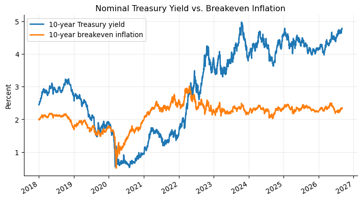
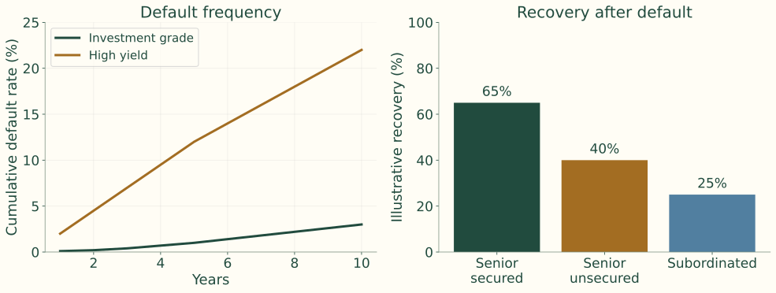
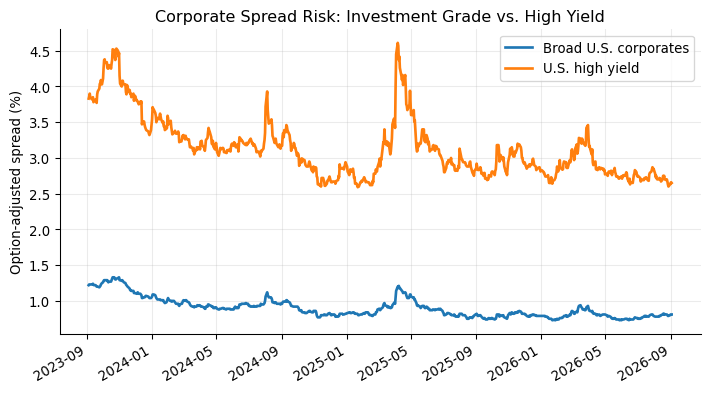

## Treasuries define the dollar base curve

<b>Treasury benchmark</b>Price of time in nominal dollars<i>→</i><b>Agency and corporate debt</b>Add credit, liquidity, options, and structure

Standardized securities, broad maturity coverage, deep secondary trading, and simple cash flows support the benchmark role.

Nominal default-risk treatment does not remove duration, reinvestment, inflation, liquidity, or tax considerations.

## Market snapshot stated in the notes

| Indicator | Value | Source date in notes |
|---|---:|---|
| 10Y Treasury yield | 4.46% | June 2, 2026 |
| 10Y breakeven inflation | 2.38% | June 3, 2026 |
| Broad corporate OAS | 0.74% | June 2, 2026 |
| High-yield OAS | 2.71% | June 2, 2026 |

Historical FRED snapshot quoted by the notes; the two Treasury measures use different dates.

## The Treasury benchmark supports several markets

| Instrument | Connection to the Treasury base |
|---|---|
| Agency debt | Treasury plus agency and liquidity compensation |
| Investment-grade corporate | Treasury plus credit and liquidity compensation |
| High-yield bonds and loans | Treasury or SOFR plus larger credit exposure |
| TIPS | Real yield plus realized inflation adjustment |
| STRIPS | Individual zero-coupon Treasury cash flows |

## Cash-flow design explains the security menu

| Security | Dominant exposure | Financing or investment purpose |
|---|---|---|
| Bill | Short rate and reinvestment | Short-term cash funding |
| Note | Nominal duration | Benchmark funding across the curve |
| Bond | Long nominal duration | Long-term funding and liabilities |
| FRN | Short-rate reset | Treasury quality with lower duration |
| TIPS | Real rate and CPI | Purchasing-power protection |
| STRIP | Pure zero-coupon duration | Exact dated cash-flow matching |

The lecture focuses on marketable securities traded in the secondary market.

## Fixed-principal Treasury instruments

| Security | Original maturity | Coupon? | Main use |
|---|---:|---|---|
| Treasury bills | 1 year or less | No coupon; sold at discount | Cash management, money-market investment |
| Treasury notes | More than 1 year through 10 years | Semiannual fixed coupons; FRNs pay quarterly floating coupons | Benchmark rates, duration exposure |
| Treasury bonds | More than 10 years | Semiannual fixed coupons | Long-duration investing and liability matching |

Noncallability removes issuer call risk. Bills have short duration but frequent reinvestment. Long bonds concentrate exposure in distant payments. Floating coupons make income uncertain.

## Bill, coupon bond, and floater cash flows

<b>Bill</b>Pay a discounted price; receive par once<i>→</i><b>Note or bond</b>Pay clean plus accrued; receive coupons and final principal<i>→</i><b>FRN</b>Floating coupons; principal at maturity

FRN coupons use a Treasury-bill reference plus the auction spread and are paid quarterly.

Instructor review: The source diagram describes quarterly resets. Payment frequency and reference-rate reset frequency should be distinguished; this slide preserves the quarterly payment convention.

## Treasury bill example: one future payment

13-week bill; discount yield $r_d=4.75\%$.

$$
P=F\left(1-r_d\frac{t}{360}\right)
$$

## Treasury bill example: the discount

$$
P=10{,}000\left(1-0.0475\frac{91}{360}\right)\approx9{,}879.93
$$

$$
F-P\approx120.07
$$

The source example pays about \$9,879.93 now and receives \$10,000 at maturity.

## TIPS separate real return from inflation

<b>CPI-U, with a lag</b>Adjusts principal<i>→</i><b>Fixed coupon rate</b>Applied to adjusted principal<i>→</i><b>Maturity payment</b>Greater of adjusted and original principal

TIPS shift realized CPI inflation exposure to the issuer. Before maturity, rising real yields can still reduce market price.

## Breakeven inflation compares nominal and real yields

$$
\text{Breakeven inflation}\approx y_{\text{nominal}}-y_{\text{TIPS real}}
$$

<h3>Inflation above breakeven</h3>
TIPS tend to outperform comparable nominal Treasuries.

<h3>Inflation below breakeven</h3>
Nominal Treasuries tend to outperform TIPS.

Breakeven also reflects liquidity, inflation-risk premiums, taxes, and supply-demand effects. It is not a pure forecast.

## TIPS example: adjusted principal and coupon

Original principal \$1,000; annual coupon 3%; first six months’ CPI increase 1%.

$$
F_{\text{adjusted}}=1000(1.01)=1010
$$

$$
\text{Semiannual coupon}=\frac{0.03}{2}(1010)=15.15
$$

Cumulative inflation of 3% makes maturity principal \$1,030. Cumulative deflation cannot reduce the maturity payment below the original \$1,000 floor.

## Purchasing power and dollar certainty

<h3>Nominal Treasury</h3>
Simpler match for a fixed dollar payment. Investor bears inflation risk.

<h3>TIPS</h3>
Closer match for CPI purchasing power. Investor retains real-yield price risk.

Introduced in 1997, TIPS became especially useful in discussions of the 2008 crisis and the 2021–2022 inflation surge.

## Nominal yields and inflation compensation

{.figure}

Archived chart from the course notes: FRED DGS10 and T10YIE. Data snapshot is preserved, not refreshed or independently verified.

## Reading the real-yield gap

$$
y_{\text{real}}\approx y_{\text{nominal}}-\text{breakeven inflation}
$$

| Nominal yield relative to breakeven | Approximate implied real yield |
|---|---|
| Above | Positive |
| Equal | Near zero |
| Below | Negative |

The gap is interpreted before liquidity, risk-premium, tax, and other frictions.

## Treasury auctions allocate a fixed supply

<b>Announcement</b>Amount, type, term, date, rules<i>→</i><b>Noncompetitive tenders</b>Quantity only; accept auction yield<i>→</i><b>Competitive tenders</b>Quantity and desired yield

Auctions are sealed-bid. A reopening adds supply to the existing CUSIP.

Instructor review: The notes state a $5m noncompetitive limit and a general 1 p.m. deadline. Treat these as source claims requiring current auction-rule verification.

## The bid stack determines the stop-out yield

<b>Available competitive amount</b>Offering less noncompetitive and nonpublic purchases<i>→</i><b>Rank bids</b>Lowest yield / highest price first<i>→</i><b>Stop-out yield</b>Highest yield needed to fill supply

Bids above the stop-out receive nothing. Bids at it may be prorated. All successful bidders receive the same stop-out yield.

## Auction example: the competitive allocation

Offering: **\$20bn**; noncompetitive: **\$4bn**; competitive amount: **\$16bn**.

| Bidder | Bid yield | Amount bid | Cumulative accepted amount | Result |
|---|---:|---:|---:|---|
| A | 4.20% | \$5 billion | \$5 billion | Filled |
| B | 4.23% | \$6 billion | \$11 billion | Filled |
| C | 4.25% | \$7 billion | \$16 billion target reached | Partially filled |
| D | 4.28% | \$4 billion | Above target | Not filled |
| E | 4.30% | \$3 billion | Above target | Not filled |

The stop-out is **4.25%**. Bidder C receives the remaining \$5bn of its \$7bn bid.

## Proration applies only at the stop-out

$$
\text{Allocation fraction}=\frac{\$1\text{bn remaining}}{\$2\text{bn bid}}=50\%
$$

| Bidder's tender at stop-out yield | Awarded amount |
|---:|---:|
| \$5 million | \$2.5 million |
| \$20 million | \$10 million |
| \$100 million | \$50 million |

Bids below the stop-out are fully filled; higher-yield bids receive nothing.

## Single-price awards and auction results

Successful bidders receive the same yield, including those who bid lower. This reduces the penalty for aggressive accepted bids.

The notes describe a coupon in **1/8 percentage-point increments**, chosen to price near par without exceeding it at the awarded yield.

Results report the high yield, price, stop-out allotment percentage, noncompetitive tenders, median bid, bid-to-cover, and coupon. Announcement and timing rules depend on the auction.

## Secondary trading turns issues into benchmarks

| Market term | Meaning |
|---|---|
| On-the-run | Newest benchmark issue; usually most liquid |
| Off-the-run | Older issue; can be cheaper or less financeable |
| When-issued | Trading after announcement and before issuance |

Dealers, brokers, and electronic platforms support OTC trading. Nearby issues can differ because of liquidity and repo specialness.

## A Treasury spread can reflect liquidity

On-the-run 10Y yield: **4.45%**. Similar-duration off-the-run: **4.50%**.

$$
4.50\%-4.45\%=5\text{ bp}
$$

This difference is mainly liquidity, benchmark demand, financing value, and scarcity rather than issuer credit. These traded issues anchor the curves used in later valuation.

## Bill yields use different denominators

$$
r_d=\frac{F-P}{F}\frac{360}{t},\qquad P=F\left(1-r_d\frac{t}{360}\right)
$$

$$
BEY=\frac{F-P}{P}\frac{365}{t}
$$

Bank discount yield uses face value and 360 days. BEY uses the amount invested and 365 days. The historical quoting convention simplifies money-market arithmetic.

## Discount yield versus BEY: a 100-day bill

Face value \$100,000; price \$99,100; discount \$900.

$$
r_d=\frac{900}{100{,}000}\frac{360}{100}=3.24\%
$$

$$
BEY=\frac{900}{99{,}100}\frac{365}{100}=3.32\%
$$

The higher BEY reflects both the smaller denominator and the longer annualization basis.

## Coupon Treasury prices use points and 32nds

$$
96\text{-}14=96+14/32=96.4375
$$

$$
\$1000\text{ par}\times0.964375=\$964.375
$$

One point is \$1 per \$100 par. A plus sign adds half a 32nd; a trailing digit adds eighths of a 32nd.

When-issued coupon Treasuries trade in yield because the coupon has not yet been set.

## Fractional quotation examples

$$
96\text{-}14+=96+14/32+1/64=96.453125
$$

$$
96\text{-}142=96+14/32+2/256=96.4453125
$$

| Quote | Calculation | Price per 100 par |
|---|---:|---:|
| `91-19` | 91 + 19/32 | 91.59375 |
| `107-22` | 107 + 22/32 | 107.68750 |
| `109-06` | 109 + 6/32 | 109.18750 |

## Smaller increments in Treasury quotes

| Quote | Calculation | Price per 100 par |
|---|---:|---:|
| `91-19+` | 91 + 19/32 + 1/64 | 91.609375 |
| `107-222` | 107 + 22/32 + 2/256 | 107.6953125 |
| `109-066` | 109 + 6/32 + 6/256 | 109.2109375 |

The trailing digit changes the fraction; it is not a decimal extension of the 32nds quote.

## Settlement adds accrued interest

$$
AI=\frac{\text{annual dollar coupon}}2\frac{\text{actual days accrued}}{\text{actual days in coupon period}}
$$

$$
P_{\text{dirty}}=P_{\text{clean}}+AI
$$

Actual/actual includes the previous coupon date and excludes settlement. The notes use next-business-day settlement. Clean quotes separate rate-driven price changes from the coupon calendar.

## Accrued interest: the timeline

Annual coupon \$8 per \$100; semiannual coupon \$4.

| Period | Days counted |
|---|---:|
| May 15 to May 31 | 17 |
| June | 30 |
| July | 31 |
| August | 31 |
| September 1 to September 10 | 9 |
| **Accrued interest period** | **118** |
| **Full coupon period: May 15 to November 15** | **184** |

## Accrued interest: the invoice amount

$$
AI=4\frac{118}{184}=2.5652
$$

The buyer pays **\$2.5652 per \$100 par** in addition to clean price.

Accrued interest builds between coupon dates and drops when the coupon is paid. Clean-price quoting keeps this calendar effect separate.

## STRIPS separate the dated claims

<b>10-year coupon Treasury</b>20 remaining semiannual coupons<i>→</i><b>Strip in book-entry system</b>Separate coupon and principal claims<i>→</i><b>21 securities</b>20 coupon STRIPS + 1 principal STRIP

Stripping creates no new Treasury borrowing. Each piece is a zero-coupon cash flow that can support spot valuation or dated liability matching.

## A STRIP exposes one payment date

$$
P_{\text{STRIP}}=\frac{F}{(1+z_T)^T}
$$

$$
z_{10}=\left(\frac{100}{62}\right)^{1/10}-1\approx4.90\%
$$

A 12-year liability can be matched with a 12-year payment without reinvesting interim coupons.

## STRIPS create tax income before cash arrives

<h3>Cash flow</h3>
No coupon cash before maturity.

<h3>Taxable income</h3>
Imputed interest may be recognized annually as phantom income.

Tax-deferred accounts, pensions, insurers, and liability-matching investors are often better able to tolerate this cash/tax timing difference.

## Reconstitution links the bond and its pieces

<h3>Coupon bond is cheap</h3>
Buy the bond, strip it, and sell the more expensive components.

<h3>STRIPS are cheap</h3>
Buy the complete set, reconstitute, and sell the more expensive coupon bond.

Equal dated Treasury cash flows should have similar prices. Liquidity, taxes, and financing costs create limits to the arbitrage.

## Agency status is not one guarantee

$$
y_{\text{agency}}=y_{\text{Treasury}}+s_{\text{agency}}
$$

Specialized institutions fund housing, agriculture, member-bank liquidity, and power infrastructure.

Some obligations have explicit federal backing; GSE support is not the same legal promise as a Treasury. Spreads reflect support structure, liquidity, sector risk, and options.

## Fannie Mae and Freddie Mac

<b>Mortgage market</b>Buy mortgages and support liquidity<i>→</i><b>Capital markets</b>Guarantee MBS and issue debt<i>→</i><b>Investor exposure</b>Support policy, mortgage stress, prepayment and spread liquidity

Debt programs include benchmark, discount, callable, structured, and global notes. In 2008, FHFA conservatorship and Treasury support agreements illustrated the importance of expected government support.

## Farm Credit and Farmer Mac

<h3>Farm Credit Bank System</h3>
Funds agricultural lenders through consolidated obligations, discount notes, designated bonds, and structured notes. Investors assess sector concentration, system support, and liquidity.

<h3>Farmer Mac</h3>
Supports agricultural real estate and rural utilities through guarantees, discount notes, and MTNs. Smaller scale can mean less liquidity and different spreads.

## FHLB and TVA

<h3>Federal Home Loan Banks</h3>
Issue consolidated obligations to fund collateralized advances. Investors assess collateral, joint-and-several structure, banking stress, and liquidity.

<h3>Tennessee Valley Authority</h3>
Federal corporate agency created in 1933. Debt funds public power and infrastructure. Investors assess power demand, rate-setting, capex, project cash flows, and liquidity.

Both differ from direct Treasury obligations.

## Corporate debt finances business needs

Operations, acquisitions, capital expenditure, repurchases, and refinancing can be funded with debt.

$$
y_{\text{corporate}}=y_{\text{base}}+s_{\text{credit}}
$$

Debt can be cheaper and less dilutive than equity. Creditors receive contractual priority but limited upside, so downside protection, asset coverage, and risk-shifting restrictions matter.

## Corporate funding spans different contracts

| Financing need | Instrument |
|---|---|
| Short-term working capital | Commercial paper |
| Flexible committed liquidity | Bank loan or revolver |
| Tailored maturity or payoff | Medium-term note |
| Broad long-term public funding | Corporate bond |
| Speculative-grade financing | High-yield bond or leveraged loan |

Spreads also price recovery, liquidity, covenants, seniority, options, taxes, demand, and risk appetite.

## Priority allocates recovery in distress

| Priority, stronger to weaker | Claim |
|---|---|
| Senior secured debt | First claim on pledged collateral |
| Senior unsecured debt | General claim after secured claims |
| Senior subordinated debt | Below senior claims |
| Subordinated debt | Junior contractual claim |
| Preferred equity | Above common equity |
| Common equity | Residual claim |

Seniority mainly affects recovery; it does not remove issuer default risk.

## Same default probability, different loss

$$
EL=PD(1-R)
$$

$$
\text{Senior secured}:6\%(1-65\%)=2.1\%
$$

$$
\text{Subordinated}:6\%(1-25\%)=4.5\%
$$

Junior capital absorbs losses sooner, supporting lower spreads for senior claims. Default frequency and loss given default are different inputs.

## Liquidation and reorganization

<h3>Chapter 7</h3>
Sell assets and distribute proceeds by priority.

<h3>Chapter 11</h3>
Continue operations while negotiating reorganization; debtor-in-possession financing can provide operating cash.

The absolute priority rule places senior creditors ahead of junior claims. Negotiated plans may allocate junior value to preserve going-concern value or avoid litigation.

## Why creditors may prefer reorganization

| Retailer example | Value |
|---|---:|
| Debt outstanding | \$900m |
| Liquidation proceeds | \$500m |
| Reorganized going concern | \$750m |

Court supervision can prevent a destructive rush for collateral. New DIP lenders may receive senior priority because otherwise they would not fund a bankrupt borrower.

## Ratings define an important market boundary

Moody’s, S&P, and Fitch provide a common language for credit risk. NRSRO means nationally recognized statistical rating organization.

<b>Investment grade</b>BBB− / Baa3 and above<i>→</i><b>Boundary downgrade</b>Potential forced selling<i>→</i><b>High yield</b>Below BBB− / Baa3

Ratings are opinions, may lag spreads, and are ordinal rather than precise default probabilities.

## The rating ladder in the notes

| Credit quality | Moody's | S&P / Fitch | Common label |
|---|---|---|---|
| Highest quality | Aaa | AAA | Prime |
| Very high quality | Aa | AA | High grade |
| Upper-medium quality | A | A | Investment grade |
| Medium quality | Baa | BBB | Lowest investment grade |
| Speculative | Ba | BB | High yield |
| Highly speculative | B | B | High yield |
| Substantial risk | Caa/Ca/C | CCC/CC/C | Distressed or near default |
| Default | D | D | Default |

Instructor review: The source table lists Moody’s “D” for default. Moody’s long-term scale generally ends at C; verify this source row before teaching it as an agency mapping.

## Corporate bonds trade flexibility for creditor control

Corporate bonds can be fixed/floating, secured/unsecured, senior/subordinated, callable/noncallable, public/private, and investment-grade/high-yield.

Two issues from the same borrower can trade differently because of maturity, coupon, covenants, call protection, collateral, and index eligibility.

Public bonds provide scalable capital and tradability; lenders generally receive less direct control than under a bank loan.

## Early redemption changes cash-flow timing

<b>Traditional call</b>Issuer can redeem after protection expires<i>→</i><b>Make-whole call</b>Price reflects remaining payment value<i>→</i><b>Sinking fund</b>Requires gradual debt retirement

Issuers value refinancing and balance-sheet flexibility. Investors value predictable cash flows. Contract terms set the price of flexibility.

## Callability and refunding are different

<h3>Callable</h3>
Can be redeemed under the specified call terms.

<h3>Refundable</h3>
Can be retired using proceeds of a replacement debt issue.

A bond can be callable but temporarily nonrefundable. Falling rates or spreads make refinancing attractive; investors face capped upside and reinvestment risk. Effective convexity can become low or negative near the call price.

## Make-whole calls preserve more investor value

$$
\text{Make-whole price}\approx PV(\text{remaining payments};\ \text{Treasury rate + stated spread})
$$

If remaining-payment PV is **\$105**, a par call at **\$100** transfers about **\$5** to the issuer. A make-whole call instead requires a price near \$105.

Calling becomes more expensive when rates fall; the provision supports mergers, asset sales, and capital-structure changes.

## Sinking funds reduce the maturity wall

<h3>Credit benefit</h3>
Gradually reduce debt and reliance on one large refinancing date.

<h3>Investor cost</h3>
Principal may return early; which holders are retired and when can be uncertain.

A sinking fund controls the path of leverage but creates reinvestment exposure.

## Covenants constrain transfers away from creditors

| Affirmative duties | Negative restrictions |
|---|---|
| Pay interest and principal | Additional debt |
| Maintain insurance | Dividends and buybacks |
| Supply financial statements | Asset sales |
| Comply with laws | New liens and unprotected mergers |

Indentures and credit agreements limit shareholder actions that increase equity upside at creditors’ expense.

## The covenant follows the potential harm

<b>More leverage</b>Debt-incurrence covenant<i>→</i><b>Cash leaves</b>Restricted payments<i>→</i><b>Assets leave</b>Asset-sale covenant

<b>Collateral pledged</b>Lien covenant<i>→</i><b>Business changes</b>Merger protection

Protections can materially affect recovery in high-yield bonds and leveraged loans.

## Two routes into high yield

<h3>Original-issue high yield</h3>
Below investment grade from issuance.

<h3>Fallen angel</h3>
Originally investment grade; downgraded after weaker credit, leverage, an LBO, or recapitalization.

Modern LBO and recapitalization structures may conserve cash now while shifting obligations into the future.

## Deferred coupons conserve cash, not obligations

| Structure | Payment design |
|---|---|
| Deferred interest | Deep discount; no cash interest initially, often 3–7 years |
| Step-up | Low initial coupon; higher later coupon |
| PIK | Interest paid with additional debt for a period |
| Extendable reset | Coupon resets to target a price, usually par |

Unlike a simple floater reset, an extendable reset can reflect both rates and required credit spreads. Delayed cash payments can increase leverage.

## Corporate settlement: clean plus accrued

6% annual coupon, semiannual payments, \$100,000 par. Coupon payment: \$3,000; settlement 80 days into a 180-day period.

$$
AI=\frac{80}{180}(3000)=1333.33
$$

$$
\text{Clean}=102.25\%\times100{,}000=102{,}250
$$

$$
\text{Dirty}=102{,}250+1333.33=103{,}583.33
$$

Use the day-count convention specified in the bond documents.

## Corporate secondary-market liquidity is fragmented

One company may have dozens of bonds with different contracts. OTC liquidity is strongest in large, recent benchmark issues and weaker in small, old, distressed, or complex issues.

Assess issue size, dealer inventory, index eligibility, TRACE prints, order size, and executable prices. An attractive screen spread may not be available for the intended trade.

## Private placements exchange liquidity for customization

<h3>Borrower</h3>
Negotiates with a limited institutional group instead of issuing a large public benchmark bond.

<h3>Investor</h3>
May obtain stronger covenants, information rights, amortization, and spread compensation, with less secondary liquidity.

Insurers with long holding horizons can value bespoke protection and direct borrower relationships.

## Medium-term notes offer repeat issuance

A shelf program permits repeated issuance without a full public deal each time. Despite the name, maturities range from under one year to decades.

<b>Issuer funding need</b>Timing and size vary<i>→</i><b>MTN program</b>Customize currency, maturity, coupon, options, principal<i>→</i><b>Investor match</b>For example, a 9-year or floating-rate exposure

## A structured note contains debt and derivatives

<b>Bank zero-coupon bond</b>Principal repayment subject to bank credit<i>→</i><b>Index call option</b>70% participation in S&P 500 upside<i>→</i><b>Five-year note</b>Market exposure plus issuer credit exposure

Other links include commodities, rates, or FX. Evaluate embedded derivatives, liquidity, fees, and secondary pricing separately.

## Commercial paper depends on rollover access

Short-term unsecured borrowing, usually under 270 days, funds receivables, inventory, and working capital. Eligible short-term issuance can use a registration exemption.

<b>Maturing CP</b>Cash must be repaid<i>→</i><b>New issuance</b>Requires market confidence<i>→</i><b>Backup bank line</b>Alternative liquidity if the market closes

The 2008 funding disruption illustrates why short maturity does not eliminate risk.

## Commercial paper example: 60-day funding

$$
P=F\left(1-r_d\frac{t}{360}\right)
$$

$$
P=5{,}000{,}000\left(1-0.0540\frac{60}{360}\right)=4{,}955{,}000
$$

Interest cost: **\$45,000**.

## Commercial paper distribution and credit tiers

<h3>Direct placement</h3>
Frequent large issuers maintain investor relationships and reduce distribution costs.

<h3>Dealer placement</h3>
A bank or securities dealer places paper on a best-efforts basis, broadening access.

The notes distinguish higher-quality Tier 1 and lower-quality Tier 2 paper and describe tighter investor constraints after a downgrade.

Instructor review: The notes’ Tier-2 eligibility statement is a regulatory claim that requires current-rule review.

## Bank loans provide negotiated funding

A **credit agreement** governs a private loan. Loans support working capital, acquisitions, refinancing, LBOs, and backup liquidity.

Senior secured, floating-rate loans often have lower rate duration and stronger recovery prospects than unsecured high-yield bonds. Credit, collateral, liquidity, weak covenants, and refinancing risks remain.

## Revolvers, term loans, and leveraged loans

| Type | What it is | What it is good for | Main investor issue |
|---|---|---|---|
| Revolving credit facility | A committed line of credit the borrower can draw and repay | Backup liquidity and working capital | Borrower liquidity and covenant compliance |
| Term loan | A funded loan with scheduled maturity | Acquisition financing, refinancing, and capital structure funding | Credit quality, collateral, amortization, and repayment capacity |
| Leveraged loan | A loan to a below-investment-grade or highly levered borrower | Financing LBOs, recapitalizations, and speculative-grade companies | Default risk, covenant protection, collateral value, and refinancing risk |

## Syndication, participation, and assignment

| Type | What it is | What it is good for | Main investor issue |
|---|---|---|---|
| Syndicated loan | A loan shared by a group of lenders, usually arranged by a lead bank | Large borrowings that are too big for one lender | Agent-bank process, transferability, and lender rights |
| Loan participation | Exposure purchased through another lender rather than direct lender status | Indirect access to loan exposure | Counterparty risk to the selling lender |
| Loan assignment | Loan ownership transferred so the buyer becomes lender of record | Cleaner secondary-market transfer of lender rights | Documentation, settlement time, and borrower/agent consent |

## High-yield bonds versus leveraged loans

| Feature | High-yield bond | Leveraged loan |
|---|---|---|
| Coupon | Usually fixed | Usually floating |
| Seniority | Often unsecured or subordinated | Usually senior secured |
| Interest-rate duration | Higher | Lower because coupons reset |
| Covenants | Often incurrence-based | Historically maintenance-based, though covenant-lite loans are common |
| Call protection | Often noncallable for several years | Often callable/prepayable with limited protection |
| Recovery in default | Often lower | Often higher due to senior secured claim |

Choose between fixed income and call protection versus seniority and floating income, considering credit, liquidity, and covenants.

## CLOs redistribute a leveraged-loan pool

<b>Leveraged loans</b>Below-investment-grade borrowers<i>→</i><b>CLO vehicle</b>Collects loan cash flows<i>→</i><b>Debt tranches</b>Senior, mezzanine, then junior<i>→</i><b>Equity</b>Residual income and first loss

Senior tranches can be investment grade despite risky collateral. Payment priority runs from senior to equity; losses run in the reverse direction.

## Credit risk can appear before default

<b>Spread widening</b>Market compensation increases<i>→</i><b>Downgrade</b>Ratings constraints can force selling<i>→</i><b>Default</b>Loss depends on eventual recovery

A complete analysis asks how likely default is, when it could occur, what can be recovered, and how much interim spread volatility the investor can tolerate.

## Annual and cumulative default probabilities

$$
PD_{5y}=1-(1-0.02)^5=9.6\%
$$

A constant 2% annual conditional default rate produces about 9.6% cumulative default over five years.

Actual defaults cluster when earnings weaken and refinancing closes. The constant-rate illustration is not a full economic-cycle model.

## Recovery completes the expected-loss calculation

$$
\text{Default loss rate}=PD(1-R)
$$

$$
0.04(1-0.40)=0.024=2.4\%
$$

Collateral, seniority, enterprise value, asset specificity, and legal process affect recovery. Spreads must also compensate for uncertainty, liquidity, downgrades, and bad-state losses.

## Default frequency differs from recovery severity

{.figure}

Illustrative arrays from the lecture notes, not estimated historical default forecasts.

## Downgrades can trigger repricing and forced selling

Investment-grade mandates, money-market credit limits, and collateral terms can tighten after a downgrade. A fallen angel may face selling before high-yield investors absorb the supply.

$$
\Delta P/P\approx-D_s\Delta s=-6(0.0080)=-4.8\%
$$

Spread duration 6 and an 80 bp widening imply an approximate 4.8% price loss without actual default.

## Spread is compensation for more than expected loss

$$
s\approx\text{expected default loss}+\text{credit risk premium}
$$

$$
\phantom{s\approx{}}+\text{liquidity premium}+\text{tax, technical, option effects}
$$

Spreads generally narrow with strong growth and risk appetite and widen with recession risk, illiquidity, or demand for safety.

## Corporate and high-yield spread cycles

{.figure}

Archived course-note chart: FRED / ICE BofA OAS series. Snapshot preserved, not refreshed. Spread spikes show how credit stress can dominate Treasury-rate gains.

## Treasury and spread moves can offset each other

Treasury duration 7; spread duration 6. Treasury yields fall 40 bp while credit spread widens 90 bp.

$$
\Delta P/P\approx-7(-0.0040)-6(0.0090)
$$

$$
=2.8\%-5.4\%=-2.6\%
$$

The corporate bond loses value despite the Treasury rally. Measure rate and spread risks separately.

## The contract determines the risk

<b>Treasury design</b>Bills, coupons, resets, inflation, stripping<i>→</i><b>Agency support</b>Mission, structure, liquidity<i>→</i><b>Corporate contract</b>Priority, covenants, options, recovery

A coupon is only part of the analysis. Cash-flow timing, financing access, legal claims, and changing required spreads determine investor outcomes.

## Readings and market resources

Fabozzi: **Chapter 6, Treasury and Federal Agency Securities**; **Chapter 7, Corporate Debt Instruments**.

- [TreasuryDirect auction results](https://www.treasurydirect.gov/auctions/auction-query/)
- [FINRA fixed-income data](https://www.finra.org/finra-data/fixed-income)
- [SEC EDGAR issuer filings](https://www.sec.gov/search-filings)
- [Federal Reserve commercial paper data](https://www.federalreserve.gov/releases/cp/)
