## Start with the investor’s objective

<div class="flow"><span><b>Objective</b>Match a benchmark, express views, or fund liabilities</span><i>→</i><span><b>Relevant risk</b>Total volatility or benchmark-relative risk</span><i>→</i><span><b>Portfolio</b>Weights that fit the mandate</span></div>

A benchmark-aware manager seeks active return within the client’s active-risk budget.

## Return is weighted; risk also depends on covariance

$$
E(R_p)=w_1E(R_1)+w_2E(R_2)
$$


$$
\sigma_p^2=w_1^2\sigma_1^2+w_2^2\sigma_2^2+2w_1w_2\rho_{12}\sigma_1\sigma_2
$$

Markowitz inputs: expected returns, variances, and covariances. Diversification depends on how exposures move together.

## Correlation changes risk without changing expected return

Two bonds, each with annual volatility **8%**; **50%** weight in each.

$$
\sigma_p=\sqrt{0.5^2(0.08)^2+0.5^2(0.08)^2+2(0.5)(0.5)\rho(0.08)^2}
$$

| Correlation | Portfolio volatility |
|---:|---:|
| +1 | 8.00% |
| 0 | 5.66% |
| −1 | 0.00% |

## Explore weights and correlation

```{=html}

<div id="two-asset-variance-widget" style="max-width: 1400px; font-family: system-ui, -apple-system, BlinkMacSystemFont, 'Segoe UI', sans-serif;">
  <div style="border: 1px solid #d6dde8; border-radius: 8px; padding: 12px; margin-bottom: 12px;">
    <div style="font-weight: 700; color: #1f77b4; margin-bottom: 8px;">Two-Asset Portfolio Variance</div>
    <div style="display: grid; grid-template-columns: repeat(auto-fit, minmax(240px, 1fr)); gap: 12px;">
      <div>
        <label>Correlation: <span id="tap-rho-label">0.00</span></label>
        <input id="tap-rho" type="range" min="-1" max="1" step="0.01" value="0" style="width: 100%;">
      </div>
      <div>
        <label>Weight in Asset 1: <span id="tap-weight-label">50%</span></label>
        <input id="tap-weight" type="range" min="0" max="1" step="0.01" value="0.5" style="width: 100%;">
      </div>
    </div>
    <div id="tap-metrics" style="margin-top: 8px; font-size: 26px;"></div>
  </div>
  <div style="display: grid; grid-template-columns: repeat(auto-fit, minmax(360px, 1fr)); gap: 16px;">
    <svg id="tap-weight-chart" viewBox="0 0 900 520" width="100%" height="340" role="img" aria-label="Portfolio variance as weights change"></svg>
    <svg id="tap-rho-chart" viewBox="0 0 900 520" width="100%" height="340" role="img" aria-label="Portfolio variance as correlation changes"></svg>
  </div>
</div>

<script>
(function() {
  const sigma1 = 0.08;
  const sigma2 = 0.08;
  const rhoInput = document.getElementById("tap-rho");
  const weightInput = document.getElementById("tap-weight");
  const rhoLabel = document.getElementById("tap-rho-label");
  const weightLabel = document.getElementById("tap-weight-label");
  const metrics = document.getElementById("tap-metrics");
  const weightSvg = document.getElementById("tap-weight-chart");
  const rhoSvg = document.getElementById("tap-rho-chart");
  const ns = "http://www.w3.org/2000/svg";

  function variance(w1, rho) {
    const w2 = 1 - w1;
    return w1 * w1 * sigma1 * sigma1
      + w2 * w2 * sigma2 * sigma2
      + 2 * w1 * w2 * rho * sigma1 * sigma2;
  }

  function make(tag, attrs = {}) {
    const node = document.createElementNS(ns, tag);
    Object.entries(attrs).forEach(([key, val]) => node.setAttribute(key, val));
    return node;
  }

  function line(svg, x1, y1, x2, y2, attrs = {}) {
    svg.appendChild(make("line", {x1, y1, x2, y2, ...attrs}));
  }

  function text(svg, x, y, content, attrs = {}) {
    const node = make("text", {x, y, ...attrs});
    node.textContent = content;
    svg.appendChild(node);
  }

  function drawWeightChart(rho, selectedW1, selectedVariance) {
    const points = Array.from({length: 101}, (_, i) => {
      const w1 = i / 100;
      return {w1, variance: variance(w1, rho)};
    });
    const width = 900;
    const height = 520;
    const left = 78;
    const right = 30;
    const top = 38;
    const bottom = 68;
    const plotW = width - left - right;
    const plotH = height - top - bottom;
    const maxVariance = sigma1 * sigma1;
    const xScale = w => left + w * plotW;
    const yScale = v => top + (maxVariance - v) / maxVariance * plotH;

    weightSvg.innerHTML = "";
    line(weightSvg, left, top, left, top + plotH, {stroke: "#333", "stroke-width": 1});
    line(weightSvg, left, top + plotH, left + plotW, top + plotH, {stroke: "#333", "stroke-width": 1});

    for (let i = 0; i <= 5; i++) {
      const w = i / 5;
      const px = xScale(w);
      line(weightSvg, px, top, px, top + plotH, {stroke: "#e8edf3", "stroke-width": 1});
      text(weightSvg, px, top + plotH + 24, `${Math.round(w * 100)}%`, {"font-size": 27, "text-anchor": "middle", fill: "#333"});
    }

    for (let i = 0; i <= 4; i++) {
      const v = maxVariance * i / 4;
      const py = yScale(v);
      line(weightSvg, left, py, left + plotW, py, {stroke: "#e8edf3", "stroke-width": 1});
      text(weightSvg, left - 10, py + 4, (v * 10000).toFixed(0), {"font-size": 27, "text-anchor": "end", fill: "#333"});
    }

    const d = points.map((p, i) => `${i === 0 ? "M" : "L"} ${xScale(p.w1)} ${yScale(p.variance)}`).join(" ");
    weightSvg.appendChild(make("path", {d, fill: "none", stroke: "#2563eb", "stroke-width": 3}));
    weightSvg.appendChild(make("circle", {cx: xScale(selectedW1), cy: yScale(selectedVariance), r: 6, fill: "#dc2626"}));
    line(weightSvg, xScale(selectedW1), yScale(selectedVariance), xScale(selectedW1), top + plotH, {stroke: "#dc2626", "stroke-width": 1.5, "stroke-dasharray": "5 5"});

    text(weightSvg, left, 24, "Variance as weight changes", {"font-size": 28, "font-weight": 700, fill: "#222"});
    text(weightSvg, left + plotW / 2, height - 20, "Weight in Asset 1", {"font-size": 28, "text-anchor": "middle", fill: "#333"});
    text(weightSvg, 22, top + plotH / 2, "Variance (pp²)", {"font-size": 28, "text-anchor": "middle", fill: "#333", transform: `rotate(-90 22 ${top + plotH / 2})`});
  }

  function drawCorrelationChart(rho, selectedW1, selectedVariance) {
    const points = Array.from({length: 101}, (_, i) => {
      const pointRho = -1 + i * 0.02;
      return {rho: pointRho, variance: variance(selectedW1, pointRho)};
    });
    const width = 900;
    const height = 520;
    const left = 78;
    const right = 30;
    const top = 38;
    const bottom = 68;
    const plotW = width - left - right;
    const plotH = height - top - bottom;
    const maxVariance = sigma1 * sigma1;
    const xScale = value => left + (value + 1) / 2 * plotW;
    const yScale = v => top + (maxVariance - v) / maxVariance * plotH;

    rhoSvg.innerHTML = "";
    line(rhoSvg, left, top, left, top + plotH, {stroke: "#333", "stroke-width": 1});
    line(rhoSvg, left, top + plotH, left + plotW, top + plotH, {stroke: "#333", "stroke-width": 1});

    for (let i = 0; i <= 4; i++) {
      const pointRho = -1 + i * 0.5;
      const px = xScale(pointRho);
      line(rhoSvg, px, top, px, top + plotH, {stroke: "#e8edf3", "stroke-width": 1});
      text(rhoSvg, px, top + plotH + 24, pointRho.toFixed(1), {"font-size": 27, "text-anchor": "middle", fill: "#333"});
    }

    for (let i = 0; i <= 4; i++) {
      const v = maxVariance * i / 4;
      const py = yScale(v);
      line(rhoSvg, left, py, left + plotW, py, {stroke: "#e8edf3", "stroke-width": 1});
      text(rhoSvg, left - 10, py + 4, (v * 10000).toFixed(0), {"font-size": 27, "text-anchor": "end", fill: "#333"});
    }

    const d = points.map((p, i) => `${i === 0 ? "M" : "L"} ${xScale(p.rho)} ${yScale(p.variance)}`).join(" ");
    rhoSvg.appendChild(make("path", {d, fill: "none", stroke: "#16a34a", "stroke-width": 3}));
    rhoSvg.appendChild(make("circle", {cx: xScale(rho), cy: yScale(selectedVariance), r: 6, fill: "#dc2626"}));
    line(rhoSvg, xScale(rho), yScale(selectedVariance), xScale(rho), top + plotH, {stroke: "#dc2626", "stroke-width": 1.5, "stroke-dasharray": "5 5"});

    text(rhoSvg, left, 24, "Variance as correlation changes", {"font-size": 28, "font-weight": 700, fill: "#222"});
    text(rhoSvg, left + plotW / 2, height - 20, "Correlation between asset returns", {"font-size": 28, "text-anchor": "middle", fill: "#333"});
    text(rhoSvg, 22, top + plotH / 2, "Variance (pp²)", {"font-size": 28, "text-anchor": "middle", fill: "#333", transform: `rotate(-90 22 ${top + plotH / 2})`});
  }

  function render() {
    const rho = Number(rhoInput.value);
    const selectedW1 = Number(weightInput.value);
    const selectedW2 = 1 - selectedW1;
    const selectedVariance = variance(selectedW1, rho);
    const selectedVol = Math.sqrt(Math.max(selectedVariance, 0));

    rhoLabel.textContent = rho.toFixed(2);
    weightLabel.textContent = `${(selectedW1 * 100).toFixed(0)}%`;
    metrics.innerHTML =
      `Asset 1 weight: <b>${(selectedW1 * 100).toFixed(0)}%</b>; ` +
      `Asset 2 weight: <b>${(selectedW2 * 100).toFixed(0)}%</b><br>` +
      `Portfolio variance: <b>${(selectedVariance * 10000).toFixed(2)}</b> percentage-points squared; ` +
      `portfolio volatility: <b>${(selectedVol * 100).toFixed(2)}%</b>`;

    drawWeightChart(rho, selectedW1, selectedVariance);
    drawCorrelationChart(rho, selectedW1, selectedVariance);
  }

  rhoInput.addEventListener("input", render);
  weightInput.addEventListener("input", render);
  render();
})();
</script>

```

## The efficient frontier selects better combinations

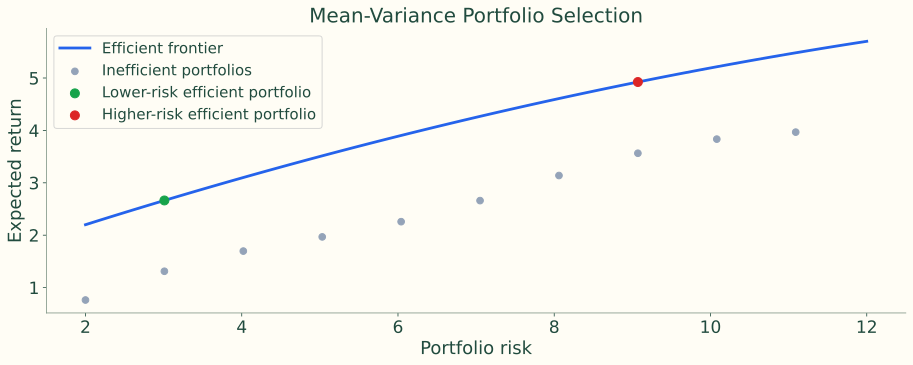{.figure}

Stylized source illustration: the highest expected return at each risk level. The choice along the frontier depends on risk tolerance.

## Separate common shocks from security-specific events

<div class="comparison"><div><h3>Systematic</h3><p>Treasury curve changes, spread widening, mortgage prepayments, and volatility shocks affect many securities.</p></div><div><h3>Idiosyncratic</h3><p>A downgrade, unusual pool prepayments, or one issue’s liquidity problem affects particular holdings.</p></div></div>

A 75 bp Treasury rise is a common shock; one bank downgrade is an issuer event. Duration neutrality does not remove concentration risk.

## The covariance count grows rapidly

$$
\text{Pairwise covariances}=\frac{N^2-N}{2}
$$

| Candidate bonds | Covariances |
|---:|---:|
| 100 | 4,950 |
| 250 | 31,125 |
| 6,500 | 21,121,750 |

Estimation error, rather than arithmetic, makes direct optimization unstable.

## A small factor set represents many bonds

$$
R_i=\alpha_i+x_{i1}F_1+\cdots+x_{iK}F_K+\epsilon_i
$$

<div class="flow"><span><b>Exposure x</b>Bond sensitivity</span><i>→</i><span><b>Factor shock F</b>Rates, spreads, volatility, currency</span><i>→</i><span><b>Residual ε</b>Issuer and issue-specific return</span></div>

Control duration, key rates, spread duration, quality, sector, convexity, concentration, liquidity, and costs. A manager can be long credit while neutral to Treasury duration.

## Why direct mean-variance optimization is difficult

| Challenge | Portfolio consequence |
|---|---|
| Too many inputs; expected-return error | Unstable weights and false precision |
| Changing correlations | Historical hedges can break |
| Defaults, calls, prepayments | Non-normal and option-like returns |
| Stale prices, odd lots, bid–ask costs | Proposed weights may not be executable |
| Benchmark mandate | Active risk matters more than total variance |

A bond that looks attractive in the model may not have traded in weeks.

## Tracking error measures active-return dispersion

$$
a_t=R_{p,t}-R_{b,t},\qquad TE=\operatorname{SD}(R_p-R_b)
$$

Low portfolio volatility can coexist with high tracking error. High total volatility can coexist with low tracking error if the benchmark shares the same risks.

$$
\sum_i(w_{p,i}-w_{b,i})=0
$$

Active weights sum to zero when both portfolios are fully invested.

## Calculate at one frequency, then annualize

<div class="flow"><span><b>Total returns</b>Portfolio and benchmark each period</span><i>→</i><span><b>Active returns</b>Subtract benchmark</span><i>→</i><span><b>Dispersion</b>Sample standard deviation</span></div>


$$
TE_{annual}=TE_{monthly}\sqrt{12}=TE_{weekly}\sqrt{52}
$$

Square-root scaling assumes the usual uncorrelated-period approximation; frequency and units must agree.

## Two portfolios, one benchmark: January–June

| Month | Benchmark % | A % | A active bp | B % | B active bp |
|---|---:|---:|---:|---:|---:|
| Jan | 0.04 | 0.02 | -2 | 1.05 | 101 |
| Feb | 1.54 | 1.58 | 4 | 2.13 | 59 |
| Mar | 0.00 | 0.04 | 4 | 0.37 | 37 |
| Apr | 0.54 | 0.61 | 7 | 1.01 | 47 |
| May | 0.76 | 0.71 | -5 | 1.44 | 68 |
| Jun | 0.30 | 0.27 | -3 | 0.57 | 27 |

## Two portfolios, one benchmark: July–December

| Month | Benchmark % | A % | A active bp | B % | B active bp |
|---|---:|---:|---:|---:|---:|
| Jul | 0.83 | 0.91 | 8 | 1.95 | 112 |
| Aug | 1.23 | 1.26 | 3 | 1.26 | 3 |
| Sep | 0.76 | 0.69 | -7 | 2.17 | 141 |
| Oct | 0.90 | 0.95 | 5 | 1.80 | 90 |
| Nov | 1.04 | 1.08 | 4 | 2.13 | 109 |
| Dec | 0.28 | 0.02 | -26 | 0.32 | 4 |

## The active-return path reveals the risk

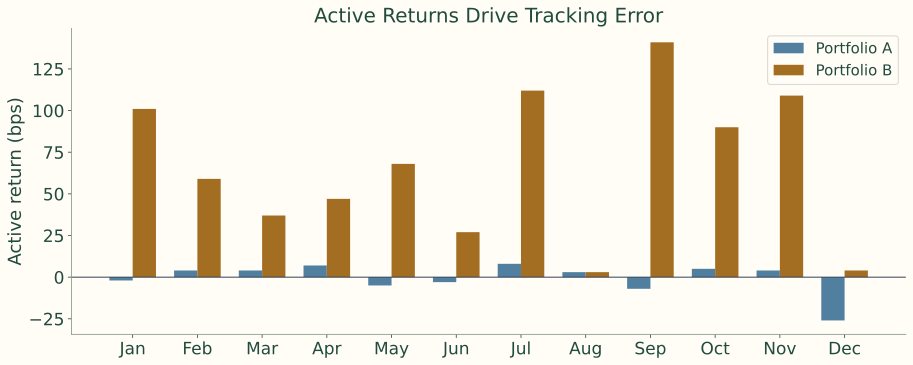{.figure}

Portfolio B may outperform, but larger deviations consume more active-risk budget.

## From active returns to tracking error

$$
TE_m=\sqrt{\frac{\sum_{t=1}^{12}(a_t-\bar a)^2}{11}}
$$

| Portfolio | Monthly TE (bp) | Annualized TE (bp) |
|---|---:|---:|
| A | 9.31 | 32.24 |
| B | 44.70 | 154.84 |

Tracking error measures dispersion around mean active return, not the mean itself.

## Six-month mandate example: the observations

| Month | Active return |
|---|---:|
| 1 | +12 bps |
| 2 | -8 bps |
| 3 | +5 bps |
| 4 | +22 bps |
| 5 | -18 bps |
| 6 | +4 bps |

$$
\bar a=\frac{12-8+5+22-18+4}{6}=2.83\text{ bp}
$$

## Six-month mandate example: the sample dispersion

$$
TE_m=\sqrt{\frac{\sum_{t=1}^{6}(a_t-\bar a)^2}{5}}
$$


$$
\text{Notes: }14.7\text{ bp/month};\quad14.7\sqrt{12}=50.9\text{ bp/year}
$$

<div class="source-issue">Instructor review: The listed observations give 14.20 bp/month and 49.21 bp/year. The source’s 14.7 / 50.9 values do not reproduce.</div>

## Historical and predicted tracking error answer different questions

<div class="comparison"><div><h3>Backward-looking / ex post</h3><p>Realized active returns describe the portfolio actually held in the past.</p></div><div><h3>Forward-looking / ex ante</h3><p>Today’s holdings, exposures, factor covariance, and residual risks estimate future dispersion.</p></div></div>

After 11 benchmark-like months, adding 1.5 years of duration and doubling a credit overweight changes predicted TE immediately. Historical TE still describes the old portfolio.

## Predicted TE combines factor and residual variance

$$
TE=\sqrt{(\Delta\mathbf{x})^{\prime}\Sigma_F(\Delta\mathbf{x})+\sigma_\epsilon^2}
$$

<div class="flow"><span><b>Active exposures</b>What differs from benchmark</span><i>→</i><span><b>Factor covariance</b>Volatility and co-movement</span><i>→</i><span><b>Residual variance</b>Issuer and issue risk</span></div>

## Exposure is sensitivity, aggregated through weights

$$
x_{p,k}=\sum_iw_{p,i}x_{i,k},\qquad x_{b,k}=\sum_iw_{b,i}x_{i,k}
$$


$$
\Delta x_k=x_{p,k}-x_{b,k}
$$

A 2% holding in a bond with duration 6.0 contributes **0.02 × 6.0 = 0.12 years** to portfolio duration.

## Translate tracking error into a model-based range

With expected active return zero and annual TE **100 bp**:

| Approximate normal-model range | Frequency |
|---|---|
| −100 to +100 bp | Roughly two-thirds of years |
| −200 to +200 bp | Roughly 95% of years |

These are model-based ranges, not guarantees. Default and option exposures can make returns non-normal.

## Strategy choice sets the active-risk budget

| Strategy | Typical active risk | Objective |
|---|---|---|
| Pure indexing | Near zero | Replicate after costs |
| Enhanced indexing | Low | Small active gains |
| Active benchmark-aware | Moderate to high | Outperform through views |
| Unconstrained / absolute return | Benchmark may not control risk | Absolute or risk-adjusted return |

## A risk budget must use consistent frequency

$$
150\text{ bp/year}/\sqrt{12}=43.3\text{ bp/month}
$$

An optimizer prediction of **65 bp/month** violates this client limit, even if the manager likes the proposed trades.

## Cell matching turns the benchmark into representative buckets

<div class="flow"><span><b>Define cells</b>Duration, maturity, coupon, sector, rating</span><i>→</i><span><b>Add structural features</b>Calls, sinking funds, MBS coupon/collateral</span><i>→</i><span><b>Choose representatives</b>Match benchmark cell weights</span></div>

A 30% corporate benchmark weight suggests about 30% in corporate cells. An intentional overweight expresses a credit view.

## More detail creates more cells

$$
2\text{ duration groups}\times3\text{ maturities}\times4\text{ sectors}\times4\text{ ratings}=96
$$

Duration ≤5 or >5 years; maturities <5, 5–15, 15+; Treasury, agency, corporate, MBS; AAA, AA, A, BBB.

A **\$50m** portfolio spread over 96 cells can require costly odd lots. Fewer cells reduce cost but increase mismatch risk.

## Sector active weights show the intended tilt

| Sector | Benchmark % | Portfolio % | Active pp |
|---|---:|---:|---:|
| Treasury | 33.3 | 29.5 | −3.8 |
| Agencies | 6.8 | 3.6 | −3.2 |
| Corporates | 26.6 | 34.8 | +8.2 |
| Agency MBS | 33.3 | 29.0 | −4.3 |

<div class="source-issue">Instructor review: The source portfolio weights sum to 96.9%; an unreported 3.1% allocation is needed for a fully invested portfolio. The plotted differences are retained as stated.</div>

## A cell report makes overweights visible

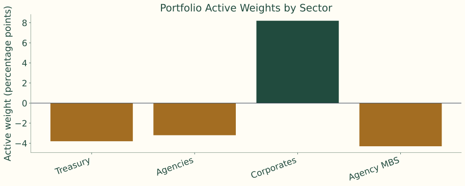{.figure}

Cells do not directly show whether mismatches hedge one another or reinforce one another.

## Exact bond indexing faces trading frictions

| Friction | Why replication is difficult |
|---|---|
| Thousands of issues | Many securities per issuer |
| Infrequent trading | Quoted/index prices may not be executable |
| Bid–ask spread | Purchases can occur above benchmark marks |
| Coupons, maturities, calls, amortization | Cash needs reinvestment |
| Eligibility and new issuance | Benchmark turnover |

## Transaction costs create immediate performance drag

$$
\$100{,}000{,}000\times0.0012=\$120{,}000
$$

Buying 1,000 small positions at an average **12 bp** execution cost loses 12 bp before any active decision. Sampling reduces cost and complexity; cells or factors control the resulting mismatch.

## Cell matching can hide issuer risk

<div class="comparison"><div><h3>Portfolio X</h3><p>20% in BBB industrials, 5–7 year maturities: 40 issuers × 0.5%.</p></div><div><h3>Portfolio Y</h3><p>Same 20% cell weight: 4 issuers × 5%.</p></div></div>

Matching the cell does not match idiosyncratic risk. Too many cells raise cost; too few hide mismatches. Representative bonds and changing benchmark composition add further error.

## Comprehensive cell example: define the grid

| Dimension | Buckets |
|---|---|
| Sector | Treasury, agency, corporate, MBS |
| Maturity | 0-3 years, 3-7 years, 7+ years |
| Credit quality | AAA/AA, A, BBB |
| Coupon type | Fixed-rate, floating-rate |

$$
4\times3\times3\times2=72\text{ possible cells}
$$

## Assign benchmark bonds to the important cells

| Cell | Sector | Maturity | Credit quality | Coupon type | Benchmark weight |
|---|---|---:|---|---|---:|
| 1 | Treasury | 3-7 years | AAA/AA | Fixed-rate | 18% |
| 2 | Corporate | 3-7 years | A | Fixed-rate | 14% |
| 3 | Corporate | 7+ years | BBB | Fixed-rate | 10% |
| 4 | MBS | 3-7 years | AAA/AA | Fixed-rate | 16% |

Each benchmark bond belongs to a cell; total market values determine the cell weights.

## Choose representative securities

| Cell | Benchmark weight | Portfolio weight | Representative holdings |
|---|---:|---:|---|
| Treasury, 3-7 year, AAA/AA, fixed | 18% | 18% | 5-year and 7-year Treasury notes |
| Corporate, 3-7 year, A, fixed | 14% | 13% | Apple, Microsoft, JPMorgan intermediate bonds |
| Corporate, 7+ year, BBB, fixed | 10% | 11% | Utilities, telecom, and energy BBB bonds |
| MBS, 3-7 year, AAA/AA, fixed | 16% | 16% | Agency MBS pass-throughs |

The holdings approximate the benchmark without buying every constituent.

## Check the sampled portfolio’s risk exposures

| Risk measure | Benchmark | Portfolio | Active difference |
|---|---:|---:|---:|
| Effective duration | 6.20 | 6.25 | +0.05 |
| Spread duration | 4.10 | 4.15 | +0.05 |
| Corporate weight | 38% | 39% | +1% |
| BBB weight | 12% | 13% | +1% |
| MBS weight | 16% | 16% | 0% |

Small reported differences suggest close matching, but covariance and concentration still determine predicted tracking error.

## An intentional BBB tilt changes cell weights

| Cell | Benchmark weight | Passive portfolio | Active portfolio |
|---|---:|---:|---:|
| Corporate, 7+ year, BBB, fixed | 10% | 10% | 12% |
| Treasury, 3-7 year, AAA/AA, fixed | 18% | 18% | 16% |

The +2 percentage-point BBB allocation is funded by −2 points in Treasuries. Preserve duration, maturity distribution, diversification, low turnover, and realistic costs.

## Multi-factor models replace millions of pairwise estimates

<div class="flow"><span><b>Rates</b>Level, slope, curvature, key rates</span><i>→</i><span><b>Spreads</b>Swap, corporate rating/sector, securitized</span><i>→</i><span><b>Other risk</b>Volatility, currency, residuals</span></div>

The factor model measures the proposed portfolio relative to the benchmark.

## Three input sets connect holdings to predicted risk

<div class="flow"><span><b>Holdings and weights</b>Accounting system and benchmark provider</span><i>→</i><span><b>Security analytics</b>Cash flows, duration, key rates, convexity</span><i>→</i><span><b>Risk estimates</b>Factor covariance and residual variance</span></div>

Required fields include market value, price, accrued interest, coupon, maturity, issuer, sector, rating, currency, and benchmark weight.

## Measure rate and spread sensitivities

| Exposure | Meaning | Example |
|---|---|---|
| Duration | Sensitivity to parallel interest-rate changes | A duration of 5 means a 100 bp yield rise is roughly a 5% price loss |
| Key rate duration | Sensitivity to specific maturity points on the yield curve | Exposure to the 2-year, 5-year, 10-year, or 30-year point |
| Spread duration | Sensitivity to credit or sector spread changes | A corporate bond may lose value if BBB spreads widen |

## Measure options, classifications, and concentration

| Exposure | Meaning | Example |
|---|---|---|
| Convexity | Curvature in the price-yield relationship | Long callable or mortgage bonds can behave differently when rates move |
| Sector / rating exposure | Weight or spread sensitivity by group | Overweight BBB industrials versus the benchmark |
| Issuer exposure | Active concentration in one issuer | Holding more JPMorgan bonds than the benchmark |

## Covariance describes how shocks move together

<div class="comparison"><div><h3>Factor covariance</h3><p>Estimate from time series of curve, spread, mortgage, volatility, and currency changes.</p></div><div><h3>Residual variance</h3><p>Estimate unexplained issuer/issue returns after common factor effects.</p></div></div>

In a flight to quality, Treasury yields may fall while credit spreads widen. Concentration, illiquidity, lower ratings, and unusual structures can raise residual risk.

## Cross-sectional regressions estimate common factor returns

$$
R_{i,t}=\alpha_t+\sum_{k=1}^{K}x_{ik,t}F_{k,t}+\epsilon_{i,t}
$$

<div class="flow"><span><b>Each date</b>Regress many bond returns on known exposures</span><i>→</i><span><b>Across dates</b>Estimated factor returns form a time series</span><i>→</i><span><b>Risk model</b>Covariance of factors; variance of residuals</span></div>

Group residual estimates by rating, sector, liquidity, and security type. Stale marks can masquerade as idiosyncratic risk.

## Broker fields populate the model; they are not the whole model

| BBB industrial bond screen | Source example |
|---|---:|
| Price | 98.75 |
| Yield | 5.82% |
| OAS | 145 bp |
| Effective / spread duration | 6.4 / 6.1 |
| Indicated bid–ask | 35 bp |

Dealer runs, axes, market depth, TRACE prints, classifications, and analytics inform exposure and cost. A risk system or quant team supplies the full covariance/residual model.

## Compare the active exposures factor by factor

$$
\Delta D=5.60-5.40=+0.20\text{ years}
$$


$$
\Delta SD_{corp}=3.10-2.40=+0.70\text{ years}
$$

An issuer overweight of 2.5 percentage points adds specific risk. Ask what happens if duration rises 0.25 years, which factors dominate, and which trades reduce TE most per dollar of cost.

## Risk decomposition should explain a decision

<div class="flow"><span><b>Interest-rate risk</b>Treasury curve active exposures</span><i>→</i><span><b>Spread / sector risk</b>Credit, mortgage, swap spreads</span><i>→</i><span><b>Idiosyncratic risk</b>Issuer, issue, liquidity, selection</span></div>

Identify whether each source of tracking error is intentional, compensated, and controllable.

## Step 1: isolate the sensitivity to each factor

$$
\text{Isolated TE}_k=|\Delta x_k|\sigma_k
$$

| Risk factor | Active exposure | Monthly factor volatility | Isolated TE |
|---|---:|---:|---:|
| Treasury level | +0.20 years | 30 bps | 6.0 bps |
| 2-year key rate | -0.10 years | 25 bps | 2.5 bps |
| 10-year key rate | +0.15 years | 35 bps | 5.25 bps |
| IG corporate spread | +0.60 years | 18 bps | 10.8 bps |
| Securitized spread | -0.25 years | 16 bps | 4.0 bps |

Units: years × basis points of factor movement = basis points of approximate return.

## The largest isolated risk is the credit overweight

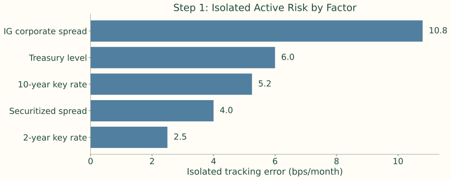{.figure}

Size alone does not make a bet undesirable; the manager must explain why the exposure is intentional.

## Step 2: combine variances, not standard deviations

$$
TE_{systematic}=\sqrt{\sum_kTE_k^2}
$$


$$
\sqrt{6^2+2.5^2+5.25^2+10.8^2+4^2}=14.23\text{ bp/month}
$$


$$
6+2.5+5.25+10.8+4=28.55\text{ bp}\quad\text{(not the uncorrelated TE)}
$$

The simple sum assumes perfectly aligned adverse movements. The square-root sum assumes zero correlations.

## Step 3: covariance can amplify or offset active risk

$$
TE_{systematic}=\sqrt{(\Delta\mathbf{x})^\prime\Sigma_F(\Delta\mathbf{x})}
$$

Treasury active-return TE = **6 bp/month**; credit active-return TE = **10.8 bp/month**.

$$
TE=\sqrt{6^2+10.8^2+2\rho(6)(10.8)}
$$

| Correlation | Combined TE, bp/month |
|---:|---:|
| 0 | 12.35 |
| +0.50 | 14.73 |
| −0.50 | 9.37 |

## Correlation changes the combined risk

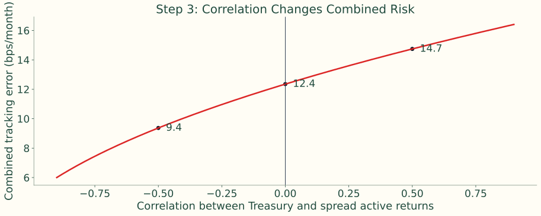{.figure}

Use correlations of signed factor return contributions consistently; isolated TE itself discards the sign of exposure.

## Step 4: add idiosyncratic variance separately

$$
TE_{total}=\sqrt{TE_{systematic}^2+TE_{idio}^2}
$$


$$
\sqrt{14.23^2+8.0^2}=16.33\text{ bp/month}
$$

The model assumes independent systematic and idiosyncratic components. Matching sectors and duration does not remove issuer concentration.

$$
\sigma_\epsilon^2=\sum_i a_i^2\sigma_{\epsilon,i}^2\quad\text{if security residuals are independent}
$$

## Variance shares explain the total tracking error

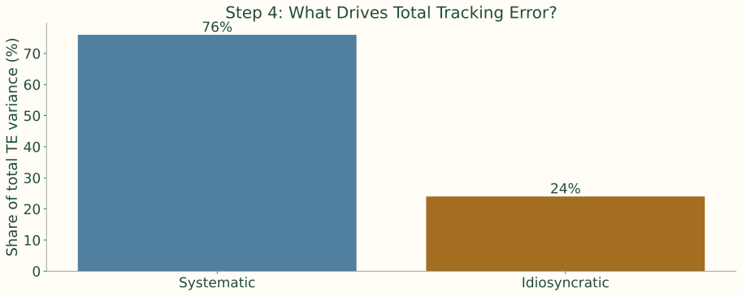{.figure}

The components add in variance terms. Their standard deviations do not add.

## Step 5: scenario returns retain direction

$$
\Delta R_{active}\approx-(\text{active exposure})(\text{factor change})
$$

| Factor | Active years | Shock bp | Active return bp |
|---|---:|---:|---:|
| Treasury level | +0.20 | +40 | −8.00 |
| 2Y key rate | −0.10 | +20 | +2.00 |
| 10Y key rate | +0.15 | +50 | −7.50 |
| IG spread | +0.60 | +25 | −15.00 |
| Securitized spread | −0.25 | +15 | +3.75 |
| **Total** | | | **−24.75** |

## The scenario shows which bets help and hurt

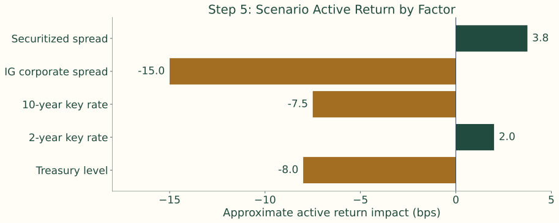{.figure}

Rate rises and spread widening hurt the long exposures. Underweight securitized spread risk helps. Isolated TE shows size; scenarios show direction.

## Step 6: equal duration can hide curve-shape risk

| Key rate | Portfolio | Benchmark | Active |
|---|---:|---:|---:|
| 2Y | 0.70 | 1.00 | −0.30 |
| 5Y | 1.35 | 1.30 | +0.05 |
| 10Y | 2.10 | 1.70 | +0.40 |
| 30Y | 1.25 | 1.40 | −0.15 |
| **Total** | **5.40** | **5.40** | **0.00** |

## The same total duration sits at different maturities

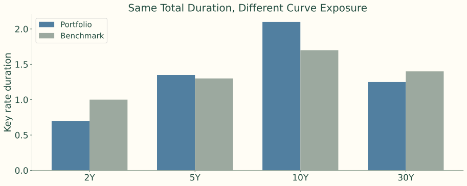{.figure}

Underweight the front end; overweight the 10-year point. The portfolio is not neutral to curve shape.

## A steepening scenario exposes the hidden mismatch

2Y yield falls **20 bp**; 10Y yield rises **40 bp**.

$$
-(-0.30)(-20)-(+0.40)(+40)=-6-16=-22\text{ bp}
$$

This is before smaller 5Y and 30Y effects. Duration matching would miss the loss.

## Step 7: turn decomposition into action

| Diagnostic question | Example decision |
|---|---|
| Is this risk intentional? | Keep a corporate spread overweight if it reflects a credit view. |
| Is this risk compensated? | Reduce issuer concentration if it adds TE without expected alpha. |
| Is this risk hedgeable? | Use Treasury futures to neutralize unwanted duration. |
| Is this risk diversifiable? | Replace a concentrated issuer position with several similar bonds. |

A marginal risk contribution asks how TE changes when a position increases slightly. A small trade can be expensive if it reinforces existing concentrations.

## An optimizer chooses the combined portfolio

$$
\mathbf w=(w_1,w_2,\ldots,w_N)
$$

<div class="flow"><span><b>Candidate holdings</b>Tradable bonds and current positions</span><i>→</i><span><b>Weights</b>Determine exposures, costs, concentrations</span><i>→</i><span><b>Constraints</b>Define allowed portfolios</span></div>

Inputs include benchmark holdings, clean prices plus accrued, views, analytics, covariance, bid–ask costs, liquidity, and turnover limits.

## The objective depends on the mandate

$$
\min_{\mathbf w}TE(\mathbf w)
$$

Passive / enhanced indexing: seek a close benchmark match.

$$
\max_{\mathbf w}\left[E(R_p-R_b)-\lambda TE(\mathbf w)^2-TC(\mathbf w)\right]
$$

Active management: trade expected alpha against risk and cost. Larger λ places more weight on avoiding active risk.

## Mandate constraints bound portfolio risk

| Constraint type | Example |
|---|---|
| Budget | Portfolio market value must equal available capital |
| Long-only | No short positions: $w_i \ge 0$ |
| Risk budget | Predicted tracking error must be below the client limit |
| Duration | Active duration must stay between -0.25 and +0.25 years |
| Sector | Corporate active weight must stay within +/-5% |

## Implementation constraints make the result tradable

| Constraint type | Example |
|---|---|
| Issuer | Active issuer weight cannot exceed 3% |
| Liquidity | Avoid bonds below a minimum issue size or trading frequency |
| Trade size | Avoid tiny odd-lot trades that are operationally inefficient |
| Turnover and cost | Total transaction cost must stay below a budget |

## Infeasible constraints reveal a tradeoff

A 50-bond limit, tight TE budget, large credit overweight, and low trading-cost budget may conflict.

The model can identify the conflict; the manager must decide which economic tradeoff is acceptable. No optimizer makes an unavailable bond executable.

## A 50-bond enhanced index portfolio: the mandate

**\$100m**, no more than **50 bonds**, no shorts; benchmark duration **5.41**, spread duration **5.27**. Benchmark roughly one-third Treasury, one-third credit-like sectors, one-third agency MBS.

| Active requirement | Limit |
|---|---|
| Duration | +0.15 to +0.30 years |
| Spread | +50 to +80 bp |
| Monthly TE | <15 bp |
| Issuer active weight | ≤3% |

## Candidate portfolio: check the requested tilts

| Measure | Portfolio | Benchmark | Difference |
|---|---:|---:|---:|
| Duration | 5.56 | 5.41 | 0.15 |
| Spread duration | 5.37 | 5.27 | 0.10 |
| Convexity | 0.11 | 0.06 | 0.05 |
| Spread | 107 bps | 57 bps | 50 bps |

Duration and spread satisfy the stated tilts. Predicted TE and issuer concentration still need to pass the other constraints.

## Toy universe: five representative bonds

| Bond | Yield % | Duration | Spread duration | Weight % |
|---|---:|---:|---:|---:|
| Treasury 5Y | 4.3 | 4.6 | 0.0 | 25 |
| Treasury 10Y | 4.6 | 8.2 | 0.0 | 15 |
| Agency MBS | 5.1 | 4.1 | 3.2 | 25 |
| A industrial | 5.4 | 5.7 | 5.4 | 20 |
| BBB financial | 6.0 | 6.1 | 5.8 | 15 |

\$10m portfolio; target duration about 5.0, spread duration about 3.0; ≥30% Treasury, ≤40% corporate.

## Toy constraints: full investment and sector limits

$$
\sum_iw_i=1,\quad w_i\ge0
$$


$$
\sum_iw_i\mathbf1_{Treasury,i}\ge30\%,\quad\sum_iw_i\mathbf1_{Corporate,i}\le40\%
$$


$$
\sum_iw_iD_i\approx5.0,\qquad\sum_iw_iSD_i\approx3.0
$$

The stated weights are a feasible illustration, not output from a full industrial optimizer.

## Compute the chosen portfolio’s exposures

$$
D_p=.25(4.6)+.15(8.2)+.25(4.1)+.20(5.7)+.15(6.1)=5.46
$$


$$
SD_p=.25(0)+.15(0)+.25(3.2)+.20(5.4)+.15(5.8)=2.75
$$

Weighted yield **5.02%**; Treasury weight **40%**; corporate weight **35%**. Targets are approximate; real constraints also include lot sizes, costs, taxes, and predicted TE.

## Compare achieved and desired exposures

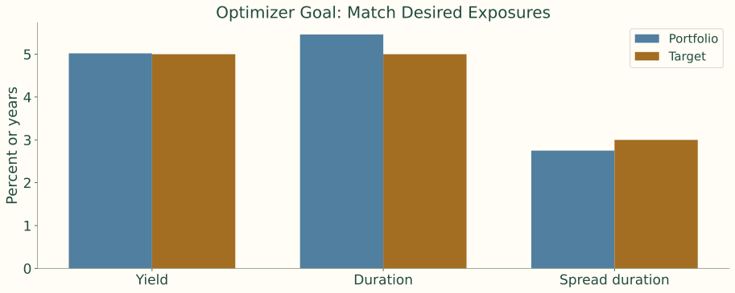{.figure}

Yield is in percent; duration measures are in years. Portfolio construction combines weights to approach several targets together.

## Read optimizer output as a diagnostic report

| Output | Question to ask |
|---|---|
| Predicted tracking error | Is the portfolio inside the active-risk budget? |
| Factor risk decomposition | Which exposures are driving active risk? |
| Trade list | Are the trades executable in realistic size? |
| Transaction cost estimate | Is the expected benefit large enough to pay for the trades? |
| Constraint shadow prices or binding constraints | Which limits are forcing the solution? |
| Issuer and sector active weights | Is the portfolio taking unintended concentration risk? |

A binding issuer cap means adding one preferred bond requires reducing another holding of that issuer or changing the mandate.

## Views and constraints meet in an implementation loop

<div class="flow"><span><b>Views + benchmark</b>Desired active exposures</span><i>→</i><span><b>Risk model + optimizer</b>Measure and choose weights</span><i>→</i><span><b>Trader review</b>Prices, size, liquidity, costs</span><i>→</i><span><b>Monitor</b>Rebalance when needed</span></div>

Optimization makes tradeoffs explicit; judgment checks that intended risks survive implementation.

## Rebalancing starts from existing holdings

Exposures drift with benchmark changes, maturities, calls, amortization, rating changes, client cash flows, market moves, and revised views.

The aim is risk control or improved expected active return **net of trading costs**.

## Rebalancing example: reduce the bank overweight

<div class="flow"><span><b>Before</b>Banks +8%; target cap +5%</span><i>→</i><span><b>Sell $5m banks</b>No more than 15 trades</span><i>→</i><span><b>Buy</b>Treasury $2m; MBS $1.5m; industrials $1.5m</span></div>

| Risk, bp/month | Before | After |
|---|---:|---:|
| Systematic | 4.6 | 4.2 |
| Idiosyncratic | 7.8 | 7.8 |
| Total (source rounded) | 9.0 | 8.8 |

At 6 bp cost for about 0.2 bp lower monthly TE, assess the benefit against implementation cost.

## A separate before/after illustration checks all limits

| Exposure | Before | After | Limit | Unit |
|---|---:|---:|---:|---|
| Duration gap | 0.32 | 0.18 | 0.25 | years |
| Corporate active weight | 9.5 | 6.2 | 8.0 | % |
| Bank active weight | 8.0 | 5.0 | 5.0 | % |
| Issuer concentration | 4.2 | 2.9 | 3.0 | % |
| Predicted TE | 14.8 | 10.6 | 12.0 | bp/month |

These plot inputs differ from the previous small-risk-reduction example in the notes; keep the two illustrations separate.

## Bring breaches inside limits while preserving views

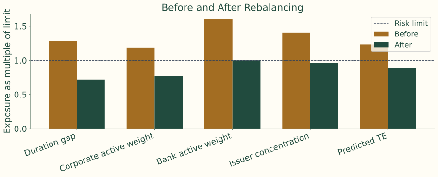{.figure}

A ratio above one breaches the limit. The after-trade portfolio retains a corporate overweight.

## Additional trades have diminishing risk benefits

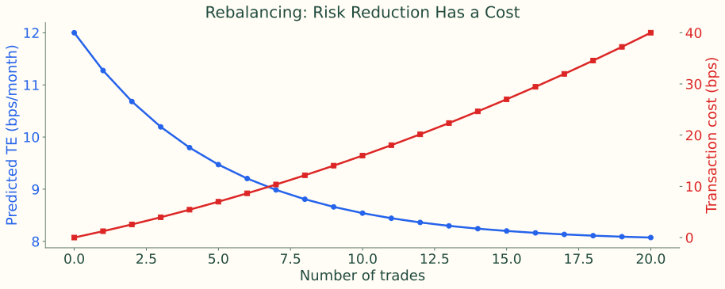{.figure}

Illustrative source curves: early trades remove the largest unwanted risks; later trades add cost for smaller TE reductions.

## Portfolio construction connects risk to implementable choices

<div class="flow"><span><b>Holdings</b>Create factor and specific exposures</span><i>→</i><span><b>Covariance</b>Turns active sensitivities into TE</span><i>→</i><span><b>Constraints and costs</b>Turn views into feasible trades</span></div>

Use historical TE to review the past; predicted TE to control today’s positions. Rebalance risk that is large, unintended, uncompensated, or outside limits.

## Readings and data resources

Fabozzi, **Chapter 25: Bond Portfolio Construction**.

- [SEC Form N-PORT holdings](https://www.sec.gov/data-research/sec-markets-data/form-n-port-data-sets)
- [FINRA fixed-income / TRACE data](https://www.finra.org/finra-data/fixed-income)
- [Federal Reserve Financial Accounts](https://www.federalreserve.gov/releases/z1/)
