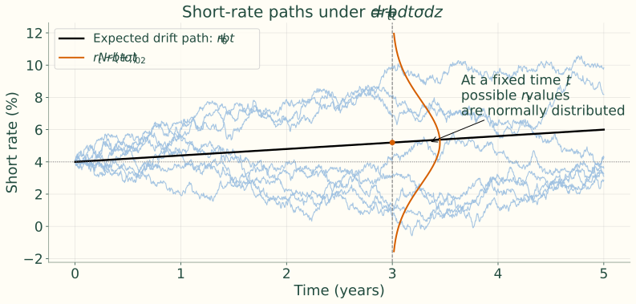
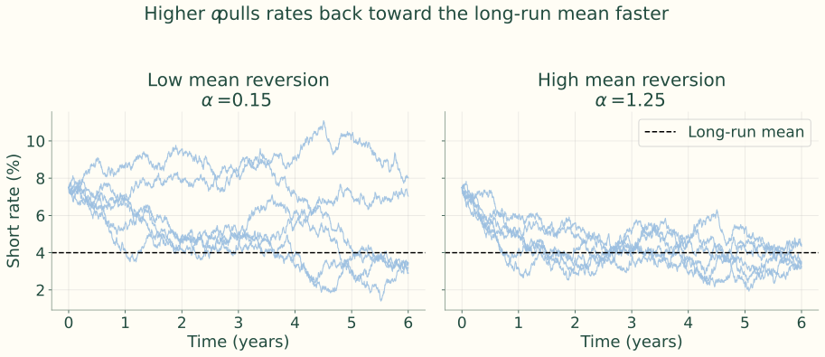
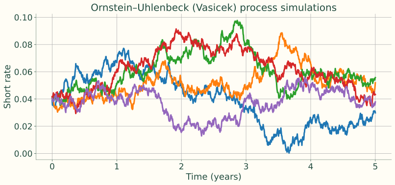
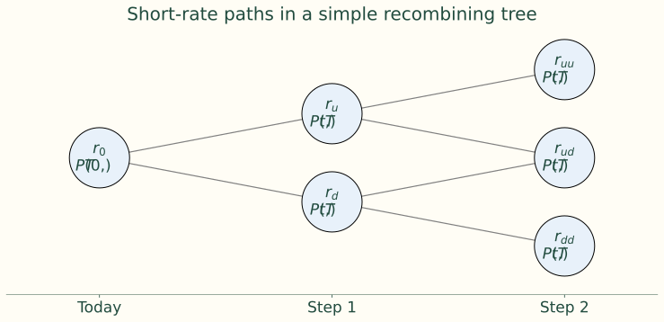
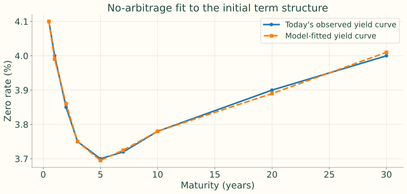
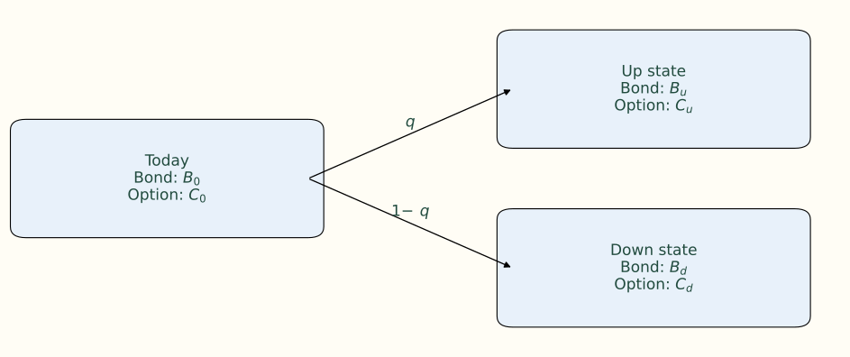

## A model is a simplified answer to a specific question

<b>Reality</b>Many economic relationships<i>→</i><b>Model</b>Selected equations, assumptions, parameters<i>→</i><b>Decision</b>Value, compare, predict, or manage risk

A useful model captures the features that matter for the decision. It need not reproduce every detail or predict the exact future path.

## Fixed-income modeling begins with discounting

$$
P=\sum_iCF_iP(0,t_i)
$$

Known payments and a discount curve can be enough to value a plain bond. Models also support duration, convexity, spreads, scenarios, stress tests, and relative value.

Callable bonds, MBS, caps, floors, swaptions, and structured notes need future states because payments or exercise can change.

## An interest-rate model adds a rule for future movement

$$
dr_t=b\,dt+\sigma\,dz_t
$$

<b>Short rate rₜ</b>Chosen state variable<i>→</i><b>Drift b dt</b>Expected local movement<i>→</i><b>Shock σ dzₜ</b>Unexpected movement

Possible paths inform future yield curves, portfolio gains/losses, calls, option values, and volatility effects.

## A snapshot and a process serve different purposes

<h3>Yield curve</h3>
Today’s discount factors summarize current market prices.

<h3>Interest-rate model</h3>
A probabilistic rule generates possible future rates and curves.

Known cash flows often need only the snapshot; rate-dependent cash flows need dynamics.

## One-factor dynamics use one Brownian source

$$
dr_t=b\,dt+\sigma\,dz_t
$$

$$
\mathbb E[dz_t]=0,\qquad\operatorname{Var}(dz_t)=dt
$$

In the simplest normal model, b and σ are constants. With b = 0, the expected change is zero and variance over horizon T is σ²T.

## Random shocks scale with the square root of time

$$
\Delta z_t\approx\sqrt{\Delta t}\,\varepsilon,\qquad\varepsilon\sim N(0,1)
$$

$$
\Delta r_t\approx b\Delta t+\sigma\sqrt{\Delta t}\,\varepsilon
$$

Halving the time step multiplies shock size by √(1/2), not 1/2. Drift scales with time; random dispersion scales with its square root.

## Drift defines the center, volatility the dispersion

Source simulation: r₀ = **4%**, b = **0.4 percentage points/year**, σ = **1.5 percentage points/√year**, T = **5 years**, daily steps, **8 paths**.

$$
r_t\sim N(r_0+bt,\sigma^2t)
$$

At three years, expected rate = **5.2%** and standard deviation = **1.5%√3 ≈ 2.60 percentage points**.

## Possible paths wander around the drift path

{.figure}

Simulated source paths with seed 7. The bell curve at year 3 illustrates the cross-sectional distribution at a fixed date.

## An Itô process allows state- and time-dependent dynamics

$$
dr_t=b(r_t,t)\,dt+\sigma(r_t,t)\,dz_t
$$

Drift and volatility can depend on the current rate and on time. These functions are the building blocks of one-factor term-structure models.

## Mean reversion pulls toward a long-run level

$$
b(r_t,t)=-\alpha(r_t-\bar r),\qquad\alpha>0
$$

<h3>Rate above the mean</h3>
Negative drift pulls downward.

<h3>Rate below the mean</h3>
Positive drift pulls upward.

Larger α means a faster pull toward the mean; it does not eliminate random shocks.

## Compare slow and fast mean reversion

Common inputs: r₀ = **7.5%**, long-run mean **4%**, σ = **1.2%**, horizon **6 years**, daily steps, **6 paths**.

The same random shocks are used for α = **0.15** and α = **1.25**.

$$
\mathbb E_t[r_T]=\bar r+(r_t-\bar r)e^{-\alpha(T-t)}
$$

The initial rate’s influence decays more quickly at higher α. This conditional-mean formula is retained from the existing deck.

## Higher mean reversion shortens the return toward the mean

{.figure}

Source simulation, seed 12; both panels use the same shock matrix.

## CEV specifies how volatility changes with the rate

$$
\sigma(r_t,t)=\sigma_0r_t^\gamma
$$

| γ | Volatility | Model family named in notes |
|---:|---|---|
| 0 | Constant | Vasicek / normal |
| 1 | Proportional to rate | Dothan / lognormal |
| ½ | Proportional to √rate | CIR / square-root |

These are volatility specifications; the full named model also requires its drift specification.

## Square-root volatility and mean reversion work together

$$
dr_t=-\alpha(r_t-\bar r)\,dt+\sigma_0\sqrt{r_t}\,dz_t
$$

The shock term vanishes as r approaches zero. With appropriate parameters, the continuous-time CIR process stays nonnegative. Strict positivity needs stronger restrictions than nonnegativity.

Constant-volatility normal models can cross zero; positive-rate lognormal models cannot.

## Ornstein–Uhlenbeck / Vasicek simulation: the setup

$$
\Delta r=-\alpha(r-\bar r)\Delta t+\sigma_0\sqrt{\Delta t}\,\varepsilon
$$

| Parameter | Source value |
|---|---:|
| Mean-reversion speed α | 0.5 |
| Long-run rate | 5% |
| Volatility σ₀ | 2% |
| Initial rate | 4% |
| Horizon / time step | 5 years / 1/252 year |
| Paths | 5 |

## OU paths combine a restoring drift with random shocks

{.figure}

Rates on this source plot use decimal units: 0.05 means 5%. Simulated paths illustrate uncertainty, not forecasts.

## No-arbitrage models begin with observed prices

<b>Benchmark instruments</b>Treasuries, swaps, and other liquid prices<i>→</i><b>Calibrate</b>Fit the initial term structure<i>→</i><b>Value targets</b>Price consistently with fitted benchmarks

The model imposes internally consistent no-arbitrage pricing. Calibration quality depends on instruments, conventions, and numerical implementation.

## Normal and lognormal no-arbitrage models

| Model | Type | Key features |
|------|------|--------------|
| **Ho–Lee** | Normal | Constant volatility; no mean reversion. Produces normally distributed rate changes. |
| **Hull–White** | Normal | Adds mean reversion to the Ho–Lee model. Useful for pricing callable bonds. |
| **Kalotay–Williams–Fabozzi (KWF)** | Lognormal | Models the logarithm of the short rate; no mean reversion. |

## Mean reversion and forward-rate model families

| Model | Type | Key features |
|------|------|--------------|
| **Black–Karasinski** | Lognormal | Lognormal model with mean reversion. |
| **Black–Derman–Toy** | Lognormal | Lognormal with endogenous mean reversion; calibrates to caps and floors. |
| **Heath–Jarrow–Morton (HJM)** | General | Multi‑factor model specifying the volatility structure of forward rates. Many models (Ho–Lee, Hull–White, KWF, etc.) are special cases. |

## Equilibrium models begin with economic assumptions

<h3>Equilibrium</h3>
Economic fundamentals and investor preferences motivate dynamics; historical estimation need not fit today’s entire curve.

<h3>No-arbitrage</h3>
Fit observed market prices, then price other claims consistently.

Vasicek and CIR are one-factor examples; Brennan–Schwartz and Longstaff–Schwartz use two factors. Equilibrium models provide economic intuition; market calibration is especially useful for derivatives.

## Use a stochastic rate model when the payoff requires it

$$
P=\sum_iCF_iP(0,t_i)
$$

P(0,tᵢ) is today’s price of a unit payment at tᵢ. Bootstrap discount factors from benchmark instruments.

A Hull–White model fitted to the same curve reproduces the same time-0 plain-bond value. That checks consistency but adds little to fixed-payment discounting.

## Cash-flow dependence determines the valuation method

| Feature | Plain fixed‑rate bond | Callable bond or rate derivative |
|---|---|---|
| Cash flows | Fixed or mostly fixed | State‑dependent cash flows |
| Main valuation input | Today's bootstrapped discount curve | Future yield curves generated by a model |
| Typical method | Discounted cash flow | Backward induction, lattice, or simulation |
| Exercise decision | None | Compare continuation value with exercise value |
| Examples | Treasury bond, fixed‑rate corporate bond | Callable bond, MBS, cap, floor, swaption |

Callable/putable bonds, MBS, caps, floors, swaptions, and structured notes depend on future rates or exercise.

## A path implies a discount factor

$$
D(0,T;\text{path})=\exp\left(-\int_0^Tr_s\,ds\right)
$$

$$
P(0,T)=\mathbb E^{\mathbb Q}\left[\exp\left(-\int_0^Tr_s\,ds\right)\right]
$$

Average discounted payoffs under the risk-neutral measure Q. A single realized path discount factor is different from the bond price, which averages over paths.

## Bond prices imply continuously compounded zero rates

$$
y(0,T)=-\frac{\log P(0,T)}T
$$

<b>Short-rate process</b>Generates paths<i>→</i><b>Path discounting</b>Integrate rates<i>→</i><b>Risk-neutral expectation</b>Zero-coupon prices<i>→</i><b>Log transform</b>Yield curve

## Future nodes imply future curves

$$
P(t,T)=\mathbb E_t^{\mathbb Q}\left[\exp\left(-\int_t^Tr_s\,ds\right)\right],\qquad T>t
$$

<h3>P(0,T)</h3>
Observed or calibrated today.

<h3>P(t,T), t > 0</h3>
Generated by the model at a future state.

In one-factor Hull–White, time and the short-rate state determine the full future curve. Each future node supplies discount factors for remaining payments.

## A tree organizes the future states

{.figure}

Branches represent possible future rates. Recombination merges paths reaching the same state; exercise is checked at eligible future nodes.

## Hull–White extends Vasicek to fit today’s curve

$$
dr_t=[\theta(t)-ar_t]dt+\sigma dW_t
$$

| Input | Role |
|---|---|
| a | Speed of mean reversion |
| σ | Short-rate volatility |
| θ(t) | Time-dependent drift function |
| Wₜ under Q | Risk-neutral Brownian motion |

## The curve fit comes from a function, not two scalars

<h3>θ(t)</h3>
An entire function of time chosen to fit the initial discount curve.

<h3>a and σ</h3>
Control future dynamics and are often calibrated to liquid rate-option prices.

Two scalar parameters could not generally fit an arbitrary observed curve. Hull–White adds market-consistent future scenarios and curves for contingent cash flows.

## Initial-curve fit: the source schematic

{.figure}

Illustrative input curve, not live market data. The source plot deliberately offsets the fitted points by up to 1 bp; it illustrates a near fit rather than a numerical calibration result.

## Calibration separates current prices from future dynamics

<b>1 Bootstrap</b>Infer market discount factors<i>→</i><b>2 Fit θ(t)</b>Match zero-coupon prices<i>→</i><b>3 Fit a and σ</b>Use caps, floors, swaptions

4. Price the target with a lattice, finite differences, or simulation.

Plain fixed cash flows often need step 1; future-rate-dependent claims need the additional steps.

## Pricing workflow: generate future decision states

<b>Observed curve</b>P(0,T)<i>→</i><b>Calibrate Hull–White</b>Initial curve and option prices<i>→</i><b>Generate rₜ</b>Trees or paths<i>→</i><b>Generate P(t,T)</b>Future discount factors

## Pricing workflow: exercise and discount backward

<b>Remaining payments</b>Value at the future curve<i>→</i><b>Exercise decision</b>Compare continuation and exercise<i>→</i><b>Discount backward</b>Recover today’s value

Complexity enters through optionality, prepayments, changing cash flows, portfolio risk, and credit/liquidity/spread modeling.

## Historical evidence is regime dependent

The notes describe Treasury evidence from the late 1970s to the 2000s: volatility rose with rate levels above roughly 10%, but the link weakened in lower-rate regimes.

<h3>Normal specification</h3>
Constant absolute volatility can be useful in lower-rate regimes.

<h3>Level-dependent specification</h3>
Square-root or proportional volatility can capture a stronger rate-level link.

The 10% division is a historical description in the notes, not a universal model-selection threshold.

## Negative rates test the model’s support

<h3>Normal models</h3>
Allow negative rates.

<h3>Positive-rate lognormal models</h3>
Exclude negative rates by construction.

The notes cite U.S. Great Depression Treasury bills and late-1990s yen deposits.

Instructor review: The notes’ claim that negative rates are rare and pricing effects are small is parameter- and regime-dependent. It should not be taught as a general guarantee.

## Select the model for the payoff, data, and computation

| Criterion | Decision |
|---|---|
| Purpose | Market-consistent valuation or economic insight? |
| Volatility and support | Constant, square-root, or proportional; can rates be negative? |
| Tractability | Calibration speed, lattice/simulation cost, transparency |
| Data | Reliable current prices or long historical series? |

Use sufficient factors and volatility structure for the payoff. The simplest robust model is often preferable.

## Historical volatility starts with changes, not levels

$$
\Delta r_t=r_t-r_{t-1},\qquad\hat\sigma_{annual}=s(\Delta r_t)\sqrt N
$$

Weekly observations use N = 52. The notes mention 250 or 260 trading days for daily data; simulations earlier use 252. State the chosen convention.

Sampling frequency, estimation window, and market regime change the estimate.

## Ten weekly rates produce nine changes

| Week | Rate (%) | Weekly change ($\Delta r_t$, bps) |
|----|------|------------------|
| 1  | 2.00 | – |
| 2  | 2.05 | +5 |
| 3  | 2.04 | −1 |
| 4  | 2.08 | +4 |
| 5  | 2.02 | −6 |
| 6  | 2.10 | +8 |
| 7  | 2.09 | −1 |
| 8  | 2.12 | +3 |
| 9  | 2.15 | +3 |
| 10 | 2.14 | −1 |

All data are artificial. A 5 bp change is 0.0005 in decimal rate units.

## Volatility calculation: center and square the changes

$$
\bar{\Delta r}=14/9=1.556\text{ bp}
$$

$$
s^2=\frac1{9-1}\sum_{i=1}^9(\Delta r_i-\bar{\Delta r})^2
$$

The notes print squared-deviation sum **94.22**, sample variance **11.78 bp²**, weekly SD **3.43 bp**, and annual SD **24.7 bp**.

Instructor review: There are nine changes, not eight. The listed data give squared-deviation sum 140.22, variance 17.53 bp², weekly SD 4.19 bp, and annual SD 30.19 bp.

## Annualize the reproducible calculation

$$
\sum(\Delta r_i-\bar{\Delta r})^2=140.2222\text{ bp}^2
$$

$$
s_{weekly}=\sqrt{140.2222/8}=4.1866\text{ bp}
$$

$$
s_{annual}=4.1866\sqrt{52}=30.1901\text{ bp}
$$

These calculations use the exact nine changes shown on the preceding slides; source values remain visible for instructor review.

## Implied volatility inverts a pricing model

<b>Observed option price</b>Cap, floor, or swaption<i>→</i><b>Chosen pricing model</b>Price as a function of volatility<i>→</i><b>Solve for σ</b>Volatility priced by that model

<h3>Historical</h3>
Describes past rate changes.

<h3>Implied</h3>
Reflects current option pricing, expectations, and risk premiums.

## The existing course demo supports the distinction

`demo_interest_rate_models.qmd` illustrates observed versus synthetic inputs, Vasicek estimation, Hull–White fitting, path simulation, and model comparison.

Use it to separate historical estimation from market calibration. The deck’s simulations are reproducible source illustrations, not estimated forecasts.

## An option is a right, not an obligation

Fixed-income underlyings can be bonds, future bond prices, short rates, yield curves, swap rates, or mortgage pools.

Future states determine the payoff. Today’s price must account for several possible outcomes.

## A one-period call has a payoff in each state

$$
C_u=\max(B_u-K,0),\qquad C_d=\max(B_d-K,0)
$$

B₀ is today’s bond value; Bᵤ and B_d are possible future values; K is the exercise price.

## The option tree maps states to payoffs

{.figure}

q and 1−q are pricing probabilities. They are not predictions of the physical frequency of up and down moves.

## Discount the risk-neutral expected payoff

$$
C_0=\frac{qC_u+(1-q)C_d}{1+r}
$$

$$
q=\frac{(1+r)-d}{u-d}
$$

The second formula is the existing deck’s simple stock-style binomial case: Bᵤ = uB₀, B_d = dB₀, no interim payment, and d < 1+r < u. It is not a universal bond-tree probability formula.

## Backward induction works from the final nodes

<b>Terminal states</b>Compute final payoffs<i>→</i><b>One step earlier</b>Expected value, then discount<i>→</i><b>Exercise date?</b>Compare continuation and exercise<i>→</i><b>Repeat</b>Work back to time zero

At multiple exercise dates, the decision is checked at every eligible node.

## Future curves value the remaining payments

$$
V_{continue}(t)=\sum_iCF_iP(t,t_i)
$$

For a callable bond, the issuer owns the exercise right. The future curve determines how expensive it is to leave the old coupon bond outstanding.

## Issuer control creates a minimum for the bondholder

$$
V(t)=\min\{V_{continue}(t),\ \text{call price}\}
$$

<h3>Rates fall</h3>
Remaining high coupons become valuable; if continuation exceeds call price, the issuer calls.

<h3>Rates rise</h3>
Continuation usually falls below call price; the issuer leaves the bond outstanding.

Apply consistent coupon timing at the exercise date.

## The callable-bond decision is a branch

<b>Future curve</b>Discount remaining cash flows<i>→</i><b>Continuation value</b>Compare with call price

<h3>Continuation > call price</h3>
Call: bondholder receives the call price.

<h3>Continuation < call price</h3>
Do not call: bondholder keeps the continuation claim.

## From models to embedded-option valuation

$$
V_{callable}=V_{option\text{-}free}-V_{issuer\ call}
$$

Lecture 8 applies the same chain: future states → remaining values → exercise rule → backward induction. The rate model supplies the future decision states.

## Keep the modeling questions in order

<b>Today</b>What does the observed curve price?<i>→</i><b>Dynamics</b>Which state variable and volatility law?<i>→</i><b>Calibration</b>Which data fit the model?<i>→</i><b>Decision</b>What payoff or exercise rule applies?

Drift, volatility, and mean reversion determine dynamics. Calibration anchors current prices; future cash-flow contingencies determine how much model complexity is useful.

## Readings and official data

Fabozzi, **Chapter 17**.

- [Treasury daily par curves](https://home.treasury.gov/resource-center/data-chart-center/interest-rates/TextView?type=daily_treasury_yield_curve)
- [New York Fed reference rates](https://www.newyorkfed.org/markets/reference-rates)
- [FRED effective federal funds rate](https://fred.stlouisfed.org/series/DFF)
- [Federal Reserve H.15](https://www.federalreserve.gov/releases/h15/)
