## From promised payments to state-dependent cash flows

<div class="flow"><span><b>Option-free</b>Discount a fixed schedule</span><i>→</i><span><b>Embedded option</b>Model future rates and exercise</span><i>→</i><span><b>Price and risk</b>Value the resulting cash flows</span></div>


$$
P=\sum_t CF_tP(0,t)
$$

Calls, investor puts, mortgage prepayment and structured coupons make the cash-flow schedule contingent.

## The lecture’s valuation path

<div class="flow"><span><b>Yield spread</b>What does it mix together?</span><i>→</i><span><b>Static spread</b>Use the full spot curve</span><i>→</i><span><b>Rate lattice</b>Make exercise state dependent</span><i>→</i><span><b>OAS and risk</b>Reprice with the option</span></div>

## Traditional spread compresses the cash-flow schedule

$$
\text{Yield spread}=YTM_{\mathrm{bond}}-YTM_{\mathrm{Treasury}}
$$

<div class="comparison"><div><h3>One yield</h3><p>YTM summarizes many dated cash flows. Realizing it requires the relevant reinvestment assumptions.</p></div><div><h3>Several risks</h3><p>Credit, liquidity and embedded options all enter the spread.</p></div></div>

## Why a single spread can mislead

<div class="comparison"><div><h3>Curve mismatch</h3><p>Different cash-flow timing and nonparallel yield curves can distort a same-maturity comparison.</p></div><div><h3>Changing cash flows</h3><p>An embedded option changes payments when rates change; YTM does not model exercise.</p></div></div>

## The quoted spread contains several components

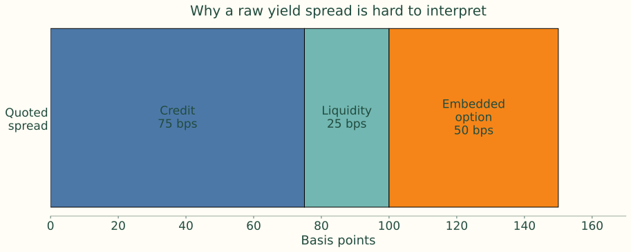{.figure}

Illustrative decomposition: 75 bp credit + 25 bp liquidity + 50 bp option compensation.

## Static spread uses every spot rate

$$
P=\sum_t\frac{CF_t}{(1+r_t+s)^t}
$$

<div class="flow"><span><b>Spot curve</b>Match each payment date</span><i>→</i><span><b>One spread</b>Add the same s at every date</span><i>→</i><span><b>Promised payments</b>Cash flows remain fixed</span></div>

## A constant spread shifts the spot curve

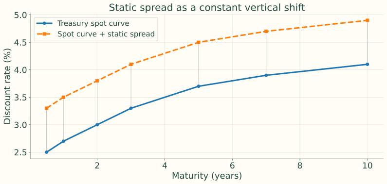{.figure}

The source illustration adds 80 bp at every maturity.

## Static-spread example: set up the payments

<div class="comparison"><div><h3>Bond</h3><p>5 years; face $1,000; 6% annual coupon paid semiannually.</p></div><div><h3>Market</h3><p>Price $1,020; ten dated spot rates, from 2.0% to 4.3%.</p></div></div>

<div class="cash-timeline" data-times='["0", "0.5", "1", "\u2026", "4.5", "5"]' data-flows='["\u2212$1,020", "$30", "$30", "\u2026", "$30", "$1,030"]'></div>

## Keep the discount convention consistent

| Time (years) | .5 | 1 | 1.5 | 2 | 2.5 |
|---|---:|---:|---:|---:|---:|
| Spot rate | 2.0% | 2.2% | 2.6% | 3.0% | 3.4% |

| Time (years) | 3 | 3.5 | 4 | 4.5 | 5 |
|---|---:|---:|---:|---:|---:|
| Spot rate | 3.8% | 4.0% | 4.1% | 4.2% | 4.3% |

The source calculation treats these as **effective annual** spot rates; fractional-year exponents discount the semiannual payments.

## Solve for the spread, rather than averaging yields

$$
1020=\sum_{k=1}^{9}\frac{30}{(1+z_{k/2}+s)^{k/2}}+\frac{1030}{(1+0.043+s)^5}
$$


$$
s=0.01400712\approx140.07\text{ bp}
$$

A larger trial spread lowers present value. Iterate until the price residual is zero.

## Price is nonlinear in the static spread

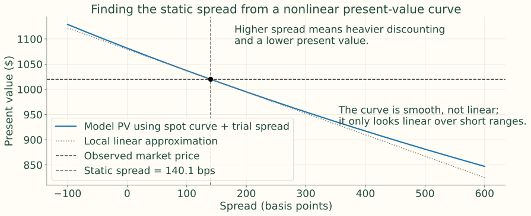{.figure}

The tangent is a local approximation; the curve supplies the solved spread.

## The issuer calls when refinancing becomes attractive

<div class="flow"><span><b>Rates fall</b>The old coupon is expensive</span><i>→</i><span><b>Issuer refinances</b>Redeem at the call price</span><i>→</i><span><b>Investor loses upside</b>Above-market coupons disappear</span></div>

This is the same economic incentive as a borrower refinancing a mortgage.

## Callability matters most in low-rate states

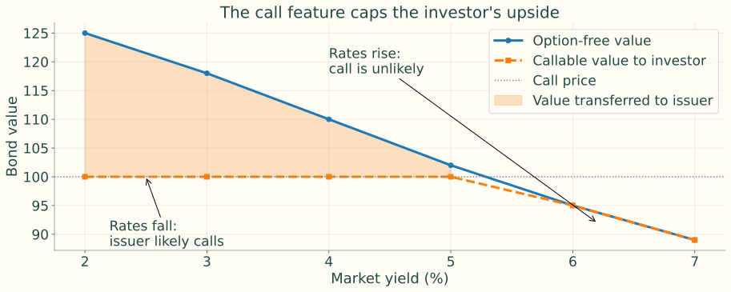{.figure}

Illustrative values at an eligible call date; the minimum rule caps continuation value.

## The option has a price

$$
V_{\mathrm{callable}}=V_{\mathrm{straight}}-V_{\mathrm{call}}
$$

<div class="comparison"><div><h3>High yields</h3><p>Call unlikely; the bond behaves more like an option-free bond.</p></div><div><h3>Low yields</h3><p>Exercise becomes attractive; price appreciation slows and effective maturity shortens.</p></div></div>

## Yield to worst is a reporting convention

$$
YTW=\min\{YTM,\ YTC_1,\ YTC_2,\ldots\}
$$

Use the relevant permitted call dates. The minimum yield does not model the probability of exercise, future volatility or the full term structure.

## The price–yield curve bends near the call region

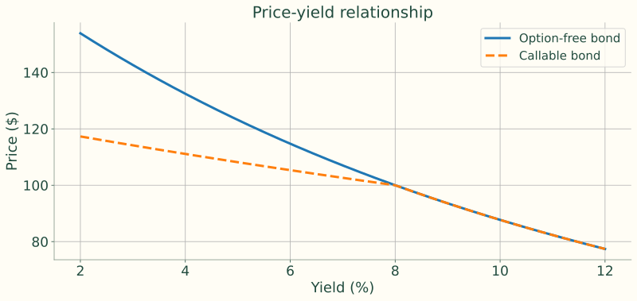{.figure}

Source illustration: 10-year, 8% annual coupon; callable after year 3 at 100. This deterministic illustration is not a calibrated stochastic valuation.

## Separate the bond from the embedded option

$$
V_{\mathrm{callable}}=V_{\mathrm{straight}}-V_{\mathrm{call}}
$$


$$
V_{\mathrm{putable}}=V_{\mathrm{straight}}+V_{\mathrm{put}}
$$

The issuer owns the call; the investor owns the put.

## The call option explains the missing upside

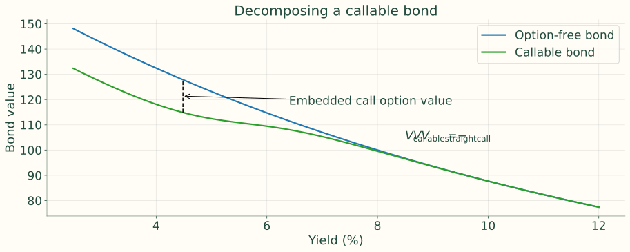{.figure}

The source’s smooth option-value curve is a schematic decomposition, not a calibrated option price.

## Value the final payoff, then work backward

<div class="flow"><span><b>Rate states</b>Construct future short rates</span><i>→</i><span><b>Maturity</b>Set terminal cash flows</span><i>→</i><span><b>Rollback</b>Discount risk-neutral continuation</span><i>→</i><span><b>Exercise</b>Apply the contract at each node</span></div>

## Backward induction reverses the direction of time

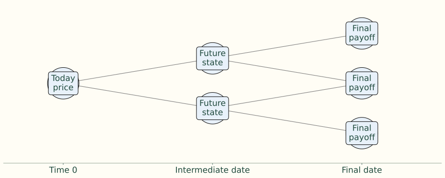{.figure}

Exercise decisions affect the values passed back toward today.

## The notes use values including the current coupon

$$
H_{i,j}=\frac{pV_{i+1,j+1}+(1-p)V_{i+1,j}}{1+r_{i,j}}+CF_i
$$

Here $p$ is the risk-neutral up probability; $r_{i,j}$ discounts the next interval; $CF_i$ is paid at the current node.<div class="source-issue">Instructor review: The worked examples also add CF₀ at time zero. Their quoted prices therefore include an immediate coupon. Keep coupon and redemption timing explicit.</div>

## Exercise replaces continuation value

$$
V^{\mathrm{callable}}_{i,j}=\min\{H_{i,j},K_i\}
$$


$$
V^{\mathrm{putable}}_{i,j}=\max\{H_{i,j},K_i^{\mathrm{put}}\}
$$

Apply these rules only on eligible exercise dates. The notes compare the coupon-inclusive hold value with the stated exercise payment; contract terms determine whether a separate coupon is payable.

## An ex-coupon convention is also possible

$$
V^{\mathrm{hold}}_{i,j}=\frac{C+pV_{i+1,j+1}+(1-p)V_{i+1,j}}{1+r_{i,j}+s}
$$

In this convention, terminal principal is $V_T=F$ and the final coupon enters the preceding rollback. Do not mix it with the notes’ coupon-inclusive terminal value $F+C$.

## A two-node exercise check

<div class="comparison"><div><h3>Low-rate node</h3><p>Hold = $103.20; call price = $101.<br>Investor receives min(103.20, 101) = $101.</p></div><div><h3>High-rate node</h3><p>Hold = $99.40; call price = $101.<br>No call: value remains $99.40.</p></div></div>

## Why the lattice matters economically

<div class="flow"><span><b>Horizontal</b>Time and discounting</span><i>→</i><span><b>Vertical</b>Possible rate states</span><i>→</i><span><b>At each node</b>Continue, call or put</span></div>

The rate path can change the payment schedule. For the simple callable bond, a recombining state tree is sufficient; more complex path-dependent contracts may require additional state variables.

## Three-year example: contract and assumptions

<div class="comparison"><div><h3>Contract</h3><p>Face 100; annual coupon 8; maturity 3 years; call price 107 from year 2.</p></div><div><h3>Tree</h3><p>Annual steps; risk-neutral p = 0.5; initial short rate 6%.</p></div></div>

<div class="source-issue">Instructor review: The following calculations reproduce the notes’ coupon-inclusive convention, including the time-zero coupon.</div>

## The short-rate lattice

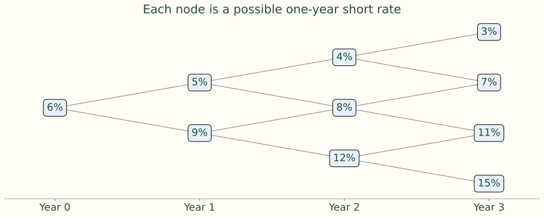{.figure}

Year 3 rates are displayed for completeness; terminal cash flow is already known at maturity.

## Step 1 — set the terminal payoff

$$
V_{3,j}=100+8=108\quad\text{in every state}
$$

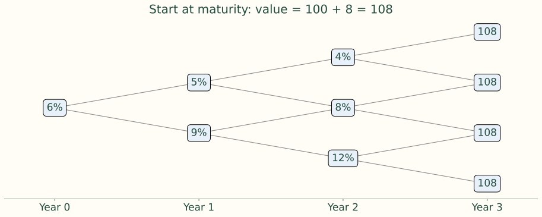{.figure}

## Step 2 — roll back to year 2

$$
H_{2,j}=\frac{0.5(108)+0.5(108)}{1+r_{2,j}}+8
$$

| Rate | Discounted terminal payoff | Current coupon | Hold value |
|---|---:|---:|---:|
| 4% | 103.8462 | 8 | 111.8462 |
| 8% | 100.0000 | 8 | 108.0000 |
| 12% | 96.4286 | 8 | 104.4286 |

## Year 2 values connect adjacent future states

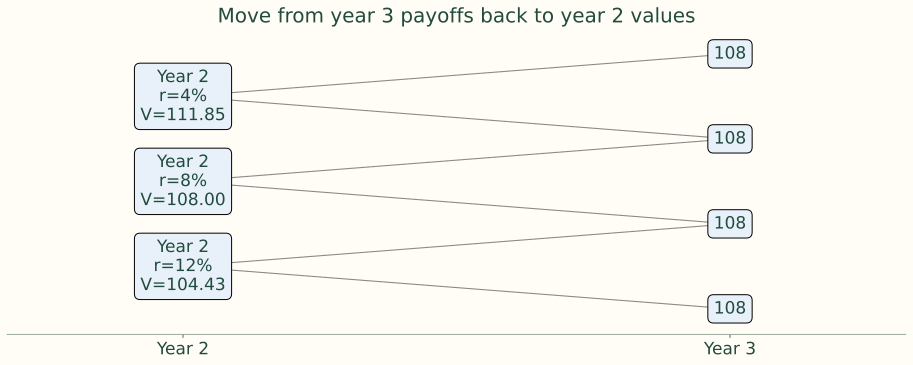{.figure}

## Step 3 — impose the call price at year 2

$$
V_{2,j}^{\mathrm{callable}}=\min(H_{2,j},107)
$$

| Rate | Hold value | Callable value | Decision |
|---|---:|---:|---|
| 4% | 111.8462 | 107.0000 | Call |
| 8% | 108.0000 | 107.0000 | Call |
| 12% | 104.4286 | 104.4286 | Continue |

## The call rule changes only the relevant states

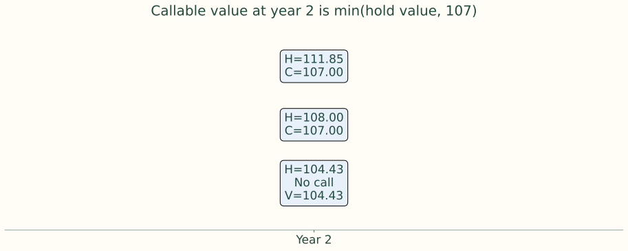{.figure}

## Step 4 — year 1, option-free bond

$$
V_{1,L}=\frac{0.5(108)+0.5(111.8462)}{1.05}+8=112.6886
$$


$$
V_{1,H}=\frac{0.5(104.4286)+0.5(108)}{1.09}+8=105.4443
$$

Use the **uncapped** year-2 values.

## Option-free values roll back through the tree

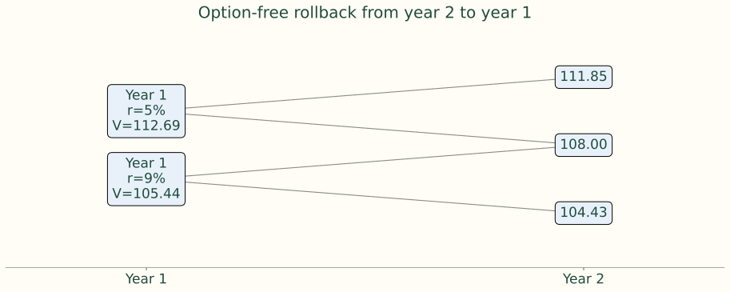{.figure}

## Step 5 — year 1, callable bond

$$
V_{1,L}^{c}=\frac{0.5(107)+0.5(107)}{1.05}+8=109.9048
$$


$$
V_{1,H}^{c}=\frac{0.5(104.4286)+0.5(107)}{1.09}+8=104.9856
$$

Use the **call-adjusted** year-2 values. No call is permitted at year 1.

## Exercise affects values before the first call date

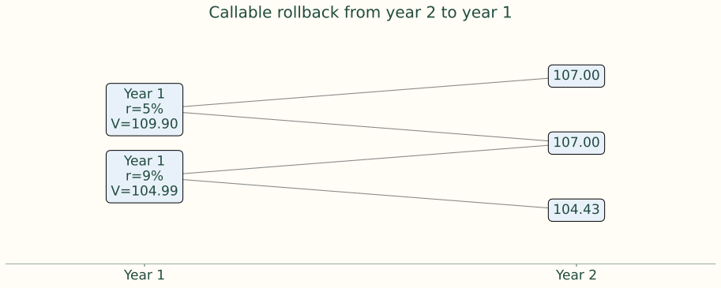{.figure}

## Step 6 — return to time zero

$$
V_0^{s}=\frac{0.5(112.6886)+0.5(105.4443)}{1.06}+8\approx110.8930
$$


$$
V_0^{c}=\frac{0.5(109.9048)+0.5(104.9856)}{1.06}+8=109.3634
$$

The source rounds the straight value to 110.8930; full-precision rollback gives 110.8929 (call value 1.5295). These source values include the immediate coupon of 8; removing only that payment gives 102.8930 and 101.3634 under the same subsequent exercise convention.

## The final rollback brings the option cost to today

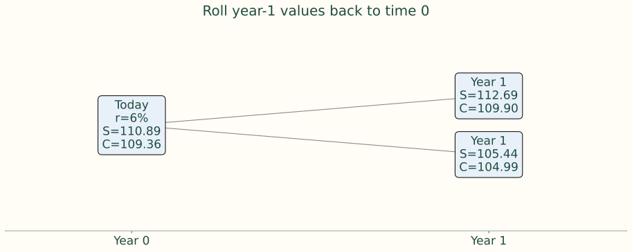{.figure}

## Step 7 — identify the embedded call value

$$
V_{\mathrm{call}}\approx110.8930-109.3634\approx1.5296
$$

<div class="comparison"><div><h3>Straight bond</h3><p>110.89 under the source convention.</p></div><div><h3>Callable bond</h3><p>109.36; investor gives up about 1.53 in value.</p></div></div>

## Put example: the investor controls exercise

<div class="comparison"><div><h3>Contract</h3><p>2 years; face 100; annual coupon 5; put at 100 after year 1.</p></div><div><h3>Tree</h3><p>r₀ = 6%; year-1 rates 4% and 12%; p = 0.5.</p></div></div>


$$
V_{2,j}=100+5=105
$$

## Compare continuation with the put price

$$
H_{1,L}=105/1.04+5=105.9615
$$


$$
H_{1,H}=105/1.12+5=98.7500
$$


$$
V_{1,L}=105.9615,\qquad V_{1,H}=\max(98.75,100)=100
$$

## Roll back the protected value

$$
V_0^{\mathrm{put}}=\frac{0.5(105.9615)+0.5(100)}{1.06}+5=102.1517
$$

The investor exercises in the high-rate state. The source value includes the immediate coupon of 5; excluding it gives 97.1517 under the same later exercise convention.

## The put creates a floor in the adverse state

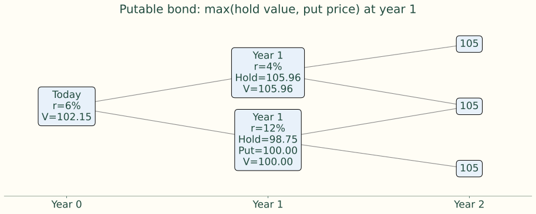{.figure}

## A valuation tree must fit observed prices

<div class="flow"><span><b>Inputs</b>Initial curve, model, volatility, time step</span><i>→</i><span><b>Trial rates</b>Choose the lower rate and node spacing</span><i>→</i><span><b>Benchmark price</b>Roll back the next maturity</span><i>→</i><span><b>Calibration</b>Adjust the level and repeat</span></div>

A plausible-looking simulation tree is not enough for valuation.

## Volatility controls spacing; calibration controls level

$$
u=e^{\sigma\sqrt{\Delta t}},\qquad d=u^{-1}
$$


$$
r_{1,H}=r_{1,L}e^{2\sigma}=4.074\%\,e^{0.20}\approx4.976\%
$$

Accept the pair only if it prices the relevant two-year benchmark correctly. Repeat one maturity at a time.

## Four maturities require four level parameters

$$
r_{t,j}=a_t e^{(2j-t)\sigma}
$$

| Maturity | Zero rate | Market discount factor |
| -------: | --------: | ---------------------: |
| 1 year | 4.00% | 0.96154 |
| 2 years | 4.50% | 0.91573 |
| 3 years | 5.00% | 0.86384 |
| 4 years | 5.25% | 0.81469 |

The source uses annual steps and σ = 10%. Each aₜ fits one additional market discount factor.

## Inspect the calibrated rates and discount factors

| Maturity | Market DF | Calibrated level a_t | Short rates at that date | Tree DF |
|---|---|---|---|---|
| 1 year | 0.96154 | 4.00% | 4.00% | 0.96154 |
| 2 years | 0.91573 | 4.98% | 4.51%, 5.50% | 0.91573 |
| 3 years | 0.86384 | 5.96% | 4.88%, 5.96%, 7.28% | 0.86384 |
| 4 years | 0.81491 | 5.93% | 4.40%, 5.37%, 6.56%, 8.01% | 0.81491 |

Volatility sets the relative distance between states; level parameters anchor the tree to today’s zero prices.<div class="source-issue">Instructor review: The written four-year discount factor is 0.81469; the source code and 5.25% zero rate imply 0.81491.</div>

## Credit can enter the valuation in different ways

<div class="comparison"><div><h3>Spread approach</h3><p>Add s to each short rate: rᵣᵢₛₖᵧ = r + s.</p></div><div><h3>Explicit default</h3><p>Model survival, default probabilities and recovery cash flows.</p></div></div>

Corporate callable values reflect both optionality and credit. Avoid counting the same credit risk in an issuer curve and again in a spread.

## Implementation: market inputs and contract details

<div class="comparison"><div><h3>Market inputs</h3><p>Fit the benchmark or issuer curve. Choose rate volatility; greater volatility generally raises call value and lowers callable value.</p></div><div><h3>Contract details</h3><p>Model call schedules, prices, notice periods, make-whole terms and exercise restrictions.</p></div></div>

## Implementation: timing and credit treatment

<div class="comparison"><div><h3>Dates</h3><p>Coupon, call and settlement dates may not align with lattice steps. Discount them consistently.</p></div><div><h3>Credit</h3><p>Choose issuer curve, added spread, default/recovery or a justified combination.</p></div></div>

OAS and effective risk inherit every assumption in this chain. Professional models include Ho–Lee, BDT, Hull–White and Black–Karasinski.

## OAS solves the price after modeling exercise

$$
P_{\mathrm{market}}=P_{\mathrm{model}}(r_{i,j}+s_{\mathrm{OAS}};\ \text{exercise rule})
$$

<div class="comparison"><div><h3>Static spread</h3><p>Full spot curve, but promised cash flows remain fixed.</p></div><div><h3>OAS</h3><p>Future cash flows change by state when the option is exercised.</p></div></div>

## Why option adjustment helps comparison

<div class="flow"><span><b>Yield spread</b>One yield and one benchmark maturity</span><i>→</i><span><b>Static spread</b>Correct cash-flow discount dates</span><i>→</i><span><b>OAS</b>Also model changing cash flows</span></div>

Quoted spread combines credit/liquidity compensation with rate uncertainty and the investor’s exposure to the embedded option.

## OAS depends on the benchmark

<div class="comparison"><div><h3>Treasury curve</h3><p>Remaining spread can reflect credit, liquidity and model risk.</p></div><div><h3>Issuer curve</h3><p>Remaining spread is closer to relative richness or cheapness versus the issuer.</p></div></div>

A wider OAS is not automatically a bargain; comparisons require compatible curve, volatility and exercise assumptions.

## Solve OAS by repeated valuation

<div class="flow"><span><b>Trial spread</b>Add the same spread at every node</span><i>→</i><span><b>Rollback</b>Reapply exercise throughout the tree</span><i>→</i><span><b>Compare</b>Model price versus market price</span><i>→</i><span><b>Iterate</b>Adjust spread until prices match</span></div>

## Express the option cost in spread terms

$$
\text{Option cost}\approx\text{Static spread}-\text{OAS}
$$


$$
150\text{ bp}-100\text{ bp}=50\text{ bp}
$$

At a fixed callable-bond market price, increasing assumed volatility generally lowers solved OAS. For a putable bond, higher volatility increases the investor’s put value.

## Effective risk allows the cash flows to change

<div class="flow"><span><b>Base curve</b>Price P₀</span><i>→</i><span><b>Downward shift</b>Reprice to obtain P₋</span><i>→</i><span><b>Upward shift</b>Reprice to obtain P₊</span></div>

Shift the entire curve, rebuild or recalibrate consistently, and hold OAS fixed while reapplying exercise. Traditional fixed-cash-flow duration misses this response.

## Effective duration measures the central slope

$$
D_e=\frac{P_- - P_+}{2P_0\Delta y}
$$

The shock Δy is a decimal rate change. Callable effective duration often shortens when falling rates make a call more likely.

## Effective convexity measures the asymmetry

$$
C_e=\frac{P_-+P_+-2P_0}{P_0(\Delta y)^2}
$$

Capped upside can produce small or negative effective convexity.

## The same curve shock produces different price responses

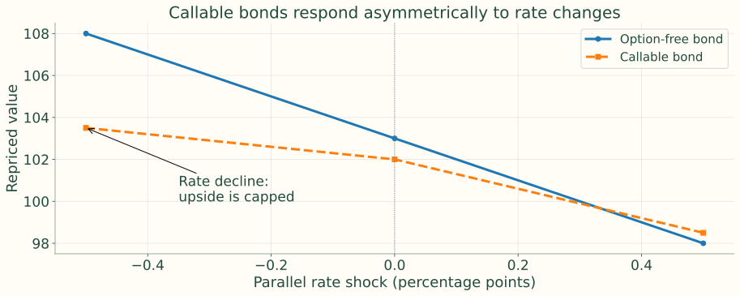{.figure}

Source schematic: callable prices 103.5 / 102 / 98.5 under −50 / 0 / +50 bp shocks.

## Apply the effective-risk formulas to the illustration

$$
D_e=\frac{103.5-98.5}{2(102)(0.005)}=4.902
$$


$$
C_e=\frac{103.5+98.5-2(102)}{102(0.005)^2}=-784.31
$$

These are the risks of the source’s illustrative three-price set, not a calibrated market bond.

## Interactive four-period example: assumptions

```{=html}
<div id="lec8-lattice-tool" style="font-size:24px; padding: .6em; background: #f8f9fa; border-radius: 6px; margin: .2em 0;">
  <div style="display: grid; grid-template-columns: repeat(3, 1fr); gap: 0.75em; align-items: end;">
    <label><strong>Face value</strong><br>
      <input type="number" id="lec8-face" value="100" min="1" step="1" style="width: 100%; font-size:26px; height:36px;">
    </label>
    <label><strong>Coupon rate (%)</strong><br>
      <input type="number" id="lec8-coupon-rate" value="6" min="0" step="0.25" style="width: 100%; font-size:26px; height:36px;">
    </label>
    <label><strong>Current short rate (%)</strong><br>
      <input type="number" id="lec8-r0" value="5" min="0" step="0.25" style="width: 100%; font-size:26px; height:36px;">
    </label>
    <label><strong>Volatility (%)</strong><br>
      <input type="number" id="lec8-sigma" value="12" min="0" step="1" style="width: 100%; font-size:26px; height:36px;">
    </label>
    <label><strong>Option type</strong><br>
      <select id="lec8-option-type" style="width: 100%; font-size:26px; height:36px;">
        <option value="call">Callable</option>
        <option value="put">Putable</option>
        <option value="none">Option-free</option>
      </select>
    </label>
    <label><strong>Option price</strong><br>
      <input type="number" id="lec8-option-price" value="100" min="0" step="0.25" style="width: 100%; font-size:26px; height:36px;">
    </label>
    <label><strong>First exercise period</strong><br>
      <input type="number" id="lec8-exercise-from" value="2" min="1" max="3" step="1" style="width: 100%; font-size:26px; height:36px;">
    </label>
    <label><strong>Market price</strong><br>
      <input type="number" id="lec8-market-price" value="102" min="1" step="0.25" style="width: 100%; font-size:26px; height:36px;">
    </label>
    <label><strong>Rate shock (bp)</strong><br>
      <input type="number" id="lec8-shock-bp" value="50" min="1" step="1" style="width: 100%; font-size:26px; height:36px;">
    </label>
  </div>

  <div id="lec8-lattice-results" style="display: grid; grid-template-columns: repeat(auto-fit, minmax(150px, 1fr)); gap: 0.6em; margin-top: 1em;"></div>
</div>
```

<div class="source-issue">Instructor review: Teaching-only, uncalibrated tree. The source widget includes a time-zero coupon; its OAS and node-shock risks illustrate mechanics, not a curve-calibrated market valuation.</div>


```{=html}
<script>
function lec8FormatPct(x) {
  return (100 * x).toFixed(2) + "%";
}

function lec8BuildTree(r0, sigma, n, shift) {
  const tree = [];
  for (let i = 0; i <= n; i++) {
    const level = [];
    for (let j = 0; j <= i; j++) {
      level.push(Math.max(-0.95, r0 * Math.exp((2 * j - i) * sigma) + shift));
    }
    tree.push(level);
  }
  return tree;
}

function lec8PriceTree(rateTree, params, spread) {
  const n = 4;
  const p = 0.5;
  const coupon = params.face * params.couponRate;
  let values = Array(n + 1).fill(params.face + coupon);
  const levels = [values.slice()];

  for (let i = n - 1; i >= 0; i--) {
    const next = [];
    for (let j = 0; j <= i; j++) {
      const r = rateTree[i][j] + spread;
      let hold = (p * values[j + 1] + (1 - p) * values[j]) / (1 + r) + coupon;
      if (params.optionType === "call" && i >= params.exerciseFrom && i < n) {
        hold = Math.min(hold, params.optionPrice);
      } else if (params.optionType === "put" && i >= params.exerciseFrom && i < n) {
        hold = Math.max(hold, params.optionPrice);
      }
      next.push(hold);
    }
    values = next;
    levels.unshift(values.slice());
  }

  return { price: values[0], levels: levels };
}

function lec8SolveOas(rateTree, params) {
  let lo = -0.20;
  let hi = 0.20;
  const priceAt = s => lec8PriceTree(rateTree, params, s).price;
  let priceLo = priceAt(lo);
  let priceHi = priceAt(hi);

  if (!Number.isFinite(priceLo) || !Number.isFinite(priceHi) || params.marketPrice > priceLo || params.marketPrice < priceHi) {
    return NaN;
  }

  for (let k = 0; k < 80; k++) {
    const mid = 0.5 * (lo + hi);
    const priceMid = priceAt(mid);
    if (priceMid > params.marketPrice) {
      lo = mid;
    } else {
      hi = mid;
    }
  }
  return 0.5 * (lo + hi);
}

function lec8DrawSvg(rateTree, valueLevels, params, oas) {
  const width = 900;
  const height = 530;
  const marginX = 80;
  const midY = 255;
  const stepX = 180;
  const stepY = 90;
  const n = 4;
  const positions = [];

  for (let i = 0; i <= n; i++) {
    positions[i] = [];
    for (let j = 0; j <= i; j++) {
      positions[i][j] = {
        x: marginX + i * stepX,
        y: midY + (i - 2 * j) * stepY / 2
      };
    }
  }

  let svg = `<svg viewBox="0 0 ${width} ${height}" width="100%" height="530" role="img" aria-label="Four-period interest-rate lattice">`;
  svg += `<rect x="0" y="0" width="${width}" height="${height}" fill="white"></rect>`;

  for (let i = 0; i < n; i++) {
    for (let j = 0; j <= i; j++) {
      const a = positions[i][j];
      const b = positions[i + 1][j];
      const c = positions[i + 1][j + 1];
      svg += `<line x1="${a.x}" y1="${a.y}" x2="${b.x}" y2="${b.y}" stroke="#888" stroke-width="1.4"></line>`;
      svg += `<line x1="${a.x}" y1="${a.y}" x2="${c.x}" y2="${c.y}" stroke="#888" stroke-width="1.4"></line>`;
    }
  }

  for (let i = 0; i <= n; i++) {
    svg += `<text x="${marginX + i * stepX}" y="510" text-anchor="middle" font-size="18">T${i}</text>`;
    for (let j = 0; j <= i; j++) {
      const pos = positions[i][j];
      const rate = lec8FormatPct(rateTree[i][j]);
      const value = valueLevels[i] && valueLevels[i][j] !== undefined ? valueLevels[i][j].toFixed(2) : "";
      svg += `<circle cx="${pos.x}" cy="${pos.y}" r="39" fill="#E8F1FA" stroke="black" stroke-width="1.6"></circle>`;
      svg += `<text x="${pos.x}" y="${pos.y - 8}" text-anchor="middle" font-size="17">r=${rate}</text>`;
      svg += `<text x="${pos.x}" y="${pos.y + 10}" text-anchor="middle" font-size="17">V=${value}</text>`;
    }
  }

  svg += `<text x="20" y="25" font-size="18">Maturity fixed at 4 periods; p = 0.5; OAS = ${Number.isFinite(oas) ? (10000 * oas).toFixed(1) + " bp" : "not bracketed"}</text>`;
  svg += `</svg>`;
  return svg;
}

function lec8UpdateLatticeTool() {
  const params = {
    face: parseFloat(document.getElementById("lec8-face").value),
    couponRate: parseFloat(document.getElementById("lec8-coupon-rate").value) / 100,
    r0: parseFloat(document.getElementById("lec8-r0").value) / 100,
    sigma: parseFloat(document.getElementById("lec8-sigma").value) / 100,
    optionType: document.getElementById("lec8-option-type").value,
    optionPrice: parseFloat(document.getElementById("lec8-option-price").value),
    exerciseFrom: parseInt(document.getElementById("lec8-exercise-from").value, 10),
    marketPrice: parseFloat(document.getElementById("lec8-market-price").value),
    shock: parseFloat(document.getElementById("lec8-shock-bp").value) / 10000
  };

  const rateTree = lec8BuildTree(params.r0, params.sigma, 4, 0);
  const base = lec8PriceTree(rateTree, params, 0);
  const oas = lec8SolveOas(rateTree, params);

  let duration = NaN;
  let convexity = NaN;
  let valueLevels = base.levels;

  if (Number.isFinite(oas)) {
    valueLevels = lec8PriceTree(rateTree, params, oas).levels;
    const upTree = lec8BuildTree(params.r0, params.sigma, 4, params.shock);
    const downTree = lec8BuildTree(params.r0, params.sigma, 4, -params.shock);
    const p0 = lec8PriceTree(rateTree, params, oas).price;
    const pUp = lec8PriceTree(upTree, params, oas).price;
    const pDown = lec8PriceTree(downTree, params, oas).price;
    duration = (pDown - pUp) / (2 * p0 * params.shock);
    convexity = (pDown + pUp - 2 * p0) / (p0 * params.shock * params.shock);
  }

  const resultItems = [
    ["Model price", base.price.toFixed(3)],
    ["OAS", Number.isFinite(oas) ? (10000 * oas).toFixed(1) + " bp" : "not bracketed"],
    ["Effective duration", Number.isFinite(duration) ? duration.toFixed(3) : "n/a"],
    ["Effective convexity", Number.isFinite(convexity) ? convexity.toFixed(2) : "n/a"]
  ];

  document.getElementById("lec8-lattice-results").innerHTML = resultItems.map(item =>
    `<div style="background: white; border: 1px solid #ddd; border-radius: 6px; padding: 0.65em;"><div style="font-size: 0.85em; color: #555;">${item[0]}</div><div style="font-size: 1.15em; font-weight: 700;">${item[1]}</div></div>`
  ).join("");

  document.getElementById("lec8-lattice-svg").innerHTML = lec8DrawSvg(rateTree, valueLevels, params, oas);
}

function lec8InitLatticeTool() {
  const tool = document.getElementById("lec8-lattice-tool");
  if (!tool || tool.dataset.initialized === "true") return;
  tool.dataset.initialized = "true";

  document.querySelectorAll("#lec8-lattice-tool input, #lec8-lattice-tool select").forEach(el => {
    el.addEventListener("input", lec8UpdateLatticeTool);
    el.addEventListener("change", lec8UpdateLatticeTool);
  });
  lec8UpdateLatticeTool();
}

if (document.readyState === "loading") {
  document.addEventListener("DOMContentLoaded", lec8InitLatticeTool);
} else {
  lec8InitLatticeTool();
}
</script>

```

## Interactive four-period example: inspect the nodes

<div id="lec8-lattice-svg" style="height:540px"></div>

Change inputs on the previous slide. Node values reflect exercise and the solved spread; maturity is fixed at four periods and p = 0.5.

## Connect the widget to the course demo

<div class="flow"><span><b>Build tree</b>Inspect the short-rate states</span><i>→</i><span><b>Price bonds</b>Compare straight, callable and putable</span><i>→</i><span><b>Solve spread</b>Match a target market price</span><i>→</i><span><b>Stress risk</b>Reprice after rate shocks</span></div>

The existing course demo `demo_callable_bond_oas.qmd` uses self-contained illustrative inputs. For market valuation, add curve calibration and verify coupon/exercise timing.

## Keep the valuation logic intact

<div class="flow"><span><b>Options</b>Change future cash flows</span><i>→</i><span><b>Lattice</b>Prices state-dependent exercise</span><i>→</i><span><b>Calibration</b>Anchors rates to the market</span><i>→</i><span><b>OAS and risk</b>Remain model dependent</span></div>

Calls cap upside; puts protect downside. Backward induction applies min or max only at the relevant exercise dates.

## Readings and market resources

Fabozzi, *Bond Markets: Analysis and Strategies*, Chapter 18.

- [FINRA, Fixed Income Data](https://www.finra.org/finra-data/fixed-income): Use TRACE-based corporate and agency bond information to compare traded prices, yields, and spreads for bonds with different embedded features.
- [FINRA, TRACE Treasury Aggregate Statistics](https://www.finra.org/finra-data/browse-catalog/trace-treasury-aggregates): Track official aggregate trading activity in U.S. Treasury securities, the benchmark market underlying spread and OAS analysis.
- [U.S. Treasury, Daily Treasury Par Yield Curve Rates](https://home.treasury.gov/resource-center/data-chart-center/interest-rates/TextView?type=daily_treasury_yield_curve): Obtain the current benchmark curve used as the starting point for static-spread, lattice, and OAS valuation.
- [SEC, EDGAR Company Filings](https://www.sec.gov/search-filings): Verify call schedules, redemption provisions, and other embedded-option terms in issuers' official prospectuses and filings.
