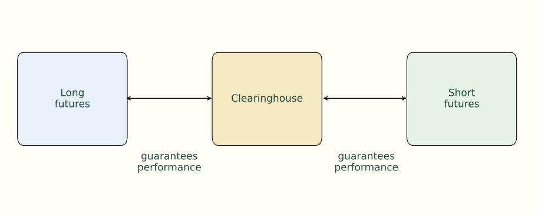
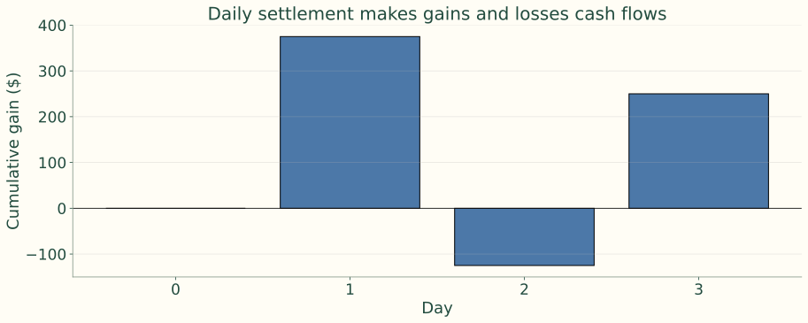
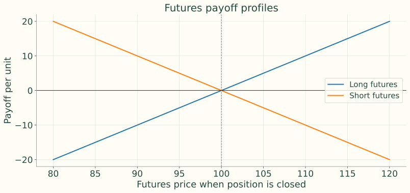
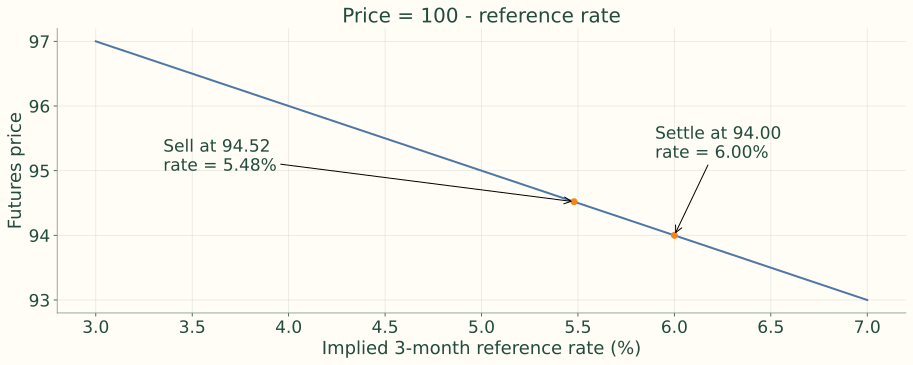
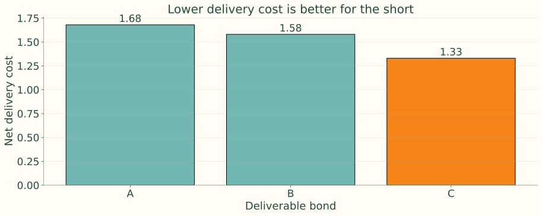
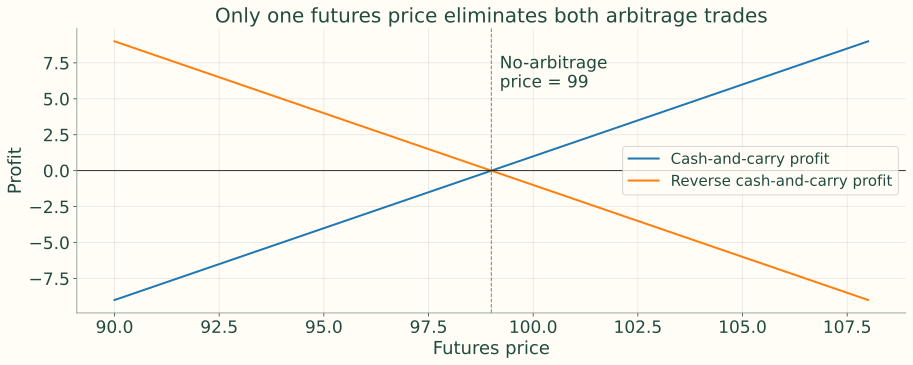
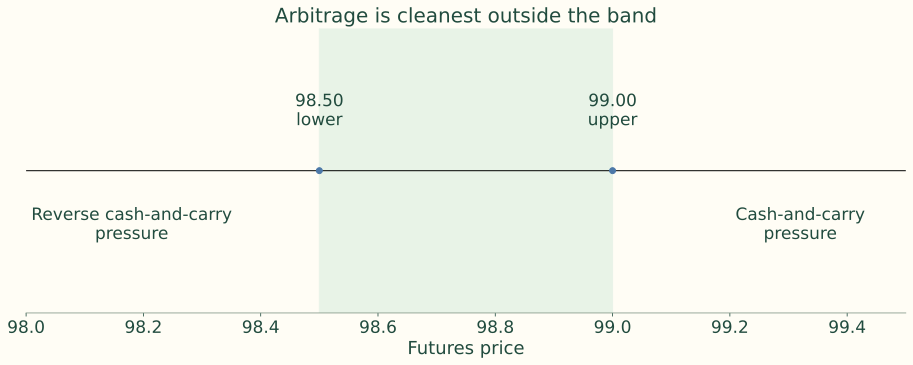
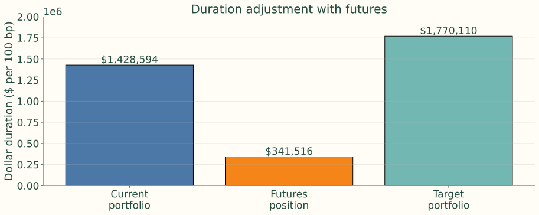
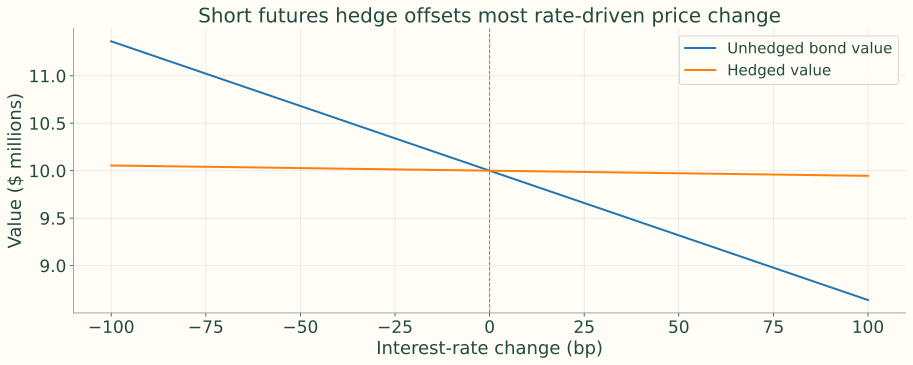
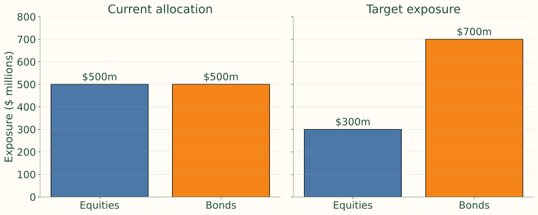

## Separate interest-rate exposure from cash ownership

<b>Contract</b>Agree today on a future price<i>→</i><b>Exchange</b>Standard terms and clearing<i>→</i><b>Portfolio</b>Change rate exposure without moving cash bonds

The futures price is the agreed price; settlement or delivery occurs at a specified future date. The nearby contract is closest to settlement; many financial futures use March, June, September and December cycles.

## The clearinghouse stands between both sides

{.figure}

## Opening a position determines the direction of exposure

<h3>Long futures</h3>
Buy the contract. Gain when its price rises; Treasury futures generally benefit from falling rates.

<h3>Short futures</h3>
Sell the contract. Gain when its price falls; Treasury futures generally benefit from rising rates.

## Notional measures exposure, not the initial cash outlay

<h3>Treasury example</h3>
$100,000 deliverable par gives exposure to that face amount.

<h3>Short-rate example</h3>
$1 million for a three-month interest period produces about $25 per basis point.

$$
1{,}000{,}000(0.0001)\frac{90}{360}=25
$$

## Daily settlement turns price changes into cash flows

<b>Open</b>Post initial collateral<i>→</i><b>Settle</b>Exchange sets daily price<i>→</i><b>Mark to market</b>Credit gains or debit losses<i>→</i><b>Fund</b>Meet margin requirements

## Close the position or settle the contract

<h3>Offset before settlement</h3>
Sell the same contract to close a long; buy it to close a short. No need to find the original counterparty.

<h3>Hold through settlement</h3>
Receive/deliver an eligible security or make a cash settlement, depending on the contract.

Most financial futures positions are offset before delivery.

## Clearing makes offsetting possible

<b>Every seller</b>Faces the clearinghouse as buyer<i>→</i><b>Clearinghouse</b>Supports performance through margining<i>→</i><b>Every buyer</b>Faces the clearinghouse as seller

Counterparty risk is reduced through the clearing and margin system; it is not eliminated from the financial system.

## Margin is performance collateral

<h3>Initial and maintenance</h3>
Initial margin opens the position; maintenance is the minimum account balance before a top-up is required.

<h3>Daily settlement and top-ups</h3>
Daily gains/losses are variation margin flows. Losses below maintenance trigger a margin call under the account’s rules.

The notes use “variation margin” for restoring the account. Unlike securities margin, futures margin is not a loan financing a purchase.

## Example 1 — Treasury daily marking to market

Long one $100,000 Treasury contract at 100-00; one full point is worth $1,000.

| Day | Settlement price | Daily price change | Cash flow to long |
|---:|---:|---:|---:|
| 0 | 100-00 | -- | -- |
| 1 | 100-12 | +12/32 | +$375.00 |
| 2 | 99-28 | -16/32 | -$500.00 |
| 3 | 100-08 | +12/32 | +$375.00 |

$$
375-500+375=250
$$

## The cumulative gain equals the total price change

{.figure}

$$
(100.25-100.00)\times1000=250
$$

## Futures versus forwards

| Feature | Futures contract | Forward contract |
|---|---|---|
| Trading venue | Organized exchange | Over-the-counter |
| Terms | Standardized | Negotiated |
| Counterparty risk | Reduced by clearinghouse | Direct counterparty exposure |
| Marking to market | Daily | Depends on contract terms |
| Liquidity | Often active secondary market | Often limited secondary market |
| Settlement intent | Usually offset before delivery | Often intended for delivery |

Standardization and daily margining support futures liquidity; forward customization changes exit and credit arrangements.

## Long and short gains are equal and opposite

$$
\Pi_{\mathrm{long}}=F_1-F_0,\qquad\Pi_{\mathrm{short}}=-(F_1-F_0)
$$

These are gains per unit before costs and the financing/reinvestment effects of daily settlement. Multiply by the contract’s price multiplier.

## Futures payoff profiles are symmetric

{.figure}

## Leverage magnifies returns relative to posted margin

$$
\frac{100{,}000\text{ exposure}}{5{,}000\text{ margin}}=20
$$

<h3>Efficient hedging</h3>
A small collateral commitment can offset a large existing exposure.

<h3>Speculative risk</h3>
A 1% adverse move on $100,000 is $1,000: 20% of the $5,000 initial margin.

## Choose the contract that matches the risk

| Family | Principal exposure |
|---|---|
| SOFR / Fed Funds | Short-term reference rates |
| Treasury notes | 2-, 5- and 10-year sectors |
| Treasury bonds | Long-end Treasury prices |
| Ultra Treasury bonds | Very long-end Treasury prices |

Each contract specifies grades, quotes, tick size, months, last trading/delivery dates and settlement method. Contract descriptions here follow the notes.

## Eurodollar futures explain the historical convention

A Eurodollar time deposit is a dollar-denominated deposit issued outside the United States. Traditional futures referenced three-month USD LIBOR on $1 million.

$$
\text{Index}=100-\text{annualized 3-month LIBOR}
$$

$$
100-94.52=5.48\%
$$

## The one-basis-point calculation carries over

$$
0.01\text{ index point}=1\text{ bp of implied rate}
$$

$$
1{,}000{,}000\times0.0001\times\frac{90}{360}=25
$$

The notes call 1 bp “one tick”; actual exchange minimum price increments depend on the contract. The $25 calculation is per basis point. These rate contracts are cash-settled.

## From LIBOR to SOFR

Eurodollar futures are historical teaching examples after the LIBOR transition. The lecture’s modern USD short-rate focus is **SOFR and Fed Funds futures**.

The index-price convention and the direction of rate exposure carry over; the reference rates and settlement calculations differ.

## A borrower hedges rising short-term rates by selling

<b>Rates rise</b>Future borrowing becomes more expensive<i>→</i><b>Index falls</b>Price = 100 − rate<i>→</i><b>Short gains</b>Offsets higher financing costs

## Example 2 — short Eurodollar futures

<h3>Entry</h3>
Sell at 94.52; implied rate 5.48%.

<h3>Settlement</h3>
Index 94.00; implied rate 6.00%.

$$
94.52-94.00=0.52=52\text{ bp}
$$

$$
52\times25=\$1{,}300\text{ gain}
$$

## Price and implied reference rate move in opposite directions

{.figure}

## SOFR futures reference secured overnight funding

SOFR measures overnight borrowing collateralized by Treasury securities.

$$
\text{SOFR futures index}=100-\text{implied SOFR rate}
$$

<h3>One-Month SOFR</h3>
Arithmetic average of daily SOFR during the delivery month.

<h3>Three-Month SOFR</h3>
Business-day compounded SOFR during the reference quarter. Both contracts are cash-settled.

## Translate an index level into the contract settlement unit

$$
\text{Contract unit}=2500\times\text{contract-grade IMM Index}
$$

$$
\text{Final index}=100-\text{contract-grade 3-month rate}
$$

$$
2500\times95.00=237{,}500
$$

This quotation unit is not an upfront investment of $237,500; futures positions settle price changes through margin.

## Translate an index change into a dollar gain

$$
1\text{ index point}=\$2500
$$

$$
1\text{ bp}=\frac{2500}{100}=\$25
$$

An index increase of 1 bp means the implied rate falls 1 bp; the long gains $25. The $1 million × 90/360 interest calculation gives the same sensitivity.

## Example 3 — a long SOFR position receives daily cash

<h3>Buy at 95.20</h3>
Implied rate = 100 − 95.20 = 4.80%.

<h3>Settle at 95.24</h3>
Implied rate = 100 − 95.24 = 4.76%.

$$
\Delta F=0.04=4\text{ bp},\qquad\Pi_{\mathrm{long}}=4(25)=\$100
$$

## A second SOFR quote check

Retained from the existing deck: price moves from 95.25 to 95.40.

$$
4.75\%\longrightarrow4.60\%
$$

$$
\Pi_{\mathrm{long}}=15(25)=\$375
$$

## Fed Funds futures focus on the policy month

$$
F=100-\text{average monthly effective federal funds rate}
$$

$$
100-95.625=4.375\%
$$

The effective rate is unsecured overnight reserve-balance funding among depository institutions. Futures are useful for interpreting policy expectations, not guaranteed forecasts.

## SOFR and Fed Funds answer different hedging questions

<h3>SOFR</h3>
Treasury-secured overnight funding; broad short-rate and derivatives hedging.

<h3>Fed Funds</h3>
Unsecured overnight bank funding; especially useful for views on FOMC policy decisions.

## Treasury futures deliver an eligible security

<b>Exchange</b>Defines the deliverable basket<i>→</i><b>Short</b>Chooses an eligible issue<i>→</i><b>Long</b>Pays the invoice amount

Unlike short-rate contracts, Treasury futures generally settle by physical delivery. Maturity and delivery rules are central to value.

## Read points and thirty-seconds correctly

$$
97\text{-}16=97+16/32=97.50\%\text{ of par}
$$

$$
0.9750(100{,}000)=\$97{,}500
$$

$$
\frac{1}{32}\%\times100{,}000=\$31.25
$$

Existing-deck check: 107-16 = 107.50%, or $107,500 per $100,000 par. Minimum tick increments differ across Treasury contract families.

## The bond future uses a hypothetical reference bond

The notes describe a $100,000-par hypothetical 20-year Treasury bond with a 6% coupon. Actual delivery comes from eligible securities.

**Conversion factors** normalize different coupons and maturities to the contract’s standard; they do not equalize every bond’s delivery economics.

## Calculate the delivery invoice with explicit quote units

$$
\text{Invoice}=Q\frac{F}{100}CF+AI
$$

Q is face amount, F is the futures quote per 100 par, CF is conversion factor, and AI is dollar accrued interest.

$$
F=94\text{-}08=94.25,\quad CF=1.20
$$

$$
100{,}000(0.9425)(1.20)=\$113{,}100\quad\text{before AI}
$$

## Repo is secured borrowing

<b>Today</b>Sell a security and receive cash<i>→</i><b>During the term</b>Security collateralizes financing<i>→</i><b>Repurchase</b>Buy it back at an agreed higher price

The difference between sale and repurchase prices is the interest cost.

## Implied repo compares delivery strategies

$$
\text{Implied repo}\approx\frac{\text{Invoice}-\text{cash price}}{\text{cash price}}\frac{360}{\text{days to delivery}}
$$

This simplified break-even financing return omits coupon and accrued-interest details. The eligible bond with the highest full implied repo rate is most attractive to deliver.

## Example 4 — find the cheapest delivery

$$
\text{Net delivery cost}=P_{\mathrm{cash}}-F\times CF
$$

| Bond | Cash price | Conversion factor | Invoice amount before accrued interest | Net delivery cost |
|---|---:|---:|---:|---:|
| A | 103.20 | 1.0800 | 101.52 | 1.68 |
| B | 98.40 | 1.0300 | 96.82 | 1.58 |
| C | 91.10 | 0.9550 | 89.77 | 1.33 |

Futures quote = 94.00. Bond C has the lowest simplified delivery cost; full implementation includes financing, accrued interest and timing.

## Compare adjusted delivery costs, not raw bond prices

{.figure}

## A second CTD comparison

Retained existing-deck example with futures quote 100.

| Bond | Cash price | CF | Invoice per 100 | Net cost |
|---|---:|---:|---:|---:|
| A | 118.00 | 1.120 | 112.00 | 6.00 |
| B | 104.50 | .995 | 99.50 | 5.00 |

Bond B is cheapest on this simplified comparison.

## Three delivery options belong to the short

<b>Quality / swap</b>Choose the eligible issue<i>→</i><b>Timing</b>Choose when in the delivery month<i>→</i><b>Wild card</b>Give notice after daily settlement is set

These rights benefit the short and reduce futures value to the long.

## Ultra bonds target very long-end exposure

The source specifies deliverable bonds with at least **25 years to maturity**.

This isolates very long-end exposure from regular Treasury bond futures and helps manage long-duration assets and liabilities.

## Treasury note futures cover shorter sectors

| Contract | Face amount in the notes | Maturity description in the notes |
|---|---:|---|
| 10-year note | $100,000 | Hypothetical 6% note; eligible 6.5–10 years |
| 5-year note | $100,000 | Eligible notes in the 5-year sector |
| 2-year note | $200,000 | Eligible notes in the 2-year sector |

These descriptions follow the source. Verify live deliverable grades and tick conventions before an actual trade.

## The law of one price links cash and futures

<h3>Cash-market route</h3>
Buy the cash bond and finance it until delivery.

<h3>Futures route</h3>
Agree on the delivery price through a futures position.

Equivalent future cash flows should have equivalent values; deviations create arbitrage pressure.

## An expensive future invites cash-and-carry

<b>Buy cash bond</b>Acquire the deliverable<i>→</i><b>Borrow</b>Finance the purchase<i>→</i><b>Sell futures</b>Lock in a high delivery price

## A cheap future invites reverse cash-and-carry

<b>Buy futures</b>Lock in the low purchase price<i>→</i><b>Short cash bond</b>Receive sale proceeds<i>→</i><b>Invest proceeds</b>Earn interest until delivery

## Example 5 — cash-and-carry setup

<h3>Inputs</h3>
Cash price 100; coupon yield 12%; financing 8%; delivery in 0.25 years.

<h3>Mispricing</h3>
Futures price 107; buy the bond, borrow 100 and sell futures.

## Example 5 — calculate each cash flow

$$
\text{Coupon accrual}=100(0.12)(0.25)=3
$$

$$
\text{Financing cost}=100(0.08)(0.25)=2
$$

$$
\text{Profit}=(107+3)-(100+2)=8
$$

The simplified example starts on a coupon date, uses linear accrual and ignores margin funding, costs and delivery options.

## Example 6 — reverse the trade when futures are cheap

<h3>Today</h3>
Short the bond for 100; invest proceeds at 8%; buy futures at 92.

<h3>After three months</h3>
Investment becomes 102. Acquire the bond for 92 and cover coupon accrual of 3.

$$
\text{Profit}=102-(92+3)=7
$$

## Derive the theoretical futures price

$$
\text{Profit}=F+ctP-(P+rtP)
$$

$$
0=F+ctP-P-rtP
$$

$$
F=P[1+t(r-c)]
$$

P is cash price; c is annual coupon divided by cash price; r is financing rate; t is years to delivery.

## The difference between coupon income and financing matters

| Relationship | Carry earned by the bond holder | Fair futures versus cash |
|---|---|---|
| c > r | Positive | F < P |
| c < r | Negative | F > P |
| c = r | Zero | F = P |

$$
F=100[1+0.25(0.08-0.12)]=99
$$

## Both arbitrage profits are zero at the fair price

{.figure}

## A second cost-of-carry check

Existing-deck inputs: P = 100, r = 7%, c = 5%, t = 0.5.

$$
F=100[1+0.5(0.07-0.05)]=101
$$

<h3>Market future = 103</h3>
Buy cash; finance; sell futures.

<h3>Market future = 99</h3>
Short cash; invest; buy futures.

## Interim cash flows complicate the simple model

<h3>Daily margin</h3>
When rates rise, a short Treasury future receives cash that can earn higher rates. When rates fall, it funds losses at lower rates.

<h3>Coupons before delivery</h3>
Their payment dates and reinvestment rates change actual carry.

Futures and forwards need not have identical prices. Transaction costs and funding constraints also matter.

## Different borrowing and lending rates create a band

$$
F_{\mathrm{upper}}=P[1+t(r_B-c)]
$$

$$
F_{\mathrm{lower}}=P[1+t(r_L-c)]
$$

Usually rB exceeds rL. Trading costs widen the range in which neither arbitrage direction is profitable.

## Example 7 — calculate the no-arbitrage boundaries

$$
F_{\mathrm{upper}}=100[1+0.25(0.08-0.12)]=99.00
$$

$$
F_{\mathrm{lower}}=100[1+0.25(0.06-0.12)]=98.50
$$

P = 100; c = 12%; t = 0.25; borrowing 8%; lending 6%.

## Arbitrage pressure is clearest outside the band

{.figure}

## The unknown deliverable has option value

$$
F=P[1+t(r-c)]-\text{quality-option value}
$$

The short can switch to the most economical eligible bond; the contract therefore tracks CTD economics rather than a fixed named bond.

## The delivery date is also a choice

$$
F=P[1+t(r-c)]-\text{delivery-option value}
$$

Delivery options include quality, timing and wild card rights. The combined adjustment benefits the short; do not subtract the quality option twice.

## Futures change portfolio dollar duration

$$
N=\frac{DD_{\mathrm{target}}-DD_{\mathrm{current}}}{DD_{\mathrm{one\ futures}}}
$$

<h3>Positive N</h3>
Buy futures to add exposure, for example ahead of a rate decline.

<h3>Negative N</h3>
Sell futures to remove exposure, for example ahead of a rate rise.

Use the same rate-shock unit in every dollar-duration measure.

## Duration adjustment: source inputs and calculation

Market value $48,109,810; duration 2.97 → target 3.68; futures dollar duration $5,022 per 100 bp.

| Measure | Calculation | Notes’ result |
|---|---|---:|
| Current DD | .0297 × 48,109,810 | $1,428,594 |
| Target DD | .0368 × 48,109,810 | $1,770,110 |
| Increase | Target − current | $341,516 |

$$
N=341{,}516/5022\approx68\quad\text{buy}
$$

## Check the arithmetic without changing the source

$$
DD_{\mathrm{current}}=1{,}428{,}861.357
$$

$$
DD_{\mathrm{target}}=1{,}770{,}441.008
$$

$$
N=341{,}579.651/5022=68.0167
$$

Instructor review: The notes’ two dollar-duration totals contain small arithmetic discrepancies. The rounded trade remains 68 contracts.

## Visualize the duration added by the futures position

{.figure}

Bar labels retain the source’s reported values. Matching duration alone leaves convexity and key-rate mismatch.

## A future has sensitivity, not bond cash-flow duration

A Treasury future has no coupon/principal schedule from which to compute Macaulay duration. Practical risk is its **DV01**.
<b>Identify CTD</b>Find the economical deliverable<i>→</i><b>CTD DV01</b>Measure cash-bond sensitivity<i>→</i><b>Scale by CF</b>Convert to futures sensitivity

## Calculate CTD DV01 and scale by the conversion factor

$$
DV01_{CTD}=D_{mod,CTD}P_{CTD}(0.0001)
$$

$$
P_{CTD}\approx F\times CF
$$

$$
DV01_{futures}\approx\frac{DV01_{CTD}}{CF}
$$

DV01 is quoted positive. Keep quote and dollar units consistent; smaller CF magnifies the futures sensitivity associated with a given CTD movement.

## CTD example: from price to contract DV01

$$
P_{CTD}=1.0240(100{,}000)=102{,}400
$$

$$
DV01_{CTD}=7.2(102{,}400)(0.0001)=73.728\approx73.73
$$

$$
DV01_f=73.728/0.9350\approx78.85
$$

A 1 bp yield decline produces about $78.85 of gain per contract; a rise produces a loss of similar size.

## A direct DV01 hedge is an exposure match

$$
N=\frac{DV01_{portfolio}}{DV01_f}=\frac{22{,}500}{75}=300
$$

<h3>Long bond portfolio</h3>
Short 300 futures to hedge rising rates.

<h3>Short bond portfolio</h3>
Buy futures to hedge falling rates.

A partial hedge scales N by the desired hedge fraction.

## Retained DV01 sizing example

Existing-deck inputs: portfolio DV01 $27,840; CTD duration 6.5, price 98.50, face $100,000, CF 0.9200.

$$
DV01_{CTD}=6.5(98{,}500)(0.0001)=64.025
$$

$$
DV01_f=64.025/.9200=69.5924
$$

$$
N=27{,}840/69.5924\approx400\quad\text{short}
$$

## The estimated futures sensitivity can change

<h3>Market changes</h3>
CTD switches, nonparallel curve moves, convexity and changing delivery-option value.

<h3>Implementation effects</h3>
Accrued interest, repo financing, whole-contract rounding and margin liquidity needs.

Monitor and rebalance the hedge as its cash/futures mapping changes.

## Short and long hedges protect different cash-market needs

<h3>Short hedge</h3>
Own bonds now; fear rising rates and falling sale proceeds. Sell futures.

<h3>Long hedge</h3>
Expect future cash inflows; fear falling rates and higher purchase prices. Buy futures.

A zero-duration target is a special case of duration management. Judge the combined position, not the futures profit in isolation.

## Basis risk remains after a hedge

The cash-bond/futures relationship can move unpredictably. **Cross hedging** uses a contract whose underlying differs from the bond being hedged.

Credit spreads, curve shape and deliverable changes can keep cash and futures from offsetting perfectly.

## The hedge ratio matches dollar sensitivity

$$
h=\frac{\text{bond volatility}}{\text{hedging-instrument volatility}}
$$

$$
h=\frac{PVBP_{\mathrm{bond}}}{PVBP_{CTD}}CF_{CTD}
$$

$$
N=h\frac{\text{par to hedge}}{\text{contract par}}
$$

For the PVBP formula, quote both bond PVBPs on the same par basis.

## Hedge-ratio example: calculate, scale, round

$$
h=\frac{0.1363}{0.1207}(1.0246)=1.1570
$$

$$
N=1.157\frac{10{,}000{,}000}{100{,}000}=115.7
$$

Short **116 contracts** against $10 million of bonds. The conversion factor converts CTD sensitivity into futures sensitivity.

## A hedge flattens the combined response

{.figure}

Source schematic assumes 96% hedge effectiveness; it illustrates remaining basis risk rather than predicting a realized hedge result.

## Optional — allow the bond and CTD yields to move differently

$$
\Delta y_{bond}=a+b\Delta y_{CTD}+\varepsilon
$$

$$
h_{\beta}=\frac{PVBP_{bond}}{PVBP_{CTD}}CF\times b
$$

b is the regression yield beta. The basic hedge implicitly assumes the spread is unchanged.

## Optional — yield-beta adjustment example

$$
h_{\beta}=1.157(0.90)=1.0413\approx1.041
$$

$$
N=1.041(100)=104.1\quad\Rightarrow\quad104\text{ contracts}
$$

For $10 million par and $100,000 contract size, a 0.90 yield beta lowers the hedge from 116 to about 104 shorts.

## Optional — pure volatility adjustment

$$
\text{Adjustment}=\frac{\sigma(\Delta y_{bond})}{\sigma(\Delta y_{CTD})}
$$

This uses a ratio of historical standard deviations rather than a regression slope. It does not incorporate correlation in the same way as yield beta.

## Optional — combine cash and futures into a synthetic security

$$
\text{Short-term riskless position}=\text{cash bond}-\text{bond future}
$$

$$
\text{Cash bond}=\text{short-term riskless position}+\text{bond future}
$$

Locking in delivery can replicate a short-term investment under matched-delivery and funding assumptions. Compare the synthetic yield with a Treasury bill of the same horizon.

## Example 8 — construct the synthetic cash flows

$$
R_{3m}=\frac{102-100}{100}=2\%
$$

$$
R_{annual,\ simple}=2\%\times4=8\%
$$

The source ignores margin reinvestment, trading costs and delivery-option effects; those assumptions are needed for the “riskless” description.

## Optional — shift exposure from equities to bonds

<b>Sell equity futures</b>Reduce equity exposure<i>→</i><b>Buy rate futures</b>Add bond exposure<i>→</i><b>Trade cash gradually</b>Replace the temporary overlay

A $200 million shift can reduce immediate transaction costs and market impact while cash managers adjust holdings.

## Example 9 — size the new bond allocation

$$
\Delta DD=0.05(200{,}000{,}000)=10{,}000{,}000
$$

$$
N=\frac{10{,}000{,}000}{5{,}000}=2{,}000\quad\text{buy}
$$

Target bond duration 5.0; futures DD $5,000 per 100 bp. More generally divide the target-minus-current dollar-duration gap by contract DD.

## The overlay changes exposure before cash holdings

{.figure}

## Retained application — locate a rate view on the curve

| View | Possible futures structure |
|---|---|
| Rates rise broadly | Short Treasury futures |
| Curve steepens | Short long-maturity / long short-maturity futures |
| Front-end cuts arrive sooner | Long selected SOFR futures |

DV01 weighting helps isolate slope rather than adding an unintended level exposure.

## Bring instrument choice and implementation together

<b>Exposure</b>Which rate, maturity and direction?<i>→</i><b>Instrument</b>Which contract and CTD?<i>→</i><b>Sizing</b>Which DV01 or tick-value ratio?<i>→</i><b>Implementation</b>Basis, margin, liquidity and monitoring

## Key points to take into a futures hedge

<h3>Contract mechanics</h3>
Clearing, collateral and daily settlement make standardized exposure tradable; the same leverage creates cash demands.

<h3>Valuation and sizing</h3>
Carry and delivery options connect futures to cash. CTD-adjusted DV01 is the starting point; basis risk determines realized hedge quality.

## Readings and market resources

- Fabozzi, *Bond Markets, Analysis, and Strategies*, **Chapter 29: Interest-Rate Futures Contracts**.
- [CME Group, U.S. Treasury Futures and Options](https://www.cmegroup.com/markets/interest-rates/us-treasury.html): Review current contract specifications, deliverable grades, quotes, and volume for Treasury futures used in duration hedging.
- [CME Group, Three-Month SOFR Futures](https://www.cmegroup.com/markets/interest-rates/stirs/three-month-sofr.html): Connect the lecture's short-rate futures mechanics to the principal exchange-traded U.S. SOFR contract.
- [CFTC, Commitments of Traders](https://www.cftc.gov/MarketReports/CommitmentsofTraders/index.htm): Examine weekly positioning by trader category in Treasury and short-term interest-rate futures markets.
- [U.S. Treasury, TreasuryDirect Auction Results](https://www.treasurydirect.gov/auctions/announcements-data-results/): Access official auction results and security details that help identify the cash instruments underlying Treasury-futures basis trades.
- [Federal Reserve Bank of New York, SOFR](https://www.newyorkfed.org/markets/reference-rates/sofr): Compare SOFR futures pricing with the official published overnight secured financing rate and its methodology.
